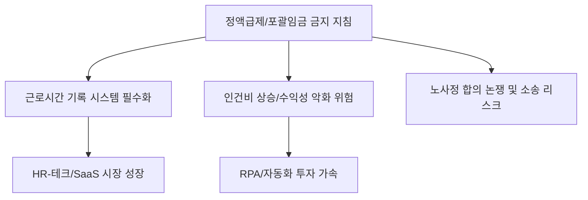

# 노동/법률 분석: 정액급제·정액수당제 '원칙적 금지' 지침과 노사정 갈등
## 투자 신호 + 사회적 영향 평가

---

## 📌 기사 기본 정보

- **날짜**: 2026-04-09
- **출처**: 대한민국 고용노동정책 리포트
- **카테고리**: 경제 > 노동 > 법률/정책
- **핵심 주제**: 고용노동부가 발표한 '정액급제(Fixed Pay)' 및 '정액수당제'의 원칙적 금지 지침과 이에 따른 노사정 합의 위배 논란 및 기업의 노무 리스크 관리 방안 분석

**메타데이터**
- 주요 지침: 실근로시간 미산정형 포괄임금제 원칙적 부정, '공짜 노동' 근절 지침
- 핵심 쟁점: 근로시간 기록 의무 강화, 노사정 합의 절차 무시 논란
- 주요 주체: 고용노동부, 한국경영자총협회(경총), 민주노총/한국노총, 인사노무 법인
- 키워드: 포괄임금 금지, 실근로시간 제도, 임금체계 개편, 노무 리스크

---

## 🔍 기사를 통한 투자 신호 추출

### 1단계: 핵심 사건 분해

**What (무엇이 일어났는가?)**
- 정부가 연장·야간·휴일 근로수당을 미리 정해진 금액으로 퉁치던 '정액급제'와 '정액수당제'를 법 위반으로 간주하고 원칙적으로 금지하는 지침을 시달함. 이는 실제 일한 만큼 돈을 주라는 취지이나, 경영계는 유연한 근무 환경을 저해한다며 강력 반발.

**When (언제 일어났는가?)**
- 2026-04-09 (디지털 근로 기록 시스템이 보편화되었으나, 여전히 많은 기업이 주 52시간제 우회 수단으로 포괄임금제를 활용하던 시점)

**Why (왜 일어났는가?)**
- 연장 근로를 유도하면서도 추가 수당을 주지 않는 '공짜 노동' 관행을 완전히 뿌리 뽑겠다는 정부의 강력한 의지
- 근로 시간의 투명성 확보를 통한 실질적인 워라밸(Work-Life Balance) 구현

**Who (누가 주도하는가?)**
- 노동자 권익 보호를 최우선으로 내세운 고용노동국 및 관련 상임위
- 비용 증가를 우려하며 대응책 마련에 부심한 기업 인사팀 및 노무법인

---

### 2단계: 투자 신호 해석

#### A. **긍정적 신호 (Bullish)**

**① 근로 시간 관리 및 유연 근무 솔루션(SaaS) 시장의 폭발적 성장**
- **신호**: 실근로시간 기록 및 정산 시스템 도입 필수화
- **의미**: 모든 기업이 법적 리스크를 피하기 위해 정밀한 타임 트래킹 및 인사 관리 소프트웨어를 도입해야 함
- **투자 기회**: 인사 관리 SaaS(ERP, 전문 노무 플랫폼) 기업, 보안 및 비대면 출퇴근 인증 기술 업체

**② 생산성 향상을 위한 '업무 프로세스 자동화(RPA)' 도입 가속**
- **신호**: 근로 시간 제한 및 수당 부담 증가
- **의미**: 사람을 더 쓰기보다 기존 인력의 업무 시간을 줄여주는 '자동화 툴'에 대한 투자가 기업의 생존 전략이 됨
- **투자 기회**: RPA 솔루션 기업, AI 비서 및 협업 툴 공급사

---

#### B. **위험 신호 (Bearish)**

**① 노동 집약적 산업의 영업이익률(OPM) 급감 리스크**
- **신호**: 포괄임금 금지로 인한 실질 임금 상승 압박
- **의미**: 기존에 포괄임금제로 버티던 중소 제조업, 소프트웨어 개발(SI), 게임, 유통 서비스업의 인건비 급증
- **투자 리스크**: 인건비 전가력이 없는 소형 IT 서비스사 및 수동 공정 중심의 제조업체

**② 노사 분쟁 증가에 따른 경영 불확실성 증대**
- **신호**: 과거 '공짜 노동'에 대한 소급적 임금 청구 소송 확산 우려
- **의미**: 대규모 소송 리스크로 인한 당기순이익 훼손 및 기업 이미지 실추
- **투자 리스크**: 과거 노사 상생 점수가 낮고 포괄임금 위반 의심 사례가 많은 기업

---

### 3단계: 섹터별 투자 기회 매트릭스

#### ✅ **높은 기대도 + 낮은 리스크**

**글로벌 스탠다드에 맞춘 전문 '사이버 보안 및 인사 데이터 관리' 기업**
- 근로 기록 데이터의 위변조 방지가 중요한 법적 쟁점이 되며, 보안성을 갖춘 인사 관리 시스템의 가치가 상승함
- **투자 추천도**: ⭐⭐⭐⭐

---

## 💰 구체적 투자 신호 변환

### 신호 1: '인건비'가 아닌 '시간 데이터'가 기업 가치를 바꾼다

**투자 해석**: 기사는 단순히 월급 체계를 바꾸라는 것이 아님. 기업이 '직원의 시간'을 어떻게 관리하고 효율적으로 쓰고 있는지 데이터로 증명하라는 요구임. 시간당 생산성이 높은 기업만이 이 제도를 견뎌낼 것임. 투자 시 '인적 자원 관리(HRM) 시스템'이 잘 갖춰진 도덕적 우량주를 선별해야 함.

---

## 🌍 사회적 영향 평가

### A. 긍정적 사회 영향
- **일한 만큼 대우받는 정의로운 노동 시장**: 정당한 보상 체계를 통해 장시간 근로 관행을 타파하고 사회 전반의 휴식권 보장
- **청년층의 제조업 및 전통 산업 유입 유도**: '열정 페이'가 사라지며 근로 조건이 투명해진 산업으로의 인재 유입 기대

### B. 부정적 사회 영향
- **중소기업의 경영난 심화**: 갑작스러운 인건비 상승을 감당하지 못하는 영세 기업들의 폐업 및 그로 인한 고용 불안 발생
- **근로 시간 측정의 경직성**: 재택근무, 외근 등 창의적이고 유연한 근무 형태가 '시간 기록'이라는 틀에 갇혀 혁신이 위축될 우려

---

## 🎯 결론: 당신의 투자 전략 수립

- **즉시 실행**: 투자 중인 기업들이 '포괄임금 리스크'에 노출되어 있는지 사업 보고서 및 뉴스 확인 (직원 만족도 조사 포함)
- **3개월 후**: 노동부의 집중 근감독 결과 발표 및 주요 기업들의 임금체계 개편 공시 확인

---

## 📝 Obsidian 연결 구조

