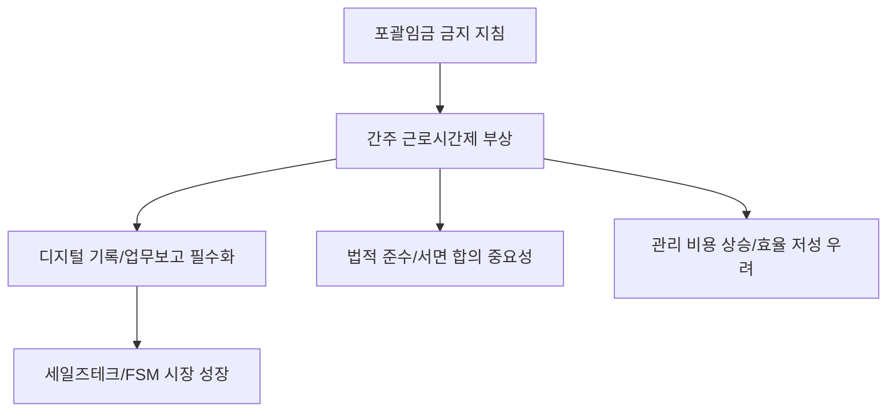

# 노동/전략 분석: 출장·영업직과 '포괄임금 금지' 지침 및 간주 근로시간제 활용 전략
## 투자 신호 + 사회적 영향 평가

---

## 📌 기사 기본 정보

- **날짜**: 2026-04-09
- **출처**: 대한민국 인사노무 실무 가이드
- **카테고리**: 경제 > 노동 > 기업경영
- **핵심 주제**: 포괄임금 금지 지침 시행에 따라 근로 시간 산정이 어려운 출장·영업직 근로자들에게 적용 가능한 '간주 근로시간제(Deemed Working Hours)'의 법적 요건과 기업의 운영 전략 분석

**메타데이터**
- 주요 법리: 근로기준법 제58조 (사업장 밖 근로에 대한 판정)
- 핵심 대안: 간주 근로시간제, 재량 근로시간제, 노사 서면 합의의 유효성
- 주요 주체: 영업직 비중이 높은 제약/보험/영업 회사, 출장이 잦은 엔지니어링 기업, 노동부 근로감독관
- 키워드: 간주 근로시간, 포괄임금 대안, 영업직 리스크 관리, 서면 합의서

---

## 🔍 기사를 통한 투자 신호 추출

### 1단계: 핵심 사건 분해

**What (무엇이 일어났는가?)**
- 정부의 포괄임금 금지 원칙에 따라, 그동안 '영업 활동'이라는 명목으로 근로 시간 산정을 포기하고 고정 수당만 주던 방식이 불법화됨. 이에 기업들은 법 테두리 안에서 근로 시간을 미리 약정한 것으로 간주하는 '간주 근로시간제'로의 전환이 시급해짐.

**When (언제 일어났는가?)**
- 2026-04-09 (정부의 포괄임금 오남용 근절 지침이 현장에 본격 적용되며 영업 현장의 혼란이 가중된 시점)

**Why (왜 일어났는가?)**
- 스마트폰, GPS 등 기술 발달로 '사업장 밖 근로'도 어느 정도 산정이 가능해졌음에도 불구하고 포괄임금제를 남용하여 연장 근로 수당을 미지급하는 관행을 막기 위함

**Who (누가 주도하는가?)**
- 효율적 인력 운용과 법적 준수(Compliance) 사이에서 균형을 찾으려는 기업 인사 담당자
- 정당한 보상을 요구하는 영업직 노동조합 및 개별 근로자

---

### 2단계: 투자 신호 해석

#### A. **긍정적 신호 (Bullish)**

**① 외근직 전용 '모바일 업무 시스템' 및 협업 툴 시장의 확대**
- **신호**: 실질 근로 기록 증빙 요구 강화
- **의미**: 방문 기록, 업무 보고, 이동 경로 등을 데이터로 남겨 '간주 시간'의 정당성을 뒷받침할 디지털 도구 도입 증가
- **투자 기회**: 모바일 ERP, 현장 관리 솔루션(FSM), 세일즈 테크 기업

**② 전문 노무/컨설팅 및 법률 자문 시장의 활성화**
- **신호**: 복잡해진 임금 설계 및 노사 서면 합의 필요성
- **의미**: 대형 로펌 및 노무법인의 자문 수요가 기업 규모와 상관없이 전방위적으로 확대됨
- **투자 기회**: 법률 서비스 플랫폼, 인사 관리 컨설팅 상장사

---

#### B. **위험 신호 (Bearish)**

**① 영업력 위축 및 관리 비용 증가**
- **신호**: 근로 시간 '간주'를 위한 엄격한 관리 통제
- **의미**: 영업사원이 자율적으로 움직이기보다 기록에 신경 쓰게 되며 활동성이 낮아질 수 있고, 관리 매니저의 모니터링 부담 증가로 인한 효율 저하
- **투자 리스크**: 전통적인 인적 영업 방식에 의존하는 제약, 소비재 유통 업체

**② 축적된 과거 수당에 대한 '우발 부 채' 리스크**
- **신호**: 노사 합의 미비 시 과거 지급액에 대한 법적 분쟁 가능성
- **의미**: 간주 근로 계약이 제대로 체결되지 않은 상태에서 실근로 증명을 통해 추가 수당을 요구할 경우 대규모 비용 지출 발생
- **투자 리스크**: 노무 관리가 허술한 중소형 수주 산업체

---

### 3단계: 섹터별 투자 기회 매트릭스

#### ✅ **높은 기대도 + 낮은 리스크**

**자동 추적 및 데이터 신뢰성이 보장된 'B2B 근무 관리 솔루션'**
- 법적 분쟁 시 가장 강력한 증거가 되는 '데이터 데이터'를 생성하는 기업임
- **투자 추천도**: ⭐⭐⭐⭐⭐

---

## 💰 구체적 투자 신호 변환

### 신호 1: '자율'에서 '약속된 기록'으로의 전환

**투자 해석**: 기사는 단순히 법을 지키라는 것이 아니라, 기업의 영업 방식 자체를 '디지털'화하라고 요구하고 있음. 과거의 '주먹구구식 영업'을 하는 기업은 퇴출될 것이며, '간주 근로시간제'를 스마트하게 활용하고 이를 데이터로 뒷받침하는 인프라를 가진 기업이 진정한 지속 가능성을 얻게 될 것임.

---

## 🌍 사회적 영향 평가

### A. 긍정적 사회 영향
- **일과 삶의 경계 확립**: '사업장 밖 근로'라는 이유로 무한정 대기하거나 연장 근무하던 관행을 공식화함으로써 노동자의 휴식권 보호
- **데이터 기반의 효율적 경영 문화**: 불필요한 외근 보고를 줄이고 핵심 성과(Output)에 집중하는 문화 확산 기폭제

### B. 부정적 사회 영향
- **디지털 감시 논란**: 근로 시간 증명을 위해 GPS 추적 등이 일상화될 경우 발생하는 근로자의 프라이버시 침해 및 신뢰 관계 훼손
- **조직 내 갈등**: 간주 시간보다 더 많이 일했다고 주장하는 근로자와 합의된 시간만 인정하려는 사측 간의 감정적 골 심화

---

## 🎯 결론: 당신의 투자 전략 수립

- **즉시 실행**: 투자 중인 기업 중 영업직 비중이 높은 곳(제약, 식품 등)의 '근무 관리 시스템 도입 현황' 확인
- **3개월 후**: 노동부의 '근로시간 기록 표준 가이드라인' 발표에 따른 기업별 대응 속도 벤치마킹

---

## 📝 Obsidian 연결 구조

