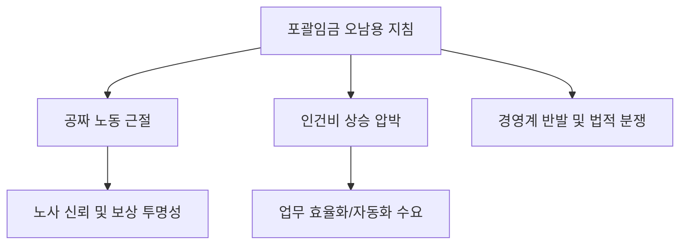

# 노동/정책 분석: '공짜 노동' 근절을 위한 포괄임금제 지침 시행과 경영계 반발
## 투자 신호 + 사회적 영향 평가

---

## 📌 기사 기본 정보

- **날짜**: 2026-04-09
- **출처**: 대한민국 고용노동정책 속보
- **카테고리**: 경제 > 노동 > 법규준수
- **핵심 주제**: 고용노동부의 포괄임금제 오남용 근절 지침 본격 시행에 따른 '공짜 노동' 문화의 법적 퇴출 시도와 이에 따른 경영계의 비용 절감 전략 수정 및 집단 반발 양상 분석

**메타데이터**
- 주요 지침: 포괄임금 계약의 유효성 요건 강화 (근로시간 산정이 어려운 경우로 한정)
- 핵심 타겟: IT, 게임, 전문직 등 화이트칼라 '공짜 야근' 사업장
- 주요 주체: 고용노동부 장관, 한국경영자총협회(경총), 정보통신(IT) 노동조합
- 키워드: 공짜 노동 근절, 포괄임금 폐지, 실근로 관리, 노무 리스크, 52시간제 준수

---

## 🔍 기사를 통한 투자 신호 추출

### 1단계: 핵심 사건 분해

**What (무엇이 일어났는가?)**
- 정부가 연장 근로 수당 등을 월급에 미리 포함해 주던 '포괄임금제'가 실제로는 수당 미지급 통로로 변질되었다고 판단, 이를 원칙적으로 금지하고 엄격한 근로 감독을 예고함. 경영계는 '유연한 업무 특성 무시'라며 강력히 저항 중.

**When (언제 일어났는가?)**
- 2026-04-09 (정부가 노동 개혁의 일환으로 임금 체계의 투명성을 국정 과제로 삼고 집중 단속 기간을 공포한 시점)

**Why (왜 일어났는가?)**
- 한국의 장시간 근로 문화를 지탱해 온 법적 허점을 제거하여 실질적인 근로 시간 단축 유도
- 공정 노동(Fair Labor) 에 대한 사회적 요구 및 워라밸 가치 확산

**Who (누가 주도하는가?)**
- '임금 체불 근절'을 성과로 내세우려는 노동부 집행 라인
- 기업의 이익 감소와 관리 부담 증가를 방어하려는 대기업 협의회

---

### 2단계: 투자 신호 해석

#### A. **긍정적 신호 (Bullish)**

**① 인사 관리(HR) 테크 및 법률 플랫폼의 주도권 확보**
- **신호**: 포괄임금 금지에 따른 증빙 의무 강화
- **의미**: 기업이 스스로 결백을 증명하기 위해 '제3자가 인증한 근무 기록'이 필수화됨. 법률 상담부터 고도화된 정산 알고리즘까지 제공하는 플랫폼 매출 급증
- **투자 기회**: 클라우드 기반 근태 관리사, AI 노무 분석 솔루션 기업

**② 고부가가치 서비스업으로의 체계 개편**
- **신호**: 단순히 '오래 앉아 있는 것'이 아닌 '성과 생산성' 위주의 평가 시스템 도입
- **의미**: 시간 기반 보상 체계 탈피를 위한 성과 관리(KPI) 고도화 솔루션 부상
- **투자 기회**: 인사 성과 시스템 전문 소프트웨어 사

---

#### B. **위험 신호 (Bearish)**

**① IT 및 소프트웨어 개발(SI) 산업의 단기 이익 훼손**
- **신호**: 주된 포괄임금제 적용 섹터에 대한 집중 감독
- **의미**: 프로젝트 마감을 앞두고 습관적으로 하던 야근에 대해 수당을 지급해야 하므로, 인건비가 기하급수적으로 상승할 위험
- **투자 리스크**: 인당 매출액이 낮고 야근 의존도가 높은 중견 SI 및 게임 개발사

**② 노사 신뢰 관계 붕괴 및 파업 리스크**
- **신호**: 지침 해석을 둘러싼 현장의 갈등
- **의미**: 경영계의 반발이 노사 대립으로 번질 경우, 파업이나 태업으로 인한 생산성 차질 발생
- **투자 리스크**: 노조 조직률이 높고 임금 단체 협상이 예정된 기업들

---

### 3단계: 섹터별 투자 기회 매트릭스

#### ✅ **높은 기대도 + 낮은 리스크**

**기업용 업무 효율화 툴 기반의 생산성 테크**
- 일을 덜 시키되 성과는 유지해야 하므로, 협업 툴이나 자동화 스택을 보유한 기업에 대한 수요는 법적 규제와 상관없이 필연적 성장세임
- **투자 추천도**: ⭐⭐⭐⭐⭐

---

## 💰 구체적 투자 신호 변환

### 신호 1: '공짜 점심'의 시대 종말과 '데이터 증명'의 시대

**투자 해석**: 기사는 기업들에게 '더 이상 직원의 시간을 공짜로 쓰지 말라'는 최후통첩과 같음. 투자자는 기업이 이 비용을 감당할 수 있는 '고배수 마진' 사업을 하는지, 아니면 '시간 기반' 사업인지를 구분해야 함. '무형 자산'이 풍부하고 시스템으로 일하는 기업만이 이 거대한 노무 환경의 변화에서 승리할 것임.

---

## 🌍 사회적 영향 평가

### A. 긍정적 사회 영향
- **일과 삶의 균형 실현**: '포괄임금'이라는 족쇄가 풀리며 젊은 세대가 원하는 저녁이 있는 삶이 제도적 보장을 받게 됨
- **정당한 보상 문화 정착**: 기여한 만큼 받는 공정 사회 기틀 마련

### B. 부정적 사회 영향
- **유연 근무제의 위축**: 시간 기록에 집착하게 되며 자율적으로 일하던 문화가 '9 to 6' 식의 경직된 관리 체계로 회귀할 위험
- **임금 삭감 논란**: 포괄입금을 폐지하며 기본급을 낮추려는 꼼수 사례 발생 시 심각한 사회적 갈등 야기

---

## 🎯 결론: 당신의 투자 전략 수립

- **즉시 실행**: 투자 중인 IT/게임 섹터 기업들의 평판 시스템(잡플래닛 등)을 통해 '포괄야근' 실태 및 개선 의지 확인
- **3개월 후**: 정부의 근로감독 결과 통계 발표를 보고, 법 위반 사례가 적은 'CLEAN 노무' 기업으로 포트폴리오 압축

---

## 📝 Obsidian 연결 구조

