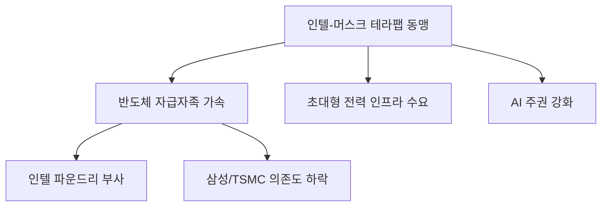

# 테크/지정학 분석: 인텔-머스크의 '테라팹' 프로젝트와 반도체 자급자족 시대의 서막
## 투자 신호 + 사회적 영향 평가

---

## 📌 기사 기본 정보

- **날짜**: 2026-04-09
- **출처**: 글로벌 반도체 및 AI 기술 인사이트
- **카테고리**: 경제 > 테크 > 지정학
- **핵심 주제**: 인텔과 일론 머스크(테슬라, xAI)가 손잡고 추진하는 초대형 반도체 공장 '테라팹(Terafab)' 프로젝트와 이를 통한 북미 중심의 반도체 자급자족 생태계 구축 전략 분석

**메타데이터**
- 주요 주체: 인텔(Intel), 일론 머스크(Tesla/xAI/SpaceX), 미국 정부(Chips Act 지원)
- 핵심 기술: 1.8A(1.8나노급 프리급) 공정, AI 가속기 전용 라인, 시스템-인-패키지(SiP)
- 주요 목표: 아시아(TSMC, 삼성) 의존도 탈피, AI 컴퓨팅 자원 내재화
- 키워드: 테라팹(Terafab), 반도체 자급자족, 머스크-인텔 동맹, 파운드리 부활

---

## 🔍 기사를 통한 투자 신호 추출

### 1단계: 핵심 사건 분해

**What (무엇이 일어났는가?)**
- 전통의 반도체 제왕 인텔과 파격적 혁신의 상징 머스크가 전격 결성. 미국 내에 역사상 최대 규모의 AI 전용 반도체 생산 기지(테라팹)를 구축하여, 설계부터 생산·수요(테슬라/xAI)까지 아우르는 수직 계열화 완성 시도.

**When (언제 일어났는가?)**
- 2026-04-09 (글로벌 공급망 병목 현상과 AI 반도체 쇼티지가 극에 달해 각국이 '반도체 주권'을 제1 국정 과제로 삼은 시점)

**Why (왜 일어났는가?)**
- 대만 리스크(TSMC)로부터 자유로운 안정적 AI 칩 공급처 확보 절실
- 인텔: 파운드리 시장 재진입을 위한 강력한 '앵커 고객(머스크)' 확보 필요
- 머스크: 엔비디아 의존도를 낮추고 테슬라 자율주행 및 xAI 전용 칩 최적화 생산 필요

**Who (누가 주도하는가?)**
- 파운드리 1위 탈환을 노리는 팻 겔싱어(인텔 CEO)
- 에너지와 컴퓨팅 파워의 완전한 수직 계열화를 꿈꾸는 일론 머스크

---

### 2단계: 투자 신호 해석

#### A. **긍정적 신호 (Bullish)**

**① '메이드 인 USA' 반도체 장비 및 부품사의 전성시대**
- **신호**: 미국 본토 내 초대형 팹(Fab) 건설
- **의미**: 미국 정부의 보조금을 받는 프로젝트인 만큼, 미국 내 공급망(AMAT, 램리서치 등) 및 우방국(네덜란드 ASML) 장비 우선 채택
- **투자 기회**: 글로벌 반도체 장비 대장주, 전력 인프라 공급사(이튼, 슈나이더 일렉트릭 등)

**② 인텔의 파운드리 기업 가치 재평가(Re-rating)**
- **신호**: 수조 원 단위의 머스크 물량 확보 가시화
- **의미**: "인텔 파운드리가 정말 될까?"라는 시장의 의심을 한 번에 해소하는 강력한 수주 신호
- **투자 기회**: 인텔 주식 및 인텔 밸류체인 소부장 업체

---

#### B. **위험 신호 (Bearish)**

**① 삼성전자·TSMC의 북미 시장 점유율 방어 위기**
- **신호**: 미국 최대 고객들이 '자국 팹'으로 이동
- **의미**: 가장 큰 수익원인 미국 빅테크 물량이 인텔로 분산될 경우 기존 파운드리 강자들의 마진율 하락 우려
- **투자 리스크**: 삼성전자 DS 부문, TSMC의 독점적 지위 약화 가능성

**② 기술 구현의 난이도와 수율 리스크**
- **신호**: 아직 검증되지 않은 초미세 공정(1.8A)에서의 대량 양산
- **의미**: 계획된 시점에 수율이 나오지 않을 경우 머스크의 차세대 서비스 전체가 지연되는 도미노 리스크 발생
- **투자 리스크**: 과도한 기대감이 반영된 인텔 관련 테마주

---

### 3단계: 섹터별 투자 기회 매트릭스

#### ✅ **높은 기대도 + 낮은 리스크**

**에너지 효율화 및 전력 변압기 섹터**
- 테라팹 같은 거대 공장과 기가 인큐베이터는 상상을 초월하는 전력을 소비하므로, 전력 망 인프라는 반도체 성공 여부와 상관없이 무조건 성장함
- **투자 추천도**: ⭐⭐⭐⭐⭐

---

## 💰 구체적 투자 신호 변환

### 신호 1: '글로벌 분업'의 종말과 '로컬 수직 계열화'의 승리

**투자 해석**: 기사는 반도체가 더 이상 '가장 싼 곳'에서 만드는 것이 아니라 '가장 안전한 내 마당'에서 만드는 시대로 변했음을 선포함. 머스크-인텔 동맹은 아시아 중심의 반도체 지형을 북미로 강제 이동시키는 거대한 중력임. 이제 투자자는 '배송료가 안 드는 근거리 공급망'을 가진 기업에 집중해야 함.

---

## 🌍 사회적 영향 평가

### A. 긍정적 사회 영향
- **글로벌 AI 혁신 속도 가속**: 컴퓨팅 자원의 풍부한 공급을 통해 인공지능이 해결할 수 있는 기후, 의학, 과학 난제 해결 가속
- **첨단 제조 일자리의 미 대륙 회귀**: 미국 내 고임금 기술 일자리 창출 및 지역 경제 활성화

### B. 부정적 사회 영향
- **디지털 패권의 독점 심화**: 특정 국가와 특정 기업 연합이 인류의 핵심 자산(반도체, AI)을 독점하며 발생하는 국가 간 불평등 심화
- **자원 파괴적 제조**: 거대 팹 건설 및 운영에 들어가는 막대한 전기와 용수 소모로 인한 환경적 부담 및 거주민 갈등

---

## 🎯 결론: 당신의 투자 전략 수립

- **즉시 실행**: 포트폴리오 내 반도체 비중을 '아시아 독점'에서 '북미 부활 세력(인텔 등)'으로 일부 분산
- **3개월 후**: 테라팹의 구체적인 착공 일정 및 미국 정부의 '칩스법' 추가 보조금 배정 규모 확인

---

## 📝 Obsidian 연결 구조

