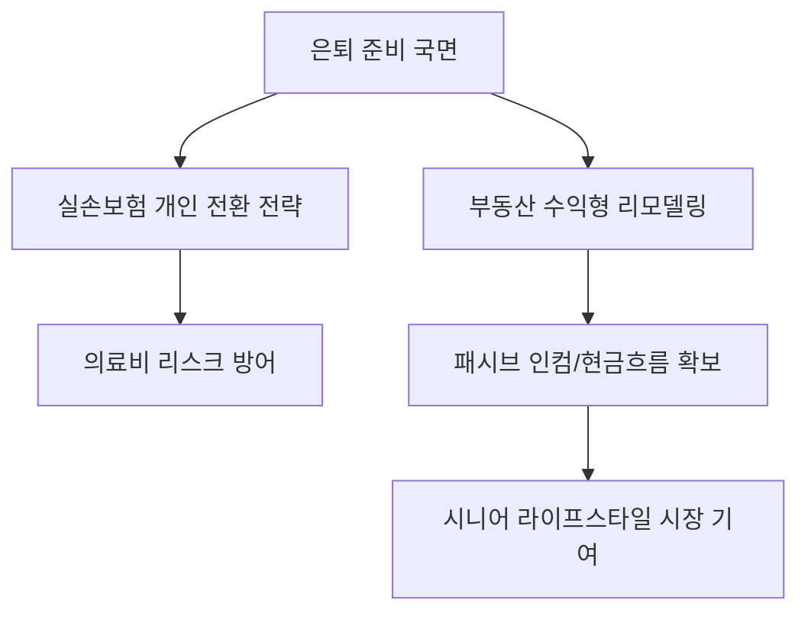

# 생활경제/재테크 분석: 은퇴 전 '실손보험 연계' 및 '부동산 자산 리모델링' 전략
## 투자 신호 + 사회적 영향 평가

---

## 📌 기사 기본 정보

- **날짜**: 2026-04-09
- **출처**: 대한민국 시니어 자산 관리 전략 리포트
- **카테고리**: 경제 > 생활금융 > 은퇴설계
- **핵심 주제**: 5060 세대의 본격적 은퇴 시즌을 맞아, 직장 단체 실손을 개인 실손으로 전환하는 '보험 연계' 비기(祕技)와 거주 주택을 수익형으로 바꾸는 '부동산 리모델링' 핵심 전략 분석

**메타데이터**
- 주요 제도: 단체실손-개인실손 전환 제도, 주택연금 활용 및 상가주택 리모델링
- 핵심 타겟: 은퇴 5년 전후의 1차 베이비부머 및 X세대 초입
- 주요 주체: 금융감독원, 보험사, 부동산 솔루션 기업
- 키워드: 은퇴 리모델링, 실손보험 전환, 주거비 절감, 패시브 인컴 확보

---

## 🔍 기사를 통한 투자 신호 추출

### 1단계: 핵심 사건 분해

**What (무엇이 일어났는가?)**
- 은퇴 후 소득 단절기에 가장 큰 리스크인 '의료비'와 '부동산 자산 편중' 문제를 해결하기 위한 구체적 솔루션 제시. 직장 보험 혜택을 중단 없이 개인으로 이어가고, 잠자는 자산인 거주용 주택을 월세가 나오는 '수익 창출기'로 변모시키는 전략.

**When (언제 일어났는가?)**
- 2026-04-09 (인구 구조상 고령층 비중이 급증하며 '보유 자산의 유동화'가 국가적/개인적 화두가 된 시점)

**Why (왜 일어났는가?)**
- 국민연금만으로는 준비되지 않은 노후의 실질적 생활비 부족 문제
- 의료 인플레이션으로 인해 실손보험 없이는 자산이 빠르게 잠식될 위험

**Who (누가 주도하는가?)**
- 자산의 70~80%가 부동산에 묶여 있는 5060 은퇴 예정자
- 시니어 전용 금융 상품을 개발하는 은행/보험사 및 인테리어/리모델링 전문 기업

---

### 2단계: 투자 신호 해석

#### A. **긍정적 신호 (Bullish)**

**① 노후 건축물 리모델링 및 인테리어 시장의 질적 도약**
- **신호**: 거주 주택을 수익형(다가구, 상가주택 등)으로 개조하려는 수요 급증
- **의미**: 신축보다는 '가치 업그레이드' 중심의 건설/건자재 수요 확대
- **투자 기회**: 프리미엄 건자재 전문사, 리모델링 특화 대형 인테리어 기업

**② 헬스케어 기반 금융 서비스 및 '실버 가전' 시장 성장**
- **신호**: 실손보험 유지 및 의료비 관리 전략에 대한 관심 증대
- **의미**: 건강을 지키는 것이 곧 자산을 지키는 것이라는 인식 확산으로 예방 의학 및 편리한 노후 생활 가전 수요 폭정
- **투자 기회**: 원격 모니터링 헬스케어 업체, 시니어 맞춤형 로봇 가전 기업

---

#### B. **위험 신호 (Bearish)**

**① 수익형 전환 실패에 따른 '깡통 상가/원룸' 리스크**
- **신호**: 준비 없는 부동산 자산 리모델링 열풍
- **의미**: 공실 리스크를 고려하지 않고 무리하게 대출을 받아 개조했으나 월세가 안 나올 경우 가계 파산 위험
- **투자 리스크**: 입지가 좋지 않은 지방 노후 주택 기반의 무분별한 리모델링 사업

**② 보험금 지급 청구 급증에 따른 보험사의 수익성 하락**
- **신호**: 고령층의 개인 실손 전환 및 유지율 상승
- **의미**: 손해율이 높은 고령층 가입자 비중이 늘어나며 보험사의 장기적 재무 부담 가중
- **투자 리스크**: 손해율 관리에 실패한 중소형 손해보험사

---

### 3단계: 섹터별 투자 기회 매트릭스

#### ✅ **높은 기대도 + 낮은 리스크**

**자산 유동화 및 연금 전환 전문 핀테크/프라이빗 뱅킹**
- 부동산을 주택연금이나 수익형 증권으로 변환해 주는 컨설팅 서비스의 가치는 시니어 시장에서 독보적임
- **투자 추천도**: ⭐⭐⭐⭐

---

## 💰 구체적 투자 신호 변환

### 신호 1: '자산의 크기'보다 '유동성의 속도'가 생존을 결정한다

**투자 해석**: 기사의 핵심은 '잠자는 10억 주택보다 매달 나오는 200만 원 월세가 낫다'는 것임. 이는 향후 부동산 시장이 강남권 등 초핵심지를 제외하고는 '수익률(Yield)' 중심으로 재편될 것임을 뜻함. 투자 시 '리모델링 후 수익 전환 가능성'이 높은 입지의 노후 자산에 주목해야 함.

---

## 🌍 사회적 영향 평가

### A. 긍정적 사회 영향
- **노후 빈곤 예방을 통한 사회 안전망 강화**: 개인 자산을 스스로 유동화하여 국가 복지 예산 부담 경감 및 삶의 질 유지
- **도심 주거 공급의 유연성 확보**: 노후 주택 리모델링을 통해 도심 내 소형 임대 주택(원룸, 투룸) 공급 활성화 효과

### B. 부정적 사회 영향
- **자산 양극화에 따른 은퇴 후 격차 심화**: 리모델링할 자산조차 없는 하위 계층 은퇴자와 자립 가능한 상위 계층 간의 사회적 위화감 조성
- **보험료 인상 도미노**: 고령층 실손 유지 비용이 젊은 세대의 보험료로 전가되며 발생하는 세대 간 갈등

---

## 🎯 결론: 당신의 투자 전략 수립

- **즉시 실행**: 부모님 또는 본인의 '단체 실손 전환 신청 기한' 확인 및 거주지의 임대 수익 시장 조사
- **3개월 후**: 주택연금 가입 기준 완화 및 수익형 전환 지원금 등 정부의 '고령자 주거 지원 정책' 변화 확인

---

## 📝 Obsidian 연결 구조

