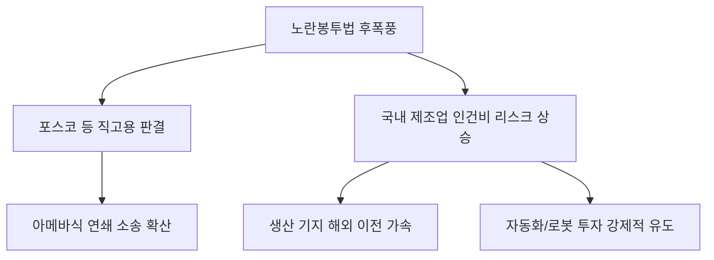

# 노동/법률 분석: '노란봉투법' 후폭풍과 포스코 직고용 결단, 아메바식 분쟁 분석
## 투자 신호 + 사회적 영향 평가

---

## 📌 기사 기본 정보

- **날짜**: 2026-04-09
- **출처**: 대한민국 고용노동 및 노사 관계 리포트
- **카테고리**: 경제 > 노동 > 법률/사회
- **핵심 주제**: 노란봉투법(노조법 제2, 3조 개정안) 입법 여파와 포스코의 협력사 직원 직고용 대법원 판결 이후 발생하는 연쇄적인 고용 분쟁 및 기업들의 대응 전략 분석

**메타데이터**
- 주요 법률: 노란봉투법(사용자 범위 확대, 손배 가압류 제한), 근로자 파업권 확대
- 핵심 사건: 포스코(POSCO) 협력사 직원 직고용 확정 판결 및 후속 조치
- 주요 주체: 포스코 홀딩스, 금속노조, 한국경영자총협회(경총), 헌법재판소
- 키워드: 노란봉투법, 불법파견 논란, 직고용 리스크, 노사 관계 4.0, 아메바식 분쟁

---

## 🔍 기사를 통한 투자 신호 추출

### 1단계: 핵심 사건 분해

**What (무엇이 일어났는가?)**
- 원청 기업이 하청 업체 노동자의 실질적인 '사용자'로 인정되는 '노란봉투법' 기조가 강화되며, 포스코 등 거대 장치 산업에서 협력사 직원을 직접 고용해야 한다는 법적 압박 증대. 이는 단순히 한 기업의 문제를 넘어 국내 산업 전반의 '외주화 모델'에 대한 근본적 위협으로 작용.

**When (언제 일어났는가?)**
- 2026-04-09 (입법 추진과 사법부의 전향적 판결이 맞물리며 경영계의 '노무 관리 패러다임'이 붕괴된 시점)

**Why (왜 일어났는가?)**
- 하청 노동자의 처우 개선 및 원청의 책임 강화라는 사회적 요구 증대
- '아메바식 분쟁': 한 부서가 직고용되면 연관된 다른 협력사들도 연쇄적으로 소송을 제기하는 확산성

**Who (누가 주도하는가?)**
- 법적 승소 경험을 바탕으로 전국적 직고용 투쟁을 가속화하는 거대 노동 조직
- 비용 절감을 위해 구축했던 '위탁 구조'가 붕괴될 위기에 처한 제조 대기업 경영진

---

### 2단계: 투자 신호 해석

#### A. **긍정적 신호 (Bullish)**

**① 공정 내 '완전 자동화' 및 '무인 로봇' 도입의 기폭제**
- **신호**: 사람을 쓰면 쓸수록 '직고용 및 파업 리스크'가 무한 확대됨
- **의미**: 기업들이 사람을 통한 하청 구조를 포기하고, 리스크가 없는 스마트 팩토리와 로봇 팔로 공정을 전면 교체하는 투자 단행
- **투자 기회**: 산업용 로봇, 무인 반송 로봇(AGV), 스마트 팩토리 제어 소프트웨어 사

**② 전문 '노사 관계 전략(IR) 컨설팅' 및 노무 법인 가치 상승**
- **신호**: 법적 리스크가 기업 존폐와 직결되는 수준으로 격상
- **의미**: 과거의 단순 노무 관리가 아닌, 정교한 법리 대응과 갈등 조정 능력을 갖춘 전문가 수요 폭증
- **투자 기회**: 대형 법무/노무 컨설팅 그룹, 분쟁 조정 전문 서비스 테크

---

#### B. **위험 신호 (Bearish)**

**① 국내 제조업의 '글로벌 원가 경쟁력' 상실 및 탈한국(Exodus)**
- **신호**: 직고용에 따른 인건비 및 복리후생비의 급격한 상승(수십 퍼센트 단위)
- **의미**: 한국 내 공장 운영의 메리트 소멸로 인해 신규 투자를 해외(미국, 동남아 등)로 돌리는 기업 가중
- **투자 리스크**: 국내 생산 비중이 높고 노동 집약적인 철강, 자동차, 조선 섹터 대형주

**② 실적의 '불확실성(Uncertainty)' 고조**
- **신호**: 수년간의 임금 소급분 청구 소송 등 잠재적 충당금 리스크
- **의미**: 장부상 이익이 나더라도 판결 한 번에 수천억 원의 비용이 발생할 수 있는 시한폭탄 보유
- **투자 리스크**: '불법 파견' 소송이 진행 중인 모든 코스피 대형 제조업체

---

### 3단계: 섹터별 투자 기회 매트릭스

#### ✅ **높은 기대도 + 낮은 리스크**

**국내보다 '해외 생산 및 판매 비중'이 압도적인 글로벌 대장주**
- 한국 내 노란봉투법 리스크를 해외 생산 기지의 효율성으로 상쇄할 수 있는 기업임
- **투자 추천도**: ⭐⭐⭐⭐

---

## 💰 구체적 투자 신호 변환

### 신호 1: '외주화' 모델의 종말과 '자동화'로의 강제 진입

**투자 해석**: 기사의 '아메바식 분쟁'은 기업 입장에서 통제 불가능한 리스크가 세포 분열하듯 퍼진다는 뜻임. 이제 '싼 인건비 하청'을 통한 이익 창출 모델은 끝났음. 투자 지표에서 '인당 매출액'이 급격히 높아지거나, 로봇 도입 속도가 가장 빠른 기업만이 이 노사 리스크의 파고를 넘을 수 있을 것임.

---

## 🌍 사회적 영향 평가

### A. 긍정적 사회 영향
- **노동 시장 이중 구조 개선**: 하청 근로자들의 고용 안정 및 처우 개선을 통해 '동일 노동 동일 임금'의 가치에 한걸음 근접
- **안전 책임의 명확화**: 원청의 직접 관리를 통해 산업 현장의 안전 사고 발생 시 책임 소재가 명확해지며 안전 투자 증가 유도

### B. 부정적 사회 영향
- **신규 채용 동결 및 고용 한파**: 직고용 부담을 느낀 기업들이 신규 채용을 극도로 억제하거나 정규직 채용을 기피하는 '고용 절벽' 유발
- **협력사(중소기업)의 붕괴**: 우수 인력이 대기업 직고용으로 빠져나가며 기존 협력업체들이 줄도산하거나 숙련 인력을 잃는 생태계 파괴

---

## 🎯 결론: 당신의 투자 전략 수립

- **즉시 실행**: 투자 중인 제조 대장주들의 '협력사 소송 현황'을 분기 보고서 주석에서 상세히 확인
- **3개월 후**: 노란봉투법에 대한 헌법재판소의 판단 및 정부의 시행령 수정 방향에 따른 제조업 비중 리밸런싱

---

## 📝 Obsidian 연결 구조

