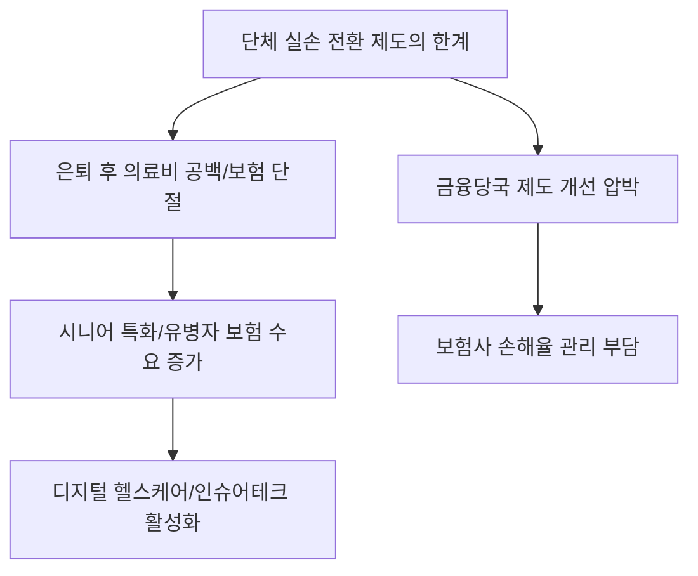

# 금융/복지 분석: 단체 실손보험의 개인 전환 제도 한계와 개선 전략
## 투자 신호 + 사회적 영향 평가

---

## 📌 기사 기본 정보

- **날짜**: 2026-04-10
- **출처**: 대한민국 보험 금융 시장 진단 보고서
- **카테고리**: 경제 > 금융 > 보험복지
- **핵심 주제**: 직장 단체 실손보험의 개인 실손 전환 제도가 가진 실도적 한계와 은퇴 후 의료비 공백을 메우기 위한 제도적 개선 방안 및 개인별 대응 전략 분석

**메타데이터**
- 주요 제도: 단체실손-개인실손 전환 제도 (은퇴 시 소급 적용)
- 핵심 문제점: 전환 시 가입 조건 강화, 무사고 이력 요구, 보장 범위 축소 가능성
- 주요 주체: 금융감독원, 생명·손해보험협회, 퇴직 예정 근로자
- 키워드: 보험 단절 리스크, 전환 실손, 은퇴 의료비, 보험 사각지대

---

## 🔍 기사를 통한 투자 신호 추출

### 1단계: 핵심 사건 분해

**What (무엇이 일어났는가?)**
- 직장 재직 중에는 단체 보험으로 혜택을 받다가 퇴직 후 개인 보험으로 전환하려 할 때, 과거 병력이나 까다로운 전환 조건 때문에 '거절'되거나 '보장 축소'가 일어나는 사례 빈번. 이는 고령화 시대 시니어들의 주거·생활비 다음으로 큰 재무 리스크로 부상.

**When (언제 일어났는가?)**
- 2026-04-10 (대규모 은퇴 세대가 쏟아지며 보험금 분쟁과 의료비 파산 위험이 사회적 이슈로 떠오른 시점)

**Why (왜 일어났는가?)**
- 보험사입장에서는 손해율이 높은 고령층 가입자를 그대로 받아들이는 것이 재무적 부담
- 가입자가 재직 중 중증 질환을 앓았을 경우, 전환 제도상의 '무심사' 요건을 충족하지 못하는 법적 허점 존재

**Who (누가 주도하는가?)**
- 제도 개선을 압박하는 금융 당국과 가입자 단체
- 수익성 방어를 위해 방어적 전환 정책을 유지하려는 손해보험사들

---

### 2단계: 투자 신호 해석

#### A. **긍정적 신호 (Bullish)**

**① '시니어 전용 특화 보험' 및 '헬스케어 결합 상품' 시장의 팽창**
- **신호**: 기존 전환 제도의 불완전성에 따른 대안 수요 증대
- **의미**: 전환 조건이 가혹한 대신, 유병자도 가입 가능한 고가의 시니어 보험이나 건강 관리 시 보험료를 깎아주는 헬스케어 테크 상품이 각광
- **투자 기회**: 헬스케어 플랫폼 보유 보험사, 디지털 건강 관리 소프트웨어 전문사

**② 고령층 특화 '프라이빗 간병 및 전문 의료 서비스' 산업 성장**
- **신호**: 보험으로 해결되지 않는 의료비 공백을 직접 지불할 수 있는 상위 계층의 '자산 기반 의료' 선호
- **의미**: 보험보다는 확실한 현금 서비스(간병, 실버타운 연계)로 눈을 돌리는 자산가 은퇴층 증가
- **투자 기회**: 대형 실버타운 운영사, 상급 종합병원 연계 서비스 기업

---

#### B. **위험 신호 (Bearish)**

**① 제2금융권 및 손해보험사의 '손해율 관리' 위기**
- **신호**: 정부의 강제적 전환 요건 완화 압박
- **의미**: 고위험 가입자를 억지로 받아야 할 경우 보험사의 장기 수익성 및 지급여력비율(K-ICS) 훼손 가능성
- **투자 리스크**: 자본 확충이 부족한 중소형 화재/손해보험주

**② 시니어 계층의 가처분 소득 급감에 따른 내수 소비 위축**
- **신호**: 예상치 못한 보험 가입 거절 및 고액 의료비 지출
- **의미**: 은퇴 자금이 의료비로 급격히 유출되며 여행, 여가, 소비재 시장의 주요 동력 상실
- **투자 리스크**: 시니어 여행 테마주, 중대형 외식 프랜차이즈

---

### 3단계: 섹터별 투자 기회 매트릭스

#### ✅ **높은 기대도 + 낮은 리스크**

**데이터 기반의 '보험 비교 분석 및 리모델링' 핀테크 기업**
- 제도적 난해함을 풀어주고 개인에게 최적화된 전환 타이밍과 대안 상품을 추천해 주는 서비스는 불황 없는 성장이 가능함
- **투자 추천도**: ⭐⭐⭐⭐

---

## 💰 구체적 투자 신호 변환

### 신호 1: '보험 주권' 확보가 가계 자산 방어의 최전선

**투자 해석**: 기사는 은퇴가 단순히 직장을 그만두는 것이 아니라 '보험 환경의 대격변'임을 경고함. 투자자는 보험사들이 이 '전환 리스크'를 어떻게 실적으로 소화하는지(손해율 관리) 유심히 봐야 함. 또한 보험의 빈틈을 메우는 '바이오/제약' 분야와 '실버 헬스케어' 하드웨어 분야가 보험 상품의 강력한 대체재가 될 것임.

---

## 🌍 사회적 영향 평가

### A. 긍정적 사회 영향
- **고령층 의료 안전망에 대한 경각심 고취**: 퇴직 전 미리 준비해야 한다는 인식을 확산시켜 개인의 재무 건전성 제고 유도
- **지능형 보험 상품 개발 촉진**: IT 기술을 활용해 리스크를 정밀하게 측정하는 혁신적 보험 모델(Insur-tech) 도입 가속화

### B. 부정적 사회 영향
- **'의료 양극화' 심화**: 직장에 있을 때만 보호받고 늙으면 버려진다는 사회적 소외감 및 세대 간 불평등 의식 고착화
- **공공 의료 재정 부담 전이**: 민영 보험에서 밀려난 고령층이 건강보험 재정으로 쏠리며 발생하는 전 국가적 복지 비용 상승

---

## 🎯 결론: 당신의 투자 전략 수립

- **즉시 실행**: 본인 및 가족의 단체 실손 규정을 확인하고, '무사고 5년' 요건 등 전환을 위한 필요 조건을 미리 관리
- **3개월 후**: 금융감독원이 발표할 '실손보험 전환 제도 개선안'의 소급 적용 범위 확인 후 보험 섹터 종목 선별

---

## 📝 Obsidian 연결 구조

