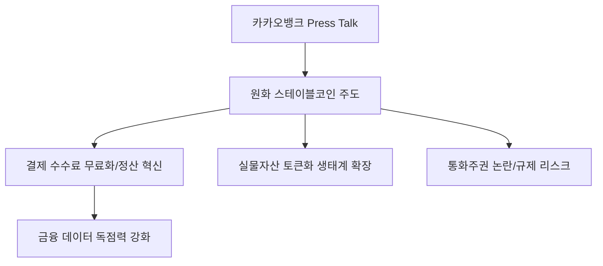

# 금융/디지털 분석: 카카오뱅크의 2026 '프레스톡'과 원화 스테이블코인 주도 전략
## 투자 신호 + 사회적 영향 평가

---

## 📌 기사 기본 정보

- **날짜**: 2026-04-10
- **출처**: 카카오뱅크 2026 프레스톡 (Press Talk) 공식 발표
- **카테고리**: 경제 > 금융 > 핀테크/가상자산
- **핵심 주제**: 카카오뱅크가 발표한 2026년 핵심 비전 중 '원화 기반 스테이블코인(Stablecoin)' 및 가상자산 연계 결제 시스템 도입을 통한 전통 금융과 블록체인 생태계의 결합 전략 분석

**메타데이터**
- 주요 상품: 원화 연동 스테이블코인 (K-Stablecoin), 가상자산 수탁(Custody) 서비스
- 핵심 타겟: 디지털 네이티브 세대(MZ), 국경 없는 결제를 원하는 직구/역직구 업체
- 주요 주체: 카카오뱅크, 카카오페이, 금융위원회(규제 당국), 주요 가상자산 거래소
- 키워드: 디지털 뱅킹 2.0, 스테이블코인, RWA(실물자산 토큰화), 금융의 코드화

---

## 🔍 기사를 통한 투자 신호 추출

### 1단계: 핵심 사건 분해

**What (무엇이 일어났는가?)**
- 카카오뱅크가 단순 인터넷 은행을 넘어 '디지털 자산의 허브'가 되겠다고 선언. 원화 가치에 1:1로 고정된 스테이블코인을 직접 발행하거나 유통 구조를 주도하여, 낮은 수수료와 실시간 정산이 가능한 새로운 결제 패러다임 구축 시도.

**When (언제 일어났는가?)**
- 2026-04-10 (정부의 토큰 증권(ST) 법제화 및 중앙은행 디지털 화폐(CBDC) 테스트가 무르익은 시점)

**Why (왜 일어났는가?)**
- 기존 송금/결제 망의 높은 수수료 구조 탈피 및 플랫폼 점유율 확대
- 가상자산 시장으로 유출되는 자금을 다시 은행 생태권 안으로 묶어두는(Lock-in) 전략

**Who (누가 주도하는가?)**
- 기술 기반 금융 혁신을 이끄는 윤호영 카카오뱅크 대표 및 전략 팀
- 카카오 생태계 내의 강력한 유저 베이스

---

### 2단계: 투자 신호 해석

#### A. **긍정적 신호 (Bullish)**

**① '금융 플랫폼'에서 '화폐 발행 및 유통 플랫폼'으로의 도약**
- **신호**: 원화 스테이블코인 시장 선점 선언
- **의미**: 카카오톡이라는 거대 메신저 기반으로 실질적인 '디지털 화폐' 지배력을 가질 경우, 예대마진 이상의 거대한 결제 수수료 및 데이터 수익 창출 가능
- **투자 기회**: 카카오뱅크, 카카오, 관련 블록체인 메인넷 기술 보유사

**② STO(토큰 증권) 및 RWA(실물 자산 토큰화) 시장의 폭발**
- **신호**: 가상자산 수탁 및 관리 인프라 구축
- **의미**: 부동산, 미술품, 금 등을 쪼개서 결제할 때 카카오뱅크의 스테이블코인이 표준으로 사용될 가능성
- **투자 기회**: 조각 투자 플랫폼, 자산 토큰화 솔루션 기업

---

#### B. **위험 신호 (Bearish)**

**① 규제 당국과의 정면 충돌 및 입법 지연 리스크**
- **신호**: 민간 은행의 스테이블코인 발행에 대한 한국은행 및 금융위의 경계
- **의미**: 통화 주권 침해 논란으로 인해 사업 시행이 무기한 연기되거나 과도한 예치금 규제가 적용될 위험
- **투자 리스크**: 가상자산 사업 확장을 주 평가지표로 삼은 카카오뱅크 단기 주가

**② 사이버 보안 및 기술적 신뢰성 이슈**
- **신호**: 블록체인 망의 해킹 또는 스마트 컨트랙트 오류 우려
- **의미**: 한 번의 사고로 은행의 가장 중요한 자산인 '신뢰'가 무너질 경우 뱅크런(Run on the bank) 사태 초래
- **투자 리스크**: 보안 시스템 구축이 검증되지 않은 초기 핀테크 확장주

---

### 3단계: 섹터별 투자 기회 매트릭스

#### ✅ **높은 기대도 + 낮은 리스크**

**글로벌 보안 인증을 받은 '금융 보안 및 영지식 증명(ZKP)' 솔루션 업체**
- 스테이블코인의 익명성과 보안성을 동시에 확보하기 위한 필수 기술임
- **투자 추천도**: ⭐⭐⭐⭐⭐

---

## 💰 구체적 투자 신호 변환

### 신호 1: '돈의 이름'이 바뀌는 변곡점

**투자 해석**: 기사는 카카오뱅크가 '은행'의 탈을 쓴 '빅테크 화폐권력'을 꿈꾸고 있음을 보여줌. 원화 스테이블코인은 은행 앱을 쓰지 않고도 카카오톡 친구에게 바로 돈(가치)을 보낼 수 있는 시대를 뜻함. 이는 전통적인 시중은행들에게는 치명적인 위협이며, 결제 시스템을 선점한 카카오뱅크에게는 독점적 프리미엄을 부여함.

---

## 🌍 사회적 영향 평가

### A. 긍정적 사회 영향
- **결제 혁신을 통한 사회적 비용 절감**: 복잡한 카드 결제망과 높은 가맹점 수수료를 줄여 소상공인과 소비자 모두에게 이익 환원
- **금융 포용성 확대**: 스마트폰 하나로 전 세계 어디서든 즉시 정산이 가능한 환경 구축으로 글로벌 금융 접근성 향상

### B. 부정적 사회 영향
- **중앙은행 통화 정책의 통제력 약화**: 민간 스테이블코인 유통량이 과도해질 경우 국가의 유동성 관리 능력이 약화될 우려
- **디지털 소외 계층의 박탈감**: 현금과 실물 카드 대신 복잡한 디지털 자산 지갑을 써야 하는 환경에서 고령층 등 소외 계층의 생활 불편 가중

---

## 🎯 결론: 당신의 투자 전략 수립

- **즉시 실행**: 카카오뱅크 포트폴리오 내 비중 유지 및 한국은행의 CBDC 테스트와 카카오 스테이블코인의 상호 호환성 여부 모니터링
- **3개월 후**: 금융위원회의 '가상자산 이용자 보호법 2단계' 및 스테이블코인 가이드라인 발표 수위 확인

---

## 📝 Obsidian 연결 구조

