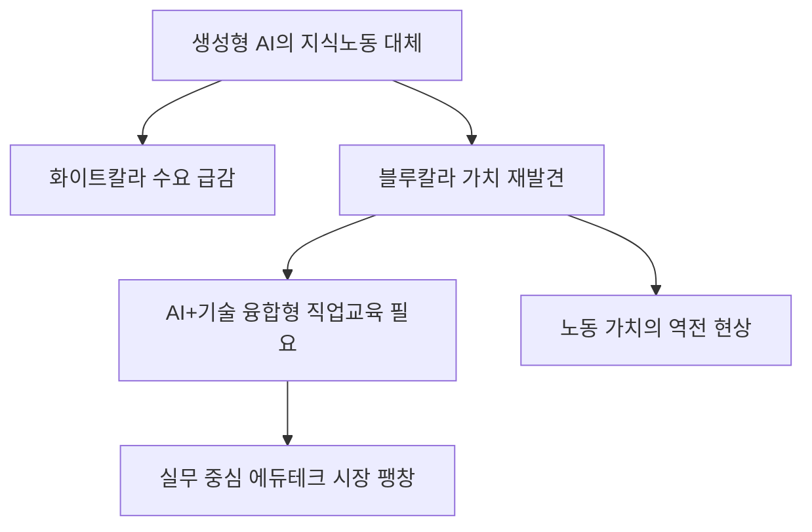

# 노동/교육 분석: AI 시대 '블루칼라의 귀환'과 직업 교육 혁신 전략
## 투자 신호 + 사회적 영향 평가

---

## 📌 기사 기본 정보

- **날짜**: 2026-04-10
- **출처**: 대한민국 고용 시장 미래 트렌드 보고서
- **카테고리**: 경제 > 노동 > 교육혁신
- **핵심 주제**: 생성형 AI가 화이트칼라 업무를 대체하는 반면, 실물 현장에서의 숙련된 기술(블루칼라)의 가치가 재평가되는 현상과 이를 뒷받침할 AI 융합형 직업 교육의 필요성 분석

**메타데이터**
- 주요 현황: 화이트칼라 정규직 공고 감소 vs 숙련 기술직 구인난 심화
- 핵심 전략: AI + 현장 기술(Smart Blue-collar) 융합 교육
- 주요 주체: 교육부, 고용노동부, 폴리텍 대학, 민간 기술 전문 훈련 기관
- 키워드: 블루칼라 리네상스, 생성형 AI 리스크, 기술 숙련공, 직업 교육 4.0

---

## 🔍 기사를 통한 투자 신호 추출

### 1단계: 핵심 사건 분해

**What (무엇이 일어났는가?)**
- AI가 코드 작성, 법률 문서 검토, 마케팅 등 지식 노동을 잠식하면서, AI가 대체하기 힘든 '물리적 공간에서의 복합적 문제 해결 능력'을 가진 기술직(전기, 배관, 정밀 가공, 건설 등)의 몸값이 폭등함.

**When (언제 일어났는가?)**
- 2026-04-10 (생성형 AI의 상용화가 기업 내 사무직 인원 감축으로 이어지며 대중의 직업관이 바뀌기 시작한 시점)

**Why (왜 일어났는가?)**
- AI는 '비트(Bit)'의 세계는 지배하지만, 현실 세계의 '원자(Atom)'를 다루는 로봇 기술은 아직 인간의 미세한 숙련도를 따라오지 못하기 때문
- 전반적인 기술직 고령화로 인해 젊은 숙련공 공급이 끊기며 '희소성'에 의한 가격(임금) 상승 발생

**Who (누가 주도하는가?)**
- 화이트칼라 경쟁에서 벗어나 전문 기술을 습득하려는 2030 MZ 세대
- 생산성 유지를 위해 고숙련공 확보에 혈안이 된 제조/건설 대기업

---

### 2단계: 투자 신호 해석

#### A. **긍정적 신호 (Bullish)**

**① 실무 중심 '에듀테크 및 성인 직업 교육' 플랫폼의 성장**
- **신호**: 대학 학위보다 '실무 자격과 기술'을 선호하는 사회 분위기
- **의미**: 전통적 대학 교육의 위기와 대조적으로, 단기간에 고숙련 기술을 전수하는 유료 특화 교육 시장의 폭발적 성장
- **투자 기회**: 실습 중심의 코딩/기술 교육 상장사, AR/VR 기반 가상 실습 솔루션 기업

**② '스마트 가전/설비 유지 보수' 서비스 기업의 가치 상승**
- **신호**: 복잡한 첨단 설비를 다룰 줄 아는 인간 작업자의 가치 증가
- **의미**: 제품 판매보다 '관리 및 AS' 단계에서 더 큰 부가가치 창출
- **투자 기회**: 대형 가전/설비 렌탈 및 관리 서비스 업체, 전문 정비 인프라 보유사

---

#### B. **위험 신호 (Bearish)**

**① 사무용 소프트웨어 및 범용 화이트칼라 서비스 시장의 위축**
- **신호**: 단순 사무 인력의 대규모 감축 및 신규 채용 중단
- **의미**: 기존 기업용 라이선스 매출 위주였던 B2B 소프트웨어 기업들의 사용자 수 기반 매출 하락 위험
- **투자 리스크**: AI 도입으로 인한 일자리 대체율이 높은 업종의 솔루션 공급사

**② 교육 시장의 극심한 양극화와 '학위 무용론'**
- **신호**: 지방 대학의 몰락 가속 및 기술 전문 학교로의 지원자 쏠림
- **의미**: 대학 기반 부동산 및 상권의 가치 하락, 학위 장사 위주의 교육 재단 재무 위기
- **투자 리스크**: 지방 거점 대학 인근 부동산 자산 리츠

---

### 3단계: 섹터별 투자 기회 매트릭스

#### ✅ **높은 기대도 + 낮은 리스크**

**AI 보조 장비(Wearable) 및 증강현실(AR) 기반 기술 전수 솔루션**
- 초보 숙련공도 숙련공처럼 일하게 해주는 '기술 보조 도구' 시장은 블루칼라 복귀의 핵심 엔진임
- **투자 추천도**: ⭐⭐⭐⭐⭐

---

## 💰 구체적 투자 신호 변환

### 신호 1: '손'과 'AI'가 만나는 곳에 거대한 부가 있다

**투자 해석**: 기사는 단순히 노가다의 부활을 말하는 게 아님. AI를 도구로 써서 현장 문제를 해결하는 '뉴 블루칼라'의 탄생을 예고함. 이제 투자자는 '앉아서 메일을 쓰는 사람'보다 '현장에서 기계를 만지며 데이터로 의사결정하는 사람'을 위한 인프라에 투자해야 함. 지식 노동의 인건비는 낮아지고 기술 노동의 인건비는 높아지는 거대 역전 현상에 베팅해야 함.

---

## 🌍 사회적 영향 평가

### A. 긍정적 사회 영향
- **일자리 미스매치 해소 및 실업률 하락**: 고학력 실업자들이 부족한 기술직으로 이동하며 국가적 생산성 향상
- **제조 현장의 디지털화 가속**: 젊고 스마트한 인력의 유입으로 낡은 제조 현장이 스마트 팩토리로 변모하는 선순환 구조 형성

### B. 부정적 사회 영향
- **화이트칼라 중산층의 붕괴**: AI에 일자리를 잃은 사무직들이 기술직으로의 전직에 실패할 경우 발생하는 대규모 중산층 빈곤화
- **교육 불평등의 고착화**: 비싼 비용을 지불해야 하는 '고급 기술 교육'에 접근하지 못한 계층의 영구적인 하층 노동자 전락 위험

---

## 🎯 결론: 당신의 투자 전략 수립

- **즉시 실행**: 포트폴리오 내 중상위권 대학 교육 서비스 종목 비중 축소 및 '기술 교육 전문 핀테크' 모니터링
- **3개월 후**: 정부의 '직업교육특별법' 제정 여부와 각 폴리텍 대학의 AI 융합 전형 지원율 확인

---

## 📝 Obsidian 연결 구조

