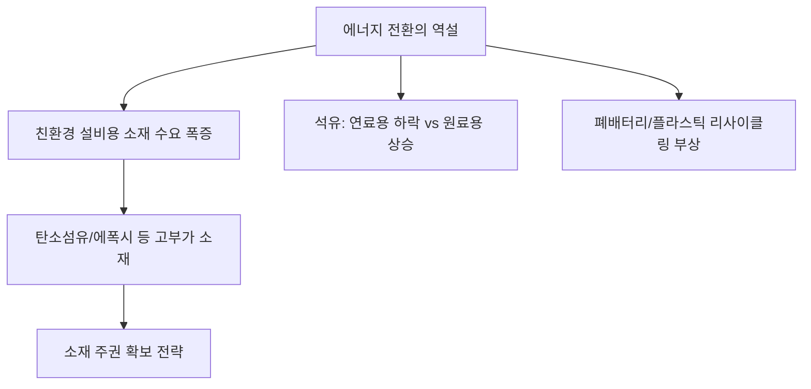

# 에너지/산업 분석: 석유화학 기반 에너지 전환의 역설과 소재 주권 분석
## 투자 신호 + 사회적 영향 평가

---

## 📌 기사 기본 정보

- **날짜**: 2026-04-10
- **출처**: 글로벌 산업 자원 에너지 분석 리포트
- **카테고리**: 경제 > 산업 > 에너지전환
- **핵심 주제**: 탄소 중립을 위해 화석 연료를 줄여야 하지만, 태양광·풍력·전기차 등 친환경 설비를 만드는 데 막대한 양의 '석유화학 기반 소재'가 들어가는 에너지 전환의 역설적 상황과 대한민국 소재 주권 확보 전략 분석

**메타데이터**
- 주요 역설: 화석 연료 소비 감소 촉진 ↔ 친환경 인프라용 석유화학 소재 수요 폭증
- 핵심 소재: 에폭시(풍력 날개), 폴리실리콘(태양광), 탄소섬유, 폐배터리 리사이클링용 용매
- 주요 주체: 국내 주요 석유화학사(LG화학, 롯데케미칼 등), 환경단체, 에너지 정책 입안자
- 키워드: 에너지 전환의 역설(Paradox), 그린 석유화학, 소재 안보, 순환 경제

---

## 🔍 기사를 통한 투자 신호 추출

### 1단계: 핵심 사건 분해

**What (무엇이 일어났는가?)**
- 탈(脫)탄소가 석유화학 산업의 종말을 의미하는 것이 아니라, 오히려 친환경 에너지 구축을 위한 '스페셜티(Specialty) 소재' 기업으로의 대전환을 요구함. 풍력 터빈, 전기차 섀시, 태양광 패널 모두 원유에서 추출한 정밀 화학 소재 없이는 생산 불가능.

**When (언제 일어났는가?)**
- 2026-04-10 (전통적인 범용 석유화학 제품은 중국의 가성비 공세에 밀리고, 친환경 첨단 소재 위주로 시장의 수익 구조가 재편되는 시점)

**Why (왜 일어났는가?)**
- 친환경 설비의 대형화/고효율화에 필요한 경량화 소재(탄소섬유 등) 및 내구성 강화 소재 수요 급증
- 단순 연료용 원유 수요는 줄지만, 산업용 원료(Feedstock)로서의 가치는 더욱 높아짐

**Who (누가 주도하는가?)**
- 기존 굴뚝 산업에서 소재 과학 기업으로 변신 중인 국내 대형 화학사
- 소재 자주권 확보를 위해 국책 과제를 수행하는 연구 기관

---

### 2단계: 투자 신호 해석

#### A. **긍정적 신호 (Bullish)**

**① '그린 소재' 포트폴리오를 선점한 석유화학 대장주의 재평가**
- **신호**: 재생에너지 설비용 고부가 가치 제품 비중 확대
- **의미**: 저가 중국산과의 가격 경쟁에서 벗어나 글로벌 친환경 공급망의 필수 파트너로 격상(Moat 형성)
- **투자 기회**: 탄소섬유, 수소 저장 탱크 소재, 전기차용 고기능 플라스틱 선도 기업

**② 바이오 기반 원료(Bio-feedstock) 및 재생 플라스틱 시장의 개화**
- **신호**: 석유 대신 식물이나 폐기물에서 화학 원료를 뽑아내는 기술 상용화
- **의미**: 탄소 국경세(CBAM) 등 글로벌 환경 규제를 수익 창출의 기회로 전환하는 기업의 독주
- **투자 기회**: 생분해성 플라스틱 제조사, 화학적 재활용(Chemical Recycling) 기술 보유 기업

---

#### B. **위험 신호 (Bearish)**

**① 범용 석유화학 제품의 만성적 공급 과잉 및 마진 위축**
- **신호**: 중국의 자급률 평정과 대규모 증설
- **의미**: 전통적인 비닐, 페트병 등 범용 제품으로는 더 이상 이익을 낼 수 없는 구조적 한계 봉착
- **투자 리스크**: 스페셜티 전환이 늦은 2선 석유화학사 및 정유사

**② 원자재 도입 단가(유가)와 환경 규제 비용의 이중고**
- **신호**: 탄소 배출권 가격 상승 및 지정학적 에너지 불안
- **의미**: 공정을 돌리는 데 필요한 에너지는 비싸지는데, 배출하는 탄소량에 따른 패널티는 늘어나는 샌드위치 리스크
- **투자 리스크**: 에너지 효율화 투자가 미비한 노후 공장 보유 기업

---

### 3단계: 섹터별 투자 기회 매트릭스

#### ✅ **높은 기대도 + 낮은 리스크**

**탄소 배출 절감형 공정과 친환경 소재를 동시에 보유한 '모빌리티 소재' 대장주**
- 전기차 경량화와 배터리 보호 소재는 에너지 전환의 가장 확실한 수익처임
- **투자 추천도**: ⭐⭐⭐⭐⭐

---

## 💰 구체적 투자 신호 변환

### 신호 1: '연소'되는 석유는 지고, '구조'가 되는 석유는 뜬다

**투자 해석**: 기사는 석유의 용도가 '태우는 에너지'에서 '친환경 기기를 만드는 소재'로 완전히 변하고 있음을 시사함. 이제 투자자는 화학 기업을 볼 때 정제 마진(Spread)이 아니라 '재생에너지 인프라 기여도'를 봐야 함. 태양광과 풍력이 많이 깔릴수록 실적이 오르는 화학사가 진정한 수혜주임.

---

## 🌍 사회적 영향 평가

### A. 긍정적 사회 영향
- **산업 생태계의 질적 위생화**: 굴뚝 산업이라는 오명을 벗고, 지구 환경을 지키는 핵심 기기들의 원료 공급원으로서의 긍정적 가치 창출
- **자원 순환 체계 구축**: 폐플라스틱을 다시 원료로 쓰는 순문 경제(Circular Economy) 모델을 통해 폐기물 문제 해결 기여

### B. 부정적 사회 영향
- **일자리 구조조정 우려**: 전통 공정 폐쇄 및 자동화된 친환경 공정 도입으로 인한 기존 숙련 노동자들의 고용 불안
- **친환경의 '그림자' 비용**: 소재 생산 과정에서 여전히 발생하는 탄소 배출과 에너지 소비에 대한 사회적 비판 직면 가능성

---

## 🎯 결론: 당신의 투자 전략 수립

- **즉시 실행**: 투자 중인 화학 종목의 '스페셜티 비중' 및 '친환경 소재 매출 가이드라인' 재점검
- **3개월 후**: 유럽의 탄소국격조정제도(CBAM) 본격 시행에 따른 국내 소재 기업들의 인증 획득 현황 및 가격 경쟁력 변화 분석

---

## 📝 Obsidian 연결 구조

