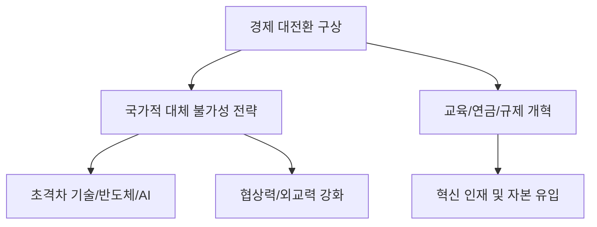

# 국가 전략 분석: 김성식 부의장의 '경제 대전환' 구상과 국가적 대체 불가성 전략
## 투자 신호 + 사회적 영향 평가

---

## 📌 기사 기본 정보

- **날짜**: 2026-04-10
- **출처**: 정책 기획 및 국가 전략 미래 리포트
- **카테고리**: 경제 > 정책 > 국가전략
- **핵심 주제**: 김성식 국회부의장(전)이 제안한 한국 경제의 생존을 위한 '경제 대전환' 모델과 글로벌 시장에서 대한민국이 '대체 불가능한 존재(Indispensable Nation)'가 되기 위한 구체적 전략 분석

**메타데이터**
- 주요 구상: 지대 추구형 경제 탈피, 혁신 주도형 성장 체계로의 대전환
- 핵심 키워드: 대체 불가성(Indispensability), 초격차 기술 안보, 교육 혁명, 연금 개혁
- 주요 주체: 국회 정책 기획단, 범부처 경제 혁신 위원회, 글로벌 산업 파트너(미국/EU)
- 핵심 변수: 정쟁을 넘어선 초당적 입법 지원 여부, R&D 예산의 효율적 배분

---

## 🔍 기사를 통한 투자 신호 추출

### 1단계: 핵심 사건 분해

**What (무엇이 일어났는가?)**
- 대한민국이 직면한 저성장·고령화·양극화 위기를 극복하기 위해, 산업 구조를 '모방'에서 '창조'로 바꾸는 국가적 리모델링 계획 발표. 특히 글로벌 공급망에서 한국을 빼면 전 세계 시스템이 마비될 정도의 기능을 확보해야 한다는 '국가적 대체 불가성' 전략 강조.

**When (언제 일어났는가?)**
- 2026-04-10 (글로벌 블록화가 가속되며 '내 편이 아니면 적'이 되는 냉혹한 국제 질서 속에서 한국의 독자적 가치 증명이 절실해진 시점)

**Why (왜 일어났는가?)**
- 기존의 '추격자(Fast Follower)' 모델로는 중국의 추격과 미국의 견제를 동시에 이겨낼 수 없기 때문
- 연급, 교육 등 구조적 개혁 없이는 국가 잠재 성장률이 0%대로 추락할 것이라는 위기감

**Who (누가 주도하는가?)**
- 정책 전문가 김성식 전 부의장 및 뜻을 같이하는 혁신 정치 세력
- 미래 먹거리를 고민하는 연구 기관 및 글로벌 전략 컨설팅 그룹

---

### 2단계: 투자 신호 해석

#### A. **긍정적 신호 (Bullish)**

**① '초격차 기술 기업'에 대한 국가적 자원 집중**
- **신호**: 대체 불가성이 입증된 기술(반도체 전공정, 차세대 배터리, 핵심 바이오)에 대한 전폭적 지원
- **의미**: 해당 섹터 기업들은 정부의 보조금, 세제 혜택은 물론이고 국가 차원의 외교적 보호를 받게 됨
- **투자 기회**: 세계 1~3위 점유율을 가진 한국의 기술 대장주 및 독점적 원천 기술 보유 벤처

**② 인프라 및 디지털 전환 기반 기술의 표준화**
- **신호**: 경제 대전환을 뒷받침할 AI, 6G, 양자 컴퓨팅 등 인프라 선제 구축
- **의미**: 국가적 대형 프로젝트(Mega Project) 발주가 이 분야에서 지속적으로 발생
- **투자 기회**: 정부 주도 디지털 뉴딜 참여 기업, 국가 기간망 보안 솔루션 업체

---

#### B. **위험 신호 (Bearish)**

**① '지대 추구(Rent-seeking)'형 산업에 대한 규제 및 매력도 하락**
- **신호**: 부동산 투기, 인·허가권 독점 등 혁신 없는 이익 구조에 대한 경고
- **의미**: 정부 정책이 자본의 흐름을 '부동산'에서 '혁신 기업'으로 돌리려 함에 따라 관련 섹터 유동성 감소
- **투자 리스크**: 단순 임대형 부동산 리츠, 정부 인허가에만 의존하는 독과점 유틸리티/서비스업

**② 개혁 부진 시 발생하는 '국가 신용 리스크'**
- **신호**: 구상은 원대하나 입법 과정에서의 정쟁으로 인한 지연
- **의미**: 골든타임을 놓칠 경우 글로벌 투자자들이 한국 시장 전체를 '서서히 가라앉는 배'로 인식
- **투자 리스크**: 원화 가치 하락 및 한국 국채 금리 상승(채권 가격 하락)

---

### 3단계: 섹터별 투자 기회 매트릭스

#### ✅ **높은 기대도 + 낮은 리스크**

**국가 전략 기술로 지정된 분야의 공급망 핵심 기업**
- 정치적 성향과 무관하게 국가 생존을 위해 밀어줄 수밖에 없는 분야임
- **투자 추천도**: ⭐⭐⭐⭐⭐

---

## 💰 구체적 투자 신호 변환

### 신호 1: '한국이 없으면 안 되는 세상'을 만드는 기업을 찾아라

**투자 해석**: 김성식 부의장이 강조한 '대체 불가성'은 투자자에게 최고의 필터임. 기업의 제품이 글로벌 공급망에서 빠졌을 때 공장이 멈추는가? 아니면 다른 기업 제품으로 금방 바꿀 수 있는가? 전자에 속하는 기업(ASML급의 국내 소부장 대장주 등)이 향후 10년 대한민국 국운과 함께할 승리자임.

---

## 🌍 사회적 영향 평가

### A. 긍정적 사회 영향
- **일자리 구조의 고도화**: 단순 조립 노동에서 창의적 설계 및 연구 위주로 산업이 재편되며 고연봉 양질의 일자리 창출
- **국가적 위상 제고**: 지정학적 요충지로서의 역할뿐만 아니라 '기술 안보의 핵심 파트너'로서 국제 사회의 발언권 강화

### B. 부정적 사회 영향
- **양극화 심화 및 패자 부활의 어려움**: 혁신 경쟁에서 밀려난 전통 산업 종사자들의 대규모 실직 및 사회적 갈등
- **개혁 통증에 따른 사회적 피로**: 연금 및 교육 개혁 과정에서 불가피하게 발생하는 모든 세대의 희생과 인내에 대한 저항

---

## 🎯 결론: 당신의 투자 전략 수립

- **즉시 실행**: 본인 포트폴리오 내 종목을 '대체 가능성' 기준으로 전수 조사하여 범용 제품(Commodity) 비중 축소
- **3개월 후**: 정부의 '하반기 경제 정책 방향'에 김성식 구상의 핵심 내용(혁신 생태계 지원법 등)이 반영되는지 확인

---

## 📝 Obsidian 연결 구조

