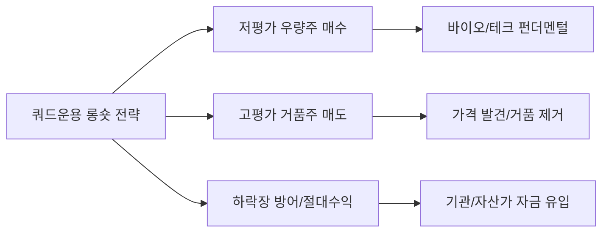

# 금융/투자 분석: 롱숏(Long-Short) 전략의 명가 '쿼드자산운용'의 철학과 미래
## 투자 신호 + 사회적 영향 평가

---

## 📌 기사 기본 정보

- **날짜**: 2026-04-10
- **출처**: 대한민국 운용업계 마켓 리더 인터뷰
- **카테고리**: 경제 > 금융 > 자산운용
- **핵심 주제**: 절대 수익을 추구하는 '롱숏 전략'의 명가 쿼드자산운용(Quad Investment)의 차별화된 투자 철학과 하락장에서도 수익을 내는 헤지펀드적 운용 기법 및 미래 성장성 분석

**메타데이터**
- 주요 전략: 롱숏(Long-Short Equity), 헬스케어/바이오 특화 투자, 절대 수익 추구
- 핵심 키워드: 펀더멘털 리서치, 헤지펀드(Hedge Fund), 변동성 관리, 글로벌 확장
- 주요 주체: 쿼드자산운용 운용팀, 국내 기관 투자자 및 고액 자산가(Private Client)
- 핵심 변수: 변동성 장세 지속 여부, 개별 종목의 실적 차별화, 공매도 규제 변화

---

## 🔍 기사를 통한 투자 신호 추출

### 1단계: 핵심 사건 분해

**What (무엇이 일어났는가?)**
- 주가지수 전체가 오르는 '베타(Beta)' 장세가 끝나고, 종목별 성과가 갈리는 '알파(Alpha)' 장세가 도래함에 따라 쿼드자산운용의 롱숏 전략이 주목받음. 특히 철저한 리서치를 기반으로 오를 주식은 사고(Long), 떨어질 주식은 파는(Short) 균형 잡힌 포트폴리오를 통해 안정적인 절대 수익률 기록 중.

**When (언제 일어났는가?)**
- 2026-04-10 (고금리와 지정학적 위기로 증시 변동성이 극심하여 전통적 '매수 후 보유(Buy & Hold)' 전략이 고전하던 시점)

**Why (왜 일어났는가?)**
- 단순히 시장 수익률을 따라가는 방식은 하락장에서 자금 방어가 불가능하기 때문
- 헬스케어 등 전문 지식이 필요한 섹터에서 쿼드만의 독보적인 분석 역량이 빛을 발함

**Who (누가 주도하는가?)**
- 리서치 중심의 운용 문화를 구축한 쿼드자산운용 리더십
- 안정적인 절대 수익을 원하는 연기금, 공제회 등 기관 투자자

---

### 2단계: 투자 신호 해석

#### A. **긍정적 신호 (Bullish)**

**① '박스피/하락장'에서도 수익을 내는 대안 투자로의 자금 유입**
- **신호**: 쿼드자산운용의 운용 자산(AUM) 지속 확대 및 수익률 방어 성공
- **의미**: 주식 시장이 지지부진할수록 롱숏 펀드나 헤지펀드로 스마트 머니(Smart Money)가 집중됨
- **투자 기회**: 쿼드자산운용의 주요 롱(Long) 종목(주로 기술주/바이오 대장주) 및 헤지펀드 운용 노하우를 가진 관련 금융주

**② 전문 리서치 역량을 갖춘 '특화 운용사'의 브랜드 파워 강화**
- **신호**: 단순 마케팅이 아닌 '실력(Track Record)' 중심의 시장 재편
- **의미**: 제대로 된 분석 없이 유행만 따르는 운용사들은 도태되고, 쿼드처럼 엣지(Edge) 있는 운용사들이 시장 파이를 독점
- **투자 기회**: 자산운용업계 내 M&A 및 기술 기반 운용사(핀테크 결합)

---

#### B. **위험 신호 (Bearish)**

**① 공매도(Short) 규제 및 제도의 불확실성**
- **신호**: 정치적 이슈에 따른 공매도 제한 조치 수시 발생
- **의미**: 롱숏 전략의 핵심인 '숏'이 막힐 경우 펀드의 헤지(Hedge) 능력이 상실되어 수익률이 급변할 위험
- **투자 리스크**: 제도 변화에 취약한 롱숏 전문 펀드 상품

**② 종목 선정(Stock Picking) 실패 시 발생하는 손실의 배가**
- **신호**: 분석과 반대로 움직이는 '숏 스퀴즈(Short Squeeze)' 상황 발생
- **의미**: 산 주식은 떨어지고 판 주식은 오르는 최악의 시나리오 발생 시 일반 펀드보다 훨씬 큰 손실 기록 가능
- **투자 리스크**: 변동성이 너무 큰 개별 테마주 위주의 롱숏 운용역

---

### 3단계: 섹터별 투자 기회 매트릭스

#### ✅ **높은 기대도 + 낮은 리스크**

**전문 리서치 조직이 탄탄한 '토탈 자산 관리 금융 그룹'**
- 운용 실력이 검증된 자회사를 둔 금융 지주사나 대형 증권사는 자산 운용 수수료 수익 증가의 직접적 수혜를 입음
- **투자 추천도**: ⭐⭐⭐⭐

---

## 💰 구체적 투자 신호 변환

### 신호 1: '지수'의 환상에서 깨어나 '종목'의 실력에 투자하라

**투자 해석**: 기사의 쿼드자산운용은 "시장이 나빠도 돈 벌 방법은 있다"는 것을 증명함. 이는 앞으로 투자자가 코스피 지수에 일희일비하기보다, 기업의 본질적 가치와 '고평가/저평가' 상태를 정밀하게 분석하는 능력을 빌려야 함(또는 그런 펀드에 투자해야 함). 특히 쿼드가 강점을 가진 '바이오'와 '딥테크' 섹터에서의 롱(Long) 포트폴리오를 주시할 필요가 있음.

---

## 🌍 사회적 영향 평가

### A. 긍정적 사회 영향
- **자본 시장의 효율성 제고**: 저평가 종목을 사고 거품 낀 종목을 파는 행위를 통해 주식 시장의 적정 가격 발견 기능 강화
- **금융 전문성 상향 평준화**: 철저한 리서치 문화를 확산시켜 투기적 투자보다는 근거 있는 투자 문화 정착 기여

### B. 부정적 사회 영향
- **개인 투자자와의 이해 충돌**: 헤지펀드의 '숏(Short)' 전략이 개인들이 많이 보유한 종목을 타겟으로 할 경우 발생하는 사회적 반감 및 갈등
- **부의 편중 가속**: 최소 가입 금액이 높은 사모 펀드 위주로 운영될 경우, 고도의 투자 전략 혜택이 고액 자산가 계층에게만 쏠리는 정보/수익 양극화

---

## 🎯 결론: 당신의 투자 전략 수립

- **즉시 실행**: 본인 포트폴리오의 '베타(시장 연동)' 비중을 줄이고, 시장과 무관하게 수익을 낼 수 있는 '알파(종목 특화)' 상품이나 전략 보완
- **3개월 후**: 쿼드자산운용 등 대형 사모 운용사들의 분기별 수익률 순위 및 주요 보유 종목(공시 내용) 변화 분석

---

## 📝 Obsidian 연결 구조

