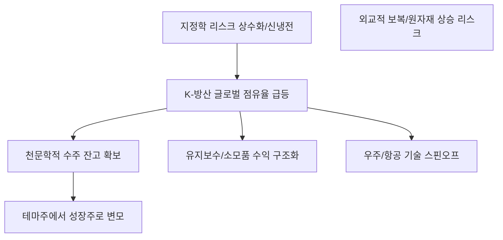

# 산업/지정학 분석: K-방산, '테마주' 아닌 '성장주'로 - 지정학 리스크 상수 시대의 장기 호황
## 투자 신호 + 사회적 영향 평가

---

## 📌 기사 기본 정보

- **날짜**: 2026-04-13
- **출처**: 글로벌 방위산업 및 안보 경제 전략 리포트
- **카테고리**: 경제 > 산업 > 방위산업
- **핵심 주제**: 폴란드 수주 등을 기점으로 폭발적으로 성장한 K-방산이 반짝 테마를 넘어 글로벌 지정학적 불안(신냉전) 국면에서 필수의 성장주로 자리 잡으며, 전 세계 무기 체계의 핵심 공급망으로 도약하는 과정 분석

**메타데이터**
- 주요 무기체계: K2 전차, K9 자주포, FA-50 경공격기, 레드백 장갑차, LIG넥스원 유도무기
- 수주 규모: 연평균 수출 200억 달러 시대 진입 목표
- 주요 고객: 폴란드, 루마니아, 호주, 사우디아라비아, UAE (중동/동유럽 위주)
- 키워드: 지정학 리스크 상수화, 윈-윈(Win-win) 기술 이전 로컬라이제이션, 실전 기록(Battle Proven)

---

## 🔍 기사를 통한 투자 신호 추출

### 1단계: 핵심 사건 분해

**What (무엇이 일어났는가?)**
- 한국의 방위산업이 저렴한 가격, 빠른 납기(Delivery), 서방 무기와의 높은 호환성, 그리고 실전에서 검증된 성능을 바탕으로 전 세계 시장 점유율을 급격히 높이고 있음. 북대서양조약기구(NATO) 국가들까지 한국 무기를 주력으로 채택하기 시작.

**When (언제 일어났는가?)**
- 2026-04-13 (러-우 전쟁 장기화, 가자 지구 및 중동 긴장 고조로 전 세계가 군비 확충에 사활을 건 시점)

**Why (왜 일어났는가?)**
- 미국과 독일 등 전통적 강자들은 생산 능력이 한계에 도달한 반면, 한국은 강력한 상시 제조 인프라(Mass Production)를 유지하고 있기 때문
- 기술 이전에 적극적이고 현지 생산(Localization)을 허용하는 파격적 조건 제시

**Who (누가 주도하는가?)**
- 한화에어로스페이스, 현대로템, LIG넥스원, 한국항공우주(KAI) 등 '빅 4'
- 수출을 국책 과제로 밀어주는 정부 방위사업청 및 외교팀

---

### 2단계: 투자 신호 해석

#### B. **긍정적 신호 (Bullish)**

**① '수주 잔고'가 증명하는 실적 가시성**
- **신호**: 향후 10년 치 이상의 매출이 이미 예약됨
- **의미**: 경기 변동과 상관없이 확정된 이익이 발생하는 '성장주'로의 리레이팅(Re-rating)
- **투자 기회**: 방산 4대장 주식, 유도무기 및 레이더 핵심 부품사

**② 무기 체계의 '운영 및 유지 보수(MRO)' 시장 독점권**
- **신호**: 한 번 팔면 끝이 아니라, 30년 이상 부품과 정비를 공급해야 함
- **의미**: 면도기-면도날 모델처럼 지속적인 고마진 소모품 매출 발생
- **투자 기회**: 군수 지원 서비스 및 항공/지상 장비 정비 전문 기업

---

#### B. **위험 신호 (Bearish)**

**① 지정학적 블록화에 따른 외교적 중립 리스크**
- **신호**: 한국 무기가 분쟁 지역에서 사용될 경우 발생하는 외교적 보복(러시아 등)
- **의미**: 수출 국가가 늘어날수록 우리 경제 다른 섹터(반도체, 자동차)가 지정학적 보복을 당할 리스크 상존
- **투자 리스크**: 수출 금지(Embargo) 조치 발생 시 관련 종목 급락

**② 원자재 가격 및 금리 상승에 따른 수익성 저하**
- **신호**: 철강, 희귀 품목 등 무기 제조 원재료 단가 상승
- **의미**: 장기 계약 특성상 원가 상승분을 즉시 가격에 반영하지 못할 경우 실적 일시 악화
- **투자 리스크**: 원자재 고정가 계약 비중이 낮은 부품사

---

### 3단계: 섹터별 투자 기회 매트릭스

#### ✅ **높은 기대도 + 낮은 리스크**

**무인 드론 및 자율주행 기반 '미래 전문 방산 테크' 기업**
- 현대전의 양상이 미사일과 전차에서 가성비 좋은 '자율형 드론'으로 급격히 이동 중임
- **투자 추천도**: ⭐⭐⭐⭐⭐

---

## 💰 구체적 투자 신호 변환

### 신호 1: '평화의 배당금'이 끝나고 '안보의 비용'이 지배하는 시대

**투자 해석**: 기사는 전 세계가 더 이상 평화를 상수로 보지 않는다는 것을 의미함. 무기는 이제 '사두면 좋은 것'이 아니라 '없으면 죽는 것'이 되었음. 한국은 이 '죽고 사는 문제'의 핵심 공급처가 됨. 투자자는 방산주를 '전쟁 나면 오르는 주식'이 아니라, 전 세계가 국방비를 GDP의 2% 이상씩 무조건 지불해야 하는 '필수 소비재' 성장주로 봐야 함.

---

## 🌍 사회적 영향 평가

### A. 긍정적 사회 영향
- **국가 안조 자립도 향상**: 수출을 통해 확보된 현금과 기술력을 바탕으로 대한민국의 국방력을 비약적으로 강화
- **첨단 제조 생태계 유지**: 방산 인프라는 우주, 항공, 정밀 기계 등 국가 핵심 제조 역량을 지탱하는 최후의 보루 역할

### B. 부정적 사회 영향
- **죽음의 상인 논란**: 한국의 무기가 실제 살상을 초래하거나 독재 정권에 수출될 경우 발생하는 도덕적 비판 및 인권 단체와의 갈등
- **자원 배분의 불균형**: 국방비 지출 증대가 교육, 복지 등 민생 예산의 축소로 이어질 수 있는 사회적 함의

---

## 🎯 결론: 당신의 투자 전략 수립

- **즉시 실행**: 일시적 호재가 아닌 '장기 수주 잔고'와 '영업이익률'의 개선 추이를 보고 포트폴리오의 10% 이상을 방산 섹터에 할당
- **3개월 후**: 미 대선 등 글로벌 정치 이벤트에 따른 각국의 국방비 예산안 변화 모니터링

---

## 📝 Obsidian 연결 구조

