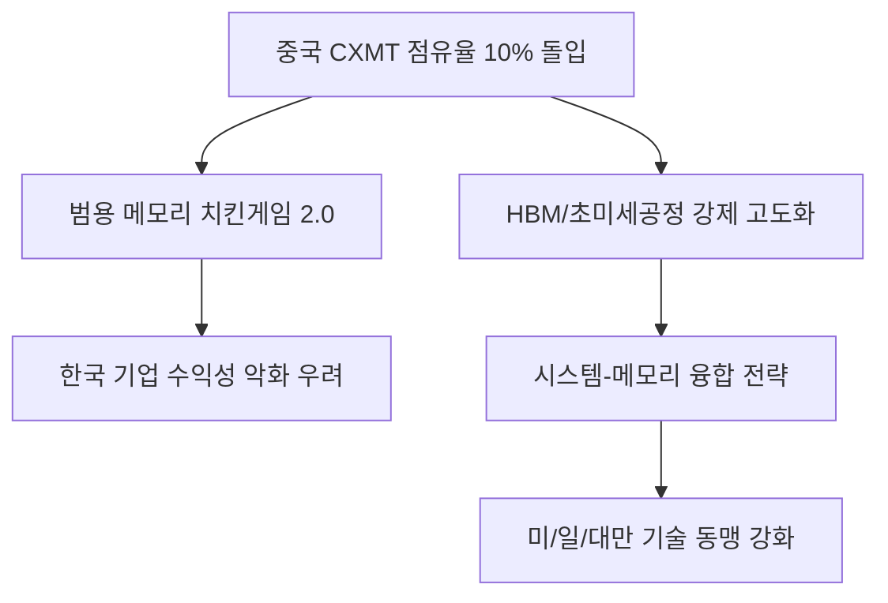

# 반도체/지정학 분석: 반도체 주도권 싸움의 데자뷔와 한국의 시스템 레벨 생존 전략
## 투자 신호 + 사회적 영향 평가

---

## 📌 기사 기본 정보

- **날짜**: 2026-04-14
- **출처**: 글로벌 반도체 시장 점유율 및 공급망 분석 리포트
- **카테고리**: 경제 > 산업 > 반도체전쟁
- **핵심 주제**: 중국의 메모리 반도체 굴기(CXMT의 시장 점유율 10% 돌입)가 가져올 시장의 판도 변화와 과거 미-일 반도체 전쟁의 데자뷔 속에서 한국이 취해야 할 '시스템 레벨' 생존 전략 분석

**메타데이터**
- 주요 주체: 삼성전자, SK하이닉스, 중국 CXMT(창신메모리), 미국 상무부(DOC)
- 핵심 지표: 글로벌 DRAM 시장 점유율, 중국 반도체 자급률, 미세공정 기술 격차
- 주요 전략: 시스템 반도체-메모리 패키징 융합, 공정 초격차 유지, 미국·일본과의 전략적 연대
- 키워드: CXMT 10% 위협, 반도체 치킨게임 2.0, 시스템 레벨 생존, 칩4(Chip 4)

---

## 🔍 기사를 통한 투자 신호 추출

### 1단계: 핵심 사건 분해

**What (무엇이 일어났는가?)**
- 중국의 창신메모리(CXMT)가 정부의 막대한 보조금을 앞세워 범용 DRAM 시장에서 점유율 10%를 돌입하며 한국 기업들의 턱밑까지 추격함. 이는 1980년대 일본이 미국 반도체를 위협하던 당시의 양상과 매우 흡사하며, 메모리 시장의 가격 하락 압박(치킨게임) 재연 우려.

**When (언제 일어났는가?)**
- 2026-04-14 (미국의 대중 반도체 장비 수출 규제에도 불구하고 중국이 '레거시(범용) 공정'에서 확실한 지배력을 확보한 시점)

**Why (왜 일어났는가?)**
- 중국 정부의 '반도체 국산화' 정책에 따른 무제한 금융 지원
- 첨단 공정은 막혔으나 공정 난이도가 낮은 중·저가 제품군에서의 생산량 폭증

**Who (누가 주도하는가?)**
- 중국의 반도체 국가대표 기업 CXMT 및 SMIC
- 이를 고사시키려는 미국의 강력한 공급망 통제 시스템

---

### 2단계: 투자 신호 해석

#### A. **긍정적 신호 (Bullish)**

**① '초미세·고부가 가치(HBM 등)' 시장으로의 강제적 고도화**
- **신호**: 범용 DRAM 시장의 레드오션화
- **의미**: 삼성과 하이닉스가 살길은 오직 중국이 따라올 수 없는 '하이엔드(HBM, DDR5)'뿐임. 이는 기업의 질적 성장을 강제함
- **투자 기회**: HBM 전용 후공정 장비사, 어드밴스드 패키징 기술 보유 기업

**② '미·일·대만·한국' 기술 동맹의 결속력 강화**
- **신호**: 중국의 위협에 대응하기 위한 공동 R&D 및 생산 분업
- **의미**: 한국 기업이 가진 '독보적 양산 능력'이 서방 세계의 안보 자산으로 평가받으며 안정적 시장 지위 확보
- **투자 기회**: 칩4(Chip 4) 동맹 내 교차 수혜를 입는 소부장 파트너사

---

#### B. **위험 신호 (Bearish)**

**① 범용 메모리 반도체 마진율의 장기 우하향**
- **신호**: 중국의 '반값 메모리' 물량 공세
- **의미**: 가전, PC용 저사양 메모리 시장에서 한국 기업의 수익성 급락
- **투자 리스크**: 레거시 공정 비중이 높은 중소형 반도체 설계 및 제조사

**② 지정학적 '샌드위치' 리스크의 극대화**
- **신호**: 중국 시장 매출 포기 압박 vs 중국 내 공장 자산 유지의 갈등
- **의미**: 판로가 막히거나 공장 장비를 업그레이드하지 못해 발생하는 '매몰 비용' 발생
- **투자 리스크**: 중국 매출 비중이 30%가 넘는 반도체 소재 기업

---

### 3단계: 섹터별 투자 기회 매트릭스

#### ✅ **높은 기대도 + 낮은 리스크**

**글로벌 빅테크가 직접 발주하는 '고객형 특화 반도체(Custom Chip)' 설계 파트너**
- 범용 제품이 아닌, 구글/MS/애플만을 위한 맞춤형 칩 시장은 중국의 물량 공세가 통하지 않는 성역임
- **투자 추천도**: ⭐⭐⭐⭐⭐

---

## 💰 구체적 투자 신호 변환

### 신호 1: '판'을 바꾸지 않으면 '공장'이 먹힌다

**투자 해석**: 기사의 핵심은 중국이 '10%'라는 임계점을 넘었다는 것임. 이는 단순한 숫자가 아니라 '시장 가격을 흔들 힘'을 가졌다는 뜻임. 이제 'DRAM 잘 만드는 것'만으로는 부족함. AI 가속기와 메모리를 하나로 묶는 '컴퓨팅 레벨'의 솔루션을 제공하는 기업만이 살아남음. 투자 포트폴리오에서 '단순 메모리 제조' 비중을 줄이고 '시스템 융합 반도체' 비중을 높여야 함.

---

## 🌍 사회적 영향 평가

### A. 긍정적 사회 영향
- **대한민국 산업 구조의 초고도화**: 생존을 건 사투 과정에서 인공지능, 자율주행 등 미래 산업을 지탱할 극한의 반도체 기술력 확보
- **국가적 기술 안보 주권 강화**: 대체 불가능한 기술력을 통해 국제 정세에서 대한민국의 협상력 및 지위 격상

### B. 부정적 사회 영향
- **협력사 생태계의 연쇄 도산 위험**: 범용 메모리 시장 위축 시 이를 받쳐주던 수많은 국내 소부장 기업들의 현금 흐름 악화 및 구조조정
- **기술 인력 유출 우려**: 중국이 점유율 확대를 위해 한국의 퇴직 인력 등을 공격적으로 영입하며 발생하는 국가적 지식 재산권 손실

---

## 🎯 결론: 당신의 투자 전략 수립

- **즉시 실행**: 투자 중인 반도체 기업의 '제품 믹스(HBM/DDR5 vs Legacy)' 비율을 확인하고 포트폴리오 압축
- **3개월 후**: 미 상무부의 추가 대중 수출 규제 리스트와 이에 따른 한국 기업의 '예외 적용' 연장 여부 확인

---

## 📝 Obsidian 연결 구조

