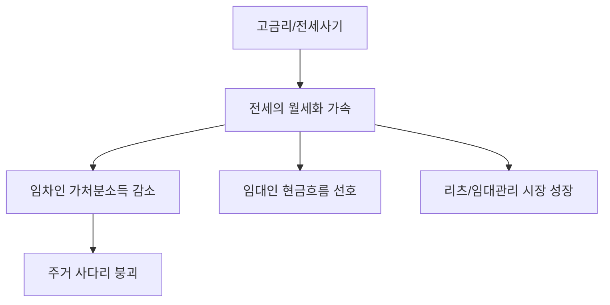

# 부동산 분석: 전세의 월세화 가속과 '주거 사다리' 붕괴 분석
## 투자 신호 + 사회적 영향 평가

---

## 📌 기사 기본 정보

- **날짜**: 2026-04-15
- **출처**: 부동산 시장 모니터링 데스크
- **카테고리**: 경제 > 부동산 > 주거복지
- **핵심 주제**: 고금리와 전세 사기 여파로 인한 '전세의 월세화' 가속화 및 청년·서민층의 주거 사다리 단절 위기 분석

**메타데이터**
- 주요 수치: 월세 비중 역대 최고치 경신, 전세가율 하락, 월 평균 주거비 지출 증가율
- 핵심 변수: 전세자금대출 금리 상단, 전세보증보험 가입 요건 강화, 월세 전환율(Yield)
- 주요 주체: 임대인(다주택자), 임차인(청년/신혼부부), 금융기관
- 키워드: 월세 시대(Era of Rent), 전세 소멸론, 주거 빈곤층 가속

---

## 🔍 기사를 통한 투자 신호 추출

### 1단계: 핵심 사건 분해

**What (무엇이 일어났는가?)**
- 한국 특유의 주택 금융 시스템인 '전세'가 급격히 위축되고 월세 계약이 대세가 됨. 이는 세입자의 가처분 소득 감소와 자산 형성 기회 박탈로 이어짐.

**When (언제 일어났는가?)**
- 2026-04-15 (고금리가 장기화되고 빌라/오피스텔 발 전세 기피 현상이 아파트로 전이되는 시점)

**Why (왜 일어났는가?)**
- 임대인: 종부세 등 세금 부담을 세입자에게 전가하기 위해 월세 선호
- 임차인: 전세 사기 공포로 인해 '차라리 매달 돈을 내더라도 안전한' 월세를 선택하는 역설적 상황

**Who (누가 주도하는가?)**
- 월세를 통해 현금 흐름을 확보하려는 은퇴 세대 임대인
- 전세 대출 한도가 막힌 사회 초년생 임차인

---

### 2단계: 투자 신호 해석

#### A. **긍정적 신호 (Bullish)**

**① 기업형 임대 및 주거 관리 플랫폼의 기회**
- **신호**: 전세 사기로 인한 개인 간 임대차 계약의 신뢰 붕괴
- **의미**: 브랜드가 보증하고 체계적으로 관리되는 '기업형 임대 주택'에 대한 프리미엄 수요 증대
- **투자 기회**: 리츠(REITs), 부동산 자산운용사, 주거 관리 테크 기업

**② 고정적 현금 흐름(Cash Flow) 자산 가치 상승**
- **신호**: 월세 시장의 팽창
- **의미**: 부동산이 시세 차익(Cap Gain) 대상에서 월세 수익(Income Gain) 대상으로 완전 전환
- **투자 기회**: 역세권 소형 주택, 연세(Rent) 수익형 부동산

---

#### B. **위험 신호 (Bearish)**

**① 중산층 진입 장벽의 영구화**
- **신호**: 전세를 통한 '무이자 강제 저축' 기능 상실
- **의미**: 월세 지출로 인해 시드 머니 확보가 어려워진 세대가 늘어나며 장기적인 내수 소비 침체 유발
- **투자 리스크**: 가처분 소득 감소에 따른 사치재, 가전, 자동차 섹터의 장기적 수요 하락

**② 갭투자 기반 아파트 가격 지지력 약화**
- **신호**: 전세금 유입 중단
- **의미**: 전세 자금을 레버리지 삼아 주가를 떠받치던 갭투자 구조의 붕괴는 아파트 가격의 하방 압력으로 작용

---

### 3단계: 섹터별 투자 기회 매트릭스

#### ✅ **높은 기대도 + 낮은 리스크**

**상업용 및 주거용 리츠(REITs)**
- 월세 계약 증가에 따른 배당 수익률 상승 기대
- **투자 추천도**: ⭐⭐⭐⭐⭐

---

## 💰 구체적 투자 신호 변환

### 신호 1: '소유'보다 '관리'와 '서비스'에 반응하는 시장

**투자 해석**: 주택 시장이 전세에서 월세로 넘어가는 것은 단순한 계약 형태의 변화가 아닌 '부동산의 금융화'를 의미함. 임대인에게는 세무/관리 서비스가, 임차인에게는 보증 보호 및 주거 서비스가 핵심 경쟁력이 될 것임.

---

## 🌍 사회적 영향 평가

### A. 긍정적 사회 영향
- **일부 임대차 시장의 투명성 제고**: 월세 기반으로 전환되며 임대 소득 노출 및 시장의 가격 기능이 보다 명확해짐

### B. 부정적 사회 영향
- **주거 사다리 붕괴**: 전세를 통해 내 집 마련을 준비하던 중산층 형성 루트가 차단되며 수저 계급론 고착화
- **청년 빈곤 가속**: 가계 소득의 30~50%가 주거비로 지출되며 결혼/출산 포기의 결정적 원인으로 작용

---

## 🎯 결론: 당신의 투자 전략 수립

- **즉시 실행**: 시세 차익 위주의 부동산 보유 비중을 현금 흐름이 나오는 리츠나 상업용 자산으로 분산
- **3개월 후**: 정부의 '공공 전세' 지원책 실효성 여부 및 월세 소득공제 확대 정책 모니터링

---

## 📝 Obsidian 연결 구조

