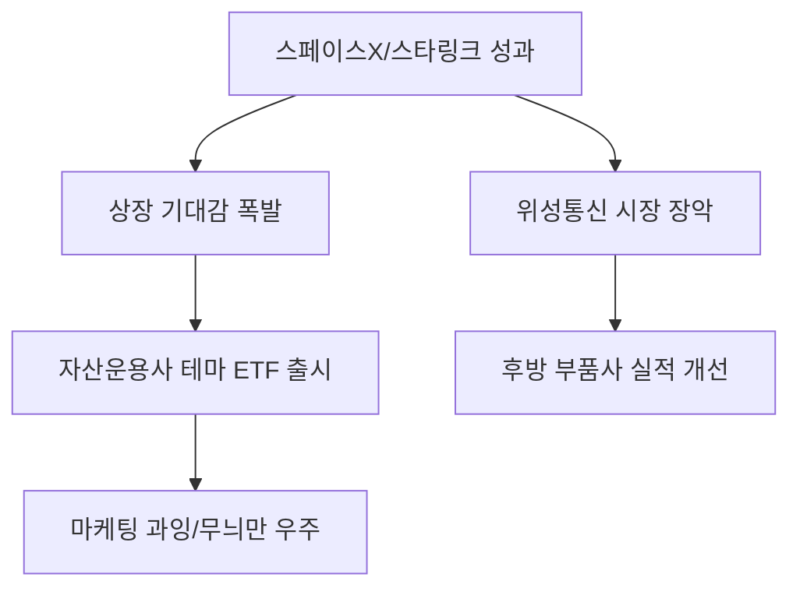

# 글로벌 테크 분석: 스페이스X IPO 광풍과 테마형 ETF의 명암
## 투자 신호 + 사회적 영향 평가

---

## 📌 기사 기본 정보

- **날짜**: 2026-04-15
- **출처**: 글로벌 테크 금융 리서치
- **카테고리**: 경제 > 테크금융 > 뉴스페이스
- **핵심 주제**: 일론 머스크의 스페이스X(SpaceX) 및 스타링크 상장 기대감에 따른 투자 과열과 그 성과를 추종하는 '우주 테마 ETF'의 마케팅 과잉 리스크 분석

**메타데이터**
- 주요 주체: 스페이스X, 스타링크, 아크 인베스트(ARK), 테마형 ETF 운용사
- 핵심 지표: 사외 주식 거래가(Secondary Market Valuation), 스타링크 구독자 수, 팰컨9 발사 성공률
- 영향 분야: 위성 통신, 우주 관광, 혁신 성장주 펀드
- 핵심 변수: 연준의 유동성 기조, 민간 우주 개발 법안 통과 여부

---

## 🔍 기사를 통한 투자 신호 추출

### 1단계: 핵심 사건 분해

**What (무엇이 일어났는가?)**
- 스페이스X의 위성 통신 사업인 '스타링크'의 영업이익 흑자 전환 소식과 함께 상장(IPO) 임박설이 돌며, 비상장 주식 및 우주 관련 테마 ETF로 자금이 폭발적으로 유입되는 '뉴스페이스 광풍' 발생

**When (언제 일어났는가?)**
- 2026-04-15 (전통 제조업 대비 혁신 기업의 밸류에이션이 다시 고평가되기 시작한 시점)

**Why (왜 일어났는가?)**
- 스타링크가 저궤도 위성 시장의 80%를 독점하며 전 세계 인터넷 인프라의 게임 체인저가 됨
- 일론 머스크라는 강력한 IP(지식재산권)가 가진 팬덤 투자 문화

**Who (누가 주도하는가?)**
- 고수익을 노리는 공격적 개인 투자자 및 혁신 성장 펀드
- 수수료 수익을 극대화하기 위해 '스페이스' 딱지를 붙인 테마 상품을 출시하는 자산운용사들

---

### 2단계: 투자 신호 해석

#### A. **긍정적 신호 (Bullish)**

**① 위성 통신 기반 산업의 수평적 확장**
- **신호**: 스타링크의 글로벌 인프라 장악력 증대
- **의미**: 기지국이 없는 오지, 해상, 항공 인터넷 시장의 폭발적 성장
- **투자 기회**: 위성 하드웨어 제조 부품사, 해상/항공 물류 자동화 소프트웨어 기업

**② 우주 데이터 기반 AI 비즈니스의 부상**
- **신호**: 궤도 위성 데이터 활용도 증가
- **의미**: 기상 예측, 정밀 농업, 국방 정보 등 위성 데이터 가공업의 부가가치 증대
- **투자 기회**: 빅데이터 분석 전문 테일러 기업

---

#### B. **위험 신호 (Bearish)**

**① 테마형 ETF의 '무늬만 우주' 리스크**
- **신호**: 우주 테마 ETF 내에 넷플릭스나 디즈니 등 관련성이 낮은 종목 편입
- **의미**: 핵심 우주 기업은 비상장이거나 소수이기에 억지로 펀드 규모를 키우기 위한 '끼워넣기' 마케팅 기승
- **투자 리스크**: 우주 산업의 본질적 성장과 무관하게 하락할 수 있는 혼합형 테마 ETF

**② 비상장 주식 시장의 거품과 사기**
- **신호**: 확인되지 않은 채널을 통한 스페이스X 주식 직접 투자 유도
- **의미**: 상장 지연 시 자금이 묶이거나 허위 매물에 속을 가능성
- **투자 리스크**: 검증되지 않은 중개 플랫폼을 통한 프리-IPO(Pre-IPO) 투자

---

### 3단계: 섹터별 투자 기회 매트릭스

#### ✅ **높은 기대도 + 낮은 리스크**

**국방 및 정부 프로젝트 수주 비중이 높은 우주 소부장**
- 민간 시장의 광풍과 무관하게 각국 정부의 우주 패권 경쟁으로 실적이 보장됨
- **투자 추천도**: ⭐⭐⭐⭐

---

## 💰 구체적 투자 신호 변환

### 신호 1: '상장'은 최대의 엑시트 신호이자 고점 신호

**투자 해석**: 기사에서 '상장 광풍'이 언급될 때는 대개 장외 시장의 밸류에이션이 이미 적절 수준을 넘어섬. 개인 투자자가 직접 비상장 주식에 뛰어들기보다, 스페이스X의 성공이 가져올 '후방 생태계(위성 수신기, 전력 반도체)'의 우량주를 찾는 것이 실리적임.

---

## 🌍 사회적 영향 평가

### A. 긍정적 사회 영향
- **글로벌 정보 격차 해소**: 스타링크를 통해 인터넷이 불가능했던 지역의 교육 및 보건 환경 획기적 개선
- **인류의 활동 영역 확장**: 뉴스페이스 시대 개막으로 인한 과학 기술 수준의 비약적 도약

### B. 부정적 사회 영향
- **우주 쓰레기 및 천문 관측 방해**: 수만 개의 위성 발사로 인한 지구 궤도 오염 및 인류 공동 자산인 밤하늘의 훼손
- **특정 기업가에 의한 글로벌 통신 통제**: 한 개인이 전 세계 통신망의 온/오프 권한을 쥐는 데 따른 민주주의적 위협

---

## 🎯 결론: 당신의 투자 전략 수립

- **즉시 실행**: 보유 중인 '우주 테마 ETF'의 실제 종목 리스트(Holdings)를 열어 스페이스X와의 연관성 재검증 및 과도한 수수료 체크
- **3개월 후**: 스타링크의 분기 실적 발표 추이에 따라 우주 산업에 대한 장기 포트폴리오 비중 결정

---

## 📝 Obsidian 연결 구조

