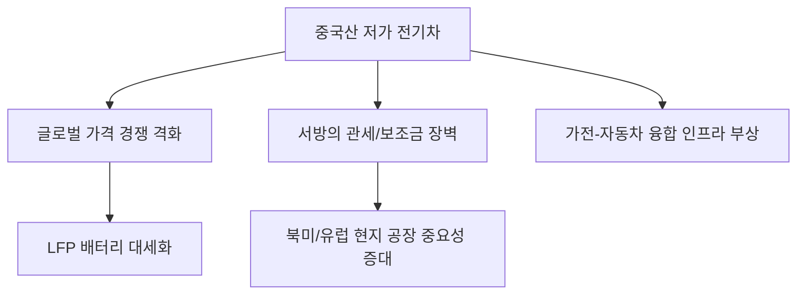

# 글로벌 모빌리티 분석: 중국산 전기차의 역습과 서방의 보조금 장벽
## 투자 신호 + 사회적 영향 평가

---

## 📌 기사 기본 정보

- **날짜**: 2026-04-15
- **출처**: 글로벌 자동차 산업 동향 보고서
- **카테고리**: 경제 > 산업 > 자동차/전기차
- **핵심 주제**: BYD, 샤오미 등 중국 전기차 업체의 압도적 가성비와 기술력을 앞세운 글로벌 공습과 이에 대응하는 미·유럽의 보조금 및 관세 장벽 강화 전략 분석

**메타데이터**
- 주요 주체: BYD, 샤오미(Xiaomi), 테슬라, 현대차그룹, EU 집행위, 미국 상무부
- 핵심 변수: 리튬인산철(LFP) 배터리 가격, EU 반보조금 조사 결과, 미국 IRA 보완 조항
- 영향 분야: 전기차(EV) 보급률, 2차전지 밸류체인, 탄소 국경세
- 키워드: 가성비 공습(Low-cost Invasion), 보호무역주의, 스마트카 생태계

---

## 🔍 기사를 통한 투자 신호 추출

### 1단계: 핵심 사건 분해

**What (무엇이 일어났는가?)**
- 중국 전기차 기업들이 내수 시장을 평정하고 연간 수백만 대 규모의 저가형 전기차를 유럽과 신흥국 시장으로 쏟아내기 시작함. 이에 미국과 유럽은 자국 산업 보호를 위해 징벌적 관세와 보조금 제외라는 강력한 방패를 가동 중.

**When (언제 일어났는가?)**
- 2026-04-15 (샤오미 SU7 등 스마트 가전과 결합된 중국 전기차가 글로벌 히트를 기록하기 시작한 국면)

**Why (왜 일어났는가?)**
- 중국의 수직 계열화된 배터리 공급망을 통한 압도적인 원가 경쟁력 확보
- 가전을 만들던 기술로 자동차의 '인포테인먼트'와 '연결성'에서 기존 자동차 강자들을 추월

**Who (누가 주도하는가?)**
- 정부의 막대한 보조금을 바탕으로 성장한 중국 거대 테크/자동차 연합
- 자국 자동차 산업의 몰락을 방어하려는 유럽(독일, 프랑스)과 미국의 정책 입안자

---

### 2단계: 투자 신호 해석

#### A. **긍정적 신호 (Bullish)**

**① 하이브리드 및 과도기적 기술을 보유한 레거시 메이커의 기회**
- **신호**: 순수 전기차 시장의 무역 장벽 강화 및 캐즘(Chasm, 일시적 수요 정체)
- **의미**: 저가 중국산 전기차가 장벽에 막히는 사이, 고품질 하이브리드(HEV)와 인프라를 갖춘 현대차/토요타 등의 점유율 방어 가능성
- **투자 기회**: 하이브리드 엔진 부품사 및 충전 인프라 운영사

**② LFP 배터리 생태계로의 전환 가속**
- **신호**: 중국 전기차의 핵심 경쟁력이 '저렴한 LPF'에서 나옴
- **의미**: 한국 배터리 3사도 고가의 NCM 대신 저가형 LFP 라인업을 강화하며 원가 경쟁력 확보에 사활
- **투자 기회**: LFP 양극재 소재 기업 및 배터리 재활용(Recycling) 업체

---

#### B. **위험 신호 (Bearish)**

**① 글로벌 자동차 가격 경쟁(Price War)의 상시화**
- **신호**: "중국산은 반값"이라는 소비자 인식 확산
- **의미**: 테슬라를 포함한 전 세계 제조업체들의 마진율 저하가 장기화될 위험
- **투자 리스크**: 브랜드 프리미엄이 낮고 원가 효율성이 떨어지는 중견 자동차 메이커

**② 지정학적 패권을 둘러싼 공급망 분절화 리스크**
- **신호**: 미국 IRA 및 유럽의 원자재법(CRMA) 강화
- **의미**: 중국산 부품을 쓰면 보조금을 못 받게 되므로, 공급망 전체를 다시 짜야 하는 천문학적 비용 발생
- **투자 리스크**: 중국 의존도가 여전히 높은 배터리 부품/소재 기업

---

### 3단계: 섹터별 투자 기회 매트릭스

#### ✅ **높은 기대도 + 낮은 리스크**

**글로벌 완성차 그룹 내 전동화 전환 소프트웨어 기업**
- 하드웨어(철판)는 중국이 싸게 만들더라도, 차량 제어 및 자율주행 소프트웨어는 서방 세계의 보안 요구에 따라 국산/서방산 채택이 강제됨
- **투자 추천도**: ⭐⭐⭐⭐

---

## 💰 구체적 투자 신호 변환

### 신호 1: '반값 전기차' 시대는 피할 수 없는 흐름

**투자 해석**: 무역 장벽이 일시적으로 중국차를 막을 수는 있으나, 소비자들은 결국 저렴한 가격으로 기울 것임. 기술 우위보다 '원가 우위'가 투자 결정의 핵심 지표가 될 것임. 특히 샤오미처럼 가전 생태계를 차 안으로 끌고 들어오는 기업의 파급력을 예의주시해야 함.

---

## 🌍 사회적 영향 평가

### A. 긍정적 사회 영향
- **전기차 대중화 가속**: 중국발 가격 경쟁 덕분에 전기차 구매 문턱이 낮아져 지구 온난화 대응 속도 개선
- **스마트 카 경험의 확대**: 단순 이동 수단을 넘어선 거주 공간으로서의 자동차 혁신 촉진

### B. 부정적 사회 영향
- **선진국 제조업 일자리 붕괴**: 중국의 저가 공세에 밀린 서방 국가 자동차 공장의 폐쇄 및 고용 불안 야기
- **디지털 식민지 우려**: 중국산 차량 운영체제(OS)가 글로벌 도로를 점령할 경우 발생하는 데이터 안보 및 개인정보 유출 위험

---

## 🎯 결론: 당신의 투자 전략 수립

- **즉시 실행**: 포트폴리오 내 전기차 비중 중 '순수 하드웨어' 제조사보다는 '자율주행 및 보안 소프트웨어' 비중 상향
- **3개월 후**: EU의 중국산 전기차 관세 확정 결과 및 이에 따른 중국의 보복 관세 규모 확인 후 리밸런싱

---

## 📝 Obsidian 연결 구조

