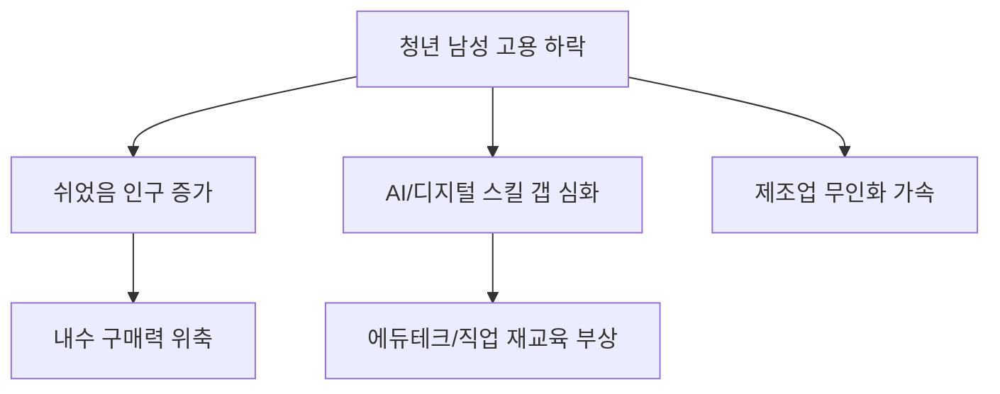

# 사회/노동 분석: 청년 남성 고용률 하락과 노동 시장의 패러다임 전환
## 투자 신호 + 사회적 영향 평가

---

## 📌 기사 기본 정보

- **날짜**: 2026-04-15
- **출처**: 대한민국 고용 동향 지표 분석
- **카테고리**: 경제 > 사회 > 노동시장
- **핵심 주제**: 2030 청년 남성의 고용률이 역대 최저 수준으로 하락한 원인과 제조·건설 등 전통적 남성 비중이 높았던 산업의 침체 및 AI·서비스 중심의 노동 시장 재편 분석

**메타데이터**
- 주요 수치: 청년(20~39세) 남성 경제활동참가율 하락폭, 비전형 노동자(긱 워커) 비중 증가
- 핵심 변수: 정규직-비정규직 양극화, 산업 구조 고도화(AI 도입), 대졸자 미취업 비중
- 주요 주체: 청년 남성 구직자, 중소 제조 기업(구인난), 정부 일자리 정책팀
- 키워드: 쉬었음 인구 증가, 노동 공급-수요 미스매치, 신기술 기반 일자리

---

## 🔍 기사를 통한 투자 신호 추출

### 1단계: 핵심 사건 분해

**What (무엇이 일어났는가?)**
- 대한민국 경제의 허리인 청년 남성 조직이 노동 시장에서 이탈하거나 '그냥 쉬었음' 상태로 전환되는 추세 심화. 특히 제조업 기반의 일자리가 줄어들고 서비스/IT 위주로 재편되며 성별 고용 격차에도 변화 발생.

**When (언제 일어났는가?)**
- 2026-04-15 (전통적 산업 현장의 자동화가 가속화되고 대규모 신규 채용이 위축된 국면)

**Why (왜 일어났는가?)**
- 제조업의 스마트 팩토리 전환으로 인한 단순 기술직 수요 감소
- 군 복무 기간과의 연계성 부족 및 사회 진출 시점의 지체
- '괜찮은 일자리'에 대한 눈높이는 높으나 기업이 요구하는 'AI 리터러시' 등 역량 미달(Skill Gap)

**Who (누가 주도하는가?)**
- 고임금 전문직으로 쏠리는 상위 10% 청년층
- 노동 시장 진입을 포기한 장기 미취업 남성층

---

### 2단계: 투자 신호 해석

#### A. **긍정적 신호 (Bullish)**

**① 교육 및 자기계발(Ed-tech) 시장의 성숙**
- **신호**: 구직자들이 신산업(AI, 데이터 등) 전직을 위해 교육에 투자
- **의미**: 노동력의 질적 업그레이드를 위한 교육 수요 폭증
- **투자 기회**: 실무 중심 직업 교육 플랫폼, AI 기반 역량 평가 솔루션 기업

**② 자동화 및 로보틱스 산업의 필수화**
- **신호**: 젊은 인력이 현장을 떠나며 심화되는 구인난
- **의미**: 사람을 구할 수 없는 제조업 현장에서 '로봇 도입'은 더 이상 선택이 아닌 생존 문제로 직결
- **투자 기회**: 협동 로봇 제조사, 스마트 팩토리 자동화 시스템 공급사

---

#### B. **위험 신호 (Bearish)**

**① 내수 소비 기반의 장기 침체 우려**
- **신호**: 소득이 없는 '쉬었음' 인구의 증가
- **의미**: 주력 소비층인 2030 남성의 구매력 약화는 유통, 외식, 패션 등 전반적인 내수 산업의 하방 압력
- **투자 리스크**: 리테일 유통사, 중저가 남성 패션 브랜드

**② 사회적 부양 비용 및 세수 감소 리스크**
- **신호**: 생산 가능 인구의 경제 활동 중단
- **의미**: 연금 기여금 및 소득세 세수는 줄어드는데 반해 복지 수요는 늘어나는 국가 재정 건전성 악화
- **투자 리스크**: 국가 신용도 및 장기적 금리 상방 압력

---

### 3단계: 섹터별 투자 기회 매트릭스

#### ✅ **높은 기대도 + 낮은 리스크**

**노동 사각지대를 메우는 '구인/구직 매칭 AI 플랫폼'**
- 단기 일자리(긱 이코노미) 비중이 늘어날수록 효율적인 매칭 시스템 보유 기업의 가치는 수직 상승
- **투자 추천도**: ⭐⭐⭐⭐

---

## 💰 구체적 투자 신호 변환

### 신호 1: '숙련 노동'에서 '지능형 자동화'로 자본의 대이동

**투자 해석**: 청년 인력의 현장 공백은 곧 '자동화 설비'의 매출 확대를 의미함. 노동 집약적 산업보다는 '노동력을 대체하는 기술'을 가진 기업에 장기 투자해야 함. 또한, 고립된 청년들을 사회로 끌어내기 위한 정부의 지원금이 투자될 '공공 서비스 테크' 영역도 유심히 관찰해야 함.

---

## 🌍 사회적 영향 평가

### A. 긍정적 사회 영향
- **일의 정의 재정립**: 평생직장 중심에서 '기술과 프로젝트' 중심의 유연한 노동 시장으로 진화하는 계기

### B. 부정적 사회 영향
- **사회적 고립 가속**: 경제적 능력을 상실한 청년 남성들의 사회적 단절로 인한 우울증, 자살률 증가 등 심각한 사회적 비용 발생
- **가족 형성의 포기**: 경제적 자립 지연으로 인한 혼인율 감소 및 초저출산 현상 심화의 근본 원인 제공

---

## 🎯 결론: 당신의 투자 전략 수립

- **즉시 실행**: 제조업 중 노동 비중이 높고 자동화율이 낮은 기업의 비중 축소 (인건비 리스크 및 인력난)
- **3개월 후**: 정부의 '청년 고용 대책' 및 법인세 감면 등 기업 채용 인센티브 정책 실효성 재평가

---

## 📝 Obsidian 연결 구조

