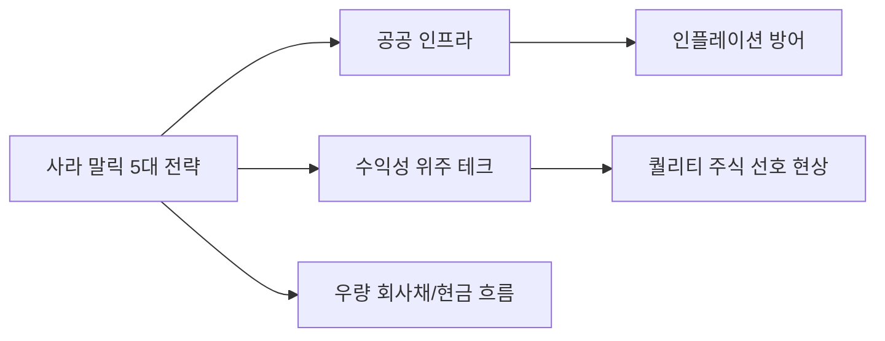

# 글로벌 투자 분석: 사라 말릭(Nuveen)의 2026년 2분기 '5대 투자처' 전략
## 투자 신호 + 사회적 영향 평가

---

## 📌 기사 기본 정보

- **날짜**: 2026-04-16
- **출처**: 글로벌 자산운용사 누빈(Nuveen) 분기 전망
- **카테고리**: 경제 > 금융투자 > 글로벌전략
- **핵심 주제**: 사라 말릭(Saira Malik) 누빈 CIO가 제시한 2026년 2분기 핵심 투자 섹터 5가지와 고금리 뉴노멀 시대를 이기는 장기 포트폴리오 전략

**메타데이터**
- 주요 인물: 사라 말릭 (Saira Malik, Nuveen CIO)
- 5대 투자 섹터: 공공 인프라, 헬스케어 혁신, 재생에너지 공급망, 현금 흐름 우수 기술주, 우량 회사채
- 핵심 키워드: 수익성(Profitability), 방어적 성장(Defensive Growth), 인플레이션 헤지
- 핵심 변수: 연준의 금리 동결 기간 장기화(Higher for Longer), 글로벌 병목 현상 해소 여부

---

## 🔍 기사를 통한 투자 신호 추출

### 1단계: 핵심 사건 분해

**What (무엇이 일어났는가?)**
- 전 세계 1.2조 달러를 운용하는 누빈이 2026년 중반 금융 시장의 변곡점을 대비하여 '꿈'보다는 '실질적 현금(Cash)'과 '배당'에 집중하는 5가지 테마를 공식 제시함.

**When (언제 일어났는가?)**
- 2026-04-16 (금리 인하 기대감이 후퇴하고 경기 연착륙 여부가 불투명한 시점)

**Why (왜 일어났는가?)**
- 단순한 유동성 장세가 끝나고, 기업의 이익 기초 체력(Fundamentals)이 주가를 결정하는 시대로 진입했기 때문
- 지정학적 리스크 심화로 인해 '안정적인 인프라' 자산의 희소성 증대

**Who (누가 주도하는가?)**
- 글로벌 기관 투자자 및 대형 연기금 (자산 배분 재설계 중)

---

### 2단계: 투자 신호 해석

#### A. **긍정적 신호 (Bullish)**

**① 공공 인프라 및 에너지 안보 섹터의 재평가**
- **신호**: 물가 상승분을 가격에 전가할 수 있는 인프라 자산 강조
- **의미**: 경기 침체와 상관없이 국가가 반드시 사용해야 하는 도로, 전력망, 통신탑 관련 기업의 수익 안정성 부각
- **투자 기회**: 글로벌 맥쿼리 인프라, 전력 설비 관련 대장주

**② 현금 흐름이 압도적인 '빅테크'의 안전자산화**
- **신호**: 부채가 적고 보유 현금이 많은 성장주 선호
- **의미**: 고금리 상황에서 이자 비용 부담 없이 자사주 매입과 R&D를 지속할 수 있는 기업의 독주
- **투자 기회**: 마이크로소프트, 엔비디아, 고금리 내구성이 검증된 AI 대형주

---

#### B. **위험 신호 (Bearish)**

**① 수익성 없는 '미래 꿈' 종목의 퇴출**
- **신호**: 당장 돈을 못 버는 중소형 성장주 기피 조언
- **의미**: 유동성 파티 시기에 올랐던 '희망 전도 종목'들의 밸류에이션 붕괴 지속
- **투자 리스크**: 고비용 대출로 연명하는 한계 좀비 기업 및 단순 테마주

**② 소비자 구매력 약화 섹터의 경고**
- **신호**: 사치재 및 임의 소비재 비중 축소 권고
- **의미**: 고금리-고물가 고착화로 인한 서민들의 지갑 닫기 현상 본격화

---

### 3단계: 섹터별 투자 기회 매트릭스

#### ✅ **높은 기대도 + 낮은 리스크**

**헬스케어 및 필수 소비재 내 혁신 기업**
- 고령화라는 메가 트렌드와 맞물려 경기 변동에 가장 강한 방어력을 보여줌
- **투자 추천도**: ⭐⭐⭐⭐⭐

---

## 💰 구체적 투자 신호 변환

### 신호 1: '성장'에서 '수익'으로의 기준 이동

**투자 해석**: 사라 말릭의 메시지는 명확함. 앞으로의 2분기는 "얼마나 빨리 성장하는가"가 아니라 "얼마나 안정적으로 이익을 지키는가"가 주가 향방을 결정함. 인플레이션을 이기는 가격 결정권(Pricing Power)을 가진 기업만이 생존함.

---

## 🌍 사회적 영향 평가

### A. 긍정적 사회 영향
- **가치 투자 문화 정착**: 비이성적 투기보다 기업의 본질적 가치를 중시하는 안정적 금융 생태계 형성

### B. 부정적 사회 영향
- **상장 기업 양극화 심화**: 대형 우량주에만 자금이 쏠리며 혁신적인 아이디어를 가진 초기 스타트업의 자금 조달 난항
- **부의 편중 가속**: 배당 자산을 대량 보유한 자산가 계층과 근로 소득만 있는 계층 간의 자산 성장 속도 격차 확대

---

## 🎯 결론: 당신의 투자 전략 수립

- **즉시 실행**: 포트폴리오 내 고부채 기업 비중을 줄이고, 배당 수익률과 현금 흐름이 우수한 '퀄리티 주식'으로 교체
- **3개월 후**: 누빈의 2분기 전망이 실제 실적 발표(Earning Season)와 일치하는지 확인 후 비중 확대

---

## 📝 Obsidian 연결 구조

