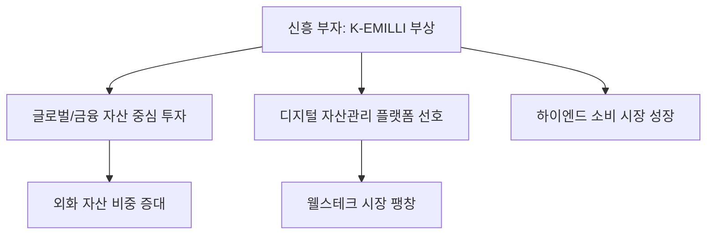

# 금융/문화 분석: 하나금융연구소 'K-EMILLI' 신흥 부자 리서치 분석
## 투자 신호 + 사회적 영향 평가

---

## 📌 기사 기본 정보

- **날짜**: 2026-04-16
- **출처**: 하나금융경영연구소 대한민국 부자 보고서
- **카테고리**: 경제 > 사회 > 자산관리(WM)
- **핵심 주제**: 금융 자산 10억~100억 사이의 '신흥 부자' 계층인 K-EMILLI(Emerging Millionaires)의 투자 행태, 라이프스타일 및 자산 형성 과정 정밀 분석

**메타데이터**
- 주요 타겟: K-EMILLI (금융 자본 10억~100억 보유자)
- 핵심 특징: 자산 형성 속도가 빠름, 해외 자산 비종 높음, 디지털 네이티브 부자
- 주요 주체: 상속형 부자보다 자수성가형(IT, 전문직) 비중 증가
- 영향 분야: 프라이빗 뱅킹(PB) 시장 재편, 하이엔드 소비재, 글로벌 분산 투자 트렌드

---

## 🔍 기사를 통한 투자 신호 추출

### 1 단계: 핵심 사건 분해

**What (무엇이 일어났는가?)**
- 과거 '부동산'에 쏠려 있던 한국 부자들의 자산 구조가 주식, 채권, 가상자산 등 '금융 자산' 중심으로 빠르게 이동 중. 특히 3040 세대를 주축으로 한 신흥 부자들이 시장의 큰손으로 부상.

**When (언제 일어났는가?)**
- 2026-04-16 (디지털 경제 전환과 스타트업 엑시트 자금이 시장에 대거 풀린 시점)

**Why (왜 일어났는가?)**
- 부동산 규제와 세금 부담으로 인한 자산 배분 다변화 필요성 증대
- 글로벌 시장에 대한 접근성 강화로 인한 '서학개미'의 부자 버전 진화

**Who (누가 주도하는가?)**
- IT 창업가, 전문직 고소득자, 대형 플랫폼의 초기 핵심 인력들

---

### 2단계: 투자 신호 해석

#### A. **긍정적 신호 (Bullish)**

**① 하이엔드 자산 관리 테크(Wealth-tech)의 성장**
- **신호**: K-EMILLI의 디지털 플랫폼 기반 자산 관리 선호
- **의미**: 전통 PB 센터 대신 고도화된 데이터 기반 자산 배분 알고리즘 수요 폭증
- **투자 기회**: 로보어드바이저 선도 기업, 초개인화 금융 서비스 플랫폼

**② 글로벌 분산 투자 및 외화 자산 선호**
- **신호**: 자산의 30% 이상을 외화 자산으로 보유하려는 경향
- **의미**: 국내 증시보다 글로벌(특히 미국) 우량 자산에 대한 자금 유입 지속
- **투자 기회**: 글로벌 주식 및 채권 중개 수익이 높은 대형 증권사

---

#### B. **위험 신호 (Bearish)**

**① 국내 부동산 매력도 하락의 장기화**
- **신호**: 신흥 부자들의 부동산 비중 의도적 축소
- **의미**: 유동성 공급의 주역인 부유층이 부동산에서 손을 떼면서 시장의 하방 압력 및 거래 절벽 고착화
- **투자 리스크**: 대형 평수 위주의 건설 및 시행 섹터

**② 사회적 박탈감과 양극화의 가속**
- **신호**: 자산 형성 속도의 극심한 격차 (EMILLI와 일반 서민층)
- **의미**: 노력으로 극복하기 힘든 자산 격차는 소비 패턴의 이분법화(초고가 vs 초저가)를 초래
- **투자 리스크**: 경쟁력 없는 중가(Middle) 브랜드 및 유통 채널

---

### 3단계: 섹터별 투자 기회 매트릭스

#### ✅ **높은 기대도 + 낮은 리스크**

**글로벌 명품 및 하이엔드 모빌리티/라이프스타일**
- 신흥 부자들의 소비는 경기 변동에 둔감하며 '취향'과 '경험'에 아낌없이 투자함
- **투자 추천도**: ⭐⭐⭐⭐⭐

---

## 💰 구체적 투자 신호 변환

### 신호 1: '디지털 금수저'는 정보와 속도에 베팅한다

**투자 해석**: 기사의 신흥 부자들은 과거 부모 세대처럼 정보를 독점하기보다, 고도화된 알고리즘을 활용해 시장의 빈틈을 빠르게 공략함. 이들이 선호하는 섹터(AI, 우주, 바이오 등)는 강력한 유동성 효과를 누릴 것이며, 이들의 포트폴리오를 추종하는 '카피 트레이딩' 시장도 주목할 필요가 있음.

---

## 🌍 사회적 영향 평가

### A. 긍정적 사회 영향
- **자본의 효율적 배분**: 고착화된 부동산 자본이 혁신 기업과 금융 시장으로 흘러들어 경제 활력 제고
- **글로벌 스탠다드 확산**: 해외 생활 경험이 풍부한 이들을 통해 선진 금융 문화 및 기부 문화 확산 기대

### B. 부정적 사회 영향
- **상대적 박탈감 심화**: 3040 부자들의 화려한 라이프스타일 노출이 평범한 청년층의 근욕 의욕을 저해
- **부의 세습 형태 진화**: 조기 교육 및 정보 접근권 독점을 통한 '지능적 부의 이전' 리스크

---

## 🎯 결론: 당신의 투자 전략 수립

- **즉시 실행**: 본인 자산 포트폴리오를 '신흥 부자'의 비율(금융 6 : 부동산 4)과 대조해 보고 글로벌 자산 비중 점검
- **3개월 후**: 하나금융연구소의 하반기 부자 보고서와 비교하여 신흥 부자들의 '현금 보유' 의지 변화 관찰

---

## 📝 Obsidian 연결 구조

