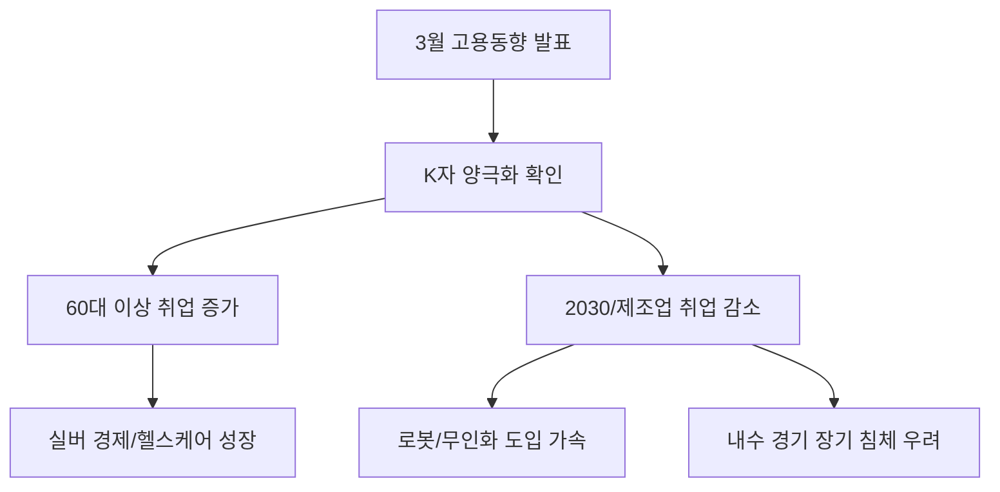

# 사회/노동 분석: 고용 시장의 'K자 양극화'와 3월 고용동향 심층 진단
## 투자 신호 + 사회적 영향 평가

---

## 📌 기사 기본 정보

- **날짜**: 2026-04-16
- **출처**: 대한민국 통계청 3월 고용동향 데이터 분석
- **카테고리**: 경제 > 사회 > 노동시장
- **핵심 주제**: 겉으로는 양호한 취업자 수 증가 이면에 숨겨진 연령별·업종별 'K자 양극화' 현상과 질 낮은 일자리 증가에 따른 고용 구조적 위기 분석

**메타데이터**
- 주요 수치: 전체 취업자 수 증가(전년비 +XX만 명), 60대 이상 취업자 비중(상향), 2030 청년 취업자 수(하락)
- 핵심 변수: 인구 구조 변화(에코 세대 졸업), 제조업 고용 위축, 비대면 서비스업 팽창
- 주요 주체: 고령층 재취업자, '그냥 쉬었음' 청년층, 자영업자
- 키워드: K자형 고용(K-shaped Employment), 실망 실업자 증가, 고용의 질 악화

---

## 🔍 기사를 통한 투자 신호 추출

### 1단계: 핵심 사건 분해

**What (무엇이 일어났는가?)**
- 전체 취업자 지표는 견조해 보이지만, 실상을 들여다보면 공공 일자리와 60대 이상의 단기 노동이 주도하고 있음. 반면 경제 성장의 핵심인 청년층과 '좋은 일자리'의 상징인 제조업 고용은 오히려 감소하며 고용 시장이 양극화되는 'K자' 형태를 보임.

**When (언제 일어났는가?)**
- 2026-04-16 (산업 구조가 하드웨어에서 소프트웨어·AI로 급격히 넘어가며 인력 수요가 비대칭적으로 발생하는 시점)

**Why (왜 일어났는가?)**
- 베이비부머 세대의 은퇴 후 생계형 재취업 증가
- 제조업의 자동화 및 스마트 팩토리 도입으로 인한 '사람 없는 공장' 확대
- 청년들이 원하는 '양질의 서비스직' 공급 부족(Mismatch)

**Who (누가 주도하는가?)**
- 일자리 비중이 급증하는 6070 액티브 시니어
- 구직을 포기하고 교육이나 휴식을 선택하는 2030 취업 준비생

---

### 2단계: 투자 신호 해석

#### A. **긍정적 신호 (Bullish)**

**① '실버 경제' 및 시니어 라이프스타일 시장의 팽창**
- **신호**: 일하는 고령층의 소득 확보 및 활동성 증대
- **의미**: 구매력을 갖춘 고령층이 늘어나며 의료, 건강기능식품, 실버 여가 산업의 구조적 성장
- **투자 기회**: 정밀 진단 의료기기 업체, 고령 친화형 식품 제조사, 시니어 전용 플랫폼

**② AI 기반 채용 및 전직 솔루션의 필수화**
- **신호**: 심각한 노동 시장 미스매치
- **의미**: 기업은 뽑을 사람이 없고, 구직자는 갈 곳이 없는 문제 해결을 위한 정교한 AI 매칭 기술 부상
- **투자 기회**: AI 인력 추천 플랫폼, 커리어 데이터 분석 상장사

---

#### B. **위험 신호 (Bearish)**

**① 청년 소비 기반 침체와 미래 성장 잠재력 하락**
- **신호**: 2030 고용률의 장기적 하향 추세
- **의미**: 결혼, 출산, 주택 구입의 주역인 청년층의 소득 부재로 인한 내수 경제의 장기 동력 상실
- **투자 리스크**: 전통 유통 채널(백화점, 대형마트), 대형 평수 아파트 건설사

**② 고용 지표의 '착시 현상'에 따른 정책 오판**
- **신호**: 양적 지표만 보고 금리를 유지하거나 규제를 강화하는 결정
- **의미**: 실제 경기 체력이 약해진 상태에서 정부가 긴축을 지속할 경우 중소기업 연쇄 도산 우려
- **투자 리스크**: 재무 구조가 취약한 코스닥 중소 제조업체

---

### 3단계: 섹터별 투자 기회 매트릭스

#### ✅ **높은 기대도 + 낮은 리스크**

**자동화 로봇 및 무인화 시스템 솔루션**
- 청년 인력을 구할 수 없는 중소 제조업체들의 생존을 위한 필수 설비임
- **투자 추천도**: ⭐⭐⭐⭐⭐

---

## 💰 구체적 투자 신호 변환

### 신호 1: '양'이 아니라 '질'을 봐라

**투자 해석**: 기사의 고용 동향은 대한민국 경제 체력이 겉으로만 멀쩡해 보이는 '속빈 강정' 임을 시사함. 60대 이상의 단기 일자리는 소비를 크게 끌어올리지 못함. 진짜 성장 동력인 대기업 제조업 고용과 IT 비중이 회복되지 않는 한, 지수 전체의 반등보다는 '시니어(Silver)'와 '자동화(Robot)'라는 두 갈래의 테마에 집중해야 함.

---

## 🌍 사회적 영향 평가

### A. 긍정적 사회 영향
- **액티브 시니어의 자아실현**: 일하는 노년이 늘어나며 고령화 사회의 부양 비용 절감 및 건강 증진 효과

### B. 부정적 사회 영향
- **청년층의 '실망 실업' 누적**: 취업 준비 기간이 길어지며 발생하는 사회적 비용(우울증, 은퇴 포기 등) 증가
- **세대 간 갈등 격차**: 일자리를 지키려는 고령층과 새로 진입하려는 청년층 간의 세대 전쟁 가능성 상존

---

## 🎯 결론: 당신의 투자 전략 수립

- **즉시 실행**: 포트폴리오 내 시니어 관련 헬스케어 비중 및 무인화 솔루션 기업 비중 상향
- **3개월 후**: 청년 고용 지표의 반등 여부 확인(산업별 매치 여부)을 통한 내수 소비 섹터 투자 시점 재결정

---

## 📝 Obsidian 연결 구조

