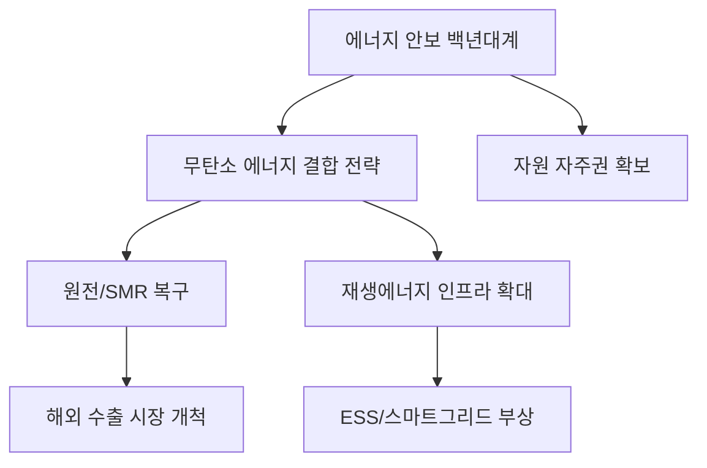

# 에너지/안보 분석: 실사구시 백년대계와 에너지 민생 전략 분석
## 투자 신호 + 사회적 영향 평가

---

## 📌 기사 기본 정보

- **날짜**: 2026-04-16
- **출처**: 에너지 정책 정론 (National Security Review)
- **카테고리**: 경제 > 정책 > 에너지안보
- **핵심 주제**: 자국 중심주의와 지정학적 위기 속에서 에너지 안보를 확보하기 위한 '실사구시(Practicality)'적 에너지 믹스 전략과 민생 안정 대책 분석

**메타데이터**
- 주요 정책: CFE(무탄소 에너지) 결합형 에너지 믹스(원전+재생에너지)
- 핵심 키워드: 에너지 주권, 자원 안보 특별법, 공급망 다변화, 에너지 바우처
- 주요 주체: 산업통상자원부, 한국전력, 글로벌 원자재 메이저, 에너지 혁신 스타트업
- 핵심 변수: 중동 분쟁 여파(호르무즈 봉쇄 리스크), 핵심 광물(리튬, 니켈 등) 가격 변동

---

## 🔍 기사를 통한 투자 신호 추출

### 1단계: 핵심 사건 분해

**What (무엇이 일어났는가?)**
- 지정학적 전쟁과 글로벌 자원 공급망 붕괴 국면에서, 정부가 '이념'을 뺀 '실질' 위주의 에너지 안보 백년대계를 수립. 원전의 기저 핵심화와 재생에너지의 전략적 확대를 동시 추진함.

**When (언제 일어났는가?)**
- 2026-04-16 (이란 등 중동 위기로 유가와 가스 가격이 요동치며 에너지 독립의 절실함이 최고조에 달한 시점)

**Why (왜 일어났는가?)**
- 에너지는 단순한 상품이 아닌 '민생'이자 '안보'이기 때문
- 글로벌 RE100 요구와 탄소 국경세 대응을 위한 저탄소 에너지 기반 구축 절실

**Who (누가 주도하는가?)**
- 에너지 안보를 국가 생존 전략으로 바라보는 범정부 대책 기구
- 해외 자원 개발에 다시 뛰어드는 국내 민관 합동 컨소시엄

---

### 2단계: 투자 신호 해석

#### A. **긍정적 신호 (Bullish)**

**① 원전 수출 및 SMR(소형 모듈 원자로) 시장의 개화**
- **신호**: 원전을 에너지 안보의 핵심 기저로 확정
- **의미**: 국내 원전 생태계의 완전한 복구 및 유럽/동남아 수출 경쟁력 강화
- **투자 기회**: 원전 핵심 설계/제조사, 특수 밸브 및 차폐재 공급 업체

**② 에너지 저장 시스템(ESS) 및 지능형 전력망(Smart Grid) 부상**
- **신호**: 재생에너지 비중 확대 전략 유지
- **의미**: 불안정한 재생에너지를 보완하기 위한 대규모 에너지 저장 기술 필수화
- **투자 기회**: 리튬/바나듐 기반 ESS 제조사, 전력 ICT 솔루션 기업

---

#### B. **위험 신호 (Bearish)**

**① 고유가 장기화에 따른 에너지 다소비 업종의 수익성 악화**
- **신호**: 에너지 수입 단가 지속 상승
- **의미**: 전기료/가스료 인상 압박이 전방위적으로 가해지며 원가 경쟁력 하락
- **투자 리스크**: 화학, 제련, 제지 등 전기를 많이 쓰는 전통 제조업

**② 자원 무기화에 따른 '핵심 광물' 공급망 중단 리스크**
- **신호**: 특정 국가(중국 등)로의 자원 의존도 심화 경고
- **의미**: 원전이나 배터리를 만들고 싶어도 원재료를 구하지 못하는 '자원 병목' 발생 시 공장 가동 중단
- **투자 리스크**: 공급망 다변화가 되지 않은 배터리 소재 및 첨단 장비 업체

---

### 3단계: 섹터별 투자 기회 매트릭스

#### ✅ **높은 기대도 + 낮은 리스크**

**해외 자원 개발 및 핵심 광물 직접 확보 기업**
- 에너지 주권 확보 차원에서의 지원이 집중되며, 원자재 가격 상승분을 수익으로 직결시킬 수 있음
- **투자 추천도**: ⭐⭐⭐⭐⭐

---

## 💰 구체적 투자 신호 변환

### 신호 1: '에너지 분권'과 '자급자족'이 돈이 되는 시대

**투자 해석**: 기사에서 강조하는 '실사구시'는 결국 어떤 상황에서도 전기가 끊기지 않게 하겠다는 의지임. 이는 중앙 집중형 전력망에서 벗어난 '마이크로 그리드' 기술과 '에너지 효율화(Zero Energy Building)' 기술에 거대한 시장이 열리고 있음을 뜻함.

---

## 🌍 사회적 영향 평가

### A. 긍정적 사회 영향
- **에너지 복지 사각지대 해소**: 에너지 바우처 확대 등을 통해 취약 계층의 '에너지 빈곤' 문제 해결 및 생존권 보장
- **국가 전력 인프라의 현대화**: 지능형 전력망 구축을 통해 무분별한 낭비를 줄이고 에너지 소비 효율 획기적 개선

### B. 부정적 사회 영향
- **에너지 가격 상승에 따른 인플레이션 전이**: 안보 확보 비용(원전 건설, 자원 확보 프리미엄)이 전기료 인상으로 전가되어 시민들의 실질 소득 감소
- **발전원 선정을 둘러싼 지역 갈등**: 원전 또는 신재생 단지 건설 부지를 둘러싼 님비(NIMBY) 및 핌피(PIMFY) 현상 재점화

---

## 🎯 결론: 당신의 투자 전략 수립

- **즉시 실행**: 포트폴리오 내 에너지 효율화 솔루션 기업 및 원전 핵심 소부장 종목의 비중 상향
- **3개월 후**: 정부의 '제11차 전력수급기본계획'의 구체적 이행 상황 파악 후 재생에너지 저장 섹터 리밸런싱

---

## 📝 Obsidian 연결 구조

