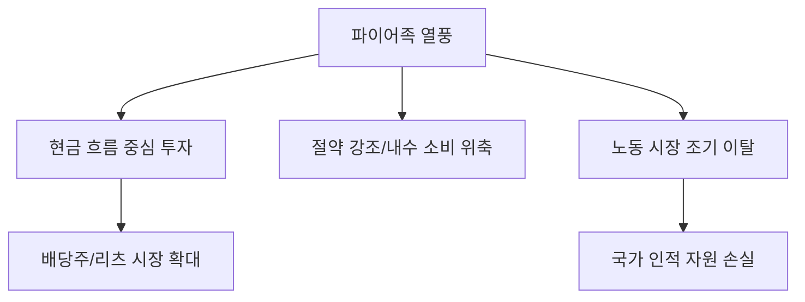

# 금융/라이프 분석: 파이어(FIRE)족 3인의 투자 사례와 경제적 자유의 자격
## 투자 신호 + 사회적 영향 평가

---

## 📌 기사 기본 정보

- **날짜**: 2026-04-16
- **출처**: 대한민국 라이프 금융 리포트
- **카테고리**: 경제 > 생활금융 > 투자심리
- **핵심 주제**: 조기 은퇴를 달성한 파이어(FIRE, Financial Independence Retire Early)족 3인의 상이한 투자 스타일과 그들이 말하는 '준비된 은퇴'의 자격 분석

**메타데이터**
- 주요 인물: A(배당 성장형, 40세 은퇴), B(트레이딩 집중형, 35세 은퇴), C(부동산 현금흐름형, 45세 은퇴)
- 핵심 전략: 배당 재투자, 극강의 절약(린 파이어), 지배구조 우량주 분산 투자
- 주요 지표: 4% 법칙(연간 인출률), 은퇴 자금 규모(Net Worth), 지속 가능한 현금 흐름
- 키워드: 경제적 자유(Financial Freedom), 조기 은퇴, 패시브 인컴(Passive Income)

---

## 🔍 기사를 통한 투자 신호 추출

### 1단계: 핵심 사건 분해

**What (무엇이 일어났는가?)**
- 평범한 직장인이었던 3인이 각기 다른 경로를 통해 30~40대에 경제적 자유를 달성한 구체적인 포트폴리오와 철학을 공개함. 이는 노동 소득의 가치 하락과 자본 소득의 중요성이 극대화된 시대상을 반영.

**When (언제 일어났는가?)**
- 2026-04-16 (팬데믹 이후의 불장과 조정을 거치며 '살아남은 파이어족'들의 생존 전략이 검증된 시점)

**Why (왜 일어났는가?)**
- 평생직장의 개념 실종 및 조직에 대한 로열티 감소
- 인플레이션과 자산 가격 폭등으로 인해 '월급만으로는 안 된다'는 위기감 팽배
- SNS를 통한 성공 사례의 빠른 확산과 '시간의 주권'을 찾으려는 욕구 증대

**Who (누가 주도하는가?)**
- 극도의 절제와 투자 지식으로 무장한 2030 스마트 투자자들
- 소득의 70% 이상을 자본으로 전환하는 실천가들

---

### 2단계: 투자 신호 해석

#### A. **긍정적 신호 (Bullish)**

**① '배당주 및 인컴(Income) 자산' 시장의 질적 성장**
- **신호**: 파이어족 3인 모두 '현금 흐름'의 중요성 강조
- **의미**: 단순 시세 차익보다 매달/매분기 현금을 주는 배당주, 리츠, 월배당 ETF 시장의 유동성 유입 강화
- **투자 기회**: 국내외 우량 고배당주, 배당 성장을 지속하는 배당 귀족주

**② 자동화된 자산 관리 및 자산 배분 비즈니스의 팽창**
- **신호**: 감정을 배제한 '규칙 기반(Rule-based)' 투자의 승리
- **의미**: 개인들이 직접 매매하기보다 검증된 알고리즘에 따른 자동 투자를 선호하게 됨
- **투자 기회**: 퀀트 기반 투자 플랫폼, 고도화된 자산 배분 테크 기업

---

#### B. **위험 신호 (Bearish)**

**① '린 파이어(Lean FIRE)'의 한계와 소비 다이어트 부작용**
- **신호**: 극단적인 절약이 전제된 은퇴
- **의미**: 예상치 못한 의료비나 자녀 교육비 발생 시 은퇴 계획이 붕괴될 위험 및 내수 소비 시장의 위축 초래
- **투자 리스크**: 중저가 소비재 섹터의 타겟층(2040) 이탈로 인한 매출 정체

**② 투자 수익률 하락 시의 '재취업 불가능' 리스크**
- **신호**: 노동 시장과의 단절 기간 장기화
- **의미**: 시장 하락기에 자산이 소진될 경우, 기술 변화 속도에 뒤처진 조기 은퇴자들의 생계 위협
- **투자 리스크**: 파이어족들이 주로 보유한 섹터의 동조화(Correlation) 하락 시 발생하는 연쇄 매도

---

### 3단계: 섹터별 투자 기회 매트릭스

#### ✅ **높은 기대도 + 낮은 리스크**

**복리 효과를 극대화하는 '배당 성장 ETF' 및 '수익형 부동산 리츠'**
- 파이어족들의 필수 포트폴리오로 자리 잡으며 장기적인 자금 유입이 보장됨
- **투자 추천도**: ⭐⭐⭐⭐⭐

---

## 💰 구체적 투자 신호 변환

### 신호 1: '은퇴'가 아니라 '현금 흐름'의 경쟁이다

**투자 해석**: 기사의 3인은 모두 자본의 크기보다 '현금 흐름의 연속성'을 승부처로 보았음. 이는 투자 시장이 '한탕'을 노리는 투기에서 '연금형 자산'을 쌓는 쪽으로 성숙해지고 있음을 뜻함. 개별 주식의 변동성에 일희일비하기보다 꾸준히 현금을 창출하는 기업의 지분을 모으는 전략이 최고의 수익률로 귀결됨.

---

## 🌍 사회적 영향 평가

### A. 긍정적 사회 영향
- **금융 문맹 탈출 및 자기 주도적 삶**: 국가나 기업에 의존하지 않고 스스로 생애 재무 설계를 하는 주체적인 시민 계층 형성
- **지식 공유의 활성화**: 본인의 성공/실패 사례를 적극 공유하며 사회 전체의 금융 리터러시 상향 평준화 견인

### B. 부정적 사회 영향
- **생산 가능 인구의 조기 이탈**: 유능한 인재들이 조기에 노동 시장을 떠남으로써 국가 경쟁력 및 혁신 동력 저하 가능성
- **근로 소득의 의미 퇴색**: 땀 흘려 번 돈보다 '돈이 돈을 버는' 구조만 숭상하는 풍조로 인한 노동 가치의 훼손
- **상대적 박탈감 심화**: 파이어를 달성하지 못한 다수의 직장인들이 겪는 만성적 무력감과 사회적 냉소주의

---

## 🎯 결론: 당신의 투자 전략 수립

- **즉시 실행**: 본인 계좌의 '연간 예상 배당금' 및 '패시브 인컴' 비중 산출 및 목표 설정
- **3개월 후**: 인플레이션 상승분이 본인의 배당 수익률로 상쇄되는지 점검 후 포트폴리오 내 물가 연동 자산 추가

---

## 📝 Obsidian 연결 구조

