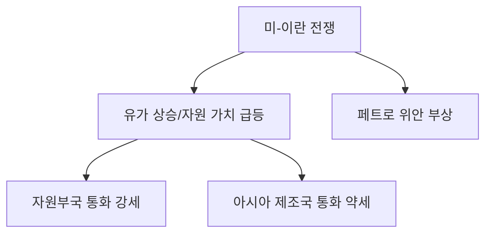

# 외환시장 분석: 이란 사태 후 '4대 현상'과 통화 패권 재편
## 투자 신호 + 사회적 영향 평가

---

## 📌 기사 기본 정보

- **날짜**: 2026-04-16
- **출처**: 머니투데이 (오건영 신한 프리미어패스파인더 단장 시평)
- **카테고리**: 경제 > 금융 > 외환
- **핵심 주제**: 미국-이란 전쟁 이후 요동치는 글로벌 외환시장의 4대 구조적 변화 분석

**메타데이터**
- 주요 사건: 미국-이란 전쟁 발발 및 자원 통화 강세
- 핵심 지표: 달러 인덱스, 위안화 환율(페트로 위안), 자원부국 통화 가치
- 주요 주체: 美 연준, 중국 인민은행, 자원 수출국(호주, 브라질)
- 영향 지역: 아시아 제조업 국가(한국, 일본, 대만) 및 자원 강국

---

## 🔍 기사를 통한 투자 신호 추출

### 1단계: 핵심 사건 분해

**What (무엇이 일어났는가?)**
- 전쟁 이후 환율 시장에서 아시아 제조업 통화 약세, 강달러 지속, 자원부국 통화 강세, 페트로 위안의 부상이라는 4대 현상 발생

**When (언제 일어났는가?)**
- 2026년 2월 전쟁 발발 이후 4월 현재까지 고착화되는 국면

**Why (왜 일어났는가?)**
- 아시아: 에너지 의존도가 높아 유가 상승 시 무역수지 악화 → 통화 가치 하락
- 미국: 안전자산 선호 및 금리 우위로 인한 압도적 강달러
- 자원국: 정치적 불안보다 자원의 가치가 통화력을 결정하는 시대 진입
- 중국: 미국의 리더십 균열을 틈탄 결제 통화 다변화 전략(위안화 국제화)

**Who (누가 주도하는가?)**
- 시장의 스마트 머니 (자원 및 안전자산으로 이동)
- 미-중 패권 경쟁국의 통화 정책 당국

---

### 2단계: 투자 신호 해석

#### A. **긍정적 신호 (Bullish)**

**① 자원 연계형 자산의 가치 재발견**
- **신호**: 호주 달러, 브라질 헤알화 등 자원국 통화의 강한 복원력
- **의미**: 이제 환율은 '성장'보다 '자원 보유'가 결정하는 시대로 전환
- **투자 기회**: 자원 통화 기반 채권, 글로벌 원자재 인프라 펀드

**② 위안화의 기축 통화 지위 격상**
- **신호**: 위안화 가치가 2008년 금융위기 이후 최고치 경신 및 페트로 위안 결제 확대
- **의미**: 달러 단극 체제의 균열과 이극 체제로의 이행 가속
- **투자 기회**: 중화권 금융 결제망 관련 기업 및 위안화 자산 배분

---

#### B. **위험 신호 (Bearish)**

**① 아시아 제조업 국가의 샌드위치 위기**
- **신호**: 원화, 엔화의 동반 약세 지속
- **의미**: 에너지 수입 비용 증가로 인한 생산성 저하 및 외인 자금 이탈 가속
- **투자 리스크**: 국내 내수 소비재, 에너지 다소비형 제조업

**② 지정학적 금융 무기화**
- **신호**: 전쟁을 빌미로 통화 가치를 인위적으로 조정하려는 정치적 압박 증대
- **의미**: 경제 논리보다 정치 논리가 환율을 지배하는 불확실성 증대

---

### 3단계: 섹터별 투자 기회 매트릭스

#### ✅ **높은 기대도 + 낮은 리스크**

**글로벌 원자재 및 에너지 결합 통화 자산**
- 인플레이션과 환율 리스크를 동시에 헤지할 수 있는 최적의 도구
- **투자 추천도**: ⭐⭐⭐⭐⭐

---

## 💰 구체적 투자 신호 변환

### 신호 1: '에너지가 곧 통화'인 시대

**투자 해석**: 기사의 "자원부국 통화 강세"는 단순한 일시적 현상이 아님. 에너지 주권이 없는 통화는 1500원 뉴노멀 시대에 상시 노출될 것임. 결제 통화 다변화와 자원 자산 편입이 필수적임.

---

## 🌍 사회적 영향 평가

### A. 긍정적 사회 영향
- **다원적 금융 질서**: 달러 일변도에서 벗어나 다양한 결제 수단이 경쟁하며 기술적 금융 혁신 촉진

### B. 부정적 사회 영향
- **수입 물가 폭등으로 인한 서민 고통**: 환율 상승이 에너지 및 식료품 가격으로 전이되어 양극화 심화

---

## 📊 투자 의사결정 매트릭스

- **시나리오 1**: 미-중 정상회담(5월) 성공 시 환율 안정 (확률 30%)
- **시나리오 2**: 전쟁 장기화 및 페트로 위안 고착화 (확률 70%) → 자원 자산 유지

---

## 🎯 결론: 당신의 투자 전략 수립

- **즉시 실행**: 원화 위주 포트폴리오에서 탈피, 호주 달러나 위안화 결제 기반 자산 일부 편입 검토
- **3개월 후**: 5월 미-중 회담 결과에 따라 달러 인덱스 방향성 재평가

---

## 📝 Obsidian 연결 구조

