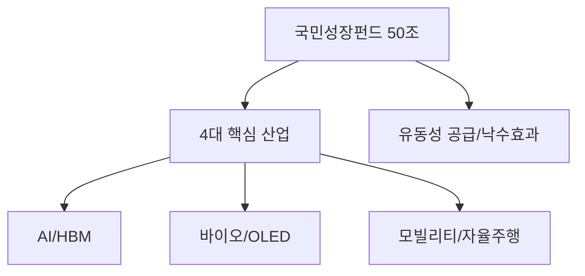

# 국가 전략 자산 분석: 50조 규모 '국민성장펀드' 2차 메가프로젝트
## 투자 신호 + 사회적 영향 평가

---

## 📌 기사 기본 정보

- **날짜**: 2026-04-17
- **출처**: 경제 정책 브리핑 (정부 합동 발표)
- **카테고리**: 경제 > 정책금융 > 첨단산업
- **핵심 주제**: 50조 원 규모의 국민성장펀드 2차 메가프로젝트 추진 (바이오, OLED, AI, 모빌리티 4대 핵심 분야 FOCUS)

**메타데이터**
- 총 예산: 50조 원 (정부 마중물 + 민간 매칭)
- 4대 타겟: 바이오헬스, OLED(차세대 디스플레이), AI(HBM 포함), 모빌리티(자율주행/UAM)
- 주요 주체: 산업은행, 기재부, 주요 민간 금융지주, 국가전략산업위원회
- 핵심 변수: 기술 주권 확보 여부, 대규모 생산 시설 국내 유치 유인

---

## 🔍 기사를 통한 투자 신호 추출

### 1단계: 핵심 사건 분해

**What (무엇이 일어났는가?)**
- 정부가 미래 먹거리 4대 분야에 50조 원을 투입하는 대규모 정책 금융 패키지를 발표. 이는 과거 'K-뉴딜'을 넘어서는 초격차 기술 확보를 목표로 함.

**When (언제 일어났는가?)**
- 2026-04-17 (해외 자본 유출에 대응하고 국내 제조업 경쟁력을 다시 세우려는 시점)

**Why (왜 일어났는가?)**
- 미국의 IRA, CHIPS법 등 자국 중심 정책에 맞서 국내 산업 생태계를 보호하기 위한 '국가 자본'의 투입 필요성 증대
- 민간 투자가 위축된 고금리 상황에서 정부가 마중물 역할 수행

**Who (누가 주도하는가?)**
- 범정부 차원의 국가전략산업 추진팀
- 해당 분야의 글로벌 경쟁력을 갖춘 선도 기업들(삼성, 현대차, SK 등)

---

### 2단계: 투자 신호 해석

#### A. **긍정적 신호 (Bullish)**

**① '실탄' 장착한 첨단 산업의 성장 속도업**
- **신호**: 50조 원이라는 가공할 만한 자금력 투하
- **의미**: 연구개발(R&D)부터 양산 시설 구축까지 금융 비용 부담의 획기적 감소
- **투자 기회**: 해당 분야의 소부장(소재·부품·장비) 강소기업 및 핵심 엔진 공급처

**② 국가 인증 '슈퍼 성장주'의 탄생**
- **신호**: 정부 펀드의 직접 지분 투자 및 금융 지원
- **의미**: 정부가 보증하는 산업이라는 강력한 신뢰 마크 확인
- **투자 기회**: 국민성장펀드 수혜 대상 섹터 내 거래소 상장 우량주

---

#### B. **위험 신호 (Bearish)**

**① 정책 자금 집행의 '도덕적 해이' 리스크**
- **신호**: 대규모 자금의 급격한 투입
- **의미**: 실질적 기술력보다 로비나 정계 연줄에 의한 자금 배분 우려
- **투자 리스크**: 실제 매출로 이어지지 않는 '테마형' 정책 수혜주들의 거품 붕괴

**② 민간 매칭 실패 가능성**
- **신호**: "민간 자금 유인"이 전제 조건
- **의미**: 금리가 여전히 높을 경우 민간 금융사들이 매칭 펀드 조성에 소극적일 수 있음

---

### 3단계: 섹터별 투자 기회 매트릭스

#### ✅ **높은 기대도 + 낮은 리스크**

**AI 인프라 및 차세대 OLED 소재**
- 글로벌 수요가 확실하며 정부 지원이 더해질 경우 가동률 급상승 예상
- **투자 추천도**: ⭐⭐⭐⭐⭐

---

## 💰 구체적 투자 신호 변환

### 신호 1: '돈의 골목'을 정부가 지정했다

**투자 해석**: 정부가 50조라는 거대 자금의 흐름을 4개 섹터로 못 박았음. 이는 개별 기업의 펀더멘털을 넘어선 '거대한 유동성 공급'을 의미하므로, 해당 섹터 내 대장주를 중심으로 포트폴리오를 재편해야 함.

---

## 🌍 사회적 영향 평가

### A. 긍정적 사회 영향
- **고급 일자리 창출**: 첨단 산업 중심의 생태계 확장으로 청년층을 위한 고임금 일자리 확대
- **기술 국산화**: 수입 의존도가 높았던 핵심 부품의 국산화를 통해 국가 안보 강화

### B. 부정적 사회 영향
- **산업 간 양극화**: 4대 분야에만 자산이 쏠리며 소외된 전통 제조업이나 서비스업의 위기 가중
- **수도권 집중화 우려**: 첨단 산업 인프라가 수도권에 집중될 경우 지역 격차 심화

---

## 🎯 결론: 당신의 투자 전략 수립

- **즉시 실행**: 국민성장펀드 2차 리스트에 포함된 구체적인 기업군 분석 및 소부장 핵심주 선별
- **3개월 후**: 실제 펀드 집행 속도와 민간 자본 유입 현황 모니터링 후 비중 조절

---

## 📝 Obsidian 연결 구조

