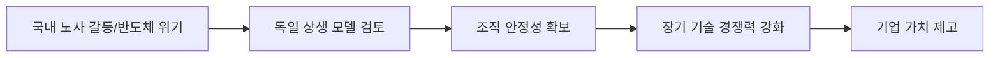

# 글로벌 산업 분석: 독일 백년 기업의 상생 철학과 반도체 위기
## 투자 신호 + 사회적 영향 평가

---

## 📌 기사 기본 정보

- **날짜**: 2026-04-17
- **출처**: 글로벌 경영 구루 리포트 (독일 베르텔스만 모델 특집)
- **카테고리**: 경제 > 경영 > 산업구조
- **핵심 주제**: 독일 장수 기업들의 이익 공유 및 연대 경영 철학이 한국 반도체 산업의 노사 갈등과 위기 해결에 주는 시사점

**메타데이터**
- 주요 모델: 베르텔스만(Bertelsmann) 이익 공유제 및 기업 연금 시스템
- 핵심 가치: 이해관계자 자본주의(Stakeholder Capitalism), 지속가능성
- 주요 주체: 삼성전자/SK하이닉스 노사, 독일 가족 기업들, 정부 정책 입안자
- 핵심 변수: 단기 성과급 요구 vs 장기적 가치 공유 시스템

---

## 🔍 기사를 통한 투자 신호 추출

### 1단계: 핵심 사건 분해

**What (무엇이 일어났는가?)**
- 한국의 주력 산업인 반도체 업계에서 '성과급'을 둘러싼 극심한 노사 갈등이 격화되자, 이에 대한 대안으로 독일 백년 기업들의 '상생 철학' 및 '기업 복지 모델'이 급부상

**When (언제 일어났는가?)**
- 2026-04-17 (기술 패권 경쟁 속에서 내부 결속력이 기업의 사활을 결정하는 시점)

**Why (왜 일어났는가?)**
- 상상을 초월하는 이익이 발생해도 분배 방식에 대한 합의가 없어 경영 불확실성이 증대됨
- 단기적 현금 요구는 기업의 미래 투자(R&D) 재원을 위협하며 경쟁력 저하를 초래

**Who (누가 주도하는가?)**
- 대화의 돌파구를 찾는 국내 대기업 경영진 및 합리적 노동계 리더
- 독일 모델을 연구하는 경영 학계 및 정책 연구소

---

### 2단계: 투자 신호 해석

#### A. **긍정적 신호 (Bullish)**

**① '상생 시스템' 구축을 통한 기업 가치(ESG) 재평가**
- **신호**: 이익 공유제나 선진적 퇴직 연금 제도 도입 논의
- **의미**: 노사 갈등 리스크를 시스템적으로 제거하여 장기 투자자의 신뢰 확보
- **투자 기회**: 노사 관계가 안정적이며 직원의 로열티가 높은 기업 (ESG 최상위 등급주)

**② '조직 문화' 자체가 경쟁력이 되는 기업**
- **신호**: 핵심 인재 유출 방지를 위한 독일식 '가족 경영' 및 '복지 모델' 벤치마킹
- **의미**: 기술 유출 방지 및 지속 가능한 혁신 동력 확보
- **투자 기회**: 국내 소부장 기업 중 독일식 히든 챔피언 전략을 구사하는 기업

---

#### B. **위험 신호 (Bearish)**

**① 단기 성과급 딜레마로 인한 '투자의 실기'**
- **신호**: 노조의 과도한 현금 분배 요구 및 파업 가시화
- **의미**: 미래 산업 주도권을 쥐기 위한 50조, 100조 단위 투자가 노사 갈등에 발목 잡힘
- **투자 리스크**: 노사 대립이 격화되는 삼성전자 등 국내 메모리 대장주

**② 한국적 토양과의 불일치 리스크**
- **신호**: "독일 모델 무조건 이식" 주장
- **의미**: 수직적 상명하복 문화와 강성 노조 문화가 충돌하며 제도 도입 과정의 극심한 통통 유발

---

### 3단계: 섹터별 투자 기회 매트릭스

#### ✅ **높은 기대도 + 낮은 리스크**

**노사 안정성이 확보된 포스트 삼성/SK 반도체 밸류체인**
- 안정적인 인력 공급과 유대감이 형성된 강소기업
- **투자 추천도**: ⭐⭐⭐⭐

---

## 💰 구체적 투자 신호 변환

### 신호 1: '돈'보다 '시스템'에 반응하는 인재

**투자 해석**: 기사의 "베르텔스만 모델"은 당장의 보너스보다 노후의 안정과 기업의 영속성을 강조함. 이러한 시스템을 갖춘 기업은 시장 변동성에도 흔들리지 않는 굳건한 기초 체력을 가짐. 기업의 보상 체계 혁신을 선도하는 기업에 투자해야 함.

---

## 🌍 사회적 영향 평가

### A. 긍정적 사회 영향
- **일자리의 질 향상**: 단순 고용을 넘어 '공동체적 소속감'을 제공하는 일자리 문화 확산
- **경제적 안정성**: 기업 연금 등 사적 복지 강화로 정부의 공적 부양 부담 경감

### B. 부정적 사회 영향
- **기업 간 양극화**: 독일 모델을 감당할 수 있는 대기업과 그렇지 못한 중소기업 간의 인재 격차 더 벌어짐
- **경직적 고용 문화**: 상생을 강조하다 보니 유연한 인력 구조 조정이 어려워질 수 있음

---

## 🎯 결론: 당신의 투자 전략 수립

- **즉시 실행**: 보유 주식 중 노사 갈등 리스크가 주가 발목을 잡는 종목 리스트업 및 상생 지표 확인
- **3개월 후**: 국내 대기업들의 성과급 체제 개편(연금화 등) 뉴스 모니터링 후 포트폴리오 조정

---

## 📝 Obsidian 연결 구조

