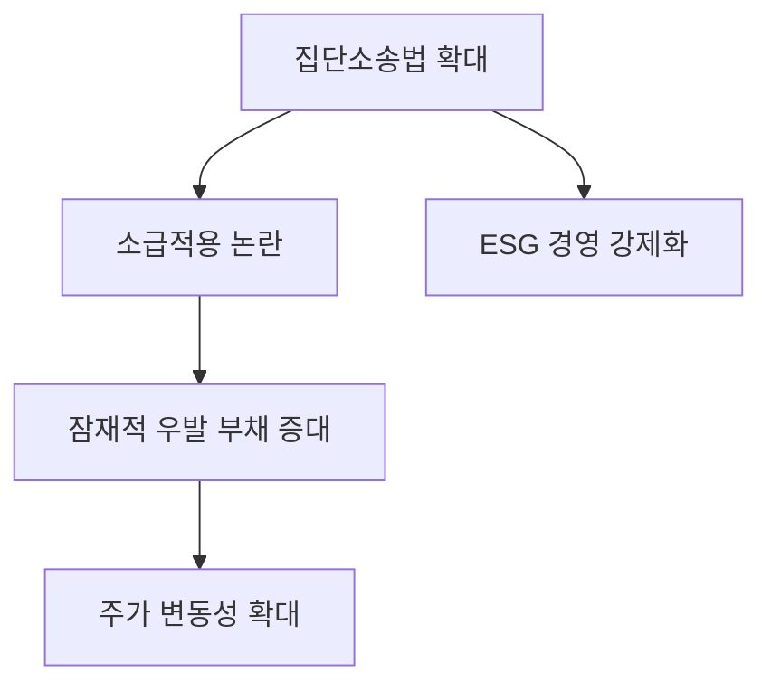

# 법률/리스크 분석: 집단소송법 소급적용 논란과 기업 대응 전략
## 투자 신호 + 사회적 영향 평가

---

## 📌 기사 기본 정보

- **날짜**: 2026-04-17
- **출처**: 법조 및 산업 정책 뉴스
- **카테고리**: 경제 > 법률 > 기업리스크
- **핵심 주제**: 집단소송법 및 징벌적 손해배상제도의 소급적용(과거 행위에 대한 적용) 논란과 이에 따른 기업들의 법적 리스크 증대

**메타데이터**
- 주요 법안: 집단소송법 제정안 (분야 제한 철폐)
- 핵심 쟁점: 소급적용 여부, 징벌적 손해배상 한도, 입증책임 전환
- 주요 주체: 법무부, 대한상공회의소(경제계), 한국소비자원(반대 입장), 대기업 법무팀
- 핵심 변수: 위헌 소지 논란, 기업의 잠재적 배상금 충당금 적립 부담

---

## 🔍 기사를 통한 투자 신호 추출

### 1단계: 핵심 사건 분해

**What (무엇이 일어났는가?)**
- 주가조작, 제조물 결함 등 특정 분야에 한정됐던 집단소송제를 전 분야로 확대하는 법안 추진 과정에서, 법 제정 전의 행위까지 소급하여 소송을 제기할 수 있게 하느냐를 두고 정부와 경제계가 격돌

**When (언제 일어났는가?)**
- 2026-04-17 (기업 규제 입법이 강화되는 정치적 국면)

**Why (왜 일어났는가?)**
- 소비자 주권 강화 및 기업의 부당 이득 환수 필요성 증대
- 가습기 살균제 사건 등 과거 대형 참사에 대한 구제 실효성 확보 차원

**Who (누가 주도하는가?)**
- 법무부 및 입법부 강경파 (추진)
- 경영계 및 보수적 법조계 (반대)
- 의외로 소비자원조차 '남소(濫訴, 소송 남발)'의 부작용을 우려하며 신중론 제시

---

### 2단계: 투자 신호 해석

#### A. **긍정적 신호 (Bullish)**

**① 법률 서비스 및 로펌 관련 섹터의 활황**
- **신호**: 기업의 법적 분쟁 리스크 폭증
- **의미**: 기업들의 방어 비용 지출 증대로 인한 대형 로펌 및 법률 테크 기업의 매출 증대
- **투자 기회**: 리걸테크(Legal-tech) 선도 기업 및 법률 컨설팅 상장사

**② 기업 지배구조 개선 및 ESG 강화**
- **신호**: 강력한 처벌 규정에 따른 선제적 리스크 관리
- **의미**: 장기적으로 투명한 경영 구조를 가진 기업만이 생존하게 되는 정화 작용
- **투자 기회**: 이미 최고 수준의 준법 감시 시스템을 구축한 우량 대기업

---

#### B. **위험 신호 (Bearish)**

**① 불확실한 '잠재적 손실'의 폭발**
- **신호**: 소급적용 조항 포함 가능성
- **의미**: 과거에 이미 끝난 사업이나 행위가 언제든 거액의 소송 대상이 되어 재무제표를 흔들 수 있음
- **투자 리스크**: 제조 시설이 많고 소비자 직접 접점이 큰 식품, 자동차, 화학 기업군

**② '기획 소송'에 따른 경영 활동 위축**
- **신호**: 소송 참여자 모집 및 기획 소송 성행 우려
- **의미**: 기업들이 신기술 도입이나 공격적 마케팅보다 '방어적 경영'에 몰두하며 혁신 속도 저하

---

### 3단계: 섹터별 투자 기회 매트릭스

#### ✅ **높은 기대도 + 낮은 리스크**

**기업 리스크 관리 솔루션 및 보험 섹터**
- 소송 리스크를 전가하거나 관리하는 시스템에 대한 기업들의 수요가 폭증할 것임
- **투자 추천도**: ⭐⭐⭐⭐⭐

---

## 💰 구체적 투자 신호 변환

### 신호 1: '소급적용'은 투자 회피 신호

**투자 해석**: 만약 법안이 소급적용을 포함하여 통과될 경우, 과거 환경 오염이나 제조 결함 이력이 있는 기업의 주가는 예기치 못한 '소송 폭탄'에 직면할 것임. 재무제표상 잡히지 않는 '우발 부채'를 철저히 점검해야 함.

---

## 🌍 사회적 영향 평가

### A. 긍정적 사회 영향
- **소비자 권익의 획기적 신장**: 대기업을 상대로 한 개별 소비자의 불리한 싸움을 제도적으로 보완
- **기업 윤리 의식 강화**: '걸리면 끝난다'는 인식으로 인한 실질적 제조 환경 개선

### B. 부정적 사회 영향
- **소송 만능주의의 폐해**: 중소기업의 경우 단 한 번의 집단소송으로 도산할 수 있어 생태계 파괴 우려
- **사회적 갈등 비용 증대**: 기업과 소비자 간의 불신이 깊어지며 합의보다 소송으로 해결하는 문화 고착

---

## 🎯 결론: 당신의 투자 전략 수립

- **즉시 실행**: 보유 종목 중 과거 대형 소비자 분쟁 이력이 있는 기업의 공시와 법적 대응 공약 확인
- **3개월 후**: 입법 과정에서 '소급적용' 조항의 생존 여부를 최종 확인 후 포트폴리오 비중 리밸런싱

---

## 📝 Obsidian 연결 구조

