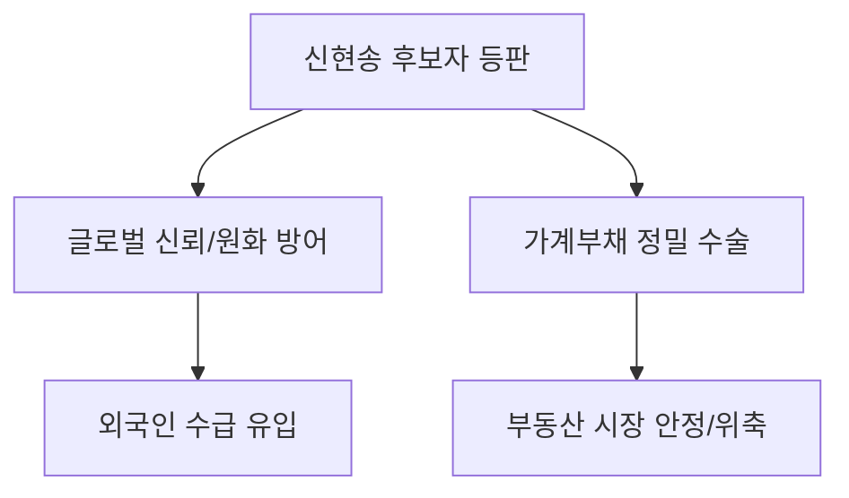

# 거시경제/금융 분석: 신현송 한은 총재 후보자와 통화정책의 향방
## 투자 신호 + 사회적 영향 평가

---

## 📌 기사 기본 정보

- **날짜**: 2026-04-18
- **출처**: 금융 시장 긴급 진단 (청문회 특집)
- **카테고리**: 경제 > 금융 > 정책
- **핵심 주제**: 세계적 석학 신현송 교수의 한국은행 총재 후보자 청문회 쟁점과 향후 통화정책(금리, 환율) 기조 분석

**메타데이터**
- 주요 인물: 신현송(Hyun Song Shin, BIS 조사국장 출신), 한은 금융통화위원회
- 핵심 이론: 글로벌 자산 가격 연계성, 통화 정책의 '실사구시'적 접근
- 주요 쟁점: 고물가 대응 vs 고금리 부채 리스트 관리, 환율 1500원 방어 전략
- 핵심 변수: 원/달러 환율 변동성, 가계 부채 연착륙 시나리오

---

## 🔍 기사를 통한 투자 신호 추출

### 1단계: 핵심 사건 분해

**What (무엇이 일어났는가?)**
- 국제 금융계의 거물인 신현송 후보자가 청문회에서 한국 경제의 '복합 위기'에 대응하는 정책 가이드라인을 제시. 특히 단순 금리 인상을 넘어선 '정교한 유동성 관리'를 강조.

**When (언제 일어났는가?)**
- 2026-04-18 (미국과 이란의 갈등으로 외환 시장이 극도로 불안한 시점)

**Why (왜 일어났는가?)**
- 한국 경제가 '저성장-고물가'의 늪에 빠진 상황에서, 실무와 이론을 겸비한 강력한 컨트롤 타워 필요성 대두
- 환율 안정을 위한 한미 금리차 관리와 내수 부양 사이의 미묘한 균형점 모색

**Who (누가 주도하는가?)**
- 임명권자(정부)와 인사청문회를 진행하는 입법부
- 신 후보자의 정책 발언에 1초 단위로 반응하는 국채 및 외환 시장 참여자

---

### 2단계: 투자 신호 해석

#### A. **긍정적 신호 (Bullish)**

**① 외환 시장의 '신뢰 프리미엄' 형성**
- **신호**: 국제적 인지도가 높은 인물의 수장 부임
- **의미**: 글로벌 투자자들의 '한국 정부의 정책 역량'에 대한 신뢰도 상승 → 원화 약세 방어 효과(Oral Intervention)
- **투자 기회**: 원화 가치 안정 시 반등할 수 있는 외국인 선호 대형주

**② 금리 정상화와 함께 올 '금융 혁신'**
- **신호**: 유동성의 양적 조절보다 질적 효율 중시 발언
- **의미**: 부실 채권 구조조정 가속화 및 우량 자산 위주의 시장 재편
- **투자 기회**: 리스크 관리 능력이 뛰어난 대형 시중 은행 및 금융 지주사

---

#### B. **위험 신호 (Bearish)**

**① '시장 기대보다 매파적(Hawkish)' 기조 가능성**
- **신호**: 부채 사이클 관리를 최우선 과제로 강조
- **의미**: 경기가 나빠도 가계 부채를 잡기 위해 금리를 내리지 않고 오랫동안 유지할 가능성(Higher for Longer)
- **투자 리스크**: 부채 비율이 높고 단기 자금 조달 의존도가 큰 건설, 유통 섹터

**② 글로벌 긴축 공조 강화**
- **신호**: 미 연준과의 정책 동조화 시사
- **의미**: 독자적인 금리 인하라는 선택지가 사라지며 내수 경기 회복 시점 지연

---

### 3단계: 섹터별 투자 기회 매트릭스

#### ✅ **높은 기대도 + 낮은 리스크**

**국채 및 통화 안정 관련 금융 상품**
- 신 후보자의 신뢰도를 바탕으로 한국 국채의 '리스크 프리미엄'이 낮아질 수 있음
- **투자 추천도**: ⭐⭐⭐⭐⭐

---

## 💰 구체적 투자 신호 변환

### 신호 1: '이론과 실무의 결합'은 시장 안정의 신호

**투자 해석**: 신현송 후보자는 BIS에서 글로벌 자본 흐름을 가장 정확히 진단해 온 인물임. 그가 강조하는 '거시건전성 규제'는 금융 시장의 갑작스러운 붕괴를 막는 방패가 되겠으나, 부동산 등 자산 시장의 '투기성 수급'은 강력히 억제할 것임.

---

## 🌍 사회적 영향 평가

### A. 긍정적 사회 영향
- **금융 국가 위상 제고**: 세계적 석학의 부임으로 한국 통화 정책에 대한 국제적 신뢰 확보
- **부채 거품의 질서 있는 정리**: 과도한 부채 기반 성장에서 벗어나 건전한 성장 토대 마련

### B. 부정적 사회 영향
- **가계 경제의 고통**: 고금리 유지가 길어질 경우 하우스푸어 및 서민들의 이자 부담 한계점 도달
- **통계적 안정 vs 체감적 고통**: 지표는 안정되나 내수 자영업자들의 폐업 속도는 빨라지는 괴리 발생

---

## 🎯 결론: 당신의 투자 전략 수립

- **즉시 실행**: 국채 금리 변동 추이 모니터링 및 고학력/고소득 기반의 하이엔드 소비 섹터로 포트폴리오 압축
- **3개월 후**: 취임 후 첫 금통위 메시지 분석을 통해 금리 동결 기간 장기화 여부 판단

---

## 📝 Obsidian 연결 구조

