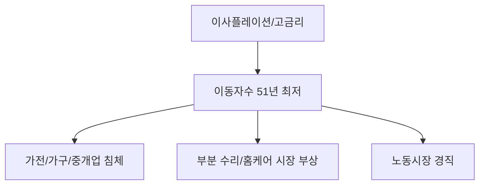

# 부동산/인구 분석: '이사플레이션'과 51년 만의 최저 이동자 수
## 투자 신호 + 사회적 영향 평가

---

## 📌 기사 기본 정보

- **날짜**: 2026-04-18
- **출처**: 국토 및 인구 통계 리포트
- **카테고리**: 경제 > 부동산 > 인구사회
- **핵심 주제**: 고물가와 고금리로 인한 이동 비용 폭증(이사플레이션)으로 주택 이동자 수가 51년 만에 최저치를 기록한 현상 분석

**메타데이터**
- 주요 수치: 국내 이동자 수 (1975년 이후 최저), 이사 비용 상승률(평균 15~20%)
- 핵심 변수: 취득세/양도세 등 거래 비용, 전세대출 금리, 이사 서비스 단가 상향
- 주요 주체: 무주택 서민층, 1주택 갈아타기 계층, 포장이사 및 인테리어 업계
- 키워드: 이사플레이션(Isa-flation), 거주지 고착화(Housing Immobile), 거래 절벽

---

## 🔍 기사를 통한 투자 신호 추출

### 1단계: 핵심 사건 분해

**What (무엇이 일어났는가?)**
- 주택 거래와 이동이 멈췄음. 중개 수수료, 이사 비용, 인테리어 비용 등 모든 부대 비용이 급등하여 이사 자체가 '사치'가 된 상황.

**When (언제 일어났는가?)**
- 2026-04-18 (봄 이사 철임에도 불구하고 시장이 정적으로 가라앉은 시점)

**Why (왜 일어났는가?)**
- 고금리로 인해 기존 저리 대출을 포기하고 신규 대출을 일으키는 것에 대한 공포
- 원자재 및 인건비 상승으로 인한 이사 서비스 가격의 천정부지 상승
- 주택 가격 상승 기대감 상실로 인한 '버티기' 전략 확산

**Who (누가 주도하는가?)**
- 이사를 포기하고 대규모 수리 대신 부분 수리로 선회하는 실거주자들
- 매물이 잠기며 거래 가뭄을 겪는 부동산 중개 시장

---

### 2단계: 투자 신호 해석

#### A. **긍정적 신호 (Bullish)**

**① '부분 수리' 및 홈 퍼니싱 시장의 성장**
- **신호**: 이사를 못 가는 대신 현재 집을 꾸미려는 수요 증대
- **의미**: 전체 인프라 교체보다는 DIY, 소형 가구, 부분 인테리어 관련 기업의 기회
- **투자 기회**: 온라인 기반 홈 퍼니싱 업체, 저가형 가구 제조사

**② 기업형 임대 및 주거 관리 서비스**
- **신호**: 거주 기간 장기화
- **의미**: 한 집에서 오래 살기 위해 필요한 유지 보수 및 정리 수납 등 서비스 수요 증대
- **투자 기회**: 주거 관리 플랫폼, 홈 클리닝 전문 상장사

---

#### B. **위험 신호 (Bearish)**

**① 부동산 연관 산업의 전방위적 침체**
- **신호**: 이동자 수 51년 만의 최저
- **의미**: 중개사, 포장이사 업체, 가구/가전 신규 구매 등 낙수 효과가 완전히 소멸
- **투자 리스크**: 대형 가구사(B2C 의존도가 높은 경우), 가전 전문 유통사(하이마트 등), 인테리어 자재 기업

**② 노동 시장의 유연성 저해**
- **신호**: 일자리에 따른 거주지 이전 불가능
- **의미**: 인재가 적재적소에 배치되지 못함에 따라 산업 전체의 생산성 하락 우려

---

### 3단계: 섹터별 투자 기회 매트릭스

#### ✅ **높은 기대도 + 낮은 리스크**

**노후 주택 유지 보수 및 리모델링 핵심 소모품**
- 이사가 줄어들수록 현재 주택의 수명 연장을 위한 소모성 자재 수요는 견고함
- **투자 추천도**: ⭐⭐⭐⭐

---

## 💰 구체적 투자 신호 변환

### 신호 1: '거래'에서 '거주'로의 가치 이동

**투자 해석**: 주택이 더 이상 가파르게 오르는 투자 대상이 아닌 상황에서, 이사플레이션은 사람들을 현재 자리에 묶어둘 것임. 이는 주택 시장의 '유동성 함정'을 뜻하며, 신규 분양이나 이사 관련 테마 주식은 장기 침체를 겪을 가능성이 높음.

---

## 🌍 사회적 영향 평가

### A. 긍정적 사회 영향
- **지역 커뮤니티의 안정화**: 잦은 이동이 줄어들며 지역 사회 기반의 연대감과 정주 의식 고취 케이스 발생

### B. 부정적 사회 영향
- **청년 세대의 주거 사다리 단절**: 이동 비용 부담으로 인해 더 나은 주거 환경으로의 진입 포기 및 출산 기피로 연결
- **노동 시장의 고착화**: 지방의 인재가 수도권으로, 혹은 성장이 필요한 지역으로 이동하지 못해 국가 전체의 성장 동력 저하

---

## 🎯 결론: 당신의 투자 전략 수립

- **즉시 실행**: 부동산 서비스 및 이사 관련 주식 중 부채 비율이 높은 기업 필터링 및 비중 축소
- **3개월 후**: 정부의 '이사 비용 지원'이나 '거래세 인하' 등 정책 반전 여부 확인

---

## 📝 Obsidian 연결 구조

