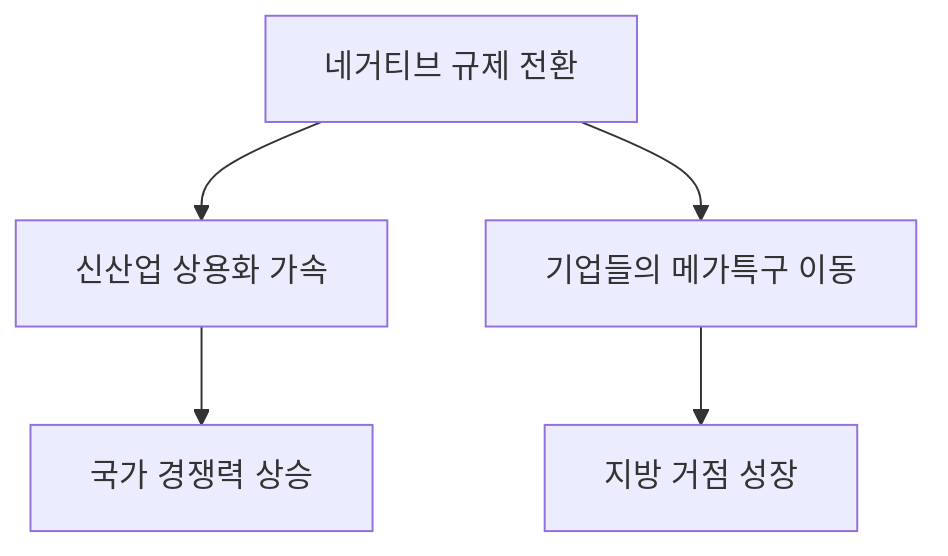

# 산업/규제 분석: 메가특구와 '네거티브 규제' 패러다임 전환
## 투자 신호 + 사회적 영향 평가

---

## 📌 기사 기본 정보

- **날짜**: 2026-04-18
- **출처**: 대한민국 규제혁신 위원회 발표
- **카테고리**: 경제 > 산업정책 > 규제개혁
- **핵심 주제**: 이재명 정부의 '규제합리화위원회'를 통한 메가특구 조성 및 '네거티브 규제(법에 금지된 것 아니면 모두 허용)' 시스템 전면 도입 분석

**메타데이터**
- 주요 주체: 이재명 정부, 규제합리화위원회, 메가지역특구(Mega-Region)
- 핵심 원칙: 네거티브 규제 시스템, 포괄적 일괄 규제 면제
- 타겟 섹터: 신에너지, 바이오테크, AI 모빌리티, 뉴스페이스(New Space)
- 핵심 변수: 수도권 역차별 논란 및 지방 거점 도시의 인프라 준비도

---

## 🔍 기사를 통한 투자 신호 추출

### 1단계: 핵심 사건 분해

**What (무엇이 일어났는가?)**
- 정부가 기존의 '열거식(Positive) 규제'에서 벗어나, 안보·공서양속 저해 행위 외에는 모든 산업 활동을 자유롭게 허용하는 '네거티브 규제'를 특정 거점 특구에 전면 도입하기로 함.

**When (언제 일어났는가?)**
- 2026-04-18 (지방 선거를 앞두고 지역 성장 동력을 확보하기 위한 입법 추진기)

**Why (왜 일어났는가?)**
- 글로벌 기술 전쟁 속에서 규제 장벽 때문에 신산업 진입이 늦어지는 '골든타임 실기'를 방지하기 위함
- 인력과 자본이 수도권으로만 쏠리는 현상을 '규제 프리(Free)'라는 강력한 인센티브로 해결하려는 의지

**Who (누가 주도하는가?)**
- 대통령 직속 규제합리화위원회 위원장 및 관련 부처 장관
- 규제에 막혀 있던 스타트업 및 글로벌 기업 유치를 희망하는 지자체장

---

### 2단계: 투자 신호 해석

#### A. **긍정적 신호 (Bullish)**

**① '파괴적 혁신' 기업들의 무대 확장**
- **신호**: 네거티브 규제 도입으로 인한 법적 불확실성 제거
- **의미**: 기존 법이 없어 사업을 못 하던 원격 의료, 드론 택시, 핀테크 등 신기술의 실전 배치가 가속화됨
- **투자 기회**: 국내외 규제 샌드박스에서 검증을 마친 후 대규모 상용화를 앞둔 혁신 기술 기업

**② 특구 내 부동산 및 기반 시설 가치 급등**
- **신호**: 메가특구 후보지(새만금, 가덕도, 나주 등) 지정 가시화
- **의미**: 기업들이 규제 혜택을 찾아 이동하며 대규모 공장 및 연구소 건설 수요 발생
- **투자 기회**: 특구 지정 예정지 인근 토목/건설 및 지역 기반 산업체

---

#### B. **위험 신호 (Bearish)**

**① '정치적 포퓰리즘'에 따른 실효성 의문**
- **신호**: 선거용 '이름만 특구' 남발 가능성
- **의미**: 예산 뒷받침 없이 규제만 완화한다고 해서 인재와 인프라가 없는 곳에 기업이 가지는 않음
- **투자 리스크**: 구체적 펀딩 계획 없이 발표만 된 지역 테마주

**② 제도 도입 과정에서의 이해관계 침해 분쟁**
- **신호**: 기존 기득권 산업(전문직군 등)과의 충돌
- **의미**: 타다 사례처럼 신산업 허용이 기존 산업의 강력한 저항에 부딪힐 경우 정책이 후퇴할 리스크 상존

---

### 3단계: 섹터별 투자 기회 매트릭스

#### ✅ **높은 기대도 + 낮은 리스크**

**에너지 전환 및 탄소 포집(CCUS) 인프라**
- 정부의 넷제로 정책과 맞물려 규제 특례가 가장 먼저 적용될 영역임
- **투자 추천도**: ⭐⭐⭐⭐⭐

---

## 💰 구체적 투자 신호 변환

### 신호 1: '안 되는 것 빼고 다 된다'는 혁신 가속

**투자 해석**: 네거티브 규제는 기업 입장에서 가장 큰 비용인 '예측 불가능한 규제 시차'를 제거해 줌. 이는 국내 스타트업의 유니콘 등극 가능성을 높이며, 해외 벤처 자산의 국내 유입을 촉진하는 마중물이 될 것임.

---

## 🌍 사회적 영향 평가

### A. 긍정적 사회 영향
- **일자리 지형의 변화**: 전통적 화이트칼라가 아닌, '지역 기반 기술 전문가' 중심의 고용 시장 형성
- **국가 혁신 체력 강화**: 규제 장벽을 넘는 연습을 통해 글로벌 표준 경쟁에서 우위 점함

### B. 부정적 사회 영향
- **안전 및 윤리 가이드라인 상실 우려**: 규제가 느슨해진 틈을 타 발생할 수 있는 환경오염이나 개인정보 침해 사고 리스크
- **기득권 산업의 몰락**: 혁신을 수용하지 못한 기존 소상공인 및 전문직들의 사회적 소외 가중

---

## 🎯 결론: 당신의 투자 전략 수립

- **즉시 실행**: 규제합리화위원회가 선정한 '네거티브 규제 100대 과제' 리스트를 입수하여 수혜 기업 매칭
- **3개월 후**: 지방선거 결과에 따라 해당 특구 프로젝트의 연기/지형 변경 가능성 점검

---

## 📝 Obsidian 연결 구조

