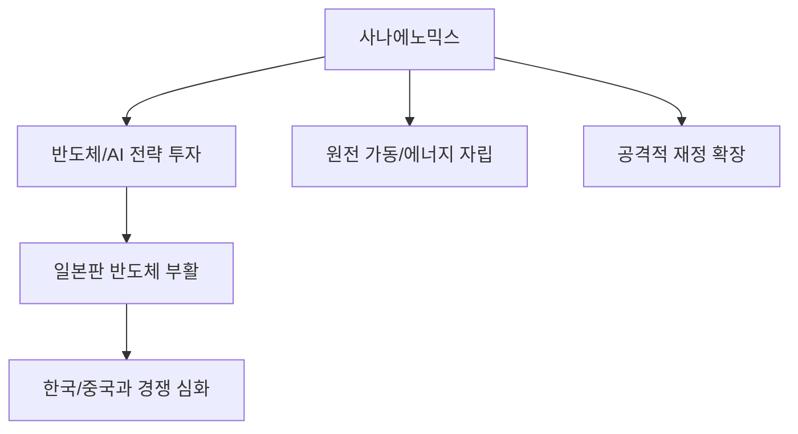

# 글로벌/지정학 분석: 사나에노믹스와 일본 경제의 선순환 과제
## 투자 신호 + 사회적 영향 평가

---

## 📌 기사 기본 정보

- **날짜**: 2026-04-19
- **출처**: 아시아 경제 전략 리포트
- **카테고리**: 경제 > 국제금융 > 일본지정학
- **핵심 주제**: 아베노믹스 설계자가 분석한 차기 총리 후보 다카이치 사나에의 '사나에노믹스(Sanae-nomics)'와 일본 경제의 자조적 부활 전략 분석

**메타데이터**
- 주요 인물: 다카이치 사나에(차기 총리 후보), 아베 신조(전 총리, 정신적 지주)
- 핵심 정책: '전략적 재정 투자', '에너지 자주권(원전 가동)', '공급망 강인화'
- 주요 주체: 자민당, 일본은행(BOJ), 일본 경단련, 도쿄 증권거래소
- 핵심 변수: 일본 금리 인상 속도, 엔화 약세의 임계점, 반도체 연합(Rapidus) 성공 여부

---

## 🔍 기사를 통한 투자 신호 추출

### 1단계: 핵심 사건 분해

**What (무엇이 일어났는가?)**
- 일본의 유력 차기 주자인 다카이치 사나에가 '강한 일본'을 기치로 아베노믹스를 계승·발전시킨 초강력 부양책 '사나에노믹스'를 발표. 국가 안보와 경제를 하나로 묶는 '통합 안보 경제' 추구.

**When (언제 일어났는가?)**
- 2026-04-19 (일본 증시가 사상 최고치를 경신한 후 저점을 다지는 글로벌 조정기)

**Why (왜 일어났는가?)**
- 엔저 기반의 수출 증가만으로는 한계에 도달했다는 판단 하에, 첨단 기술(반도체, 에너지) 자립을 통한 '실물 경제의 질적 도약' 필요성 절감
- 중국의 위협에 대응하기 위한 안정적인 공급망 구축 가속화

**Who (누가 주도하는가?)**
- 자민당 내 보수 강경파 및 국방/경제 안보 라인
- '버블 붕괴의 기억'에서 탈피하려는 일본의 젊은 투자층

---

### 2단계: 투자 신호 해석

#### A. **긍정적 신호 (Bullish)**

**① 일본판 반도체 부활(Rapidus)에 대한 전폭적 지원**
- **신호**: 사나에노믹스의 핵심인 '전략적 기술 투자'
- **의미**: 국가 예산을 쏟아부어 첨단 공정을 일본 내에 다시 세우려는 하이테크 민족주의 강화
- **투자 기회**: 라피더스(Rapidus) 연합 참여 기업 및 일본 내 소부장(소재·부품·장비) 세계 1위 기업들

**② 에너지 비용 하락을 통한 제조업 경쟁력 회복**
- **신호**: 원전 재가동 승인 가속화 선언
- **의미**: 저렴하고 안정적인 전력 공급으로 일본 제조업의 부활 기반 마련
- **투자 기회**: 원전 설비 및 유지 보수 관련 일본 기업, 일본 내 전력 다소비 제조업

---

#### B. **위험 신호 (Bearish)**

**① '엔저의 역습'에 따른 수입 물가 폭등 위험**
- **신호**: 초완화적 통화 정책의 연장 시사
- **의미**: 엔화 약세가 장기화될 경우 수입 에너지 및 식료품 가격 폭등으로 인한 내수 소비 위축
- **투자 리스크**: 일본 내수 시장 의존도가 높은 유통/식품 기업

**② 재정 건전성 악화로 인한 채권 시장 혼란**
- **신호**: "국가 부채보다 투자가 우선"이라는 강경 발언
- **의미**: 일본 국채에 대한 신뢰 하락 및 금리 급등 리스크 상존
- **투자 리스크**: 일본 국채 비중이 높은 글로벌 자산 배분 펀드

---

### 3단계: 섹터별 투자 기회 매트릭스

#### ✅ **높은 기대도 + 낮은 리스크**

**글로벌 경쟁력을 갖춘 일본 정밀 기계 및 로봇 섹터**
- 엔저 혜택과 정부의 기술 투자 지원을 동시에 받는 최상위 섹터임
- **투자 추천도**: ⭐⭐⭐⭐⭐

---

## 💰 구체적 투자 신호 변환

### 신호 1: '안보'가 '수익'을 결정하는 시장

**투자 해석**: 사나에노믹스는 단순한 경기 부양이 아님. 인접국(중국, 한국)과의 경쟁에서 이기기 위해 '에너지'와 '기술'을 국가가 직접 통제하는 쪽으로 이동하고 있음. 일본 투자 시 '안보 전략'과 맞닿아 있는 산업을 선택해야 함.

---

## 🌍 사회적 영향 평가

### A. 긍정적 사회 영향
- **일본 국민의 자신감 회복**: '잃어버린 30년'을 끝내고 다시 성장하는 국가로 변화하며 사회 전반의 활력 증대
- **기술 주권 강화**: 외부 충격에 흔들리지 않는 자립 경제 체제 구축

### B. 부정적 사회 영향
- **주변국과의 갈등 증폭**: 일본의 강경한 '자국 중심' 정책이 한국, 중국 등 인접국과의 무역 마찰 및 역사 갈등으로 번질 위험
- **세대 간 격차 심화**: 주식 시장 호황의 혜택을 누리는 자산가 대 고물가에 시달리는 서민층 사이의 괴리 확대

---

## 🎯 결론: 당신의 투자 전략 수립

- **즉시 실행**: 일본 증시(니케이 225) 내 첨단 부품·소재 기업 비중 상향 조정 (반도체 부활 수혜주)
- **3개월 후**: 다카이치 사나에의 지지율 및 일본은행(BOJ)의 금리 정책 선회 시점 면밀히 관찰

---

## 📝 Obsidian 연결 구조

