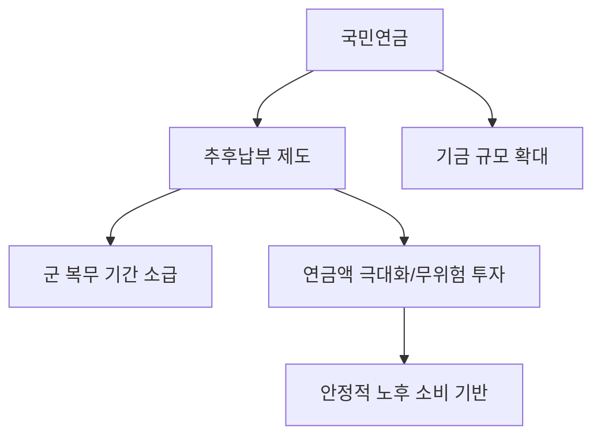

# 복지/재구성 분석: 연금보험료 '추후납부(추납)' 매직과 군 복무 추납 전략
## 투자 신호 + 사회적 영향 평가

---

## 📌 기사 기본 정보

- **날짜**: 2026-04-19
- **출처**: 국민연금 전략 리포트 (복지 설계 특집)
- **카테고리**: 경제 > 생활경제 > 연금복지
- **핵심 주제**: 국민연금 가입 기간을 늘려 연금액을 극대화하는 '추후납부(추납)' 제도의 실익과 최근 강화된 군 복무 추납 전략 분석

**메타데이터**
- 주요 제도: 국민연금 추후납부(추납, 7년-84개월 한도)
- 핵심 대상: 경력 단절 여성, 군 필수 복무자, 실직 기간이 있었던 가입자
- 주요 주체: 국민연금공단(NPS), 가입자 개인, 복지 예산 당국
- 핵심 변수: 연금 고갈 논란에 따른 제도 변경 가능성, 추납 시 소득 대체율 적용 기준

---

## 🔍 기사를 통한 투자 신호 추출

### 1단계: 핵심 사건 분해

**What (무엇이 일어났는가?)**
- 국민연금 수령액을 높이기 위한 가장 강력한 도구인 '추납' 제도의 효율성이 재조명됨. 특히 과거에 군 복무를 한 남성들이 당시 내지 않았던 보험료를 한꺼번에 내서 가입 기간을 2년 가까이 늘리는 전략이 확산 중.

**When (언제 일어났는가?)**
- 2026-04-19 (연금 개혁안 논의가 활발해지며 '한 달이라도 빨리 가입하는 게 이득'이라는 인식이 퍼진 시점)

**Why (왜 일어났는가?)**
- 국민연금 수익률이 시중 예적금이나 웬만한 투자 수익률보다 월등히 높기 때문(수익비 1.5~2.5배)
- 가입 기간 1년이 늘어날 때마다 평생 받는 연금액이 약 5%씩 복리로 늘어나는 효과

**Who (누가 주도하는가?)**
- 은퇴를 앞둔 50대 초반 직장인 (가장 수익률이 높은 시점)
- 스마트한 복지 설계를 지향하는 MZ세대 (군 복무 기간 소급 적용 관심)

---

### 2단계: 투자 신호 해석

#### A. **긍정적 신호 (Bullish)**

**① '연금의 가치' 재발견에 따른 금융 시장의 이동**
- **신호**: 추납 건수 및 금액의 폭발적 증가
- **의미**: 불확실한 주식 투자보다 국가가 보장하는 연금 자산에 대한 신뢰 및 자금 유입 강화
- **투자 기회**: 국민연금 기금 운용 규모가 커짐에 따라 국민연금이 주로 매수하는 '국내 대형 우량주' 및 '지배구조 우수주'

**② 연금 전문가 및 상담 마켓의 팽창**
- **신호**: 추납 알고리즘 등 정교한 계산 서비스 수요 증대
- **의미**: 개인화된 복지 컨설팅 시장이 하나의 고부가 가치 산업으로 정착
- **투자 기회**: 웰테크(Wealth-tech) 업체, 대형 보험사의 연금 전환 센터

---

#### B. **위험 신호 (Bearish)**

**① 제도 축소 리스크 (Hurry Up!)**
- **신호**: 추납 기간 한도 축소(10년 → 7년) 및 소급 적용 제한 논의 시작
- **의미**: '공짜 점심'을 누리려는 가입자가 너무 많아 기금 고갈 속도가 빨라지면 정부가 혜택을 줄일 가능성
- **투자 리스크**: 제도 변경 전 막차를 타지 못한 예비 은퇴자들의 노후 재무 설계 차질

**② 저소득층의 '추납 양극화'**
- **신호**: 목돈이 있는 사람만 혜택을 보는 구조
- **의미**: 정보와 자본이 있는 일부 계층만 연금액을 높이는 '연금 불평등' 심화에 따른 사회적 반발

---

### 3단계: 섹터별 투자 기회 매트릭스

#### ✅ **높은 기대도 + 낮은 리스크**

**국민연금 선호 가치주 및 고배당 섹터**
- 국민연금이 든든한 투자자로 참여하는 기업들은 연금 기금 유입의 직접적 수혜를 받음
- **투자 추천도**: ⭐⭐⭐⭐⭐

---

## 💰 구체적 투자 신호 변환

### 신호 1: '돈이 되는 복지'를 선점하라

**투자 해석**: 주식 10% 수익보다 연금 가입 기간 2년 늘리는 것이 생애 소득 측면에서 훨씬 유리함. 기사는 '군 복무 추납'이 현시점 가장 수익비가 좋은 투자처임을 시사함. 이는 가계의 잉여 자본이 증권 시장보다 연금 공단으로 먼저 흘러갈 것임을 뜻함.

---

## 🌍 사회적 영향 평가

### A. 긍정적 사회 영향
- **노후 빈곤의 질서 있는 해결**: 국민 개개인이 자발적으로 보험료를 추가 납부하여 스스로 노후 소득을 강화함으로써 복지 사각지대 해소
- **국가 기금 건전성 기여**: 단기적으로는 기금 유입액이 늘어나 연금 운용의 유동성 확보에 도움

### B. 부정적 사회 영향
- **군 미필자 및 여성과의 형평성 논란**: 군 복무 추납이 '남성에 대한 특혜'로 인식될 경우 성별 갈등의 새로운 도화선이 될 위험
- **정보 격차에 따른 불평등**: 제도를 모르는 사람은 평생 손해를 보는 '정보 소외' 문제 발생

---

## 🎯 결론: 당신의 투자 전략 수립

- **즉시 실행**: 본인 및 가족의 '국민연금 가입 내역' 조회 후 누락 기여 기간(군 복무, 실직 등) 확인 및 추납 견적 산출
- **3개월 후**: 연금 개혁안 입법 속도를 체크하여 추납 조건이 악화되기 전 실행 여부 최종 결정

---

## 📝 Obsidian 연결 구조

