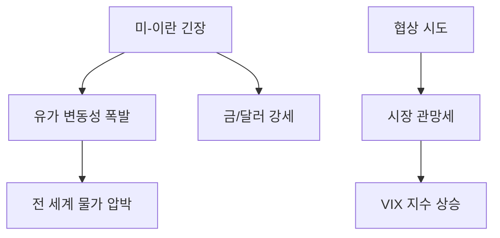

# 글로벌/지정학 분석: 지정학적 불씨와 시장의 불확실성 (미-이란 협상)
## 투자 신호 + 사회적 영향 평가

---

## 📌 기사 기본 정보

- **날짜**: 2026-04-21
- **출처**: 국제 지정학 및 원자재 시장 리서치
- **카테고리**: 경제 > 국제금융 > 지정학적리스크
- **핵심 주제**: 미국과 이란의 협상 불확실성에 따른 글로벌 금융 시장 및 원유 시장의 변동성 확대와 걸프전의 역사적 교훈 분석

**메타데이터**
- 주요 사건: 미-이란 핵협상 재개 및 호르무즈 해협 긴장
- 역사적 참조: 1990년 걸프전 이후의 유가 변화와 시장 반응
- 핵심 지표: WTI(서부 텍사스산 원유) 가격, 금값(Gold), 변동성 지수(VIX)
- 주요 주체: 美 백악관, 이란 혁명수비대, OPEC+, 바이든 정부 외교팀

---

## 🔍 기사를 통한 투자 신호 추출

### 1단계: 핵심 사건 분해

**What (무엇이 일어났는가?)**
- 미-이란 간의 물밑 협상이 진행 중이나, 돌발적인 국지적 충돌이 겹치며 시장은 '협상 타결에 따른 유가 하락'과 '충돌에 따른 유가 폭등' 사이에서 극심한 혼선을 겪는 중.

**When (언제 일어났는가?)**
- 2026-04-21 (전쟁의 공포가 시장 가격에 완전히 선반영되었으나, 실제 타격 여부는 불투명한 임계점)

**Why (왜 일어났는가?)**
- 양국 모두 국내 정치적 이유(선거 등)로 강성 발언을 쏟아내면서도, 고유가로 인한 경제 파탄을 피하려는 실리적 동기를 동시에 가짐
- 호르무즈 해협이라는 전 세계 에너지 동맥을 둘러싼 지정학적 도박

**Who (누가 주도하는가?)**
- 협상의 키를 쥔 미국의 실무 외교 그룹
- 유가 상승을 통해 이득을 보는 산유국 연합(OPEC+)

---

### 2단계: 투자 신호 해석

#### A. **긍정적 신호 (Bullish)**

**① 협상 타결 시 '소비재 및 항공/운수' 섹터의 급반등**
- **신호**: 미-이란 극적 합의 또는 긴장 완화 징후
- **의미**: 유가 수송비 부담 경감 및 글로벌 교역량 회복
- **투자 기회**: 항공사, 해운주, 저전력 가전 업체

**② 안전자산(금, 달러)의 하방 안정화**
- **신호**: 전쟁 리스크 감소
- **의미**: 시장의 공포 지수가 낮아지며 위험 자산(주식)으로 자금이 다시 유입되는 초기 신호

---

#### B. **위험 신호 (Bearish)**

**① '걸프전의 교훈': 끝날 때까지 끝난 게 아니다**
- **신호**: 기사 내 '과거 사례' 언급
- **의미**: 과거에도 실제 평화 협상 직전에 기습적 충돌이 일어났을 때 시장은 최악의 패닉에 빠졌음
- **투자 리스크**: 레버리지를 활용한 상방 베팅 주식

**② '장기 고유가' 국면의 고착화**
- **신호**: 협상 결렬 및 추가 제재
- **의미**: 에너지 비용 100달러 시대가 고착될 경우 전 세계 제조업의 마진율 급감
- **투자 리스크**: 에너지 다소비형 제조업 (화학, 철강, 시멘트)

---

### 3단계: 섹터별 투자 기회 매트릭스

#### ✅ **높은 기대도 + 낮은 리스크**

**방산 및 사이버 보안 섹터**
- 지정학적 긴장이 고조되든 완화되든, '방어'의 필요성은 상시 강화되는 추세임
- **투자 추천도**: ⭐⭐⭐⭐

---

## 💰 구체적 투자 신호 변환

### 신호 1: '뉴스'에 팔고 '침묵'에 사라

**투자 해석**: 기사에서 협상 불확실성이 강조될 때는 시장이 이미 가격을 낮춰 놓은 상태임. 만약 협상이 파행을 겪는다는 속보가 나오면 오히려 그 시점이 '단기 저점'일 가능성이 높음(Buy on Rumor, Sell on News의 변형). 불확실성이 극에 달했을 때 변동성을 활용한 포지션 구축 필요.

---

## 🌍 사회적 영향 평가

### A. 긍정적 사회 영향
- **에너지 전환 가속화**: 지정학적 리스크가 화석 연료의 한계를 보여줌으로써 재생에너지 및 에너지 자립에 대한 사회적 합의 가속화

### B. 부정적 사회 영향
- **글로벌 인플레이션의 전이**: 고유가가 물가 상승을 촉발하여 저소득층의 실질 소득 감소 및 사회적 갈등 유발
- **지정학적 피로도 누적**: 지속적인 전쟁 공포로 인한 글로벌 시민들의 심리적 불안 및 세계화의 퇴보

---

## 🎯 결론: 당신의 투자 전략 수립

- **즉시 실행**: 원유 상장지수펀드(ETF) 차익 실현 및 에너지 비용 상승에 강한 '방어적 배당주'로 포트폴리오 일부 이동
- **3개월 후**: 미-이란 협상의 최종 시한(Deadline) 통과 후 시장의 새로운 균형가 확인

---

## 📝 Obsidian 연결 구조

