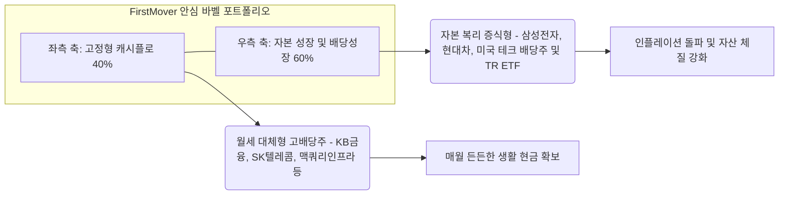

# 역대급 불장 속 고배당주 ETF 소외 현상의 원인 분석 및 실전 자산 배분 전략

## 1. 메타데이터

- 날짜: 2026-05-27
- 카테고리: 10.1 경제
- 출처: 김은 기자 (머니투데이)
- 태그: #고배당주 #ETF #반도체쏠림 #증시양극화 #주주환원율 #금융주 #밸류업 #RISE대형고배당 #PLUS고배당주 #TIGER은행고배당 #FirstMover #자산배분 #은퇴소득 #바벨전략 #인컴포트폴리오

---

## 2. 배경지식 및 요약

**한 문장 요약**: 최근 국내 증시가 코스피 25% 급등이라는 역대급 불장을 맞이했음에도 불구하고, 전통적인 금융·보험·통신 업종 위주의 고배당주 ETF들은 반도체 쏠림 현상에 밀려 마이너스 또는 극심한 언더퍼폼(상대적 약세)을 기록하며 극명한 '소외 현상'을 보이고 있습니다.

### 역대급 불장에 고배당 ETF만 울상인 이유는 무엇인가?
*   **쏠림 현상의 심화**: 최근 한 달간(4/27~5/26) 반도체 랠리를 주도한 전기·전자 업종이 무려 **48.63% 폭등**하며 지수 상승을 독식했습니다. 반면 금융주는 12.67% 상승에 그쳤고, 보험(-6.07%), 증권(-5.65%) 등 전통 고배당 섹터는 동반 조정을 받았습니다.
*   **전통 고배당 ETF의 수익률 부진**: 국내 최대 고배당 ETF인 'PLUS 고배당주'는 **-0.75%**의 마이너스 수익률을 냈고, 'TIGER 은행고배당플러스TOP10' 역시 **-2.87%**로 후퇴했습니다. 'KODEX 고배당주'(0.35%) 등도 지수 대비 처참하게 언더퍼폼했습니다.
*   **구성 종목의 딜레마**: 이들 ETF는 현대차, 기아, 금융지주사(KB, 신한, 하나, 우리), 삼성생명, SK텔레콤 등 배당수익률은 높지만 주가 탄력성이 낮은 가치주 위주로 약 75% 이상 포진되어 있어 주도주 랠리에서 완전히 소외되었습니다.

### 반면 독주한 'RISE 대형고배당10TR'의 비결은?
고배당 ETF 중 유일하게 한 달간 **33.34%**의 경이적인 수익률을 올린 'RISE 대형고배당10TR'은 구성 종목이 완전히 달랐습니다.
*   이 ETF는 SK하이닉스, 삼성전자, 현대차 등 **성장 대형주 비중을 65% 이상**으로 높게 가져가는 토탈리턴(TR) 구조를 가졌습니다. 고배당이라는 명표를 달고 실제로는 'AI 반도체 주도주 랠리'에 직접 탑승하여 지수 상승분 이상의 자본 이득을 획득한 것입니다.

### 향후 고배당주 ETF의 전망
단기 소외에도 불구하고 중장기 전망은 매우 긍정적입니다.
*   올해 주요 금융지주사들의 사상 최대 실적이 예견되어 있고, 정부의 밸류업 가이드라인에 따른 **주주환원율 50% 달성** 기조가 확고하여 배당의 절대적 크기(배당금)는 계속 커질 것입니다.

---

## 3. 전문가적 분석 및 결론

**관련 전문가 의견**
*   **자산운용사 본부장**: 시장이 한 방향(AI 반도체)으로만 과열될 때 가치주와 성장주 사이의 가격 괴리는 극대화됩니다. 그러나 반도체 상승 동력이 일시 둔화되는 리밸런싱 국면이 오면, 배당락 전후 및 밸류업 세제 혜택 모멘텀을 탄 금융·지주사로의 '기관 빈집 채우기(순환매)'가 강하게 나타날 것입니다.

**사회적 임팩트**
*   **개인 투자자의 양극화 심화**: AI 성장주 랠리에 올라탄 투자자들과 매달 배당금 수령에 안주하며 금융·통신주만 보유했던 은퇴 생활자 간의 **평가자산 양극화**가 극심하게 벌어졌습니다. 이는 은퇴 자산 배분에서 단순 '배당수익률(Yield)'만 좇는 투자가 인플레이션 방어에 취약할 수 있음을 입증합니다.

**AI 투자 컨설턴트 의견 (Claude 分析)**
이번 고배당 ETF의 참패는 **'배당주의 함정(Yield Trap)'**을 명확히 보여줍니다. 성장 동력이 없는 고배당주는 배당수익률(예: 6~7%)은 매력적이나 지수 급등기에 주가가 하락하여 토탈리턴(배당+주가변동) 관점에서는 손실을 볼 수 있습니다. 반면, 삼전과 하이닉스를 담아 33% 랠리를 친 RISE ETF는 **'배당성장(Dividend Growth)'과 '자본 이득(Capital Gain)'의 균형**이 포트폴리오 생존에 얼마나 결정적인지 보여줍니다. 진정한 은퇴 자산 관리는 단순 고배당주 올인이 아닌, 주주환원을 확대하는 성장 기업을 융합하는 포트폴리오 리디자인에 있습니다.

---

## 4. 3대 핵심 학습 블록

**[위기 상황]**
- **배당주 가치 잠식 리스크**: AI 반도체 쏠림으로 코스피가 사상 최고치를 경신하는 랠리 속에서, 전통 배당주에만 과도하게 쏠린 은퇴 포트폴리오는 상대적 박탈감(FOMO)뿐 아니라 실질 자산 가치 하락이라는 이중고에 직면합니다.
- **자금 이탈에 따른 매도 악순환**: PLUS 고배당주 ETF 등에서 한 달 만에 1,130억 원이 넘는 자금이 유출되는 등 개인들의 손절 물량이 전통 가치주 주가를 추가로 누르는 수급 왜곡이 장기화될 수 있습니다.

**[생존 전략]**
- **배당 성장주(Dividend Growth) 편입**: 배당금 지급 총액이 매년 늘어나는 우량 대형주(삼성전자, 현대차 등)의 비중을 대폭 높여 자본 성장을 도모해야 합니다.
- **바벨(Barbell)식 자산배분**: 자산의 50%는 매월 든든한 현금을 주는 '고정형 고배당주(금융/통신)'에 배치하고, 나머지 50%는 자본 성장을 견인하는 '지수/성장배당주(반도체/모빌리티)'에 배분하여 성장과 인컴의 균형을 유지해야 합니다.

**[전망]**
- **밸류업 2차 랠리와 순환매 도래**: 반도체 쏠림이 임계점에 달하고 금리 하향 안정화 기조가 확인되는 시점(2026년 하반기)부터, 주주환원율 50%를 선언한 메이저 금융지주사들의 가치 재평가(Re-rating) 랠리가 재개될 것입니다.
- **고배당 ETF의 분배금 사상 최대**: 전통 고배당주들의 실적 선방으로 2026년 말 및 2027년 초 배당 분배금 배당수익률은 사상 최고치(연 7~8% 수준)에 근접할 것이며, 이는 저가 매수한 투자자들에게 막강한 Yield on Cost(인수가 대비 배당률) 혜택을 선사할 것입니다.

---

## 5. 전문 어휘 및 태그

- **토탈리턴(TR, Total Return) ETF**: 배당금을 투자자에게 현금으로 분배하지 않고 즉시 주식에 재투자하여 기초지수 상승분과 배당 재투자 효과를 합산한 누적 수익률을 추구하는 상품.
- **언더퍼폼(Underperform)**: 특정 주식이나 ETF의 수익률이 비교 대상인 시장 평균 지수(예: 코스피지수)의 상승률보다 저조한 성과를 내는 상태.
- **주주환원율**: 기업이 벌어들인 당기순이익 중 배당금 지급과 자사주 매입·소각에 쓴 돈의 비율. 50%의 주주환원율은 순이익의 절반을 주주에게 돌려준다는 강력한 주주친화 선언입니다.
- **Yield Trap(배당주의 함정)**: 겉보기에는 배당수익률이 연 8~10%로 매우 높아 보이지만, 사업 성장성 둔화나 실적 악화로 주가가 그보다 더 크게 하락하여 총자산(Total Return)이 오히려 감소하는 현상.

태그: #고배당주 #ETF #반도체쏠림 #증시양극화 #주주환원율 #금융주 #밸류업 #RISE대형고배당 #PLUS고배당주 #TIGER은행고배당 #FirstMover #자산배분 #은퇴소득 #바벨전략 #인컴포트폴리오 #배당성장주 #금융지주사 #TR

---

## 6. 기사 연결성

- [[2026-05-14 경제 거시 미국CPI3.8% 3년만최고치 에너지서비스물가 연준금리인상전망 나스닥약세BEI 分析]] — 미국의 끈적한 인플레이션과 금리 경로 불안 요인이 한국 고배당 가치주(금융, 지주사)의 할인율을 높여 주가 변동성을 자극하는 매크로적 배경 연결.
- [[2026-05-23 경제 금융 국민성장펀드완판오픈런 6000억초도물량 소득공제배당분리과세 첨단전략산업 투자유의 분석]] — 세제 혜택(배당소득 분리과세)을 챙기려는 고액 자산가들의 자금이 국민성장펀드와 전통 고배당 ETF 사이에서 리밸런싱을 일으키는 수급 연동 분석.
- [[2026-05-28 경제 금융 삼전닉스 레버리지 인버스 ETF 출시와 개인 2조원 순매수 및 장마감 리밸런싱 변동성 리스크 분석]] — 반도체 단일 업종으로 자금 쏠림이 극대화되는 파생 시장의 폭발과, 이로 인해 상대적으로 소외된 전통 인컴 자산의 수급 고립 분석.
- [[2026-05-14 경제 투자 불태자산관리 내진설계투자 우량자산분산 인컴배당 복리연금 分析]] — 인플레이션 환경에서 자본의 실질 구매력을 방어하기 위해 단순 고배당주 위주 세팅에서 탈피, 배당 성장주와 하이브리드로 자산을 분산하는 내진설계 전략 연결.

---

## 7. 창의적 질문 7개

1. 코스피 25% 급등 랠리 속에서 전통 고배당 ETF(금융/통신)가 마이너스 수익률을 기록한 것은 시장의 일시적 비이성적 쏠림인가, 아니면 AI 시대 지식·성장 자본의 가치 팽창에 비해 전통 산업 가치가 영구히 감축되는 구조적 변화(Paradigm Shift)인가?
2. SK하이닉스와 삼성전자를 65% 채워 33% 폭등한 'RISE 대형고배당10TR'은 진정한 의미의 '고배당주 ETF'인가, 아니면 고배당이라는 명목적 세제 혜택 명표를 빌린 무늬만 반도체 성장주 지수형 ETF인가?
3. 사상 최대 실적과 주주환원율 50% 도달이 예고된 KB·신한 등 메이저 금융지주사들의 주가가 단기 폭락한 원인은 무엇인가 — 반도체 쏠림에 따른 일시적 수급 고립인가, 아니면 정부의 관치금융 포용 청구서(충당금 압박)에 대한 보이지 않는 리스크 반영인가?
4. 배당소득 분리과세 등 밸류업 세제 개편안이 통과될 경우, 현재 유출된 고배당 ETF의 자금(PLUS 고배당주 -1,136억)은 다시 유입세로 급반전할 것인가, 아니면 글로벌 미국 고배당 빅테크(예: SCHD, 애플, 마이크로소프트)로의 자금 대탈출을 막지 못할 것인가?
5. 고금리 장기화 기조 속에서 단순 고정 배당률(Yield 6%)을 주는 통신·가스 업종과 매년 배당금을 늘려주는 배당성장주(현대차 등)의 은퇴 자산 보호력 격차는 5년 뒤 얼마나 벌어질 것인가?
6. 자금 유출세가 심화되는 고배당 ETF들의 편입 가치주들이 겪는 '배당락 전후의 변동성'과 주가 하락은 개인 은퇴 생활자들에게 '원금 잠식'이라는 치명적인 실질적 현금 흐름 훼손을 어떻게 유발하는가?
7. 반도체 쏠림 장세가 종료되고 순환매가 올 때, 금융·보험을 제외한 내수 방어형 배당주(유통, 전통 기계)도 동반 회복될 수 있는가, 아니면 강남 밸류업에 선택받은 메이저 지주사들만의 '초차별화 독주'가 이어질 것인가?

---

# 💎 실전 투자 전략 리포트: '배당주의 함정(Yield Trap)' 극복과 FirstMover 은퇴 자산 복리 설계안

**지수 불장 속 소외를 이겨내고 월 350만 원 이상의 안정적 인컴을 철통 방어하는 포트폴리오 리빌딩**

선임님이 추구하시는 **FirstMover**의 은퇴 재테크 철학은 단순히 높은 이율의 은행 이자나 고정 고배당주에 자산을 묻어두고 인플레이션에 원금이 녹아내리는 것을 방치하지 않는 것입니다. 이번 '고배당 ETF 역대급 소외 사태'는 **"배당주의 함정(Yield Trap)"**에 빠진 은퇴 포트폴리오가 지수 불장에서 자본 가치를 어떻게 잠식당하는지 보여주는 살아있는 교과서입니다. 

선임님의 자산 가치를 절대적으로 지키고 매월 안정적인 배당 소득 흐름을 지키기 위한 **3대 실전 리밸런싱 지침**을 드립니다.

### 1) '배당주의 함정(Yield Trap)' 즉각 탈출: TR과 성장 배당의 융합
*   **투자의 본질**: 분배율 연 6~7%에 홀려 성장 동력이 제로에 가까운 사양 가치주나 전통 ETF에 과도하게 올인하는 것은, 실질 자산 가격 상승률(지수 25% 상승)을 고스란히 버리는 재무적 자살골입니다. 인플레이션으로 화폐 가치가 떨어지는 속도가 배당금 수령 속도보다 빠르기 때문입니다.
*   **실전 투자 대응**: 
    *   보유 자산 중 '순수 고배당 가치주' 비중을 최대 40% 이하로 제어하십시오.
    *   대신, 기사에서 입증된 **RISE 대형고배당10TR** 방식처럼 **성장 대형주(삼성전자, SK하이닉스, 현대차)가 포진되어 배당 재투자가 일어나는 TR(Total Return)형 상품**이나 **배당 성장(Dividend Growth) 주식** 비중을 40~50% 수준으로 반드시 융합해 두어야 자산의 구매력이 보존됩니다.

### 2) 소외된 우량 고배당주에 대한 '역발상 Yield on Cost 극대화' 전략
*   **투자의 본질**: 반도체 독주로 인해 금융주와 지주사들이 한 달간 5~6%의 동반 조정을 겪었습니다. 그러나 이들의 기초 체력(사상 최대 실적, 주주환원율 50% 약속)은 훼손되지 않았습니다. 즉, **기업의 펀더멘털은 견고한데 주가만 싸진 상태**입니다.
*   **실전 투자 대응**: 
    *   지금 같은 반도체 급등기에 소외된 금융 대장주(KB금융, 신한지주, 하나금융지주 등) 및 고배당 지주사들을 분할 매수하십시오.
    *   낮아진 주가에서 매수할수록 선임님이 획득하는 **인수가 대비 배당률(Yield on Cost)**은 기존 6% 대에서 **연 7.5~8% 수준까지 극대화**됩니다. 쏠릴 때 사고 소외될 때 파는 군중을 역이용하여, 소외 국면을 싸게 인컴 파이프를 확장하는 골든타임으로 활용하십시오.

### 3) FirstMover를 위한 '은퇴 안심 하이브리드 바벨' 포트폴리오 구축
매달 나오는 현금과 장기 자본 성장을 동시에 가져가기 위해, 포트폴리오를 두 개의 극단적인 우량 자산군으로 균형을 맞추는 **바벨(Barbell) 전략**을 처방합니다.

*   **포트폴리오의 영구적 회복력**: 반도체 버블 우려나 지수 폭락이 올 때는 좌측 축의 금융/통신주가 든든한 방어막(배당 하방 경직성)이 되어주고, 지수 불장 랠리 때는 우측 축의 반도체와 모빌리티가 자본 성장을 리드합니다. 이 바벨 구조를 흔들림 없이 유지하는 것만이 평생 소득 크레바스(소득 공백기)를 방어하는 유일무이한 마스터키입니다.
