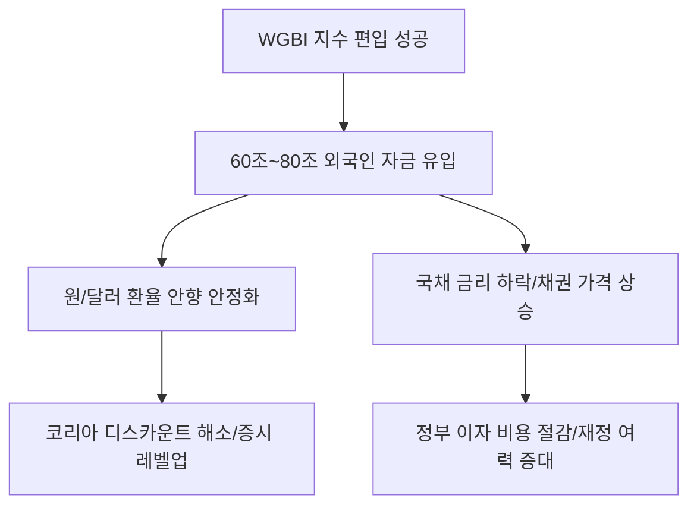

# 거시경제 분석: WGBI(세계국채지수) 편입과 외환시장 안정화 시나리오
## 투자 신호 + 사회적 영향 평가

---

## 📌 기사 기본 정보

- **날짜**: 2026-04-11
- **출처**: 대한민국 거시경제 및 외환 리서치
- **카테고리**: 경제 > 거시 > 외환/채권
- **핵심 주제**: 한국 국채의 WGBI(FTSE 세계국채지수) 편입 성공에 따른 수십조 원 단위의 외국인 자금 유입 전망과 이로 인한 원/달러 환율 안정 및 국정 신인도 상승 효과 분석

**메타데이터**
- 주요 사건: FTSE Russell의 한국 국채 WGBI 편입 확정 공표
- 예상 유입 자금: 약 60조~80조 원 (추정치)
- 핵심 지표: 한국 국채(KTB) 금리, 원/달러 환율 변동성, CDS 프리미엄
- 주요 주체: 기획재정부, 한국은행, 글로벌 연기금 및 인덱스 펀드
- 키워드: WGBI 편입, 외환시장 안정(FX Stability), 자본 유입, 코리아 디스카운트 해소

---

## 🔍 기사를 통한 투자 신호 추출

### 1단계: 핵심 사건 분해

**What (무엇이 일어났는가?)**
- 오랜 숙원이었던 '세계 3대 채권지수' 중 하나인 WGBI에 한국 국채가 정식 편입됨. 이는 한국 자본 시장의 투명성과 안정성이 글로벌 표준에 도달했음을 세계적으로 공인받은 사건.

**When (언제 일어났는가?)**
- 2026-04-11 (수년간의 제도 개선-외국인 투자자 등록제 폐지, 외환시장 개방 시간 연장 등-의 결실을 본 시점)

**Why (왜 일어났는가?)**
- 글로벌 패시브 자금(지수를 추종하는 자금)은 지수 편입 비중에 따라 기계적으로 한국 국채를 매수해야 하기 때문
- 한국 국채의 수익률과 안정성이 미 국채 대비 매력적인 포트폴리오 다변화 수단으로 인정받음

**Who (누가 주도하는가?)**
- 정부 경제팀 (기재부 장관 및 외환 정책 라인)
- 런던/뉴욕의 대형 자산운용사 및 연기금 매니저

---

### 2단계: 투자 신호 해석

#### A. **긍정적 신호 (Bullish)**

**① 원화 가치의 하방 경직성 확보 (환율 안정)**
- **신호**: 수십조 원의 달러 자금이 원화 채권을 사기 위해 유입
- **의미**: 경상수지 흑자 외에 거대한 '자본수지' 공급원이 생김으로써 환율 발작 리스크 감소
- **투자 기회**: 수입 원재료 비중이 높은 기업 (항공, 유틸리티, 음식물 사료 기업), 내수 소비주

**② 국채 금리 하락 (채권 가격 상승) 및 조달 비용 감소**
- **신호**: 글로벌 매수세 유입으로 인한 채권 수익률 하락
- **의미**: 정부 및 기업의 이자 부담 경감 → 설비 투자(CAPEX) 여력 증대
- **투자 기회**: 부채 비율이 높으나 성장성이 확실한 인프라/제조업체, 장기 채권 ETF

---

#### B. **위험 신호 (Bearish)**

**① 외환 시장 개방에 따른 변동성 통제력 약화**
- **신호**: 야간 외환 시장 운영 및 해외 기관 참여 확대
- **의미**: 글로벌 이벤트 발생 시 과거보다 더 빠르게 외국인 자금이 빠져나갈 수 있는 통로가 넓어짐
- **투자 리스크**: 환율 변동에만 기대어 수익을 내던 투기적 파생 상품

**② '뉴스에 팔아라(Sell the News)' 단기 조정 리스크**
- **신호**: 편입 발표 직후의 일시적 매물 출회
- **의미**: 기대감이 선반영된 상태에서 실제 유입까지 시차가 발생할 경우 단기적 주가/채권 가격 조정
- **투자 리스크**: 발표 당일 추격 매수한 레버리지 투자자

---

### 3단계: 섹터별 투자 기회 매트릭스

#### ✅ **높은 기대도 + 낮은 리스크**

**금융지주 및 대형 증권사 (기관 수탁 서비스)**
- 외국인 자금 유입 시 환전, 수탁, 중개 수수료 수익이 안정적으로 발생하는 구조적 수혜주임
- **투자 추천도**: ⭐⭐⭐⭐⭐

---

## 💰 구체적 투자 신호 변환

### 신호 1: '코리아 디스카운트' 탈출의 실질적 교두보

**투자 해석**: 기사의 WGBI 편입은 한국 시장이 '이머징'에서 '선진'으로 넘어가는 관문임. 이는 한국 기업들의 가치 평가 모델(Valuation) 자체가 한 단계 격상되어야 함을 뜻함. 환율이 안정되면 외국인 주식 투자자들도 환차손 걱정 없이 장기 투자에 임할 수 있으므로, 코스피 지수의 장기적 레벨업(Level-up) 신호로 읽어야 함.

---

## 🌍 사회적 영향 평가

### A. 긍정적 사회 영향
- **국가 재정 건전성 확보**: 국채 발행 금리가 낮아지며 국민 세금으로 지불해야 할 이자 비용 절감 및 복지 재원 여력 증대
- **글로벌 금융 선진화**: 국제적 기준에 맞는 투명한 금융 인프라 구축으로 국내 시장의 신뢰도 향상

### B. 부정적 사회 영향
- **자본 시장의 해외 의존도 심화**: 글로벌 금융 위기 시 해외 투자자들의 의사결정에 따라 국내 경제가 더 크게 출렁일 수 있는 취약성 노출
- **부익부 빈익빈 시장**: 대형 우량 자산으로만 자금이 쏠리며 중소기업 채권 시장과의 양극화 심화 우려

---

## 🎯 결론: 당신의 투자 전략 수립

- **즉시 실행**: 포트폴리오 내 '환율 민감도가 높은 부채 기업'의 비중 상향 조정 및 선진국 수준의 안정성에 베팅
- **3개월 후**: 실제 인덱스 펀드들의 자금 유입 속도를 데이터로 확인하며 추가 매수 여부 결정

---

## 📝 Obsidian 연결 구조

