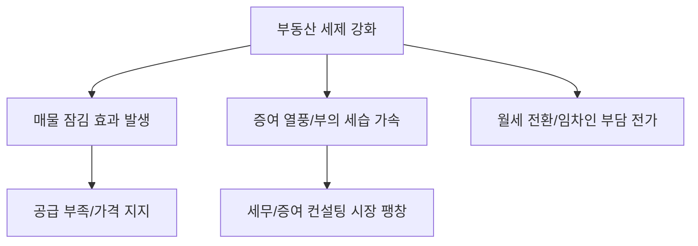

# 부동산/세무 분석: 숫자는 거짓말을 하지 않는다 - 대한민국 부동산 세제의 허와 실
## 투자 신호 + 사회적 영향 평가

---

## 📌 기사 기본 정보

- **날짜**: 2026-04-11
- **출처**: 부동산 정책 및 세무 통계 진단 리포트
- **카테고리**: 경제 > 부동산 > 세무정책
- **핵심 주제**: 복잡해진 대한민국 부동산 세제(종부세, 양도세, 취득세)의 실효성에 대한 통계적 검증과 실제 시장 가격에 미치는 영향 및 자산가들의 세금 회피/절세 경로 분석

**메타데이터**
- 주요 지표: 부동산 세수 비중(GDP 대비), 다주택자 보유 비중 변화, 증여 건수 추이
- 핵심 쟁점: 징벌적 과세의 실효성(가격 하락 유도 성공 여부), 공급 억제 효과
- 주요 주체: 국세청, 기획재정부, 다주택자 자산가, '영끌' 1주택자
- 키워드: 세금의 자본화(Capitalization), 잠김 효과(Lock-in Effect), 증여 비중 확대, 조세 정의

---

## 🔍 기사를 통한 투자 신호 추출

### 1단계: 핵심 사건 분해

**What (무엇이 일어났는가?)**
- 부동산 가격 폭등을 막기 위해 도입된 강력한 보유세와 양도세가 오히려 매물 잠김을 유발하여 가격을 떠받치거나, 자산을 자녀에게 물려주는 '증여 열풍'으로 이어짐. 숫자로 본 세제 정책의 실제 결과는 '시장 안정'보다는 '부의 세습 강화'로 나타남.

**When (언제 일어났는가?)**
- 2026-04-11 (수년간의 고강도 규제 세제와 최근의 완화 기조가 충돌하며 시장 참여자들이 세금 계산기를 가장 바쁘게 두드리는 시점)

**Why (왜 일어났는가?)**
- 세금보다 높은 자산 상승 기대감
- 퇴로(양도세)가 막힌 상태에서 보유세 부담을 자녀와 나누는(증여) 전략 선택

**Who (누가 주도하는가?)**
- 세무 전문가(노무/회계법인)와 결합된 자산가 계층
- 세제 개편을 통해 공급을 늘리려는 정부 정책팀

---

### 2단계: 투자 신호 해석

#### A. **긍정적 신호 (Bullish)**

**① '절세 솔루션' 및 '가족 법인 관리' 시장의 성장**
- **신호**: 부동산 세제가 복잡할수록 전문적 자산 관리 수요 급증
- **의미**: 개인이 감당하기 힘든 세무 처리를 대행해 주는 서비스와 자산 이동(증여/신탁) 인프라의 가치 상승
- **투자 기회**: 세무 자동화 플랫폼, 상속/증여 특화 금융 상품 보유 은행

**② 희소성 있는 '핵심지 1주택'의 가치 강화**
- **신호**: 똘똘한 한 채에 대한 세제 우대 지속
- **의미**: 다주택 리스크를 피하기 위해 지방 자산을 처분하고 강남/서초 등 핵심지로 자금을 몰빵하는 '자산의 집중화' 심화
- **투자 기회**: 핵심지 거점 부동산 리츠, 프리미엄 주거 단독 개발 시행사

---

#### B. **위험 신호 (Bearish)**

**① '잠김 효과'에 따른 거래 절벽 및 중개업계 고사**
- **신호**: 양도세 부담으로 팔지 못하는 집들
- **의미**: 시장에 매물이 나오지 않아 거래량이 급감하며 공인중개, 등기 대행, 가구/인테리어 후방 산업의 동반 침체
- **투자 리스크**: 가구/가전 등 이사 관련 내수 섹터, 부동산 플랫폼 기업

**② '조세 저항'에 따른 정치적 불확실성 증대**
- **신호**: 공시가격 현실화 및 종부세 논란
- **의미**: 선거철마다 바뀌는 세제 정책으로 인해 시장의 예측 가능성 붕괴 및 장기 투자 계획 수립 불가
- **투자 리스크**: 정책 변화에 민감한 건설주 및 금융주

---

### 3단계: 섹터별 투자 기회 매트릭스

#### ✅ **높은 기대도 + 낮은 리스크**

**세무 데이터베이스 및 AI 절세 알고리즘 기업**
- 세법은 매년 바뀌지만 '세금을 덜 내고 싶다'는 욕구는 영원하며, 복잡할수록 기술의 가치가 올라감
- **투자 추천도**: ⭐⭐⭐⭐⭐

---

## 💰 구체적 투자 신호 변환

### 신호 1: '세금'을 이기는 '자산'만 남는다

**투자 해석**: 기사는 결국 세제가 시장을 이기지 못하고 변종(증여)을 낳았음을 숫자로 증명함. 투자자는 정부의 세제 규제를 보며 '가격 하락'을 기대하기보다, 세금을 낼 체력이 있는 '우량 자산'이 어디로 흐르는가를 봐야 함. 자본은 결국 세금이 가장 적은 길(현행 제도 내 1주택 혜택 지역)로 흐를 것임.

---

## 🌍 사회적 영향 평가

### A. 긍정적 사회 영향
- **자산 형성의 투명화**: 증여와 자산 이동 과정에서 법적 절차 준수 및 증여세 납부를 통해 불투명한 자금 흐름 양성화 효과
- **부동산 투기 수요 억제**: 취득세 중과 등으로 인한 단기 투기성 거래의 획기적 감소

### B. 부정적 사회 영향
- **부의 대물림 고착화**: 세금을 회피한 내지는 적극적으로 방어한 증여를 통해 계층 이동 사다리가 더 공고해지는 부작용
- **세입자에게로의 조세 전가**: 보유세 인상분이 월세 인상으로 이어지며 저소득층의 주거비 부담 가중 (Indirect Taxation)

---

## 🎯 결론: 당신의 투자 전략 수립

- **즉시 실행**: 본인 소유 자산의 '수익률 대비 세금 비중'을 재산정하고, 증여 등 장기적 가산 전수 로드맵 수립
- **3개월 후**: 정부의 '세제 개편안' 발표(종부세 폐지 논의 등) 시점에 따른 매물 출회 가능성 및 시장 가격 변동 모니터링

---

## 📝 Obsidian 연결 구조

