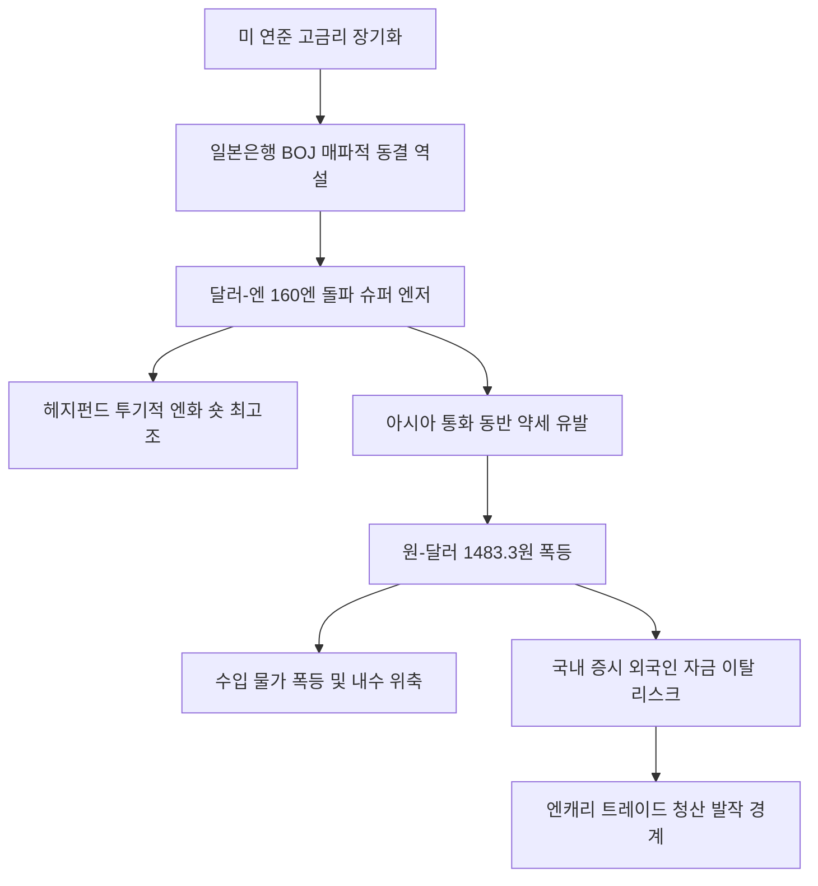

# 외환/금융 분석: 160엔 돌파 슈퍼 엔저와 아시아 통화 동반 약세 및 원화 압박 현상
## 투자 신호 + 사회적 영향 평가

---

## 📌 기사 기본 정보

- **날짜**: 2026-05-01
- **출처**: 염지현 기자
- **카테고리**: 경제 > 금융 > 외환
- **핵심 주제**: 달러-엔 환율이 심리적 저항선인 160엔을 돌파하며 34년 만의 사상 최저치를 기록한 가운데, 일본은행(BOJ)의 정책적 한계와 아시아 통화의 동반 약세 및 한국 원화(원-달러 1480원대)에 가해지는 유동성 압박 분석

**메타데이터**
- 주요 사건: 달러-엔 160엔 돌파 및 아시아 통화 동반 약세, 원-달러 1483.3원 급등
- 핵심 원인: 일본은행(BOJ)의 매파적 동결 역설(금리 인상 신호 부재), 글로벌 헤지펀드의 투기적 엔화 매도 집중, 미 연준(Fed)의 고금리 장기화
- 주요 주체: 일본은행(BOJ), 글로벌 헤지펀드, 한국 외환당국, 미국 연방준비제도(Fed)
- 키워드: 슈퍼 엔저, 환율방어, 캐리트레이드 청산, 원화 약세, 아시아 통화 위기

---

## 🔍 기사를 통한 투자 신호 추출

### 1단계: 핵심 사건 분해

**What (무엇이 일어났는가?)**
- 엔화 가치가 달러당 160엔 선을 돌파하며 34년 만의 역사적 엔저를 기록했습니다. 이는 일본 외환당국의 개입 의지를 비웃듯 글로벌 헤지펀드들이 투기적 순매도 포지션을 2024년 7월 이후 최대치로 늘린 결과입니다. 이로 인해 원-달러 환율이 1483.3원까지 치솟는 등 아시아 주요 통화가 동반 약세를 보이는 연쇄 반응이 발생했습니다.

**When (언제 일어났는가?)**
- 2026-05-01 (일본은행의 통화정책 회의 후 미온적 기조가 지속되며 외환 시장의 비명이 임계점에 도달한 시점)

**Why (왜 일어났는가?)**
- 미국과 일본 간의 극심한 금리 차이가 장기화되고 있습니다.
- 일본은행(BOJ)은 막대한 정부 부채와 실물 경기 위축 우려로 인해 기준금리를 공격적으로 인상하지 못하는 트릴레마에 빠져 실질적인 매파적 조치를 취하지 못했습니다.
- 일본 외환당국의 직접적인 달러 매도 개입 여력에 대해 글로벌 시장이 의구심을 품고 적극적인 엔화 숏 포지션을 취했기 때문입니다.

**Who (누가 주도하는가?)**
- 엔화 약세에 공격적으로 베팅하는 글로벌 매크로 헤지펀드들
- 금리 차이에 한계를 수용하며 소극적 구두 개입과 단기 조절에 그치는 일본 외환당국 및 BOJ

---

### 2단계: 투자 신호 해석

#### A. **긍정적 신호 (Bullish)**

**① 달러화(USD) 및 기축통화 자산의 독주 체제 강화**
- **신호**: 엔화와 원화를 포함한 아시아 통화의 동반 폭락 현상
- **의미**: 글로벌 지정학적 위기 및 고금리 장기화 국면에서 미국 달러화가 유일무이한 최후의 피난처 역할을 수행함
- **투자 기회**: 미국 단기 국채 ETF(T-Bill), 미국 달러 현금성 자산 비중 확대

**② 대형 수출 기업의 환차익 극대화**
- **신호**: 원-달러 환율의 1480원대 고공행진 지속
- **의미**: 반도체 등 달러 결제 비중이 높고 해외 매출 비중이 80% 이상인 대형 수출 대기업의 원화 환산 실적이 극대화됨
- **투자 기회**: 글로벌 경쟁력을 갖춘 IT/반도체 대형주([[삼성전자]], [[SK하이닉스]])

---

#### B. **위험 신호 (Bearish)**

**① 일본 엔화 기반 캐리트레이드 청산(Yen-Carry Unwind) 공포**
- **신호**: 투기적 엔화 숏 포지션의 사상 최대치 근접과 일본 당국의 실탄 개입 가능성
- **의미**: 엔화 약세가 임계점을 지나 당국의 개입으로 급격히 반등할 경우, 전 세계에 풀려 있던 엔화 차입 자금이 강제 청산되며 글로벌 자산 시장의 발작을 촉발할 수 있음
- **투자 리스크**: 고레버리지 신흥국 주식 및 신흥국 채권 포트폴리오 전체

**② 수입 원자재 및 에너지 의존 중소기업의 마진 스프레드 붕괴**
- **신호**: 원화 약세에 따른 수입 물가 가중 및 내수 경기 위축
- **의미**: 고환율로 인해 수입 가스, 원유 및 주요 중간재 비용이 폭등하며 수출 경쟁력이 약하고 원가 전가능력이 없는 내수 중소기업의 도산 위험이 급증함
- **투자 리스크**: 내수 음식료, 중소 제조업, 수입 원자재 비중이 높은 화학/소재 섹터

---

### 3단계: 섹터별 투자 기회 매트릭스

#### ✅ **높은 기대도 + 낮은 리스크**

**미국 달러화(USD) 및 실물 금(Gold)**
- 글로벌 긴축 연장과 아시아 통화 붕괴 우려 속에서 가치 보존력이 가장 확실한 자산입니다. 특히 엔화의 안전자산 지위가 소멸되면서 대체 안전자산으로의 자금 쏠림이 가속화됩니다.
- **투자 추천도**: ⭐⭐⭐⭐⭐

---

## 💰 구체적 투자 신호 변환

### 신호 1: '과거의 엔저=수출호재' 공식의 폐기와 통화 다변화 전략

**투자 해석**: 기사는 달러-엔 160엔 돌파가 아시아 통화 가치를 동반 훼손하며 한국 원화에 강력한 하방 압력을 가하고 있음을 경고합니다. 이제는 엔저를 단순한 한국 수출 기업의 호재로 해석하는 구시대적 관점을 폐기해야 합니다. 엔화 약세는 한국의 수입 물가 폭등과 자본 유출 우려를 자극하는 시스템 리스크의 서막입니다. 따라서 투자자는 단기적인 엔화 반등을 노린 엔화 매수(환투자)를 극도로 지양하고, 대신 강력한 달러 자산과 실물 금으로 포트폴리오를 대피시켜야 합니다. 또한, 향후 일본 당국의 개입에 따른 엔캐리 트레이드 청산 발작(Yen-Carry Unwind) 발생 시 신흥국 증시에서 외국인 자금이 일시에 이탈할 수 있으므로 5월 한 달간은 주식 비중을 낮추고 현금(달러) 비중을 40% 이상으로 유지하는 방어적 전략이 유효합니다.

---

## 🌍 사회적 영향 평가

### A. 긍정적 사회 영향
- **달러화 자산 유입을 통한 개인 금융 방어**: 글로벌 자산 배분에 대한 일반 대중의 인식이 개선되며 달러 자산 투자를 통한 개인 차원의 부의 수호 효과 발생
- **국가 차원의 제도적 방어 필요성 대두**: 원화 가치 수호를 위해 세계국채지수([[WGBI 세계국채지수 편입]]) 가입 등 거시적 금융 제도 개편에 대한 사회적 공감대 확산

### B. 부정적 사회 영향
- **수입 인플레이션 장기화에 따른 서민 경제 타격**: 고환율이 에너지 및 생필품 가격 인상을 촉발하여 저소득층과 서민들의 실질 구매력이 급감하고 소득 양극화가 심화됨
- **한·일 여행 및 교육 유학 업계의 직격탄**: 엔화 가치 급락에도 불구하고 달러 기반의 글로벌 물가가 폭등하며 해외 유학, 연수 및 항공 관련 산업의 내수 소비가 급격히 위축됨

---

## 🎯 결론: 당신의 투자 전략 수립

- **즉시 실행**: 원화 표시 자산 중 일부를 미국 달러(USD)화 MMF 및 원-달러 환노출형 초단기 국채 ETF로 전환하여 통화 헤징을 완료함
- **3개월 후**: 미 연준의 금리 기조 변화 및 일본은행의 실질 금리 인상 여부를 확인한 후, 엔캐리 트레이드 청산 리스크가 진정되는 시점에 글로벌 테크 대형주의 저가 매수 분할 진입 고려

---

## 📝 Obsidian 연결 구조

