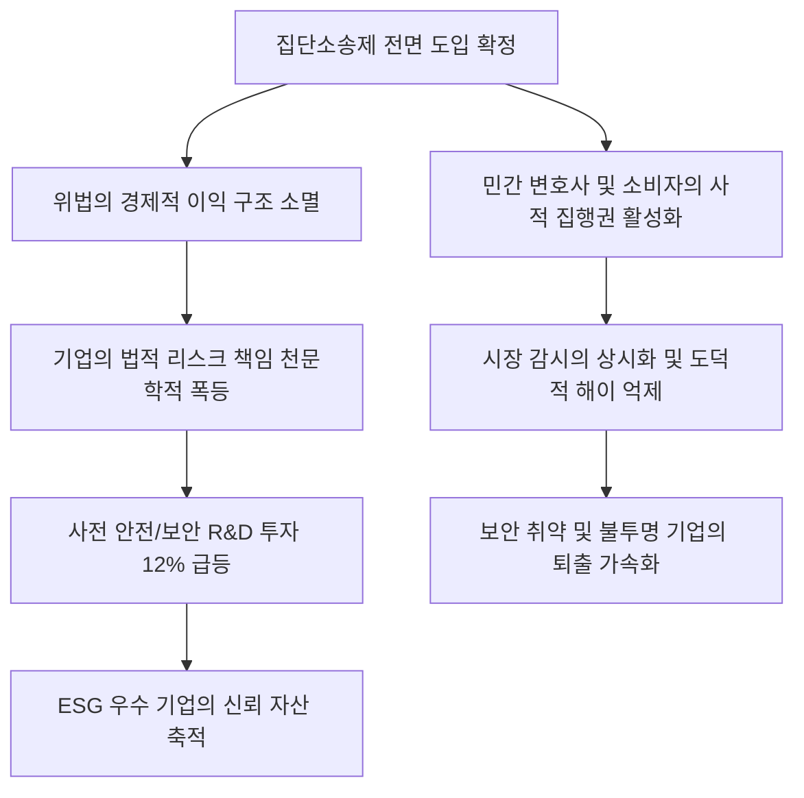

# 법률/제도 분석: 집단소송제 전면 도입과 시장 인센티브 구조 재편 및 준법 기업 경쟁 우위 현상
## 투자 신호 + 사회적 영향 평가

---

## 📌 기사 기본 정보

- **날짜**: 2026-05-01
- **출처**: 심재훈 (법무법인 혜명 외국 변호사·KAIST 겸직 교수)
- **카테고리**: 경제 > 법률 > 시장질서
- **핵심 주제**: 가습기 살균제 사태 등 반복되던 대규모 소비자 피해에도 불구하고 위법의 경제적 이익이 소송 비용보다 더 컸던 기형적 모순을 혁파할 '집단소송제'의 전면 도입과 이를 통한 기업 컴플라이언스(Compliance) 및 시장 질서의 근본적 체질 개선 분석

**메타데이터**
- 주요 사건: 대한민국 내 집단소송제의 전면 도입 현실화
- 핵심 원인: '위법의 경제적 이득'을 차단하는 징벌적 비용 설계, 정부 규제의 한계를 보완하는 사적 집행자(Private Enforcer) 육성
- 주요 주체: 대한민국 사법부, 대기업 컴플라이언스 본부, 소비자 권익 보호 단체, 법조계(로펌)
- 키워드: 집단소송제, 징벌적 배상, 컴플라이언스, 사적 집행자, ESG 지배구조

---

## 🔍 기사를 통한 투자 신호 추출

### 1단계: 핵심 사건 분해

**What (무엇이 일어났는가?)**
- 대한민국 시장에 집단소송제가 전면적으로 도입되었습니다. 단 한 명 또는 소수의 피해자가 소송을 제기해 승소하더라도 판결의 효력이 동일한 피해를 입은 모든 구성원에게 자동으로 확대 적용되는 혁신적 시스템입니다. 이는 기업의 법적 책임 비용을 천문학적으로 증가시켜 법 준수를 합리적인 경영적 생존 공식으로 의무화시킵니다.

**When (언제 일어났는가?)**
- 2026-05-01 (반복되는 개인정보 유출 및 대형 인재 사태를 방지하기 위해 법 개정이 최종 관문을 넘어선 시점)

**Why (왜 일어났는가?)**
- 기존의 법체계 아래서는 대규모 소비자 피해가 발생해도 개별 소송의 난이도와 비용으로 인해 기업이 적정 선의 합의나 솜방망이 처벌로 끝내는 편이 이익인 구조적 모순이 지속되었습니다.
- 정부와 규제 당국(공정거래위원회 등)의 한정된 자원과 감시 인력만으로는 초고속으로 다변화하는 디지털·플랫폼 시장의 위법 행위를 완전 통제하기 불가능하다는 구조적 한계를 절감했기 때문입니다.

**Who (누가 주도하는가?)**
- 정부 규제를 넘어서 능동적으로 법적 발언권을 확대하는 소비자와 민간 법률 대리인(사적 집행자)
- 법 개정을 완성하고 사법적 필터링 제도를 구축 중인 입법부 및 사법부

---

## 2단계: 투자 신호 해석

### A. **긍정적 신호 (Bullish)**

**① 준법 지원(Compliance) 솔루션 및 보안 산업의 고성장**
- **신호**: 기업들의 위법 리스크 예방 비용(R&D 내 안전 및 보안 투자 비중)의 평균 12% 이상 급등 현상
- **의미**: 소송 비용과 징벌적 배상액이 기하급수적으로 폭등함에 따라, 기업들이 사전에 위법을 방지할 정보 보안 시스템 및 실시간 내부 통제 컴플라이언스 솔루션 도입에 예산을 아끼지 않게 됨
- **투자 기회**: 사이버 보안 전문 기업, 기업용 컴플라이언스 소프트웨어 개발사, ESG 전문 평가·컨설팅사

**② 투명한 거버넌스를 갖춘 고신뢰 우량주(ESG Leader)의 밸류에이션 프리미엄**
- **신호**: 법을 엄격히 준수하는 준법 기업의 리스크 해소와 시장 신뢰 자산 축적
- **의미**: 법을 위반하며 단기 마진을 취하던 부도덕한 경쟁사들이 시장에서 배제되고, 정직하고 투명한 기업들이 장기적인 독점적 우위와 기관 투자자 자금을 독식하게 됨
- **투자 기회**: 업계 최고 수준의 ESG 등급을 장기간 유지해온 대형 제조 및 IT 우량주

---

### B. **위험 신호 (Bearish)**

**① 개인정보 취약 플랫폼 및 원가 절감형 제조 기업의 재무적 사형 선고**
- **신호**: 정보보안 투자가 미비하거나 하도급 원가 후려치기로 생존하던 한계 기업들의 연쇄 피소 리스크
- **의미**: 단 한 건의 시스템 오류나 원가 절감형 부실 관리로도 수천억 원에 달하는 집단소송이 즉시 개시되어 기업의 존폐 자체가 흔들릴 수 있음
- **투자 리스크**: 보안 투자가 미비한 영세 플랫폼 기업, 지배구조가 불투명한 가족 경영형 제조사

**② 소송 대행 과열에 따른 기업 소송 관리 비용 증가**
- **신호**: 민간 기획 소송 및 법률 대리인들의 무차별적 집단소송 제기 가능성
- **의미**: 사법부가 정교한 필터링 제도를 갖추기 전까지는 기획 소송으로 인한 대형 기업들의 법률 대응 수수료 및 사법적 방어 비용이 급등하여 단기 수익성에 지장을 줄 수 있음
- **투자 리스크**: 소송 분쟁 노출도가 높은 유통, 건설 및 화학 섹터 중소형주

---

### 3단계: 섹터별 투자 기회 매트릭스

#### ✅ **높은 기대도 + 낮은 리스크**

**글로벌 정보보안 및 ESG 준법 솔루션 공급사**
- 집단소송제의 전면 도입으로 모든 상장사는 리스크 헤징을 위해 보안 시스템을 무조건 업그레이드해야 합니다. 이는 정책 수혜가 법적으로 강제되는 구조이므로 경기 흐름과 무관하게 강력한 매출 성장이 보장되는 절대 섹터입니다.
- **투자 추천도**: ⭐⭐⭐⭐⭐

---

## 💰 구체적 투자 신호 변환

### 신호 1: ESG 투자 기준의 전면 개편 - 법적 리스크 지수(Legal Risk Index)의 의무화

**투자 해석**: 기사는 집단소송제 도입이 단순한 법 개정이 아니라 기업의 이익 창출 함수 자체를 바꾸는 '인센티브 구조의 대전환'임을 분명히 하고 있습니다. 이제 '준법'은 도덕적 구호가 아니라 주주의 지갑을 지키는 가장 강력한 재무적 수단입니다. 따라서 투자자는 투자 대상 기업을 선정할 때 기존의 재무제표(PER, PBR)뿐만 아니라 해당 기업의 '법적 리스크 지수'와 '보안 인프라 투자 비율'을 최우선 지표로 확인해야 합니다. 만약 보유 중인 종목 중 개인정보 보호 체계가 허술하거나 하도급 분쟁 리스크가 높은 기업이 있다면 즉시 비중을 축소하고, 반대로 강력한 법적 컴플라이언스 시스템을 구축하고 내부 제보자 포상 시스템을 선제 도입한 고신뢰 우량 기업([[삼성전자]] 등)으로 자산을 대피시키는 지배구조 기반의 포트폴리오 리밸런싱을 즉시 단행해야 합니다.

---

## 🌍 사회적 영향 평가

### A. 긍정적 사회 영향
- **시장 자정 능력의 비약적 향상**: 정부 감시의 사각지대에서 민간 피해자들이 '사적 집행자'로 변모해 기업들의 편법 행위를 실시간으로 억제하며 시장 신뢰도를 선진국 수준으로 향상시킴
- **소비자 주권의 실질적 확립**: 대기업 중심의 왜곡된 분쟁 관계에서 일반 국민들의 법적 발언권이 확보되고, 억울한 피해가 정당하게 신속 보상받는 보이지 않는 신뢰 인프라 정착

### B. 부정적 사회 영향
- **기획형 기획 소송 남발로 인한 산업 활력 저하**: 합의금을 노린 법률 브로커와 기획 소송 대행 로펌들의 과도한 공격으로 혁신 벤처/스타트업들이 소송 방어에 에너지를 빼앗겨 경영 위축 우려
- **기업 리스크 관리 비용의 소비자 전가**: 보안 투자 및 소송 방어 예산 폭증분이 제품 및 서비스 가격에 반영되어 최종 소비자의 물가 부담으로 이어질 가능성 존재

---

## 🎯 결론: 당신의 투자 전략 수립

- **즉시 실행**: 보유 주식 중 준법 리스크 및 과거 가혹 행위/개인정보 침해 이력이 있는 중소 플랫폼/제조 기업의 비중을 모두 정리하고, 사이버 보안 및 내부 통제 솔루션 테마 ETF 편입
- **3개월 후**: 사법부의 1호 집단소송 판결례 및 사법 필터링 가이드라인을 모니터링하여 법률 리스크가 해소된 준법 우수 기업에 대한 장기 적립식 매수 개시

---

## 📝 Obsidian 연결 구조

