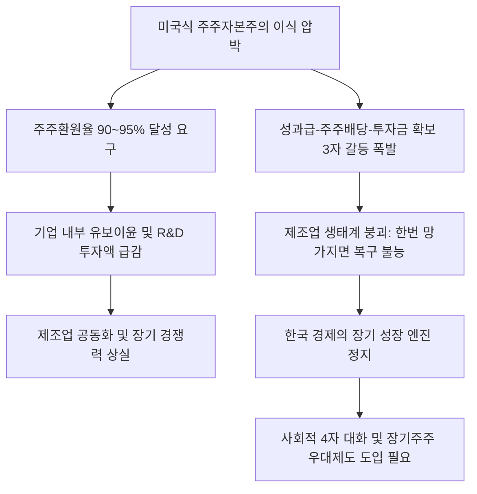

# 산업정책/제조업 분석: 주주자본주의의 함정과 한국 제조업 생존 전략 및 '사회적 대타협' 해법
## 투자 신호 + 사회적 영향 평가

---

## 📌 기사 기본 정보

- **날짜**: 2026-05-01
- **출처**: 중앙일보 (조민근 논설위원, 강정현 기자 / 중앙대 특별강연 현장)
- **카테고리**: 경제 > 산업정책 > 제조업
- **핵심 주제**: AI 반도체 호황으로 삼성전자·SK하이닉스가 사상 최대 이익을 올리는 가운데 발생하는 성과급, 배당, 자사주 매입 압박이 한국 제조업의 장기 투자 동력을 잠식할 수 있다는 장하준 교수의 경고와 주주자본주의 극복을 위한 미래 생존 전략 분석

**메타데이터**
- 주요 사건: 장하준 교수의 한국 제조업 장기 생존을 위한 사회적 대화 처방 발표
- 핵심 원인: 주주 이익 극대화 철학(주주자본주의)이 낳은 미국의 제조업 공동화 선례, 장기 R&D 투자 여력을 훼손하는 단기적 이익 배분 요구 폭발
- 주요 주체: 장하준 런던대 교수, 대기업 경영진(삼성, 현대 등), 행동주의 펀드 및 소액 주주, 규제 당국(정부)
- 키워드: 주주자본주의, 유치산업 보호론, 사다리 걷어차기, 주주환원율, 유보이윤, 사회적 대타협

---

## 🔍 기사를 통한 투자 신호 추출

### 1단계: 핵심 사건 분해

**What (무엇이 일어났는가?)**
- 세계적인 석학 장하준 교수는 특별 강연과 인터뷰를 통해 "기업은 주주의 지갑을 채우기 위한 현금지급기가 아니다"라며 강하게 경고했습니다. AI 반도체 붐으로 대규모 영업이익을 거둔 기업들에 대해 소액주주와 행동주의 펀드, 노동계가 동시에 단기 보상과 환원을 강하게 요구하는 상황을 지적하며, 이 압력이 투자 동력을 갉아먹어 미국식 제조업 붕괴를 초래할 수 있음을 폭로했습니다.

**When (언제 일어났는가?)**
- 2026-05-01 (삼성·하이닉스의 역대급 실적 발표와 상법 개정을 통한 소액주주 권한 강화 논의가 뜨겁게 맞물린 시점)

**Why (왜 일어났는가?)**
- 지난 30년간 미국을 지배해온 '주주 자본주의'가 이익의 90~95%를 자사주 매입과 배당에 쏟아붓게 만들어 농부가 씨앗(투자)을 뿌리지 않는 현상을 유발, 결국 미국의 제조업 비중을 50%에서 16%로 축소시켰기 때문입니다.
- 한국 또한 주택 공급과 복지 제도 미비로 인해 노후 불안을 주식시장의 배당과 자사주 환원이라는 '도깨비 방망이'로 한 번에 해결하려는 정책적 오해와 대중적 열망이 팽배해졌기 때문입니다.

**Who (누가 주도하는가?)**
- 단기적 밸류업과 환율 방어 등 명목 하에 고환율 및 고배당을 동시에 요구하는 금융 자본과 소액 주주단
- 장기 R&D를 수호하기 위해 제도적 제동장치(장기주주 의결권 우대 등)와 사회적 4자 대화를 역설하는 정책 거시학계

---

## 2단계: 투자 신호 해석

### A. **긍정적 신호 (Bullish)**

**① 유보이윤을 지키며 '초격차 R&D'에 올인하는 독립형 기술 독점주**
- **신호**: 주주환원 압력에 휩쓸리지 않고 내부에 현금을 유보하여 차세대 기술(HBM4, 차세대 SMR 등) 개발에 투자하는 기업의 출현
- **의미**: 단기 배당보다 미래의 생태계 파괴력에 투자하는 기업만이 10년 뒤 공급망 재편 국면에서 압도적 생존자가 됨
- **투자 기회**: 주주 압박 속에서도 장기 CapEx(설비투자) 계획을 견고하게 고수하는 한국 대표 테크주([[삼성전자]], [[SK하이닉스]])

**② 다자간 경제 연합 및 공급망 중결합 수혜 섹터**
- **신호**: 미·중 패권 전쟁의 틈새에서 추진되는 '중견국 연대(Middle Power Alliance)' 논의의 진전
- **의미**: 미국의 자국 우선주의와 중국의 자급화 압박 속에서 캐나다, 독일, 한국 등 중견 국가들이 다자 무역 질서를 수호하여 공급망 안정을 확보함
- **투자 기회**: 다국적 공급 다변화 혜택을 입는 방산, 친환경 선박, 정밀 부품 공급사

---

### B. **위험 신호 (Bearish)**

**① 과도한 주주환원으로 성장 동력을 잃어버리는 '배당 좀비' 기업**
- **신호**: 기업의 주주환원율이 유보이윤의 임계점을 넘어 이익의 80% 이상을 배당 및 자사주 소각에 처분하는 구조
- **의미**: 단기 주가는 오를지라도 설비 리뉴얼 및 핵심 인재 영입 자금이 부족해져 경쟁국의 추격을 허용하고 장기 쇠락의 길로 들어섬
- **투자 리스크**: R&D 투자 비중은 감소하면서 주주 환원율만 지속적으로 올리는 한계 성숙 기업 전체

**② '고령자판 유치산업 보호론'의 한계에 부딪힌 미국 제조업 부활 테마**
- **신호**: 미국의 막대한 보조금 지급에도 불구하고 기업들의 실질 자본 투자 지연 현상
- **의미**: 주주자본주의에 중독된 미국 기업들이 보조금을 받아도 자사주 매입에 전용하거나 실질 설비 투자를 기피하여 미국 내 제조업 부활 속도가 예상을 극도로 하회할 수 있음
- **투자 리스크**: 순수 미국 내 공장 건설 수혜만을 노린 단순 미국 인프라 테마주

---

### 3단계: 섹터별 투자 기회 매트릭스

#### ✅ **높은 기대도 + 낮은 리스크**

**초격차 R&D 보유 대형 수출 기업 및 유보 현금이 풍부한 가치주**
- 장하준 교수의 지적대로 제조업 생태계는 한번 붕괴하면 복구할 수 없는 무형의 유산입니다. 단기 배당 압력을 견디며 강력한 '유보이윤'을 통해 기술적 만리장성을 쌓는 기업만이 다가올 중국의 자력 기술 추격 주기에서 파산을 피할 수 있습니다.
- **투자 추천도**: ⭐⭐⭐⭐⭐

---

## 💰 구체적 투자 신호 변환

### 신호 1: '밸류업 환상'에서 탈피한 기술 장기 투자 성향(PBR 혁신) 종목 발굴

**투자 해석**: 기사는 한국 증시의 코리아 디스카운트 해소법으로 무차별 거론되는 '주주환원 확대' 정책의 치명적 독성을 웅변하고 있습니다. 행동주의 펀드가 소액주주의 권익 보호를 명분 삼아 '자사주 매입'과 '특별배당'만을 요구할 때, 이는 기업의 미래 생존줄을 끊는 결과를 가져올 수 있습니다. 따라서 현명한 투자자는 단순히 '주주환원율이 높다'는 이유로 종목을 고르는 쉬운 선택을 거부해야 합니다. 오히려 기업 내부의 '유보이윤 규모'와 '설비투자(CapEx) 성장률'이 안정적으로 우상향하고 있는지를 관찰해야 합니다. 또한, 정치권의 상법 개정이 소액주주 강화로 갈 때, 이를 틈타 기업의 장기 적립금을 훼손하려는 파괴적 압력이 가해지는 기업은 포스포러스(Phosphorus)처럼 녹아내릴 수 있으므로, 지배구조 방어 장치가 견고하고 경영진이 R&D 수호 의지를 명확히 천명한 준법 지배구조 우량 기업을 선별하여 투자 포트폴리오의 중심으로 삼아야 합니다.

---

## 🌍 사회적 영향 평가

### A. 긍정적 사회 영향
- **장기 투자 가치에 대한 범사회적 재평가**: 단기 차익 실현 목적의 투기 문화에서 벗어나, 기업의 본질적 기술 축적과 노동자-지역사회 공동체의 장기 번영을 중시하는 진정한 가치 투자 문화의 확산
- **다자주의 중견국 연대를 통한 경제 외교력 신장**: 미·중 패권에만 종속되던 외교 프레임에서 벗어나 캐나다, EU 등과의 중견국 다자 공급망 연대를 통해 경제적 생존 공간 확보

### B. 부정적 사회 영향
- **내수 불균형 해소 지연 및 노후 불안 지속**: 주식시장 붐으로 노후 안정과 부동산 문제를 해결하려던 정부 정책이 실패하며, 국가 복지 지출 확대를 둘러싼 세대 간·계층 간 사회적 갈등 가중
- **성과급과 배당을 둘러싼 기업 내 노사주 삼자 갈등 격화**: 황금알을 낳는 거위의 배를 가르는 격으로 대기업 내 임직원 성과 분쟁과 소액주주의 이해관계가 극단적으로 충돌하여 장기 파업 리스크 가중

---

## 🎯 결론: 당신의 투자 전략 수립

- **즉시 실행**: 포트폴리오 내에서 단순히 주주환원 찌라시로 급등했으나 대규모 설비 투자가 정체된 기업을 모두 정리하고, 이익의 상당 부분을 독보적인 장기 미래 R&D에 재투자하는 업계 지배적 대형 테크주로 리밸런싱
- **3개월 후**: 미·중 패권 구도 및 중국의 반도체·조선 자급률 추이를 추적하고, 국내 상법 개정 및 주주환원율 상한 제동장치 관련 법제화 입법 동향 확인 후 비중 조절

---

## 📝 Obsidian 연결 구조

