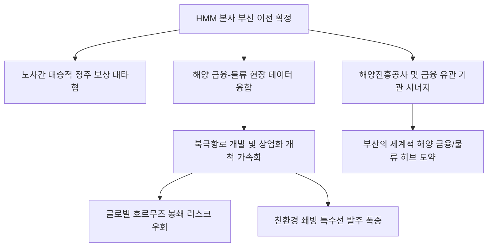

# 해운/물류 분석: HMM 본사 부산 이전 확정과 북극항로 패권 선점 및 해양 물류 혁신 현상
## 투자 신호 + 사회적 영향 평가

---

## 📌 기사 기본 정보

- **날짜**: 2026-05-01
- **출처**: 세종 = 김경희 기자
- **카테고리**: 경제 > 해운 > 산업정책
- **핵심 주제**: 대한민국 최대 원양 국적 해운사인 HMM의 본사 부산 이전 최종 확정과 노사 전격 대타협을 기점으로 한 북극항로 인프라 선제 확보 및 국가 균형 발전 해양 물류 클러스터 가동 분석

**메타데이터**
- 주요 사건: HMM 노사, 본점 소재지의 부산 북항 신사옥 전격 이전 합의
- 핵심 원인: 극단적 수도권 집중에 따른 지방 소멸 리스크 타개, '북극항로 개발'이라는 국가적 미래 성장 대안 및 해양 물류 중심지와의 유기적 현장 경영 통합
- 주요 주체: HMM 경영진 및 노동조합, 국토교통부, 해양수산부, 부산광역시
- 키워드: HMM 부산이전, 북극항로, 부산항 북항, 물류혁명, 해양 금융 클러스터

---

## 🔍 기사를 통한 투자 신호 추출

### 1단계: 핵심 사건 분해

**What (무엇이 일어났는가?)**
- 국내 1위 원양 국적 해운사인 HMM이 본사를 여의도에서 부산항 북항 신사옥으로 이전하기로 노사 간 최종 합의에 서명했습니다. 이로써 5월 중 임시 주주총회를 열어 정관을 변경하고 이전 등기를 마칠 계획입니다. 이는 단순한 사무실 이전을 넘어, 대통령의 핵심 국정과제인 '북극항로 상업화 선점'과 '지방 금융·해운 허브 구축'을 위한 지휘본부 전진 배치라는 거시경제적 의미를 갖습니다.

**When (언제 일어났는가?)**
- 2026-05-01 (지방선거를 눈앞에 둔 시점에서 노조의 파업 우려를 딛고 대승적인 국가 균형 발전 대타협이 완결된 날)

**Why (왜 일어났는가?)**
- 서울의 관료적 오피스 환경에서 벗어나 해양수산 거점인 부산 현장의 생생한 물동량 및 현장 데이터와 지휘부를 직접 물리적으로 결합하기 위함입니다.
- 중동 호르무즈 해협 봉쇄 등 지정학적 위기가 상시화되면서, 기존 항로를 대체할 우회 루트인 '북극항로' 개척의 실행 속도를 높여 국가 해상 물류 주권을 보장하기 위해서입니다.

**Who (누가 주도하는가?)**
- '지방 정주 및 복리 보장'을 조건으로 타협을 도출한 HMM 노사 공동 협의회
- 산업은행, 해양진흥공사 등 HMM의 주요 주주단 및 국가지정 정책 금융 기관들

---

## 2단계: 투자 신호 해석

### A. **긍정적 신호 (Bullish)**

**① 친환경 쇄빙·특수선 건조 조선사 및 해양 기자재 선도 기업의 물량 폭증**
- **신호**: HMM 본사의 부산 이전과 북극항로 개척 인프라 투자 가속화
- **의미**: 아시아와 유럽을 잇는 최단 거리를 돌파하기 위해 북극의 얼음을 깨고 달릴 수 있는 고부가가치 친환경 쇄빙 컨테이너선과 LNG/암모니아 추진선 발주가 본격화됨
- **투자 기회**: 북극항로 특수선 및 친환경 엔진 기술 독점 조선 대형주

**② 부산항 북항 재개발 랜드마크 밸류체인 및 지방 해양 물류 테크 인프라 수혜**
- **신호**: HMM 본사 이전 및 신사옥 건립 추진
- **의미**: 부산 북항 일대가 해양진흥공사, 한국산업은행(이전 추진 중)과 결합하여 세계적인 해양 금융·물류 디지털 혁신 거점으로 부상함
- **투자 기회**: 부산 북항 내 대규모 오피스 빌딩 개발 자산 보유사, 지능형 항만 IoT 물류 관제 소프트웨어 전문 기업

---

### B. **위험 신호 (Bearish)**

**① 단기적인 이전 비용 지출 및 핵심 인적 자원 이탈 우려**
- **신호**: 본사 이전에 따른 생활 거점 변화 및 인력 마찰
- **의미**: 연구원 및 선박 금융, 디지털 전산 관리 직무의 서울 이탈 기피 현상으로 인해 일시적인 전문 인력 누수와 인적 자원 충원 비용이 단기 영업이익에 마이너스 요소로 작용할 수 있음
- **투자 리스크**: HMM의 단기 실적 변동성 및 인적 구조조정 관련 리스크

**② 수도권 여의도/마포 일대 대형 오피스 임대 시장의 공실률 상승 압력**
- **신호**: 대기업 본사 및 유관 협력업체들의 대규모 남하 이동
- **의미**: 대형 해운 대기업과 유관 에이전트들이 도미노식으로 여의도를 떠나면서 해당 지역의 상업용 부동산 시장에 단기 공실 리스크 및 임대료 하락 압력을 가함
- **투자 리스크**: 서울 여의도·영등포 권역 상업용 임대 비중이 높은 리츠(REITs) 상품군

---

### 3단계: 섹터별 투자 기회 매트릭스

#### ✅ **높은 기대도 + 낮은 리스크**

**친환경 선박 항로 최적화 AI 솔루션 기업 및 쇄빙 추진 기술 제조사**
- 북극항로는 기존의 수에즈 운하 경로보다 거리를 30% 이상 단축하지만 극단적 기후 데이터를 실시간 모니터링해야 합니다. 따라서 HMM의 본사 현장 배치와 결합하여 자율운항 및 해상 지정학 연계 루트 분석 AI 소프트웨어를 공급하는 테크 기업은 구조적 성장 가도를 달릴 것입니다.
- **투자 추천도**: ⭐⭐⭐⭐⭐

---

## 💰 구체적 투자 신호 변환

### 신호 1: '지정학적 리스크'를 무력화하는 신공급망(북극항로) 인프라 선점 가치에 주목

**투자 해석**: 기사는 HMM의 부산 본사 이전을 단순한 정치적 선심성이 아닌, 호르무즈 해협 봉쇄 등 지구촌 해로 마비 상황에 대응하기 위한 '북극항로 패권 확보 전략'으로 해석하고 있습니다. 수에즈 운하를 통과하지 못해 해상 운임이 치솟고 수출입 동맥경화가 우려되는 시대에, 한국의 물류 대동맥이 극지방을 뚫고 지나가는 독점적 해상 노선을 확보한다는 것은 국가 안보적 엄청난 프리미엄입니다. 따라서 투자자는 단기적인 이전 비용 증가로 주가가 눌리는 시점을 오히려 'HMM' 및 관련 친환경 선박 수주 대형 조선사의 저가 분할 매수 타이밍으로 인식해야 합니다. 특히, 북극 해빙 속도가 빨라짐에 따라 상업화가 조기 달성될 경우 HMM이 누릴 독점적 통행 마진과 연관 해양 금융 클러스터의 시너지는 코리아 디스카운트의 실제적 해소 모델이 될 것이므로, 장기적 시각으로 포트폴리오 내 친환경 조선 및 항만 디지털화 섹터의 편입 비중을 점진적으로 높여나가야 합니다.

---

## 🌍 사회적 영향 평가

### A. 긍정적 사회 영향
- **실질적 국토 균형 발전의 물꼬**: 대형 국적 기업의 남하를 통해 양질의 고급 청년 일자리가 부산에 공급되며, 지방 소멸을 방지하는 상징적 티핑 포인트 제공
- **지방 정주 여건의 획기적 개선**: 핵심 해운 인프라 유입이 [[지역의사제]] 등 지방 정주 복지 정책과 맞물려 의료·교육·일자리가 하나로 통합되는 지속 가능한 지방 거점 생태계 완성

### B. 부정적 사회 영향
- **일시적인 주거 이전에 따른 가족 이산과 주거 마찰**: 여의도에서 부산으로 갑작스럽게 삶의 터전을 옮겨야 하는 직원 자녀들의 교육 문제 및 가구 이전 분쟁 발생
- **정치적 지방선거 표심 연계 논란**: 대형 국책 사업의 입지 확정이 선거철 정치 논리와 연계되어 정권 교체 시 관련 북극항로 투자 예산의 지속 가능성을 둘러싼 불필요한 국론 분열 유발

---

## 🎯 결론: 당신의 투자 전략 수립

- **즉시 실행**: 단기적 이전 비용 우려로 관련주(HMM) 주가 조정 시, 중장기적 북극항로 및 친환경 선박 패러다임 수혜를 겨냥해 분할 매수 개시
- **3개월 후**: 5월 주총 정관 변경 완결 여부 및 임직원 부산 안착률을 모니터링하고, 북극항로 상용화를 위한 러시아·EU 다자간 외교 협의와 특수선 건조 수주 동향을 점검하여 비중 확대

---

## 📝 Obsidian 연결 구조

