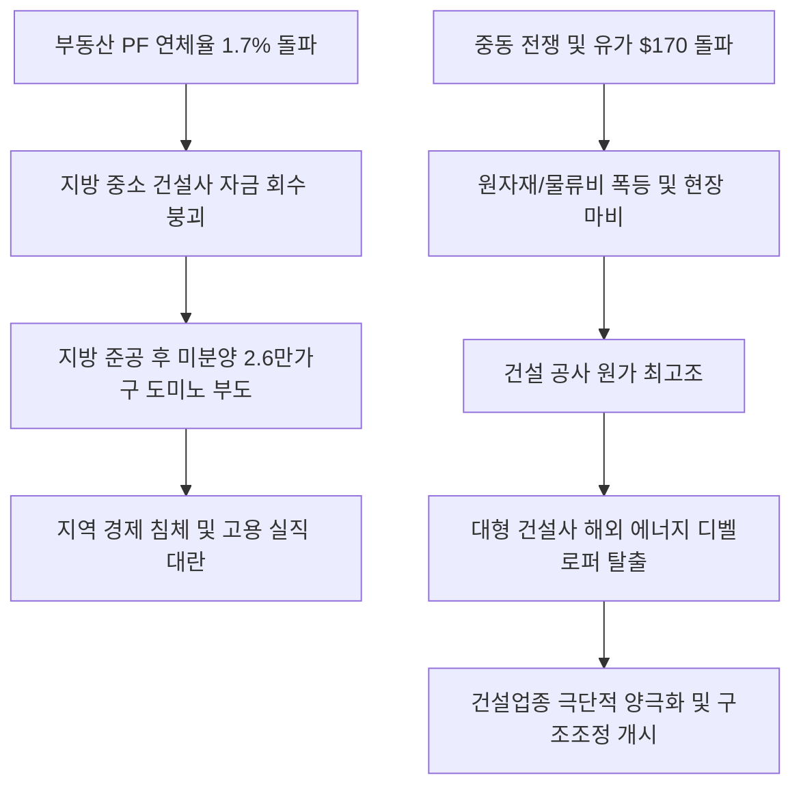

# 부동산/건설 분석: PF 부실과 중동 전쟁의 이중고와 지방 건설사 도산 및 지역 경제 붕괴 현상
## 투자 신호 + 사회적 영향 평가

---

## 📌 기사 기본 정보

- **날짜**: 2026-05-02
- **출처**: 신문 1면 '건설산업' 종합
- **카테고리**: 경제 > 건설 > 부동산
- **핵심 주제**: 부동산 프로젝트 파이낸싱(PF) 대출 부실 장기화와 중동 전쟁 발 고유가(배럴당 $170 돌파)로 인한 원자재 가격 폭등 속에서, 지방의 악성 미분양 주택이 13년 만에 최대치를 경신하며 지방 건설사들의 도미노 도산 위기와 대형 건설사 인력 감축 분석

**메타데이터**
- 주요 사건: 지방 '준공 후 미분양' 2만 6000가구 돌파 및 대형 건설사 희망퇴직 도래
- 핵심 원인: 중동 지정학 전쟁 발 원자재/물류 원가 쇼크(레미콘·아스팔트 가격 폭증), 고금리 장기화에 따른 지방 부동산 개발 PF 연체율 급등(1.7%)
- 주요 주체: 지방 중소 건설사, 대형 건설사(롯데건설, 현대엔지니어링 등), 국토교통부 및 금융위원회, 건설 일용직 노동자
- 키워드: PF 부실, 악성 미분양, 원자재 쇼크, 공사 원가 폭등, 건설업 구조조정

---

## 🔍 기사를 통한 투자 신호 추출

### 1단계: 핵심 사건 분해

**What (무엇이 일어났는가?)**
- 대한민국 건설 산업에 미분양 적체와 원가 폭등이 동시에 습격하는 '퍼펙트 스톰'이 발생했습니다. 특히 악성으로 불리는 '준공 후 미분양'이 지방을 중심으로 2만 6000가구를 넘어서며 13년 만의 최고치를 기록, 지방 건설 생태계가 셧다운(공사 중단) 위기에 몰렸습니다. 대재앙 수준의 유가 폭등은 시멘트, 철근 등 모든 건설 원자재 가격을 밀어 올려 대형 건설사조차 희망퇴직과 신규 채용 중단을 발표하게 만들었습니다.

**When (언제 일어났는가?)**
- 2026-05-02 (중동 전쟁발 공급망 유가 폭등의 영파가 원자재 자급 지수를 최저로 끌어내려 공사 중단 현장이 속출한 시기)

**Why (왜 일어났는가?)**
- 호르무즈 해협 봉쇄 등으로 유가가 배럴당 $170를 돌파하며 석유 정제 계열 자재(아스팔트, 플라스틱 배관 등)와 운송비가 급격히 올랐기 때문입니다.
- 분양가 상승으로 인해 내수 주택 구매 수요가 붕괴했음에도 금리 인하 지연으로 PF 채무 상환 자금 조달 비용이 수배로 급등했기 때문입니다.

**Who (누가 주도하는가?)**
- 자금 미회수로 부도를 맞이하고 있는 하도급 전문 지방 중소 건설사들
- PF 대출 연체 리스크를 방어하기 위해 부동산 담보권 실행 및 대출 회수에 들어간 2금융권 금융사들

---

## 2단계: 투자 신호 해석

### A. **긍정적 신호 (Bullish)**

**① 해외 원전/재건 수주 포트폴리오를 보유한 대형 초일류 건설사**
- **신호**: 국내 주택 사업 비중을 축소하고 중동·유럽의 친환경 에너지/인프라 시장으로 축을 이동하는 흐름
- **의미**: 국내 PF 위기와 무관하게 해외 국책 수주를 통해 달러화 매출을 올리고, 원가 상승분을 안정적으로 에스컬레이션(물가연동)할 수 있는 초대형 건설사는 독보적인 실적 방어력을 보여줌
- **투자 기회**: 해외 원전 및 초대형 플랜트 시공 능력을 보유한 대형 건설 주도주

**② 모듈러 주택 및 공기 단축 원가 절감형 건설 테크 기업**
- **신호**: 공사 현장의 고물가·인력난 대안으로 스마트 건설 공법 수요 증가
- **의미**: 공장에서 유닛을 미리 제작해 현장에서 조립하는 모듈러 공법은 전통적 시공 방식 대비 인건비와 자재 낭비를 30% 이상 절감하여, 마진 압박 속에서도 건설사의 채산성을 지켜냄
- **투자 기회**: 모듈러 특허 보유사, 스마트 현장 로봇 및 3D 스캐닝 정밀 시공 업체

---

### B. **위험 신호 (Bearish)**

**① 지방 주택 및 민자 토목 사업 비중이 70%를 넘는 중견 건설사**
- **신호**: 준공 후 미분양 2만 6천 호 돌파 및 지방 부동산 연체율의 임계점 이탈
- **의미**: 분양 대금 회수가 막힌 상태에서 만기가 도래하는 PF 차입금의 고금리 차환 압박을 견디지 못하고 유동성 파산으로 직행할 확률이 극도로 높음
- **투자 리스크**: 지역 기반의 중견 주택 건설사 및 지방 PF 우발채무 노출 금융기관(저축은행, 캐피탈 등)

**② 전통적 시멘트·레미콘·철강 등 원가 민감 자재 유통 기업**
- **신호**: 물류비 폭등 및 건설 현장의 동시다발적 셧다운
- **의미**: 자재 가격은 올랐으나 건설사들이 대금 지급을 미루거나 부도가 나면서 대규모 대손충당금 설정 리스크에 직면하며, 납품량 자체가 급감해 마진 스프레드가 붕괴됨
- **투자 리스크**: 순수 국내 건설 자재 납품 비중이 높은 철강/시멘트 섹터 중소형주

---

### 3단계: 섹터별 투자 기회 매트릭스

#### ✅ **높은 기대도 + 낮은 리스크**

**해외 재건, SMR 원전 및 친환경 에너지 사업으로 체질 개선을 마친 '에너지 디벨로퍼' 대형 건설사**
- 국내 주택 시장의 부실 고리를 과감히 끊고, 탄소배출 제로 시대에 걸맞은 글로벌 에너지 인프라 기업으로 전환한 대형 건설사는 PF 리스크에서 완전히 해방되어 장기적인 주주 밸류에이션 리레이팅을 달성할 것입니다.
- **투자 추천도**: ⭐⭐⭐⭐⭐

---

## 💰 구체적 투자 신호 변환

### 신호 1: 건설업종 내 '옥석 가리기' - 국내 주택 중심에서 해외 에너지/원전 비중으로의 탈출(Exodus) 확인

**투자 해석**: 기사는 국내 부동산 PF 연체율이 1.7%에 달해 금융위기 직전 수준이며, 고유가가 건설 현장을 마비시키는 치명적 외부 덫이 되었음을 확인해 줍니다. 투자자는 건설업 전체가 위기라는 매도 리포트에 현혹되어 모든 건설주를 투매할 필요가 없습니다. 오히려 이번 기회를 국내의 부실한 부동산 개발 거품을 털어내고 체질을 개선하는 계기로 삼아야 합니다. 철저하게 포트폴리오를 분리하여, 국내 주택 개발 비중이 높은 건설사와 이들의 채권을 대량 보유한 2금융권 금융사([[PF 부실]])는 예외 없이 매도 포지션을 유지해야 합니다. 반면, 대규모 유보 현금을 바탕으로 미국의 SMR 설계 기업과 제휴하거나 중동·호주의 그린 수소 사업 등 장기 인프라 운영 수익을 창출하는 '에너지 디벨로퍼' 대형 건설사([[현대건설]], [[삼성물산]] 등)에 대해서는, PF 노이즈로 주가가 과도하게 디스카운트되는 조정을 최상의 장기 매수 기회로 활용해야 합니다.

---

## 🌍 사회적 영향 평가

### A. 긍정적 사회 영향
- **부동산 거품 제거를 통한 국가 부채 다이어트**: 부실 PF 사업장의 과감한 청산과 구조조정을 통해 대한민국 경제 전반의 도덕적 해이를 제거하고 건전성을 회복하는 발판 마련
- **친환경·스마트 건설 기술의 도입 가속화**: 고비용·고에너지 소모 구조의 재래식 공법에서 탈피하여 3D 프린팅, 친환경 건축 등 저탄소 스마트 공법 도입이 빨라지는 계기 제공

### B. 부정적 사회 영향
- **일용직 및 서민 고용 붕괴에 따른 지역 경기 동사(凍死)**: 건설 현장의 잇단 셧다운으로 생계 수단을 잃은 일용직 노동자들의 실직이 이어져 서민 경제와 자영업 경기에 최악의 한파 초래
- **주택 공급 가뭄에 따른 2~3년 뒤 전·월세 및 집값 폭등**: 현재의 신규 인허가 중단이 장기 공급 부족으로 고착되어 경기 회복기에 무주택 서민들의 주거비 부담을 극대화시키는 부작용 야기

---

## 🎯 결론: 당신의 투자 전략 수립

- **즉시 실행**: 국내 주택 분양 리스크 노출도가 높은 중소형 건설주 및 PF 익스포저가 큰 상장 캐피탈/저축은행 관련주 전량 매도
- **3개월 후**: 정부의 SOC 조기 예산 집행 효과 및 LH 미분양 매입 추진 강도를 확인하고, 해외 재건과 원전 수출 모멘텀이 실현되는 시점에 대형 에너지 전환 건설주 포지션 추가 확보

---

## 📝 Obsidian 연결 구조

