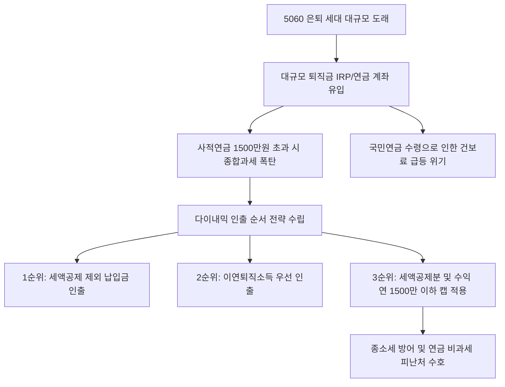

# 세무/금융 분석: 은퇴자 종합소득세 신고와 연금소득 절세 및 건강보험료 대응 전략
## 투자 신호 + 사회적 영향 평가

---

## 📌 기사 기본 정보

- **날짜**: 2026-05-02
- **출처**: 김동엽 상무 (중앙SUNDAY 올댓시니어)
- **카테고리**: 경제 > 금융 > 세무
- **핵심 주제**: 5월 종합소득세 신고 기간을 맞아 은퇴자들이 연금 자산을 수령할 때 직면하는 세금 폭탄과 사적연금 1500만 원 분리과세 기준, 그리고 이연퇴직소득(퇴직금) 인출 순서에 따른 건강보험료 폭탄 회피 절세 전략 분석

**메타데이터**
- 주요 사건: 은퇴 소득에 대한 종합소득세 및 건강보험료 연계 과세 이슈 부각
- 핵심 원인: 사적연금 연 1500만 원 초과 수령 시 누진 과세(최대 49.5%), 국민연금 등 공적연금의 지역가입자 건보료 직격탄 반영
- 주요 주체: 5060 은퇴 세대, 시니어 자산 관리 기관(증권사/은행), 국민건강보험공단, 국세청
- 키워드: 종합소득세, 연금소득, 건강보험료, 이연퇴직소득, 분리과세, 인출 전략

---

## 🔍 기사를 통한 투자 신호 추출

### 1단계: 핵심 사건 분해

**What (무엇이 일어났는가?)**
- 베이비부머 은퇴 대란 속에서 복잡한 연금 과세 체계를 제대로 이해하지 못해 5월 종합소득세 신고 시 고율의 세무 가산세를 물거나 건강보험료가 수십만 원 폭증하는 은퇴자들이 급증하고 있습니다. 사적연금(연금저축·IRP 내 세액공제분 및 운용수익)의 1500만 원 캡 한도 준수 여부와 퇴직금을 이체한 이연퇴직소득의 분리과세 특례를 활용해 합리적으로 인출하는 포트폴리오 탈출 전략의 필요성이 임계점에 달했습니다.

**When (언제 일어났는가?)**
- 2026-05-02 (대기업 및 건설업 구조조정으로 인한 50대 조기 은퇴자들의 IRP 퇴직금 유입이 정점에 달하고 5월 종소세 신고가 개시된 시점)

**Why (왜 일어났는가?)**
- 국민연금 등 공적 연금소득은 금액과 상관없이 100% 건강보험료 산정 소득에 반영되어 지역가입자 은퇴자들의 건보료를 폭등시키기 때문입니다.
- 연금 계좌에서 매년 인출하는 사적연금 합계액이 단 1원이라도 1500만 원을 초과할 경우, 저율 원천징수(3.3~5.5%) 혜택이 즉시 상실되고 최고 49.5%의 종합과세 누진율을 적용받는 기형적 과세 구조를 유지하고 있기 때문입니다.

**Who (누가 주도하는가?)**
- 노후 자산의 세후 실질 구매력을 방어하려는 대규모 은퇴 시니어 집단
- 시니어들의 연금 유치 경쟁을 벌이면서 정교한 디지털 인출 설계 솔루션을 제공하는 메이저 증권사 및 핀테크사

---

## 2단계: 투자 신호 해석

### A. **긍정적 신호 (Bullish)**

**① 개인형 퇴직연금(IRP) 및 연금 특화 자산배분 펀드(TDF) 시장의 대폭팽창**
- **신호**: 은퇴자들의 퇴직금을 일시금이 아닌 IRP를 통한 이연 수령 선호도 증가
- **의미**: 퇴직금을 IRP로 이체해 연금으로 받을 경우 퇴직소득세를 30~40% 감면해주고 전액 분리과세되므로, 대규모 퇴직연금 원금이 제도권 금융기관에 초장기로 묶여 대리 운용되는 초대형 머니무브(Money Move)가 발생함
- **투자 기회**: 연금 자산 점유율이 높은 선두 대형 증권사, 시니어 타겟 TDF 운용사

**② AI 기반 지능형 디지털 세무 및 다이내믹 인출(Decumulation) 솔루션 스타트업**
- **신호**: 복잡한 수명 시나리오별 건보료·세금 최적화 시뮬레이션 수요 폭발
- **의미**: "어떻게 모으는가"보다 "어떻게 찾을 때 세금을 아끼는가"가 시니어들의 지상 최대 화두가 되면서, 이를 실시간 해결하는 지능형 AI 연금 관리 소프트웨어 기업이 핵심 서비스 플랫폼으로 등극함
- **투자 기회**: 실버 테크(Silver-Tech) 및 연금 핀테크 플랫폼 선도사

---

### B. **위험 신호 (Bearish)**

**① 연금 인출 캡 관리 실패에 따른 고액 연금 자산가의 대규모 자금 투매 리스크**
- **신호**: 연 1500만 원 한도를 고려하지 않은 무분별한 배당형 연금 상품의 고수익 실현
- **의미**: 증시 호황([[코스피 6000]])으로 연금 계좌 내 주식형 펀드 수익이 폭증하여 강제로 연 1500만 원 수령 한도를 넘기게 될 경우, 절세 혜택이 모두 소멸되어 은퇴자들이 자산을 투매하거나 강제로 계좌를 해지하는 노이즈가 발생함
- **투자 리스크**: 분배금 조절 옵션이 없는 사적연금용 고배당 펀드 및 일시금 인출 비중이 높은 연금 저축 자산

**② 공적 연금(국민연금) 의존도가 80% 이상인 한계 은퇴 가구의 가처분 소득 붕괴**
- **신호**: 국민연금 수령액 인상 및 그에 연동된 건강보험료의 부과 기준율 인상
- **의미**: 국민연금 수령액이 조금 늘어났다는 이유로 기초연금 수급 자격을 박탈당하고 지역 건보료 등급이 폭등하여 실질 가처분 가계 소득이 오히려 감소하는 연금 역설이 현실화됨
- **투자 리스크**: 공적연금 인상 시 실질 내수 소비력이 급감하는 고령층 중심의 저가 생필품/유통 섹터

---

### 3단계: 섹터별 투자 기회 매트릭스

#### ✅ **높은 기대도 + 낮은 리스크**

**퇴직연금(IRP) 자산 관리 인프라 및 AI 핀테크 세무 플랫폼**
- 은퇴 인구의 절대수가 급증하는 인구통계학적 변화 속에서 세무 및 인출 리스크를 완전히 차단해주는 플랫폼은 초장기 캐시카우를 보장받습니다. 세금과 건보료를 절감해주는 무형의 소프트웨어 솔루션 가치는 날이 갈수록 프리미엄이 붙을 것입니다.
- **투자 추천도**: ⭐⭐⭐⭐⭐

---

## 💰 구체적 투자 신호 변환

### 신호 1: '모으는 운용'에서 '빼 쓰는 인출(Decumulation) 전략'으로의 시니어 포트폴리오 패러다임 이동

**투자 해석**: 기사는 은퇴자들의 노후 생존이 연금 자산의 표면 수익률이 아닌 '세후 실질 소득(Net Cash Flow)'을 얼마나 통제하는가에 달려있음을 보여줍니다. 주식의 불타기/물타기만큼이나 중요한 것이 연금 인출의 정교한 설계입니다. 투자자는 은퇴 포트폴리오 운용 시, 사적연금(연금저축/IRP)의 연 수령액을 철저히 '1500만 원 분리과세 마지노선' 안쪽으로 묶어두는 수량 조절 옵션을 발동해야 합니다. 퇴직금 재원인 이연퇴직소득은 인출 한도 제한 없이 전액 분리과세되므로, 연금 수령의 첫 단추로 '이연퇴직소득'을 먼저 소진하는 인출 순서(① 납입 시 세액공제 받지 않은 원금 -> ② 이연퇴직소득 -> ③ 납입 시 세액공제 받은 원금 및 운용수익)를 철저히 고수해야 합니다. 현재 건강보험료 부과 대상에서 사적연금이 제외되어 있는 비과세 피난처 제도를 최대한 활용하여 공적연금 비중이 지나치게 높은 투자자는 자산의 무게중심을 IRP 및 연금계좌 내의 사적연금 및 연금 수령 분산 전략으로 빠르게 이전시켜야 노후의 경제적 붕괴를 막을 수 있습니다.

---

## 🌍 사회적 영향 평가

### A. 긍정적 사회 영향
- **고령층의 합리적 금융 자립도 향상**: 복잡한 세무 전략 학습을 통해 은퇴 세대의 자산 관리 능력이 고도화되고 국가의 복지 재정 지원 의존도가 낮아지는 순기능 발생
- **디지털 세무 민주화 실현**: 대면 세무사 비용을 감당하기 어려운 서민 은퇴자들이 AI 세무 플랫폼을 통해 동등한 수준의 고급 절세 혜택을 누리는 사회적 안전망 가동

### B. 부정적 사회 영향
- **연금 과세 체계의 양극화 갈등**: 고액 자산가들은 정교한 절세를 통해 건보료를 회피하는 반면, 국민연금 하나에만 목을 매는 저소득 은퇴자들은 고스란히 건보료 인상 폭탄을 맞으며 사회적 상대적 박탈감 고조
- **실버 세대의 불법 현금성 자산 쏠림 현상**: 향후 건강보험공단이 재정 적자를 막기 위해 사적연금에까지 건보료 부과를 확대 추진할 경우, 은퇴자들이 금융 제도권을 탈출해 비제도권 실물 자산(골드바, 현금 보유)으로 숨어들어 자본 왜곡 심화 우려

---

## 🎯 결론: 당신의 투자 전략 수립

- **즉시 실행**: 은퇴 연금 계좌의 수령 계획서 상 연간 사적연금 인출 예정액을 연 1480만 원 수준으로 세팅하여 과세 당국의 레이더망(종합과세 누진세)에서 안전하게 대피시킴
- **3개월 후**: 건강보험공단 및 보건복지부의 사적연금 건보료 합산 부과 법안 개정 여부를 주기적으로 필터링하고, AI 세무 매니저를 도입하여 예상 기대 수명 맞춤형 인출 스케줄 최종 수립

---

## 📝 Obsidian 연결 구조

