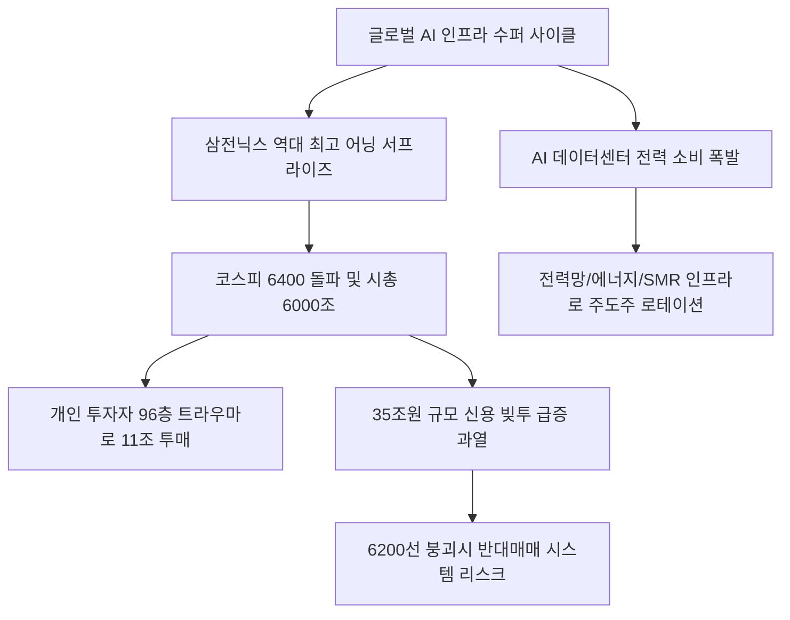

# 증시/시장 분석: 코스피 6000 시대 돌파와 '삼전닉스' 딜레마 및 피크아웃 공포와 레버리지 과열 현상
## 투자 신호 + 사회적 영향 평가

---

## 📌 기사 기본 정보

- **날짜**: 2026-05-02
- **출처**: 배현정 기자 (중앙SUNDAY BIZ & MONEY)
- **카테고리**: 경제 > 금융 > 증시
- **핵심 주제**: 삼성전자와 SK하이닉스의 경이로운 어닝 서프라이즈에 힘입어 코스피 6400선 돌파 및 시가총액 6000조 원의 역사적 고지에 도달한 한국 증시의 상황과 과거 고점 트라우마('96층의 기억')로 인한 개인의 차익 매도세 및 35조 원 규모 신용융자 빚투 과열 공존 분석

**메타데이터**
- 주요 사건: 코스피 6000 시대 개막 및 삼전닉스 시총 쏠림의 가속화
- 핵심 원인: AI 빅테크 인프라 투자 폭증에 따른 장기 공급 계약 전환(반도체 수퍼 사이클), 저PER(5~6배) 평가에 기반한 외국인과 기관의 강력한 매수 유입
- 주요 주체: 삼성전자 및 SK하이닉스, 개인 투자자 전체(11조 원 순매도 기록), 외국인 투자자 및 헤지펀드, 신용 레버리지 빚투 집단
- 키워드: 코스피 6400, 삼전닉스, 96층의 기억, 피크아웃 공포, 빚투 과열, AI 인프라 랠리

---

## 🔍 기사를 통한 투자 신호 추출

### 1단계: 핵심 사건 분해

**What (무엇이 일어났는가?)**
- 대한민국 종합주가지수가 역사상 최초로 6400포인트를 돌파하며 시가총액 6000조 원 시대를 열어젖혔습니다. 1년간 SK하이닉스가 625%, 삼성전자가 297% 폭등하는 초강세장을 주도하고 있으나, 개인들은 과거 '9만 전자'의 상흔인 '96층의 트라우마'로 인해 폭등장에서 11조 원어치의 차익실현 매물을 던지며 시장 탈출을 고민하고 있습니다. 반면, 35조 원에 육박하는 신용융자 잔고와 고레버리지 ETF로의 단기 투기성 자금 유입은 역대 최고조에 달했습니다.

**When (언제 일어났는가?)**
- 2026-05-02 (반도체 최대 실적 수치가 연달아 발표되고 외국인의 파상적인 매수가 유입되어 '칠천피' 기대감과 조정 공포가 첨예하게 맞물린 시점)

**Why (왜 일어났는가?)**
- 이번 상승 랠리는 과거의 단순 경기 순환 사이클이 아닌 글로벌 빅테크 기업들의 AI 구동을 위한 '생존형 인프라 구축' CapEx 경쟁에 연동되어 있어 이익의 체급과 하방 지지선이 훨씬 단단해졌기 때문입니다.
- 메모리 반도체가 주문생산형 장기 공급 계약 구조로 진화하여 실적 변동성이 현격히 낮아졌기 때문입니다.
- 지수 폭등 이면에서 일부 개인들이 고배율 레버리지 상품을 활용해 단기 일확천금을 노리는 극단적 투기 심리가 확산되었기 때문입니다.

**Who (누가 주도하는가?)**
- 실적의 절대적 이익 체급 변화를 포착하고 저평가 영역(PER 5~6배)에서 쓸어 담는 외국인과 기관 투자가들
- 96층의 기억에 갇혀 조기 차익 실현을 감행하는 공포형 개미들과 35조 원대 빚투를 이끄는 레버리지 단타족

---

## 2단계: 투자 신호 해석

### A. **긍정적 신호 (Bullish)**

**① AI 반도체 밸류체인 연계 전력·에너지 인프라 및 핵심 네트워킹 섹터의 수혜 확산**
- **신호**: 반도체 칩 가동에 수반되는 데이터센터 전력 소비 폭발 및 송배전 설비 노후화 대안의 긴급성
- **의미**: 반도체 상승장의 에너지가 증시 전반으로 확산되어 변압기, 친환경 전력망 구축, 데이터센터 전용 액체 냉각 장치 관련 중소형 강소기업들의 영업이익을 폭발적으로 견인함
- **투자 기회**: 초고압 변압기 선도사, 데이터센터 냉각 솔루션 특허사, 에너지 디벨로퍼 전환 대형 건설주

**② 장기 맞춤형 메모리 반도체 소부장(소재·부품·장비) 초정밀 기업의 낙수 효과**
- **신호**: HBM4 등 차세대 메모리의 고객 주문 생산 체계 정착
- **의미**: 범용 메모리와 달리 고객 맞춤형으로 생산되어 단가 후려치기 리스크가 없고, 안정적인 장기 고마진 납품이 유지되어 소부장 협력사들이 사상 최대 현금흐름을 확보함
- **투자 기회**: HBM 패키징 및 테스트 장비 독점력 보유 강소 기업

---

### B. **위험 신호 (Bearish)**

**① 35조 원 규모 신용 잔고 폭탄의 '마진콜 청산 반대매매' 리스크**
- **신호**: 신용융자 잔고의 사상 최대치 갱신 및 레버리지 상품 과열
- **의미**: 사소한 매크로 악재나 실적 둔화 찌라시에도 6200선 붕괴 시 단기 담보부족 계좌들의 마진콜 폭탄이 투하되어 시장 지수 전체를 4500선까지 수직 낙하시키는 기술적 급락 발작이 발생할 수 있음
- **투자 리스크**: 신용융자 매수 비중이 7% 이상인 코스닥 시가총액 상위 중소형 개별 테마주

**② 매크로 스태그플레이션(스태프) 부활 및 금리 인하 기대 완전 소멸**
- **신호**: 중동 지정학 전쟁 장기화에 따른 배럴당 $170 유가 폭등 지속
- **의미**: 인플레이션이 재차 연소되면서 각국 중앙은행의 기준금리 고공행진이 고착화되어 고레버리지 레버리지 투자자들을 파산으로 몰고 가며 증시 멀티플을 하향 조정시킴
- **투자 리스크**: 부채 비율이 200%를 초과하는 한계 성장 기술주 및 고레버리지 지수 추종 ETF

---

### 3단계: 섹터별 투자 기회 매트릭스

#### ✅ **높은 기대도 + 낮은 리스크**

**AI 전력망 및 차세대 에너지 디벨로퍼 밸류체인**
- 반도체 상승장의 다음 바통을 터치받는 것은 무조건 '에너지'입니다. 아무리 훌륭한 반도체 칩이 개발되어도 전기(Power) 공급 없이는 연산할 수 없습니다. 따라서 AI 구동에 필수적인 변압기, 그린 수소 및 SMR 연동 에너지 주도 기업은 가장 가시성이 높은 고성장 섹터입니다.
- **투자 추천도**: ⭐⭐⭐⭐⭐

---

## 💰 구체적 투자 신호 변환

### 신호 1: '겁먹은 상승장' 속의 공포 극복과 '포스트 반도체(AI 전력망·인프라)'로의 포트폴리오 로테이션

**투자 해석**: 기사는 한국 증시 코스피 6000 돌파가 단순한 버블 과열이 아닌, 전 세계 AI 인프라 구축 사이클이라는 강력한 '현실 기초 체력(Fundamentals)'에 기인하고 있음을 데이터로 증명합니다. 개인들이 과거 '96층의 기억'이라는 트라우마에 사로잡혀 주식을 투매할 때, 이는 외국인과 기관에 우량한 반도체 지분을 저렴하게 헌납하는 패착이 될 수 있습니다. 지금은 도망칠 때가 아니라, 감성 지표(Fear 65%, Greed 35%)가 차분함을 가리키는 점을 신뢰하고 반도체 우량 자산을 흔들림 없이 수호해야 합니다. 다만, 신용융자 35조 원 과열로 인한 일시적 지수 변동성은 불가피하므로 무리한 신용 빚투는 가혹한 청산의 칼날에 노출될 수 있어 철저히 금지해야 합니다. 따라서 투자자는 단기 지수 조정 시 6200선 전후에서 반대매매 물량을 받아내는 전략적 바이더딥(Buy the Dip) 매수 대기 자금을 확보하고, 이미 급등한 반도체 대형주 외에 아직 온기가 도달하지 않은 후속 인프라 테마(전력망, 변압기, 서버 냉각, 원전, SMR 에너지)로 포트폴리오의 이익 비중을 점진적으로 재배분(Sector Rotation)해야 수익을 극대화할 수 있습니다.

---

## 🌍 사회적 영향 평가

### A. 긍정적 사회 영향
- **국민 가계의 금융 자산 축적 및 자본시장 신뢰 증대**: 부동산에만 치우쳤던 가계 자산 구조가 자본시장 중심으로 이전하며 건전한 투자 주주 문화가 성숙하는 기틀 확보
- **수출 실적 개선에 기반한 국가 신인도 상향**: 삼전닉스의 신기록 행진이 대한민국 국가 신용등급 안정성에 강력한 크레딧 보증 마크를 부여하여 글로벌 금융 연대의 중심축으로 부상

### B. 부정적 사회 영향
- **일확천금을 쫓는 레버리지 영끌 빚투로 인한 청년층의 금융 파산**: 35조 원 빚투 속에서 무리하게 대출을 받아 고위험 선물·옵션, 레버리지 ETF에 올인했다가 청산당한 서민 청년들의 사회적 좌절과 연쇄 신용불량자 대량 양산
- **소득 양극화 및 상실감의 심화**: '포모(FOMO)' 증후군이 사회 전반에 확산되며, 주식을 보유하지 못해 6000 돌파 랠리에서 철저히 소외된 이들의 불안감과 우울증 급증

---

## 🎯 결론: 당신의 투자 전략 수립

- **즉시 실행**: 과도한 레버리지(신용/스탁론) 매수 잔고 전량 정리 및 6200선 단기 조정 대비 포트폴리오의 30%를 현금(달러/MMF)으로 대피시킴
- **3개월 후**: AI 인프라 투자 수요의 CapEx 꺾임 여부를 분기 빅테크 실적으로 검증하고, 전력망 확보 수혜가 본격화되는 에너지 인프라 강소기업의 비중 대폭 상향

---

## 📝 Obsidian 연결 구조

