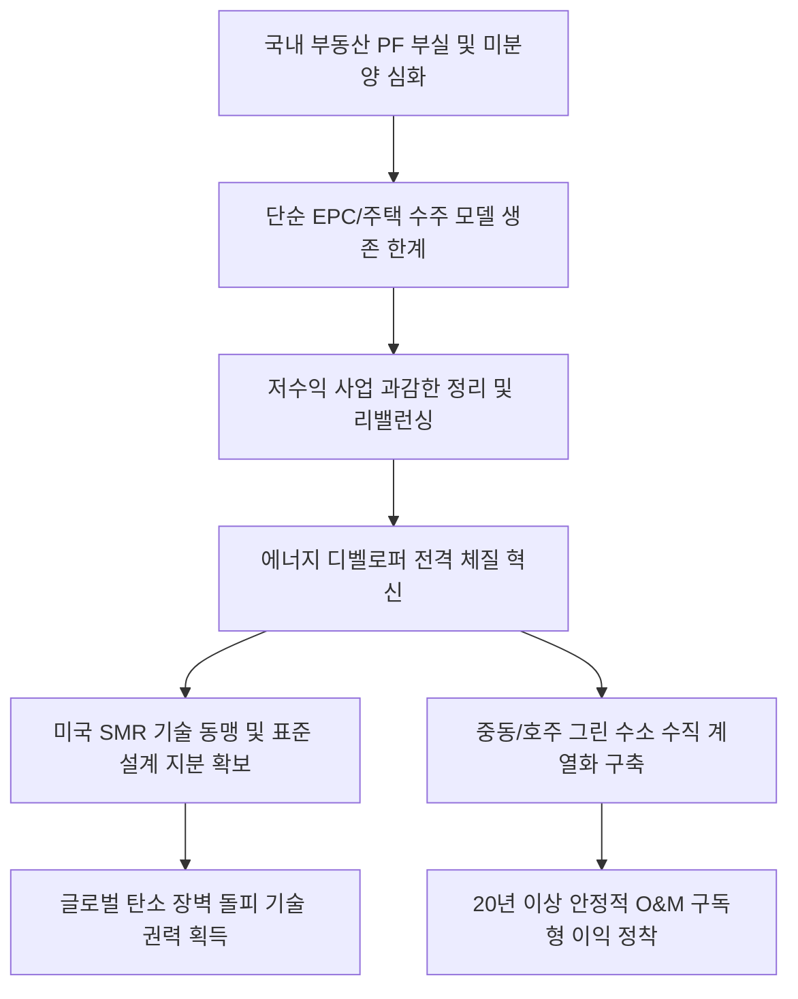

# 신성장/에너지 분석: 건설사의 '에너지 디벨로퍼' 전환과 SMR·그린 수소 신성장 동력 및 포트폴리오 리밸런싱 현상
## 투자 신호 + 사회적 영향 평가

---

## 📌 기사 기본 정보

- **날짜**: 2026-05-02
- **출처**: 황정일 기자 (중앙일보 종합)
- **카테고리**: 경제 > 건설 > 신성장동력
- **핵심 주제**: 국내 주택 경기 붕괴와 부동산 PF 부실 위기를 돌파하기 위해 대형 건설사들이 소형모듈원전(SMR), 그린 수소, 재생에너지 등 에너지 생산부터 소비까지 장악하는 '에너지 디벨로퍼'로 대대적인 정체성 혁신 및 포트폴리오 다변화를 단행하는 전략 분석

**메타데이터**
- 주요 사건: 대형 건설사들의 저수익 민자/주택 사업 정리 및 에너지 신사업 전면 전진 배치
- 핵심 원인: 기존 수주-시공(EPC) 중심 비즈니스 모델의 이익 한계 직면, 글로벌 탄소중립 환경 규제(CBAM) 대응 및 20년 이상 장기 운영 수익원 확보 필요성
- 주요 주체: 메이저 건설사(현대건설, 삼성물산, GS건설, 대우건설 등), 글로벌 SMR 표준화 설계 파트너사, 국토교통부 및 에너지 규제 당국
- 키워드: 에너지 디벨로퍼, 소형모듈원전(SMR), 그린 수소, 포트폴리오 리밸런싱, 에너지 밸류체인

---

## 🔍 기사를 통한 투자 신호 추출

### 1단계: 핵심 사건 분해

**What (무엇이 일어났는가?)**
- 대한민국 대형 건설사들이 부동산 PF 부실의 늪에서 벗어나기 위해 업의 본질을 바꾸는 '대수술'에 돌입했습니다. 대우건설이 광역철도 민자 사업 계약을 과감히 해지하는 등 저수익·고리스크 토목/주택 사업은 축소하는 한편, 미국의 SMR 전문 기업과의 기술 동맹, 중동·호주의 대형 그린 수소 플랜트 건설 및 인도의 재생에너지 시장 진출을 구체화하며 단순 시공사에서 친환경 '에너지 자산 소유자 및 운영자(Developer)'로의 급격한 포지셔닝 전환을 선언했습니다.

**When (언제 일어났는가?)**
- 2026-05-02 (지방 악성 미분양과 PF 연쇄 도산 공포가 극에 달해 구시대 토목 모델의 종말이 공식 선언된 시점)

**Why (왜 일어났는가?)**
- 원자재 폭등과 PF 유동성 마비로 인해 기존의 '땅 짚고 헤엄치기' 식 주택 분양과 단순 도급 시공으로는 영업이익률을 3% 이하로 유지하기도 힘든 최악의 채산성 악화에 봉착했기 때문입니다.
- 글로벌 AI 데이터센터 급증으로 인한 초대형 전력 수요 폭발로 분산형 고효율 에너지원(SMR, 그린 수소) 시장이 향후 20년 이상 폭발적 장기 호황을 누릴 초입에 진입했기 때문입니다.

**Who (누가 주도하는가?)**
- 선제적으로 국내 비중을 낮추고 글로벌 에너지 파트너십을 구축해 나가는 초일류 건설사 경영진
- 탄소 배출 규제를 강화하고 친환경 투자 인센티브(IRA 등)를 지급하며 글로벌 공급망을 재편하는 미국 및 주요 선진국 정부

---

## 2단계: 투자 신호 해석

### A. **긍정적 신호 (Bullish)**

**① SMR 표준 설계 지적재산권(IP) 보유 및 글로벌 원전 '팀코리아' 주도주**
- **신호**: 미국 소형모듈원전 기업과의 전략적 지분 투자 및 표준 설계 공동화 성과
- **의미**: 단순 하청 시공이 아닌, 전 세계 SMR 표준 설계와 원천 라이선스 로열티 마진을 확보하여 건설업계 역사상 유례없는 '무형 지식 자산 고마진(영업이익률 15% 이상)' 모델로 전환함
- **투자 기회**: 독보적 SMR 시공 및 설계 라이선스를 확보한 대형 건설사([[현대건설]], [[삼성물산]] 등)

**② 친환경 신재생 연계 수소/암모니아 밸류체인 및 에너지 O&M(운영관리) 솔루션**
- **신호**: 호주 및 중동 내 초대형 그린 수소 생산 단지 소유 및 독점 공급권 획득
- **의미**: 생산된 친환경 에너지를 저장·운송하여 대형 해운사([[HMM]])의 친환경 선박 연료로 공급하거나 IT 대기업([[삼성전자]]) 데이터센터에 직접 판매함으로써 장기적이고 예측 가능한 '구독형 에너지 마진'을 창출함
- **투자 기회**: 수소 밸류체인 수직계열화를 구축 중인 대형 EPC 지주사 및 스마트 에너지 관리 소프트웨어사

---

### B. **위험 신호 (Bearish)**

**① 주택 및 민자 도로·철도 시공에만 목을 매고 있는 재래식 중견 건설사**
- **신호**: 에너지 전환 기술 연구 비중 제로 및 국내 주택 수주 잔고 위주의 포트폴리오 고착
- **의미**: 다가오는 글로벌 탄소국경조정제도(CBAM) 장벽을 넘지 못하고, 국내 주택 경기 장기 불황에 고스란히 노출되어 고사 직전의 한계 상황을 마주하게 됨
- **투자 리스크**: 지역 주택 분양에 잔여 생존을 걸고 있는 한계 중소형 건설주

**② 에너지 전환 초기 투자 예산 조달에 따른 급격한 부채 비율 상승 기업**
- **신호**: 친환경 인프라 매입 목적의 회사채 대량 발행 및 신용등급 전망 하향
- **의미**: 에너지 디벨로퍼로의 전환은 수년간의 대규모 선제 자본 투입이 수반되므로, 자체 현금 유보력이 약한 상태에서 억지로 신사업을 끼워 넣은 기업은 사업이 궤도에 오르기 전 재무적 이자 비용 부담을 이기지 못하고 붕괴할 수 있음
- **투자 리스크**: 현금성 자산 보유량이 적은 상태에서 무리하게 대형 풍력/태양광 디벨로퍼 전환을 선포한 한계 인프라 기업

---

### 3단계: 섹터별 투자 기회 매트릭스

#### ✅ **높은 기대도 + 낮은 리스크**

**SMR 표준 시공 독점권 및 지분 보유 글로벌 EPC 선도주**
- AI 데이터센터에 분산 전원을 공급하는 핵심 거점인 SMR을 실질적으로 지을 수 있는 기술과 글로벌 독점 라이선스를 가진 기업은 향후 에너지 주권을 쥐는 새로운 기술 권력이 될 것입니다. 단순 아파트 분양주가 아닌 글로벌 최고 수준의 에너지 유틸리티 지배주로 봐야 합니다.
- **투자 추천도**: ⭐⭐⭐⭐⭐

---

## 💰 구체적 투자 신호 변환

### 신호 1: 건설 섹터의 밸류에이션 리프레이밍(Re-framing) - '아파트 건설사'에서 '에너지 유틸리티 주권자'로의 전환

**투자 해석**: 기사는 국내 부동산 PF가 터지고 미분양이 늘어나는 상황을 극복하기 위해 대형 건설사들이 '기술 혁신형 탈출구'를 뚫어내고 있음을 입증하고 있습니다. 이제 투자자는 건설 업종을 단순히 '주택 착공 데이터'나 '부동산 대책 규제 완화'라는 낡은 깔때기로 재단해서는 안 됩니다. 진입장벽이 없는 단순 벽돌 쌓기 수주 업자들은 포트폴리오에서 철저히 걸러내고, 그 자리에 SMR 표준 설계 권한과 호주 그린 수소 소유권을 쥔 '글로벌 에너지 디벨로퍼' 대형 건설사들을 편입시켜야 합니다. 이들은 향후 탄소중립 국면에서 전 세계 빅테크들의 RE100 수요를 민간 차원에서 해결하는 독점적 이익 집단이 될 것입니다. 따라서 주가 등락 시 국내 PF 노이즈로 억울하게 동반 급락하는 시점을 최상의 기회로 삼아, 원전 수출 '팀코리아' 주역이자 무형의 에너지 최적화 소프트웨어 자산을 키워내는 대형 혁신 건설사 포지션을 대폭 늘릴 것을 적극 추천합니다.

---

## 🌍 사회적 영향 평가

### A. 긍정적 사회 영향
- **민간 주도의 국가 에너지 안보 안착**: SMR 및 그린 수소의 독자 공급망을 확보함으로써 지정학적 위기([[호르무즈 봉쇄]]) 시에도 흔들리지 않는 에너지 자립형 산업 기반 마련
- **지방 스마트 도시의 에너지 분산화 촉진**: 소형모듈원전(SMR)이 [[지역의사제]] 기반 지방 소도시에 친환경 고효율 전력과 온수를 공급하는 인프라로 융합되어 거주 자립도 향상에 기여

### B. 부정적 사회 영향
- **지방 중소 건설 생태계의 공동화와 양극화 심화**: 대형사들이 에너지 초격차 기술로 갈아타는 동안, 자금력이 없는 지방 중소 업체들은 도미노 부도를 맞이해 건설 산업 구조가 기술 대기업 중심으로 극단적으로 왜곡되는 통증 수반
- **SMR 입지 선정을 둘러싼 사회적 갈등 및 님비(NIMBY) 자극**: 원전 안전성에 대한 불신이 팽배한 내수 정서 하에서, SMR 시범 시공 대상 지역 주민들의 격렬한 반대 투쟁과 이에 따른 심각한 지역적·정치적 국론 분열 노출

---

## 🎯 결론: 당신의 투자 전략 수립

- **즉시 실행**: 미래 에너지 신사업 로드맵이 부재하고 국내 부동산 PF 연체 리스크에 직접 노출된 중소 주택 건설사 지분 전량 정리
- **3개월 후**: 대형 건설사의 미국 SMR 기자재 최초 납품 및 해외 수소 플랜트 설계 마진 입증 여부를 모니터링하며 에너지 디벨로퍼 전환 1티어 주도주 적립식 포지션 강화

---

## 📝 Obsidian 연결 구조

