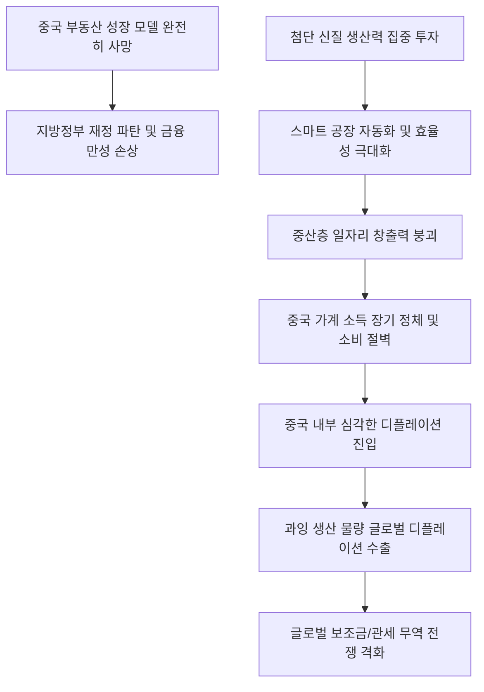

# 글로벌/중국 분석: 중국의 경제 전환과 소득 정체의 딜레마 및 '신질 생산력'과 내수 소비 절벽의 충돌 현상
## 투자 신호 + 사회적 영향 평가

---

## 📌 기사 기본 정보

- **날짜**: 2026-05-04
- **출처**: 루이즈 루 (옥스퍼드 이코노믹스 이코노미스트)
- **카테고리**: 경제 > 글로벌 > 중국경제
- **핵심 주제**: 중국 정부가 추진 중인 첨단 제조업 및 지식 기반의 '신질 생산력' 성장 모델이 자동화와 효율성 극대화로 인해 부동산 붕괴 이후 소득의 원천이던 일자리를 창출하지 못해 가계 소득이 장기 정체되고, 이로 인해 내수 불황과 디플레이션 수출의 악순환이 고착화되는 '질서 있는 전환'의 구조적 한계 분석

**메타데이터**
- 주요 사건: 중국의 구 경제(부동산) 모델 붕괴와 신질 생산력(첨단 기술)으로의 질서 있는 전환 추진 중 가계 소득 장기 정체 직면
- 핵심 원인: 첨단 스마트 공장 자동화에 따른 일자리 창출력 소멸, 부동산 버블 붕괴에 따른 지방 재정 위기 및 은행·개발업체의 만성 부채 손상
- 주요 주체: 옥스퍼드 이코노믹스, 중국 베이징 정책 당국, 중국 가계 소비층, 글로벌 수입국들
- 키워드: 신질 생산력, 질서 있는 전환, 디플레이션 수출, 과잉 생산, 생산자 서비스, 소득 양극화

---

## 🔍 기사를 통한 투자 신호 추출

### 1단계: 핵심 사건 분해

**What (무엇이 일어났는가?)**
- 중국 경제가 엔진(첨단 스마트 공장 및 신질 생산력)은 고성능으로 교체했으나, 이를 구동할 연료(가계 소득 및 내수 소비)가 고갈되어 멈춰 서는 '만성적 손상' 상태에 진입했습니다. 첨단 제조업으로 투자가 쏠리면서 공장의 생산성은 높아졌지만, 극단적인 자동화 공정 탓에 고용 시장의 훈풍과 가계의 임금 상승으로 연결되지 못하고 있습니다. 결국 내수에서 소화되지 못한 중국의 엄청난 과잉 생산량이 헐값에 글로벌 시장으로 쏟아져 나오는 '디플레이션 수출' 파고가 강해지고 있습니다.

**When (언제 일어났는가?)**
- 2026-05-04 (주택 수요의 급락은 제동이 걸렸으나, 가계와 지방정부의 부채 상환 한계 및 장기 디플레이션 압력이 구조적으로 고착화된 시점)

**Why (왜 일어났는가?)**
- 과거 성장을 주도하고 광범위한 낙수효과와 중산층 고용을 견인했던 '부동산 개발 모델'이 완전히 사망했기 때문입니다.
- 새로운 대안인 첨단 제조 및 AI 혁신은 고용 유발 계수가 극도로 낮아, 소수의 설계 엔지니어와 대기업에만 부가 집중되고 일반 서민들의 가처분 소득은 오히려 정체 또는 감소하는 소득 양극화를 낳고 있기 때문입니다.

**Who (누가 주도하는가?)**
- 기존 부실 부동산 자산을 조기 정리하지 않고 질질 끌며 질서 있는 전환을 꾀하려다 내수 타이밍을 놓치고 있는 베이비 베이징 당국
- 극도로 낮아진 소득 탓에 저축을 늘리며 소비 절벽을 만드는 중국 일반 소비자들

---

## 2단계: 투자 신호 해석

### A. **긍정적 신호 (Bullish)**

**① 글로벌 공급망의 정밀 설계 및 생산자 서비스(Industrial Service) 플랫폼 기업**
- **신호**: 중국 제조업의 경쟁력 확보를 돕는 고부가가치 R&D, 엔지니어링, 산업 디자인 등 생산자 서비스 시장의 육성 기조
- **의미**: 단순 하드웨어 제조 마진이 붕괴함에 따라, 공정 효율화와 부품 지능화를 설계해주는 특화 소프트웨어 및 무형의 B2B 솔루션 기업들의 가치가 급등함
- **투자 기회**: 스마트 제조 시스템 통합(SI) 기업, B2B 물류 지능화 기술주

**② 저가 중국산 부품/중간재를 수입하여 최종재를 생산하는 비(非)중국 글로벌 제조 대기업**
- **신호**: 중국의 내수 소비 부진이 낳은 대규모 과잉 생산 물량의 초저가 해외 투하(디플레이션 수출)
- **의미**: 완제품을 생산하는 글로벌 제조 대기업 입장에서 배터리 셀, 디스플레이 파트 등 주요 원부자재를 중국으로부터 엄청나게 저렴한 헐값에 안정적으로 장기 조달할 수 있어 제조원가가 대폭 절감됨
- **투자 기회**: 수입 다변화로 원가를 크게 낮춘 글로벌 친환경 가전/모빌리티 세트 생산 대기업

---

### B. **위험 신호 (Bearish)**

**① 중국 내수 소비 활성화 및 화장품, 유통, 명품 등 대(對)중국 소비 의존도가 높은 성숙 산업군**
- **신호**: 중국 가계의 만성적 소득 정체와 소비 유동성 함정(예비적 저축 성향 극대화)
- **의미**: 과거의 중국 내 중산층 소비 폭발 공식을 믿고 여전히 중국 시장 매출 비중을 40% 이상으로 유지하는 기업들은 매출 급감과 가치 디레이팅을 장기적으로 겪게 됨
- **투자 리스크**: 대중국 수출 비중이 높은 화장품, 레저 브랜드, 중국 프리미엄 유통 대형주

**② 글로벌 시장에서 중국의 초저가 밀어내기 수출과 직접 경쟁하는 신흥국 제조업**
- **신호**: 중국산 전기차, 태양광 패널, 구형 레거시 반도체([[CXMT]]) 등의 해외 밀어내기 공습
- **의미**: 중국의 보조금을 업고 헐값에 쏟아지는 과잉 생산 물량이 유럽, 미국, 동남아 등 글로벌 오픈 마켓을 장악하면서 무형의 기술 차별화가 없는 국내 중소 강소 제조사들의 설 자리가 박멸됨
- **투자 리스크**: 중국의 생산 과잉 3대 섹터(태양광, 석유화학, 레거시 IT 부품) 경쟁 기업들

---

### 3단계: 섹터별 투자 기회 매트릭스

#### ✅ **높은 기대도 + 낮은 리스크**

**글로벌 공급망 최상위 설계 기술 보유 강소 소프트웨어 및 무형 자산 강소주**
- 중국이 생존을 위해 제조업 효율화(생산자 서비스)를 가속할수록 무형의 설계 특허와 공정 AI 제어권을 가진 최상위 플랫폼사는 중국 기업들로부터 막대한 로열티 수수료를 징수하게 됩니다. 제조 공장 부지는 없으나 설계 지적재산권(IP)을 가진 기업이 최종 승자가 되는 구조입니다.
- **투자 추천도**: ⭐⭐⭐⭐⭐

---

## 💰 구체적 투자 신호 변환

### 신호 1: 중국발 '디플레이션 수출(Deflation Export)' 공습 대비 및 대중 소비재 자산의 철저한 비중 축소

**투자 해석**: 기사는 중국의 '신질 생산력' 성장의 치명적인 그림자인 '고용 없는 소득 정체'를 예리하게 해부하고 있습니다. 중국 가계의 지갑이 얇아졌다는 것은 그동안 글로벌 럭셔리 및 내수 소비재 기업들을 먹여 살리던 중국의 소비 엔진이 영구적으로 훼손되었음을 의미합니다. 따라서 투자자는 대중국 화장품이나 소비재 반등 테마에 투자하는 섣부른 행동을 멈추고 해당 포트폴리오를 완전히 철수해야 합니다. 대신, 중국이 생존을 위해 헐값에 해외로 쏟아부을 초저가 원자재와 부품을 전략적으로 조달하여 최종 마진을 극대화하는 글로벌 세트업 강자([[삼성전자]] 등)나, 중국의 밀어내기 수출에 대응해 미국과 유럽 연합이 100% 관세 보조금 장벽을 칠 때 그 틈새 시장에서 반사이익을 챙기는 반사 수혜 섹터(한국 방산, 인도 공급망 핵심 기업)로 포트폴리오의 무게중심을 이동시켜야 글로벌 무역 마찰의 파고 속에서 부를 지켜낼 수 있습니다.

---

## 🌍 사회적 영향 평가

### A. 긍정적 사회 영향
- **글로벌 인프라 비용의 획기적 인하**: 중국산 초저가 태양광 및 배터리 부품 공급으로 인해 개발도상국과 글로벌 저소득 국가들의 신재생 인프라 도입 비용이 급감하여 전 지구적 탄소배출 감축에 간접 기여
- **제조업 전반의 지능형 설계 고도화**: 중국이 생산자 서비스 강화에 나서며 공장 자동화 및 정밀 공정 설계 분야의 디지털화가 글로벌 표준으로 격상되는 기술 진보 유도

### B. 부정적 사회 영향
- **글로벌 일자리 파괴와 무역 전쟁의 격화**: 중국의 과잉 생산 물량 덤핑이 해외 로컬 공장들의 부도를 촉발하여 타 신흥국 서민들의 일자리를 위협하고, 이는 미국의 100% 관세 보강 등 글로벌 극단적 극우 보호무역주의와 국가 간 마찰을 장기화시킴
- **중국 내부의 빈부격차 고착화에 따른 사회적 냉소**: 고도화된 AI 공장의 혜택을 극소수 기술 관료와 베이징 핵심 세력만 독점하여, 기회를 잃은 중국 청년들의 극단적 구직 포기(탕핑)와 사회적 우울증 장기 고착화

---

## 🎯 결론: 당신의 투자 전략 수립

- **즉시 실행**: 포트폴리오 내에서 대중국 소비재(화장품, 패션, 내수 연계 엔터) 비중을 전량 청산하고, 글로벌 저원가 조달 수혜를 받는 테크 대형주로 이동
- **3개월 후**: 중국 베이징 당국의 가계 소득 직접 보조금(현금 지급 등) 정책 발동 여부 및 미국·EU의 중국산 수입품에 대한 추가 징벌 관세 장벽의 최종 관철 흐름을 분석하여 리스크 한도 조정

---

## 📝 Obsidian 연결 구조

