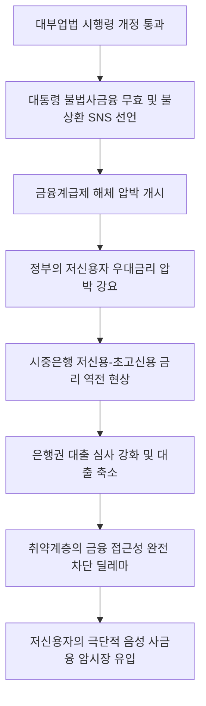

# 금융정책/시장 분석: 불법사금융 대부업법 개정과 금융계급제 해체 선언 및 시중은행 금리 역전 현상
## 투자 신호 + 사회적 영향 평가

---

## 📌 기사 기본 정보

- **날짜**: 2026-05-04
- **출처**: 오현석·김원 기자 / 중앙일보
- **카테고리**: 경제 > 금융정책 > 서민금융
- **핵심 주제**: 이재명 대통령이 불법 사금융 척결을 위해 "연 60%를 초과하는 불법 대부는 원금과 이자 모두 무효이므로 갚지 않아도 무방하다"고 선언한 대부업법 시행령 개정과, 정부의 '금융계급제 해체' 압박으로 인해 시중은행에서 초고신용자와 저신용자 간 금리가 뒤집히는 금리 역전 현상 및 여신 공급 위축 딜레마 분석

**메타데이터**
- 주요 사건: 대부업법 시행령 개정 통과 및 대통령의 "불법 사금융 원리금 무효" 공식 선언
- 핵심 원인: 소득이 낮을수록 높은 이자를 내야 하는 '금융계급제' 모순 타파, 정책적 금리 압박에 따른 시중은행의 리스크 미반영 금리 왜곡 발생
- 주요 주체: 이재명 대통령, 청와대 김용법 정책실장, 시중 5대 은행 여신담당부서, 서민 저신용 대출 차주층
- 키워드: 불법사금융, 대부업법 개정, 금융계급제, 금리 역전 현상, 리스크 기반 가격 책정, 금융 포용

---

## 🔍 기사를 통한 투자 신호 추출

### 1단계: 핵심 사건 분해

**What (무엇이 일어났는가?)**
- 정부가 연 60%를 초과하는 고금리 불법 대부계약에 대해 법적으로 원금과 이자 전체를 무효화하는 대부업법 시행령 개정안을 통과시켰습니다. 이재명 대통령은 SNS를 통해 "불법 대부는 갚지 않아도 무방하다"는 강력한 대국민 메시지를 전파했습니다. 이와 동시에 정부의 취약계층 우대 금리 요구 압박이 시중은행에 가해지며, 600점 이하 저신용자의 대출 금리가 초고신용자(950점 이상)보다 낮아지는 기형적 '금리 역전 현상'이 나타나고 있습니다.

**When (언제 일어났는가?)**
- 2026-05-04 (대부업법 시행령 국무회의 의결 직후, 대통령의 직접 선언이 외환/채권 시장 및 가계 부채 전반에 뜨거운 화두로 부상한 시점)

**Why (왜 일어났는가?)**
- 성실히 빚을 갚아온 저소득 고신용자(202만 명)가 신용 관리를 하지 않은 고소득 저신용자(43만 명)보다 비싼 이자를 부담해 온 '금융계급제'의 기형적 모순을 정치적으로 파괴하기 위함입니다.
- 금융 관료 출신인 김용법 정책실장의 "잔인한 금융 시스템 설계 공범" 고백에서 드러나듯, 리스크 기반 가격 책정이 낳은 금융 소외를 복지 차원에서 교정하려는 청와대의 강력한 의지가 작용한 결과입니다.

**Who (누가 주도하는가?)**
- 서민층 표심과 취약계층 보호를 위해 금융 원칙 조율을 불사하는 대통령실 및 정책 조율 라인
- 정부의 압박에 못 이겨 리스크 심사를 우회해 우대 금리를 억지로 산정하고 있는 시중 은행권

---

## 2단계: 투자 신호 해석

### A. **긍정적 신호 (Bullish)**

**① 자체적인 대안 신용평가(CSS) AI 및 고성능 리스크 관리 솔루션 공급사**
- **신호**: 단순 신용점수가 아닌 실질 상환 이력과 빅데이터를 결합한 새로운 신용평가 시스템 개혁 필요성 대두
- **의미**: 은행들이 리스크를 반영하지 못하는 규제 금리 체계 하에서 생존하기 위해, 차주의 우발 부도 가능성을 비금융 데이터(결제망, 통신비 납부 등)로 정밀하게 필터링할 수 있는 AI 기반 차세대 신용평가 인프라 도입을 서두르게 됨
- **투자 기회**: 금융 특화 AI 핀테크 개발사, 대안 신용평가 데이터 보유 플랫폼 기업

**② 서민 금융 안정화로 연체율 관리에 숨통이 트이는 소형 서민 밀착형 금융사**
- **신호**: 서민 대출자들의 이자 원리금 탕감 및 채무 재조정 정책 지원
- **의미**: 한계 대출자들의 파산 도미노를 정부가 법적으로 차단해주면서, 부실 채권 상각 부담에 시달리던 서민 전문 저축은행이나 협동조합 계열의 연체율 지표가 단기적으로 마사지(안정화)되는 효과를 누릴 수 있음
- **투자 기회**: 정부의 서민 금융 지원책과 연동된 특수 정책 금융 대행사

---

### B. **위험 신호 (Bearish)**

**① 규제 리스크로 여신 영업 마진이 훼손되는 메이저 시중은행 및 금융지주사**
- **신호**: 초고신용자 금리 인상 및 저신용자 금리 인하에 따른 금리 역전과 여신 스프레드 통제 상실
- **의미**: 시장 금리 원칙이 붕괴되어 은행이 고위험 대출을 취급하면서도 적정 마진을 수취하지 못함에 따라, 결국 대출 심사를 극단적으로 강화해 전체 대출 잔고(여신 규모)가 정체되고 순이자마진(NIM)이 장기 쇠락하게 됨
- **투자 리스크**: 규제 강도가 높은 대형 금융지주사 및 시중은행 주식 전체

**② 음성 사금융 시장 확대로 타격을 입는 건전 대부 및 P2P 온투업계**
- **신호**: 불법 사금융 척결을 위한 규제 그물망 가동 및 대출 금리 상한 제한
- **의미**: 합법적인 중간 신용 공급자 역할을 수행하던 중신용 대부 및 P2P 금융사들마저 '대출 무효'라는 극단적인 도덕적 해이 프레임에 갇혀 자금 회수 난항을 겪고 대출 문턱을 대폭 올림에 따라, 저신용자들이 결국 양성 시장에서 쫓겨나 더 깊은 암시장(Dark Market)으로 유입되는 부작용 초래
- **투자 리스크**: 중·저신용자 대상 대출 연체율이 급증하는 핀테크 플랫폼 및 온투업계

---

### 3단계: 섹터별 투자 기회 매트릭스

#### ✅ **높은 기대도 + 낮은 리스크**

**글로벌 신용평가 인프라 및 차세대 금융 CSS AI 공급사**
- 정부가 리스크 기반 가격 책정을 무력화할수록 금융권은 살기 위해 지능형 AI 기반의 고정밀 차주 스크리닝 시스템을 확보해야만 합니다. 규제가 심할수록 리스크 필터링 기술에 대한 수요는 기하급수적으로 커지는 절대 법칙이 작동합니다.
- **투자 추천도**: ⭐⭐⭐⭐⭐

---

## 💰 구체적 투자 신호 변환

### 신호 1: 금융지주 주식에 대한 '규제 리스크 디스카운트' 대응 및 금융 핀테크 포트폴리오의 구조적 전환

**투자 해석**: 기사는 정부의 취약계층 보호 기조가 금융 시장 고유의 '리스크 기반 가격 책정(Risk-based Pricing)' 메커니즘을 훼손하여 은행권에 상당한 규제 리스크를 유발하고 있음을 명확히 보여주고 있습니다. 초고신용자의 금리가 올라가고 저신용자의 금리가 낮아지는 인위적 '금리 역전'은 시중은행의 부실 리스크를 증가시키고 결국 은행들로 하여금 대출 문을 닫게 만드는 여신 공급 경색(Credit Crunch)으로 이어집니다. 따라서 투자자는 단기 배당수익률만 보고 은행주를 매수하는 안일한 판단을 지양해야 합니다. 정부의 규제 압박이 NIM(순이자마진) 하락으로 전이되는 시점에서는 은행 포트폴리오를 대폭 축소하고, 대신 이 기형적 금리 규제를 돌파하기 위해 은행들이 대대적으로 외주를 줄 '대안 신용평가 AI 기술주'나 보안 컴플라이언스 핀테크 주식으로 자산의 비중을 전환해야 규제 주도형 금융 시장 왜곡 국면에서 손실을 방어할 수 있습니다.

---

## 🌍 사회적 영향 평가

### A. 긍정적 사회 영향
- **막다른 길에 몰린 한계 차주의 극단적 구제**: 불법 사금융의 약탈적 고리채 사슬에 묶여 있던 극빈층 취약 서민들을 법률적으로 즉시 해방시켜 사회 안전망 편입 유도
- **성실 서민 차주의 권익에 대한 공론화**: 그동안 가려져 있던 '저소득 고신용자' 202만 명의 존재와 이들이 겪는 불합리한 금리 역차별을 공론화하여 합리적 신용 평가 시스템 개혁 필요성에 대한 범국민적 공감대 마련

### B. 부정적 사회 영향
- **신용 붕괴와 도덕적 해이(Moral Hazard) 만연**: 대통령이 대부 계약의 원리금 상환 의무 상실을 직접 선언함으로써 서민 차주들 사이에 "빚은 안 갚아도 정부가 해결해준다"는 신용 질서 해이 현상이 빠르게 확산
- **서민 대출 기근으로 인한 암시장 쏠림 가속화**: 은행권의 대출 심사 극단적 장벽 강화로 급전이 필요한 취약계층이 합법 대출에서 영구 배제되어, 60% 상한 제한을 비웃는 연 1000% 이상의 살인적인 음성 사금융 암시장으로 밀려나는 최악의 경제적 역설 돌출

---

## 🎯 결론: 당신의 투자 전략 수립

- **즉시 실행**: 포트폴리오 내 국내 4대 금융지주 및 시중은행 비중을 축소하고, 대안 신용평가 알고리즘 및 은행 리스크 분석 시스템 특허를 가진 기술주로 리밸런싱
- **3개월 후**: 대부업법 시행령 개정 이후의 2금융권 연체율 추이 및 저신용자 대출 거절 건수 증가 데이터를 추적하여, 정부가 서민 자금줄 경색을 막기 위해 내놓을 '정책금융(서민금융진흥원 등) 채권' 수혜주 발굴

---

## 📝 Obsidian 연결 구조

