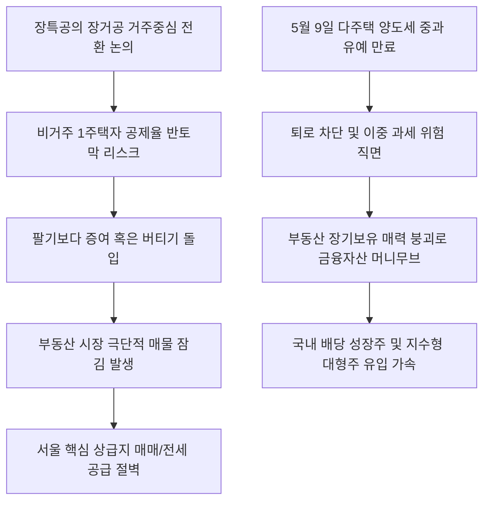

# 부동산/세제 분석: 장기보유특별공제 축소와 장거공 전환 및 양도세 유예 만료에 따른 매물 잠김 현상
## 투자 신호 + 사회적 영향 평가

---

## 📌 기사 기본 정보

- **날짜**: 2026-05-04
- **출처**: 김연주 기자 (기사 기반)
- **카테고리**: 경제 > 부동산 > 부동산정책
- **핵심 주제**: 5월 9일 다주택자 양도소득세 중과 유예 종료와 맞물려 추진되는 장기보유특별공제(장특공)의 '장기거주특별공제(장거공)'로의 개편 논의, 그리고 이로 인해 발생할 비거주 1주택자의 세 부담 급증 및 부동산 시장의 극단적인 '매물 잠김(Lock-in Effect)' 우려 분석

**메타데이터**
- 주요 사건: 양도세 장기보유특별공제의 거주 요건 대폭 강화(장거공 전환) 및 다주택 중과 유예 만료 박두
- 핵심 원인: 실거주 중심의 조세 정의 구현 명목 하에 비거주 주택 보유자에 대한 세 부담 강화, 물가 상승에 따른 명목 차익 보전 장치의 축소
- 주요 주체: 국토교통부 및 기획재정부, 비거주 1주택자(지방 발령자, 해외 주재원 등), 다주택 자산가, 부동산 세무 업계
- 키워드: 장기보유특별공제, 장기거주특별공제, 양도소득세 중과세, 매물 잠김, 실거주 요건, 조세 정의

---

## 🔍 기사를 통한 투자 신호 추출

### 1단계: 핵심 사건 분해

**What (무엇이 일어났는가?)**
- 부동산 시장의 핵심 혜택이던 장기보유특별공제(장특공) 제도가 단순히 오래 보유하는 것보다 실제 거주 기간을 중심으로 공제율을 차등하는 '장기거주특별공제(장거공)'로의 강제 전환 수술대에 오릅니다. 5월 9일부로 양도세 중과 유예가 종료되는 다주택자들과 함께, 고가 주택을 보유 중이나 직장·학업 등의 이유로 비거주 상태인 1주택자의 양도세 공제 한도가 반토막 날 위험이 현실화되었습니다. 이로 인해 집주인들이 매도를 포기하고 시장에서 매물을 철회하는 매물 증발 위기가 임계점에 달했습니다.

**When (언제 일어났는가?)**
- 2026-05-04 (5월 9일 양도세 중과 유예 종료일을 불과 5일 남겨두고 정부의 7월 세제개편안의 장특공 축소 아젠다가 수면 위로 급부상한 시점)

**Why (왜 일어났는가?)**
- 자산의 자본 차익에 대한 과세를 대폭 강화하고 실거주자 위주로 부동산 질서를 전면 재편하겠다는 이재명 정부의 강력한 부동산 개혁 드라이브와 조세 정의 기조가 작동했기 때문입니다.
- '소득이 있는 곳에 세금이 있다'는 원칙 하에 단순히 자산을 오래 보유해 얻은 자본이익의 무거운 과세 기준을 실거주 증명 요건으로 결합해 시장 내 장기 다주택 투기 수요를 차단하기 위함입니다.

**Who (누가 주도하는가?)**
- 양도세 중과 종료 및 장거공 도입 카드로 부동산 시장의 장기 자본 차익을 과세망에 가두려는 기획재정부 세제실
- 퇴로가 막히자 시장 매물을 거두어들이고 증여 또는 실거주 우회 전략을 짜고 있는 수도권 1주택 및 다주택 자산가들

---

## 2단계: 투자 신호 해석

### A. **긍정적 신호 (Bullish)**

**① 부동산 자본의 이탈에 따른 국내 증시 및 주식 자산으로의 대규모 머니 무브(Money Move)**
- **신호**: 세제 혜택 박탈로 인한 부동산의 장기 보유 가치 하락 및 투자 매력 훼손
- **의미**: 부동산을 장기 보유하여 물가상승률 이상의 마진을 챙기던 개인 고액 자산가들의 거대 잉여 자금이 과세 규제가 덜한 주식형 연금 계좌, 고배당 우량주, 혹은 저평가 코스피 대형주([[코스피 6000]])로 이동하게 됨
- **투자 기회**: 국내 배당 성장 주도주, 시니어 자산 관리 신탁 및 적립식 우량 펀드

**② 고가 주택 양도세 절세 우회로인 '부동산 증여 및 상속' 전문 법률·세무 컨설팅 산업**
- **신호**: 매물 잠김과 동시에 가속화되는 증여(Gift) 절벽 현상
- **의미**: 양도세를 내느니 자녀에게 사전에 증여하는 편이 유리하다는 판단이 대세로 굳어지며, 정교한 신탁 설계와 절세 가이드라인을 제공하는 법조·세무 서비스 수요가 폭발함
- **투자 기회**: 상속·증여 신탁 운용 비중이 높은 대형 금융지주사 및 자산 관리 플랫폼사

---

### B. **위험 신호 (Bearish)**

**① 서울 핵심 상급지 및 수도권 아파트 매매 거래량의 급격한 공급 절벽**
- **신호**: 보유자들의 양도 거부 및 증여 전환에 따른 극단적 매물 동결(Lock-in)
- **의미**: 팔려는 매물이 시장에서 완전히 자취를 감추어 거래 가뭄이 장기화되고, 이는 중개업, 이사, 인테리어 등 연관 내수 산업 전반에 연쇄 침체의 찬물을 끼얹음
- **투자 리스크**: 수도권 주택 매매 수수료 의존도가 높은 프롭테크 기업, 가구·인테리어 및 건자재 대형 내수 브랜드

**② 1주택자라도 '비거주' 상태에 놓인 고가 아파트 소유주의 급격한 세 부담 폭탄**
- **신호**: 최대 80%이던 공제율이 거주 요건 불충족으로 인해 최하 20~40%로 급감할 우려
- **의미**: 해외 거주 주재원, 지방 발령으로 불가피하게 주소지를 옮긴 1주택 은퇴 시니어 가구의 가처분 부가 양도세 증가분 탓에 심각하게 손상되어 가계 부채 부실화 압력이 생김
- **투자 리스크**: 대형 1주택 자산가가 다수 거주하는 지역 기반의 프리미엄 소비재 유통사

---

### 3단계: 섹터별 투자 기회 매트릭스

#### ✅ **높은 기대도 + 낮은 리스크**

**국내 우량 배당 성장 주식 및 자산 배분형 금융 신탁**
- 장특공 축소와 다주택 중과는 부동산을 장기간 묻어두는 전통적인 자산 포트폴리오의 생존 공식을 완전히 붕괴시킵니다. 부동산에서 이탈한 거대한 개인 유동성은 결국 배당 소득 감면 혜택이 살아 있는 금융 자산이나 주식 시장으로 대거 유입될 수밖에 없는 팽창적 머니 무브의 수혜를 누립니다.
- **투자 추천도**: ⭐⭐⭐⭐⭐

---

## 💰 구체적 투자 신호 변환

### 신호 1: 부동산 자산 비중의 선제적 축소 및 금융 자산 중심의 포트폴리오 다변화 전략 실행

**투자 해석**: 기사는 정부의 '거주 의무 결합형 세제(장거공)' 도입 논의가 부동산 시장을 동맥경화에 빠뜨리는 동시에 장기 보유의 기대 수익률을 파괴하는 거대한 신호탄임을 알려줍니다. 양도세율이 증여세를 초과하거나 공제율이 반토막 날 것이 우려되는 환경에서 고가 비거주 부동산을 쥐고 버티는 것은 현명한 선택이 아닙니다. 투자자는 보유 중인 부동산 중 '비거주 투자용 아파트'에 대해 5월 9일 중과 유예 만료 전 또는 7월 세제개편안 최종 발표 전에 양도 처분을 검토하거나, 여의치 않을 경우 즉시 정밀 세무 상담을 거쳐 증여 신탁으로 우회해야 합니다. 그리고 부동산 매각으로 회수된 거대한 자금을 부동산에 재투자하기보다는, 현재 고성장 랠리를 펼치고 있는 지능형 반도체 대형주([[삼성전자]], [[SK하이닉스]])나 연 5~6%의 고배당이 안정적으로 유지되는 금융형 상장 리츠 및 자산 신탁 상품으로 이동시켜 자산의 유동성과 세후 수익률을 획기적으로 개선해야 부동산 규제 쓰나미 속에서 가문의 자산을 수호할 수 있습니다.

---

## 🌍 사회적 영향 평가

### A. 긍정적 사회 영향
- **투기 목적의 위장 보유 근절 및 실거주자 주권 확립**: 주거하지 않으면서 자본 차익만 노리는 비거주 다주택 투기 자본을 시장에서 영구 배제하여 실거주 중심의 조세 정의 안착
- **자본시장의 활력 공급망 작동**: 부동산에만 수십 년간 묶여 있던 대한민국 특유의 기형적 고령층 가계 자산이 제도권 주식과 산업 자본으로 환류되어 국가 미래 성장 동력의 재원으로 활용되는 계기 마련

### B. 부정적 사회 영향
- **서울 상급지 공급 부족 심화로 인한 자산 양극화 격화**: 세금 무서워 집을 못 파는 '매물 잠김'이 극단화되면서 강남 등 핵심 요지의 주택 가격이 오히려 폭등하고, 지방 부동산은 하락하는 양극화의 역설 심화
- **고령 은퇴 계층의 가혹한 이중 과세에 따른 조세 저항**: 젊은 시절 세금을 성실히 내고 집 한 채로 은퇴하여 지방 요양원에 거주 중인 비거주 고령층이 실거주 의무 위반이라는 잣대로 양도세 폭탄을 맞아 빈곤층으로 전락하는 고통 유발

---

## 🎯 결론: 당신의 투자 전략 수립

- **즉시 실행**: 투자 목적 비거주 보유 아파트의 세무 시뮬레이션을 실시하여 양도차익 과세 한도 초과 시 매도 또는 자녀 증여 신탁 전환 결정 실행
- **3개월 후**: 7월 발표 예정인 정부의 공식 세제개편안 세부 시행령을 확인하고, 부동산 매물 잠김에 따른 전셋값 폭등 추이 데이터를 분석하여 포트폴리오 리스크 최종 보정

---

## 📝 Obsidian 연결 구조

