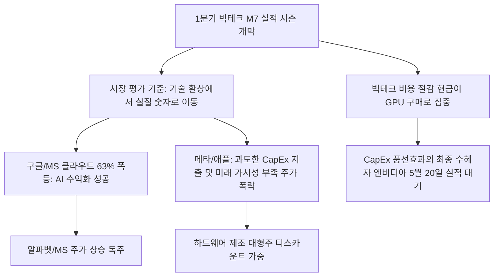

# 빅테크/증시 분석: 1분기 AI 실적 희비와 CapEx 폭식 및 엔비디아 향방과 AI 수익화 검증 현상
## 투자 신호 + 사회적 영향 평가

---

## 📌 기사 기본 정보

- **날짜**: 2026-05-04
- **출처**: 배정원 기자 / 중앙일보 글로벌머니클럽(GMC)
- **카테고리**: 경제 > 금융 > 해외증시
- **핵심 주제**: 2026년 1분기 실적 시즌에서 미국 빅테크(M7)의 주가 향방을 가른 기준이 단순한 기술 선전에서 'AI 실질 수익화(수치 입증)'로 전환된 현상과 구글·MS의 상승독주 대비 메타·애플의 주가 급락 및 5월 20일 예정된 '최종 보스' 엔비디아 실적 풍향계 분석

**메타데이터**
- 주요 사건: 미 나스닥 25,000 돌파 및 AI 수익 가시성에 따른 M7 기업들의 주가 극단적 양극화
- 핵심 원인: AI 투자의 선(先) 지출 - 후(後) 회수 구조에 따른 자본 지출(CapEx) 폭증 부담, 빅테크 비용 절감분이 엔비디아 가속기 구매로 집중되는 'CapEx 풍선효과'
- 주요 주체: 알파벳(구글), 마이크로소프트(MS), 메타, 애플, 엔비디아
- 키워드: 매그니피센트 7, 자본 지출(CapEx), AI 수익화, CapEx 풍선효과, 엔비디아 실적

---

## 🔍 기사를 통한 투자 신호 추출

### 1단계: 핵심 사건 분해

**What (무엇이 일어났는가?)**
- 미국 나스닥 지수가 사상 최초로 25,000선을 뚫어내고 S&P500이 7,200선을 넘어서는 대강세장 속에서도, M7 내 개별 기업들의 주가 향방은 극명하게 쪼개졌습니다. 알파벳(+9.97%)과 MS는 AI 인프라(클라우드 63% 성장 등)를 바탕으로 실제 돈을 벌어들이고 있음을 재무제표의 '숫자'로 증명한 반면, 메타(-3.93%)는 예상을 초과한 CapEx 폭증 탓에 주가가 하락했고, 애플(-8.55%)은 생성형 AI 미래 매출 로드맵 부재로 폭락세를 겪었습니다.

**When (언제 일어났는가?)**
- 2026-05-04 (1분기 빅테크의 실적 엇갈림이 확인되고, 시장 전체가 5월 20일 엔비디아의 실적 판가름을 초조하게 대기하고 있는 분수령 국면)

**Why (왜 일어났는가?)**
- 주식 시장이 AI라는 마법 단어에 기대던 '장밋빛 기대 단계'를 완전히 졸업하고, "AI 투자금 대비 실제 매출 환산(수익화) 속도가 얼마나 빠른가"를 철저하게 계산하는 '냉혹한 검증 단계'로 이행했기 때문입니다.
- 개별 기업들이 전사적 비용을 쥐어짜며 장부상 확보한 막대한 현금이 서비스 혁신 대신 엔비디아의 AI 하드웨어 구매로 빨려 들어가는 기형적 병목 현상이 발생했기 때문입니다.

**Who (누가 주도하는가?)**
- 클라우드와 구독 경제 모델을 장악하고 가시적인 AI 매출 곳간을 열고 있는 선두 빅테크들
- 투자 회수 시점의 지연을 극도로 혐오하며 CapEx의 조금의 초과 지출에도 매도 버튼을 누르는 월가의 메이저 기관 투자자들

---

## 2단계: 투자 신호 해석

### A. **긍정적 신호 (Bullish)**

**① 클라우드(Cloud B2B) 지배력과 결합된 즉각적 AI 수익 모델 가동 기업**
- **신호**: 구글 클라우드 전년 대비 63% 폭풍 성장 및 MS 코파일럿 가입자당 매출(ARPU) 상승
- **의미**: 기업용 AI 수요를 흡수할 수 있는 자체 클라우드 호스팅 인프라를 이미 독점한 플랫폼은, AI 투자가 고스란히 B2B 정기 구독료와 데이터 처리 수수료로 즉각 환수되는 선순환 마진을 누림
- **투자 기회**: 클라우드 인프라와 AI 생산성 도구를 수직 계열화한 독점 빅테크

**② CapEx 풍선효과의 절대 강자인 초고성능 인프라(하드웨어) 생태계**
- **신호**: M7 빅테크의 무차별적인 GPU 구매 경쟁 및 자본 지출 폭증 지속
- **의미**: 빅테크 간의 AI 군비 경쟁이 격화될수록 개별 빅테크의 주가 하락 여부와 상관없이 엔비디아의 H100/B200 가속기와 SK하이닉스·삼성전자의 차세대 HBM 수요는 기하급수적으로 채워지며 실적 고점이 매분기 상향됨
- **투자 기회**: AI GPU 절대 독점사([[엔비디아]]), HBM 독점 패키징 수혜주([[SK하이닉스]], [[삼성전자]])

---

### B. **위험 신호 (Bearish)**

**① AI 투자의 실질 수익 회수 로드맵이 지연되거나 불투명한 하드웨어 디바이스 제조 기업**
- **신호**: 애플의 기록적인 실적에도 불구하고 생성형 AI 킬러 콘텐츠 부재에 따른 주가 급락
- **의미**: 스마트폰 등 완제품 하드웨어 판매에 의존하는 기업이 생성형 AI를 결합해 교체 주기를 획기적으로 당기는 '킬러 서비스'를 보여주지 못할 경우, 장기 시장 점유율 둔화와 밸류에이션 할인을 피할 수 없음
- **투자 리스크**: 모바일 디바이스 비중이 절대적이면서 AI 플랫폼 전환이 늦은 글로벌 세트 제조주

**② 단기 Cash Flow 통제를 벗어난 과도한 미래 지향적 CapEx 투자 기업**
- **신호**: 메타의 업계 최고 마진율 기록에도 불구하고 CapEx 추정치 상향에 따른 주가 하락
- **의미**: 당장의 광고 비즈니스는 견고하나 메타버스 및 미래 AI 휴머노이드 등 투자 회수 기간이 5년 이상 걸리는 장기 인프라에 무제한 자본을 쏟아붓는 기조는 월가의 단기 자금 회수 본능과 정면 충돌하여 주가 발목을 잡음
- **투자 리스크**: 매출 대비 미래 미가시적 R&D/설비투자 비중이 30%를 넘는 IT 한계 기업

---

### 3단계: 섹터별 투자 기회 매트릭스

#### ✅ **높은 기대도 + 낮은 리스크**

**초고대역폭 메모리(HBM) 및 AI 가속기 병목 시장의 최상위 공급사**
- 빅테크의 AI 실적 희비가 엇갈려도 이들이 앞다투어 쏟아붓는 CapEx 예산은 예외 없이 엔비디아와 HBM 제조사([[SK하이닉스]], [[삼성전자]])의 곳간으로 빨려 들어갑니다. 군비 경쟁이 치열할수록 총과 칼을 파는 무기 상인이 가장 높은 이익률과 안전 마진을 누리는 원리입니다.
- **투자 추천도**: ⭐⭐⭐⭐⭐

---

## 💰 구체적 투자 신호 변환

### 신호 1: 빅테크 'CapEx 풍선효과' 집중 수혜 자산 매수 및 5월 20일 엔비디아 향방 대기

**투자 해석**: 기사는 글로벌 AI 랠리가 '기술 예찬론'에서 '숫자 검증론'으로 엄중하게 패러다임 시프트가 일어났음을 경고하고 있습니다. 단순히 'AI를 개발한다'는 찌라시 테마는 무참히 무너지며, 주가가 폭락한 메타와 애플의 사례가 이를 대변합니다. 이제 투자자는 M7 포트폴리오를 재편할 때 구글과 MS처럼 이미 B2B 클라우드 채널을 통해 매월 현금을 걷어 들이는 '수익 확정형 AI 플랫폼'에 초점을 맞춰야 합니다. 그리고 이들이 서로 죽기 살기로 돈을 쏟아붓는 CapEx 풍선의 최종 낙수 효과가 향하는 길목을 잡아야 합니다. 5월 20일 예정된 '최종 보스' 엔비디아의 실적 발표는 글로벌 AI 랠리가 코스피 7000선 돌파([[코스피7000]])를 이끌 연장선이 될지, 아니면 일시적 발작 조정을 가져올 분수령이 될 것입니다. 따라서 현재는 레버리지를 극도로 낮추고, 한국의 HBM 쌍두마차([[SK하이닉스]], [[삼성전자]])와 엔비디아의 비중을 안정적으로 유지하면서 엔비디아 실적 발표일에 나오는 가이던스 변화를 기점으로 포트폴리오의 탄력적 진입 여부를 최종 결정해야 합니다.

---

## 🌍 사회적 영향 평가

### A. 긍정적 사회 영향
- **산업 전반의 AI 실용성 극대화 가속**: 빅테크가 주주들로부터 실적 검증 압박을 받으면서, 뜬구름 잡는 거대 모델 연구 대신 실질적으로 업무 생산성을 높이고 비용을 아껴주는 '생활 밀착형 B2B AI 도구' 개발에 속도를 내어 사회 전반의 업무 효율성 제고
- **그린 데이터센터 기술의 비약적 성장**: CapEx 절감을 위해 에너지 전력 소비를 획기적으로 낮출 수 있는 친환경 변압 및 쿨링 기술 도입이 가속화되어 탄소 저감 기술 진보 유도

### B. 부정적 사회 영향
- **빅테크 독점력의 고착화와 중소 기술 기업의 퇴출**: 막대한 CapEx 예산을 보유한 M7 빅테크만이 AI 거대 언어 모델과 최신 GPU 인프라를 소유할 수 있게 되어, 자체 인프라가 없는 신흥 스타트업 및 중소 소프트웨어 기업들이 빅테크의 하청 업자로 전락하는 기술 종속 가속화
- **자본 쏠림에 따른 실물 경제의 상대적 소외와 양극화**: 국가의 산업 자본과 글로벌 모험 자본이 오직 AI 하드웨어와 실리콘밸리 빅테크에만 극단적으로 쏠려, 전통 제조업 및 지방 기반 서민 실물 산업들이 자금 조달에 심각한 애로를 겪는 자본 양극화 심화

---

## 🎯 결론: 당신의 투자 전략 수립

- **즉시 실행**: AI 수익 모델 가시성이 낮고 디바이스 판매 정체에 직면한 빅테크(애플 등) 비중을 대폭 낮추고, 확실한 클라우드 캐시카우를 보유한 빅테크로 비중 압축
- **3개월 후**: 5월 20일 엔비디아의 1분기 실적 성적표 및 향후 가이던스를 추적하여 빅테크 CapEx의 꺾임 현상이 없는지 모니터링한 뒤 반도체 핵심 장비주 포지션 비중 리밸런싱 단행

---

## 📝 Obsidian 연결 구조

