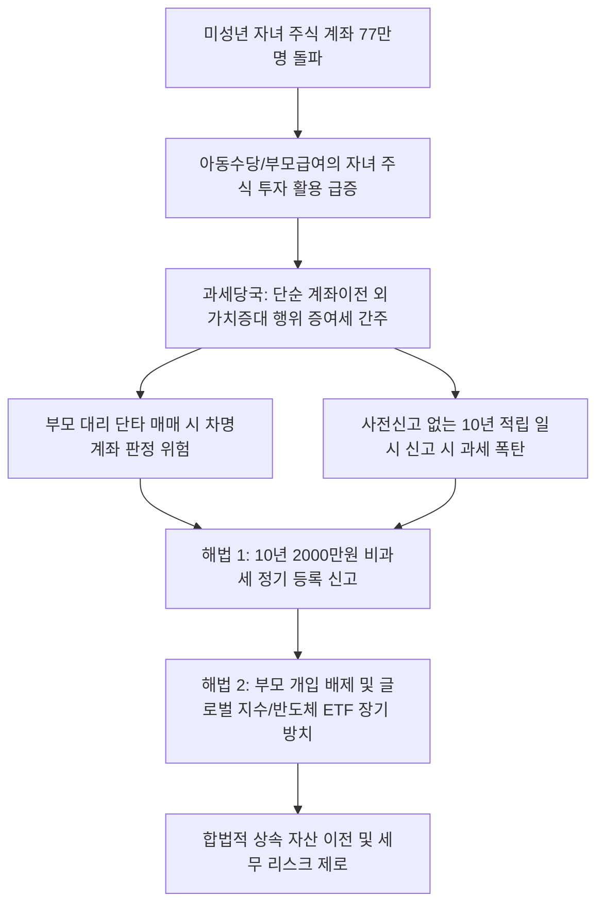

# 세무/재테크 분석: 미성년 자녀 주식 투자와 아동수당의 증여세 과세 전환 및 안전한 절세 전략 Q&A
## 투자 신호 + 사회적 영향 평가

---

## 📌 기사 기본 정보

- **날짜**: 2026-05-04
- **출처**: 오효정 기자 / 중앙일보 · NH농협은행 문현준 세무전문위원
- **카테고리**: 경제 > 금융 > 세무
- **핵심 주제**: 증시 호황에 따라 미성년 자녀 명의 주식 계좌가 77만 명으로 급증한 가운데, 아동수당 및 부모급여를 주식·ETF 투자에 활용하는 순간 증여세 부과 대상으로 전환되는 세법적 원리와 10년 2000만 원 비과세 공제 활용법, 그리고 단타 매매에 따른 '차명 계좌' 판정 리스크 분석

**메타데이터**
- 주요 사건: 미성년 주식 보유자 77만 명 돌파 및 복지수당의 투자 전환에 대한 증여세 과세 위험 부각
- 핵심 원인: 세법상 증여 개념에 "타인의 재산 가치를 증가시키는 행위(부모 기여)" 포함, 미취학 아동 명의 계좌의 실질 관리 주체 오인에 따른 차명계좌 리스크
- 주요 주체: 미성년 자녀를 둔 학부모층, 국세청 상속증여세과, 시니어·가족 자산관리 세무 전문가
- 키워드: 증여세, 아동수당, 자녀주식 계좌, 미성년자 투자 공제, 차명계좌 리스크, ETF 장기 보유

---

## 🔍 기사를 통한 투자 신호 추출

### 1단계: 핵심 사건 분해

**What (무엇이 일어났는가?)**
- 정부가 출산 장려를 위해 지급하는 아동수당 및 부모급여를 자녀 명의 주식 계좌에 이체해 주식과 ETF를 매수하는 부모들이 급증했으나, 이는 전액 증여세 과세 대상인 것으로 확인되었습니다. 세법상 단순한 금전 이전 외에 '부모의 판단에 의해 타인의 재산 가치를 간접적으로 증대시키는 행위'가 증여로 간주되기 때문입니다. 비과세 신고 없이 10년간 임의로 굴리다 한꺼번에 소명하거나, 부모가 잦은 단타 매매(사팔사팔)로 자녀 계좌의 수익률을 올릴 경우 추가 징벌 과세 및 차명계좌 징벌을 맞을 위험이 고조되었습니다.

**When (언제 일어났는가?)**
- 2026-05-04 (미성년 주식 보유자가 5년 만에 3배 폭증하고, 가정의 달인 5월을 맞아 자녀 주식 증여 및 아동 수당 절세 팁에 대한 세무 상담이 정점에 달한 시기)

**Why (왜 일어났는가?)**
- 정부의 복지 급여 수급 자체는 비과세이지만, 이를 소비처에 쓰지 않고 자녀 명의의 투자 종잣돈으로 전용하는 순간 세법 상 "부모의 기여로 자녀 자산 가치가 창출되었다"고 엄격하게 추정하기 때문입니다.
- 많은 부모들이 자녀 계좌를 단순히 본인의 차명 계좌처럼 생각해 '사팔사팔' 매매를 대신 해주어도 무방하다고 믿는 법적 무지(無知)가 만연했기 때문입니다.

**Who (누가 주도하는가?)**
- 자산 격차 심화 시대에 자녀에게 주식 조기 증여를 통해 미래 부를 물려주려는 3040 젊은 학부모층
- 미성년자 주식 계좌의 비정상적 고수익 거래 패턴 및 자금 출처 불일치 거래를 실시간 스크리닝하는 국세청 과세망

---

## 2단계: 투자 신호 해석

### A. **긍정적 신호 (Bullish)**

**① 미성년 자녀 전용 장기 적립식 글로벌 지수 및 반도체 테마 ETF**
- **신호**: 부모의 잦은 매매 개입이 증여세 폭탄(차명계좌 리스크)을 부르는 제도적 장벽
- **의미**: 자녀 계좌에 목돈을 넣거나 매달 적립할 때, 부모가 단기 거래로 기여하는 방식이 전면 규제되므로 오직 '최우량주 장기 보유' 또는 '글로벌 테크 ETF'를 매수해 10년 이상 그대로 묻어두는 장기 분산형 금융 투자가 유일한 우회로로 정착됨
- **투자 기회**: 국내외 최우량 IT/지능형 반도체 대형주([[삼성전자]], [[SK하이닉스]]), 미국 대표 지수 추종 ETF

**② 세무 신고를 대행해주는 원클릭 디지털 상속·증여 핀테크 플랫폼**
- **신호**: 10년 2000만 원 공제 한도 범위 내 소액 일괄·분기 신고 수요 폭발
- **의미**: 국세청 홈택스의 복잡한 소액 증여 신고를 모바일 터치 몇 번으로 자동 해결해주고 자금 출처 영수증을 자동 보존해주는 자동화 세무 테크 서비스의 유료 이용률이 기하급수적으로 증가함
- **투자 기회**: 리테일 세무 신고 편의성을 극대화한 인터넷 전문 은행 및 자산 관리 앱사

---

### B. **위험 신호 (Bearish)**

**① 미성년 자녀 계좌를 활용한 단기 급등주 테마 및 고위험 레버리지 거래**
- **신호**: 부모가 자녀 아이디로 대리 접속해 단기 테마주를 반복 매매하는 행위
- **의미**: 자녀가 스스로 투자할 수 없는 나이임에도 비정상적인 급등주 거래 기록과 매매 차익이 계좌에 고스란히 남을 경우, 국세청은 이를 100% '부모의 차명 계좌'로 추정하여 자녀 명의의 주식을 부모 자산으로 귀속시키고 거액의 종합소득세 및 가산세를 소급 추징함
- **투자 리스크**: 미성년자 계좌 내 고변동성 중소 테마주 및 고위험 파생 연계 상품

**② 비과세 사전 신고 없는 10년 만기 자녀 적립 통장의 일시금 전환**
- **신호**: 매달 10만~20만 원씩 자녀 통장에 적립 후 10년째에 한꺼번에 2000만 원으로 신고하는 행위
- **의미**: 국세청은 정기적인 적립금이 부모의 호주머니에서 나온 사실상의 개별 증여 건들로 해석하여 일괄 비과세를 인정하지 않고, 각 적립 시점의 이자 및 평가 차익 전부에 대해 양도 및 증여세를 소급 추징해 소명 리스크를 극대화함
- **투자 리스크**: 매년 비과세 증여 신고를 누락하고 장기 보유 중인 자녀 명의 금융 자산 전체

---

### 3단계: 섹터별 투자 기회 매트릭스

#### ✅ **높은 기대도 + 낮은 리스크**

**글로벌 우량 자산 분산형 테크/지수 ETF 및 원클릭 디지털 증여 신고 서비스**
- 부모 개입을 억제하고 세제 혜택을 합법적으로 누리려면 미성년 자녀의 자산은 세계에서 가장 안전한 빅테크 생태계나 지수형 ETF에 묻어두는 것이 교과서적 정답입니다. 이와 동시에 증여 신고 데이터를 안정적으로 축적하는 핀테크 플랫폼은 시니어 세대의 금융 유치 절대 강자로 떠오르게 됩니다.
- **투자 추천도**: ⭐⭐⭐⭐⭐

---

## 💰 구체적 투자 신호 변환

### 신호 1: 자녀 계좌의 '차명 리스크 방지형' 포트폴리오 셋업 및 500만 원 단위 정기 신고 의무화

**투자 해석**: 기사는 부모들의 선의의 절세 노력이 자칫 세법적 무지로 인해 '탈세 가산세 폭탄'으로 이어질 수 있음을 명확히 경고하고 있습니다. 아동수당과 세뱃돈으로 자녀의 부를 불려주고 싶다면, 자녀 계좌를 내 계좌처럼 '사팔사팔' 매매하는 단타의 덫에서 완벽하게 탈피해야 합니다. 투자자는 자녀 계좌 개설 즉시 미성년자 10년 2000만 원의 비과세 한도 범위 내에서 현금을 증여한 후, 매달 구구절절 홈택스에 신고하기보다 500만~1000만 원 단위로 누적될 때마다(또는 1년 주기) '정기 증여 신고'를 즉시 단행해 자금 출처의 꼬리표를 합법적으로 등록해야 합니다. 매수한 종목은 급등주 테마를 전면 배제하고, 장기 우상향의 역사를 지닌 글로벌 지수 ETF나 무형의 기술 권력을 쥐어 미래 독점력이 보장되는 한국 최우량 반도체 대형주([[삼성전자]]) 위주로 포트폴리오를 채워 넣은 후 10년 동안 절대 매도하지 않고 방치해야 자녀의 노후 준비와 상속 리스크 헤징을 동시에 실현할 수 있습니다.

---

## 🌍 사회적 영향 평가

### A. 긍정적 사회 영향
- **고령층 중심 자본의 건전한 조기 환류**: 상속 시점까지 고여 있을 자산가들의 현금과 부가 미성년 손자녀 세대로 조기에 합법적 환류되어 자본시장의 동력을 확보하고 가계 부의 가치 분산 기여
- **어릴 때부터 습득하는 조기 경제·세무 교육의 마중물**: 주식 증여 및 정기 신고 과정을 통해 자녀가 자연스럽게 세무 기초와 금융 투자의 중요성을 체득하여 미래의 현명한 주주 세대로 성장하도록 지원

### B. 부정적 사회 영향
- **출발선부터 벌어지는 부의 대물림 격화**: 아동수당에 얹어 매월 수십만 원의 주식을 증여해줄 수 있는 고소득층 자녀와 당장 수당을 생계비로 소비해야 하는 취약계층 자녀 간의 조기 자산 양극화 및 사회적 박탈감 가중
- **국세청 과세 감시망과 서민 가계 간의 충돌 마찰**: 소액 세뱃돈과 용돈까지 자금 출처 조사의 잣대를 들이대는 것에 대해 일반 서민들의 과도한 세무 조행 거부감과 행정 낭비 초래 우려

---

## 🎯 결론: 당신의 투자 전략 수립

- **즉시 실행**: 자녀 명의 주식 계좌 내에 누적된 투자 원금이 있다면 2000만 원 공제 한도 범위 안에서 세무 대행 앱 또는 홈택스를 통해 '과세 비과세 증여 신고'를 즉시 단행하여 증거 이력을 확보함
- **3개월 후**: 매월 자동 적립되는 소액 아동수당의 경우 500만 원 단위 돌파 시점마다 일괄 절세 신고 스케줄을 달력에 등록하고, 자녀 계좌 내 개별 테마주는 전량 매도 후 초우량 테크 대형주/지수 ETF로 일원화

---

## 📝 Obsidian 연결 구조

