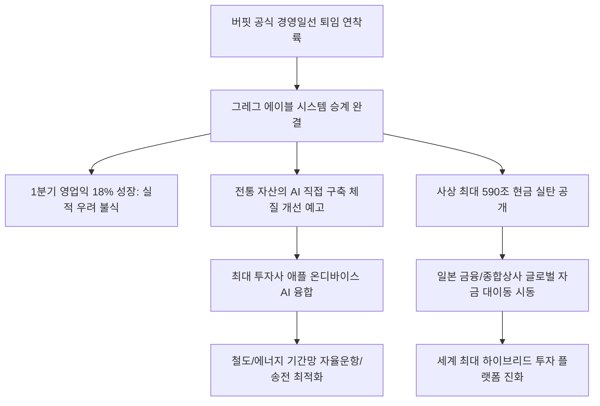

# 해외투자/거시 분석: 포스트 버핏 시대 버크셔 해서웨이의 AI 체질 개선과 590조 현금 활용 및 에이블 하이브리드 전략 현상
## 투자 신호 + 사회적 영향 평가

---

## 📌 기사 기본 정보

- **날짜**: 2026-05-04
- **출처**: 심재훈 특파원 (오마하 현지 보도)
- **카테고리**: 경제 > 금융 > 해외투자
- **핵심 주제**: 가치 투자의 거장 워런 버핏 퇴임 이후 그레그 에이블 CEO 체제 하에 연착륙에 성공한 버크셔 해서웨이가 1분기 18%의 영업이익 성장(16.7조 원)을 증명하고, 590조 원(3974억 달러)이라는 사상 최대의 현금 실탄을 바탕으로 전통 가치 투자를 넘어선 AI 및 첨단 기술 결합형 체질 개선과 애플 온디바이스 AI 생태계 융합 전략 분석

**메타데이터**
- 주요 사건: 버크셔 해서웨이 오마하 주주총회를 통한 그레그 에이블 경영권 공식 승계 및 AI 체질 전환 청사진 발표
- 핵심 원인: 워런 버핏의 카리스마 기반 투자 모델의 시스템화 전환 필요성, AI 기술을 전통 기간산업에 융합하는 기술 내재화(Direct Build) 및 포트폴리오 글로벌 다변화
- 주요 주체: 그레그 에이블 버크셔 CEO, 워런 버핏(이사회 의장/참관자), 애플(Berkshire 최대 지분 보유사), 일본 도쿄마린 홀딩스
- 키워드: 포스트 버핏, 그레그 에이블, 온디바이스 AI, 기술 내재화, 투자 실탄, 일본 다변화

---

## 🔍 기사를 통한 투자 신호 추출

### 1단계: 핵심 사건 분해

**What (무엇이 일어났는가?)**
- 가치 투자의 종가인 버크셔 해서웨이가 워런 버핏 퇴임 후 그레그 에이블 CEO 시대를 열며 월가의 신뢰 회복에 성공했습니다. 1분기 영업이익이 전년 대비 18% 증가한 16.7조 원을 기록하여 실적 우려를 씻어냈으며, 사상 최대치인 590조 원의 현금 실탄 보유량을 공개했습니다. 그레그 에이블은 이 막대한 자금력과 자사 최대 투자 종목인 애플의 '온디바이스 AI' 기술을 버크셔가 소유한 에너지(BHE), 철도(BNSF) 등 전통 기간산업에 이식하는 '기술 직접 구축(Direct Build) 및 체질 개선'을 전격 선언했습니다.

**When (언제 일어났는가?)**
- 2026-05-04 (버핏의 퇴임 이후 첫 오마하 주주총회가 열려 버크셔의 미래 비전과 자금 운용의 일대 패러다임 시프트가 선포된 역사적 시점)

**Why (왜 일어났는가?)**
- "내가 이해하지 못하는 기술에는 투자하지 않는다"는 버핏의 낡은 보수주의가 AI 기반의 초지능형 4차 산업 시대에는 성장을 방해하는 족쇄가 될 수 있다는 위기감이 안팎으로 고조되었기 때문입니다.
- 리더십 교체기에 버크셔가 '느린 공룡'이라는 낙인을 지우고, 590조 원의 현금이 자본 비효율성으로 썩어가는 것을 막기 위해 에이블 특유의 '하이브리드(가치+AI기술) 가치 창출 공식'이 절실했기 때문입니다.

**Who (누가 주도하는가?)**
- 버핏의 낡은 성공 방정식을 '언런(Unlearn)'하고 버크셔를 기술 내재화 복합 플랫폼으로 재정비하고 있는 그레그 에이블 CEO
- 에이블에게 전권을 넘기고 관람석 1열에서 승계의 마침표를 지지해준 워런 버핏

---

## 2단계: 투자 신호 해석

### A. **긍정적 신호 (Bullish)**

**① 애플 온디바이스 AI(On-device AI) 생태계 및 B2B 융합 수혜 플랫폼**
- **신호**: 버크셔의 최대 투자 종목(애플)과 철도·에너지 등 B2C 실물 인프라의 전격 기술 연합
- **의미**: 보안과 가동 속도가 독보적인 애플의 온디바이스 AI 제어 기술이 버크셔의 아날로그 철도 물류망과 발전소 송배전망에 결합되면서, 운영원가를 20% 이상 절감시키는 지능형 기간망 시스템으로 업그레이드됨
- **투자 기회**: 온디바이스 AI 특허 및 기기 생태계 절대 강자([[애플]]), 데이터 및 통신 모듈 핵심 공급사

**② 글로벌 자금 대이동의 수혜를 받는 비(非)미국 선진 금융 및 신사업 포트폴리오**
- **신호**: 미국 내수 포트폴리오 탈피 및 일본 손보사(도쿄마린) 등 글로벌 금융 파트너십 구축
- **의미**: 590조 원의 역대급 실탄 중 일부가 미국 외의 초우량 안전자산으로 분산 이동하면서, 엔저 수혜를 바탕으로 실적이 턴어라운드하는 글로벌 금융 및 전통 가치 자산에 강력한 크레딧 보증 효과와 유동성을 제공함
- **투자 기회**: 버크셔가 추가 지분을 확보하고 있는 일본 5대 종합상사 및 초우량 손해보험주

---

### B. **위험 신호 (Bearish)**

**① 무형의 밸류에이션(카리스마) 상실에 따른 단기적 프리미엄 박탈 리스크**
- **신호**: 워런 버핏 개인의 신화적 팬덤 소멸 및 주총의 종교적 색채 둔화
- **의미**: 버핏의 절대적 인지도에 기대어 시장 평균보다 높은 멀티플을 받아온 버크셔 주가가, 지극히 숫자에 기반한 냉정한 '일반 복합 대기업(Conglomerate)' 잣대로 재평가되면서 단기적으로 주가 상방이 억제될 수 있음
- **투자 리스크**: 리더십 교체 초기 버크셔 지분 및 고멀티플 기술주 중심의 추격 매수 포지션

**② 전통적 저효율 EPC 중심의 건설 및 아날로그 기간산업**
- **신호**: 버크셔가 추진하는 기간망 내 AI 자동화 및 인력 대체 기술 내재화 가속
- **의미**: 스마트 제어와 자율주행 물류가 도입되지 않은 기존의 노후 아날로그 인프라와 재래식 철도, 발전소 기업들은 버크셔 동맹의 압도적인 비용 절감 칼날 앞에 마진이 폭락하여 도태될 운명에 처함
- **투자 리스크**: 스마트 융합 능력이 결여된 전통 에너지, 건설 및 재래식 물류 운송사

---

### 3단계: 섹터별 투자 기회 매트릭스

#### ✅ **높은 기대도 + 낮은 리스크**

**애플 온디바이스 AI 연계 하드웨어 디바이스 및 반도체 밸류체인**
- 버크셔가 590조 원의 화력을 애플과의 온디바이스 AI 융합에 쏟아붓겠다는 전략은, 침체 우려가 있던 애플의 스마트 디바이스 생태계가 실물 경제(물류, 에너지)를 제어하는 거대한 두뇌로 작동할 것임을 보장합니다. 디바이스의 지속적 교체 수요와 HBM 반도체 수요가 견고히 지지되는 최상의 안전 마진입니다.
- **투자 추천도**: ⭐⭐⭐⭐⭐

---

## 💰 구체적 투자 신호 변환

### 신호 1: '포스트 버핏 시대'의 자본 흐름 추적 - 전통 자산의 AI 장착(하이브리드 가치주) 비중 확대

**투자 해석**: 기사는 버크셔 해서웨이의 승계가 '가장 성공적인 연착륙'의 궤도에 들어섰으며, 그 방향성이 '전통적 가치 자산의 AI 디지털 옷 입히기'에 있음을 보여줍니다. 이제 투자자는 낡은 개념의 성장주와 가치주의 이분법적 사고를 전면 '언런(Unlearn)'해야 합니다. 단순히 '저PBR 가치주'라는 이유로 굴뚝 주식을 매수하는 고루한 투자는 10년 뒤 파산서로 돌아옵니다. 오히려 버크셔가 소유한 철도와 에너지의 혁신처럼, 튼튼한 실물 영토(현금흐름)를 쥐고 있으면서도 애플의 AI 두뇌를 수혈받아 스스로를 지능형 플랫폼으로 개조해 나가는 '하이브리드 가치주([[삼성전자]] 등)'를 선점해야 합니다. 또한 버크셔의 590조 원 거대 자본 쓰나미가 향하고 있는 '일본 초우량 금융/에너지 1티어 주식'으로 포트폴리오를 다변화시켜, 글로벌 통화 마찰과 지정학 긴장 국면에서도 시스템적으로 돈이 복리로 불어나는 '포스트 버핏식 복합 자산 운용 체계'를 내 개인 포트폴리오에 적극 이식해야 장기적인 절대 생존자가 될 수 있습니다.

---

## 🌍 사회적 영향 평가

### A. 긍정적 사회 영향
- **글로벌 복합 기업의 리더십 승계 모범 사례 제시**: 창업주의 카리스마에 의존하던 세계 최대 투자 지주사가 충격 없이 시스템과 숫자 중심의 경영권 승계를 완료하여 기업 연속성의 훌륭한 이정표 정착
- **기간산업의 디지털 효율화를 통한 비용 인하**: 철도 물류와 전력 에너지망에 AI 자동화가 내재화되면서 화물 운송 지연과 전력 손실률이 비약적으로 낮아져 사회 거시적 물가 안정과 자원 최적화 기여

### B. 부정적 사회 영향
- **일자리 창출 없는 자동화로 인한 블루칼라의 실직 우려**: BNSF 철도망 및 BHE 발전 인프라에 애플 AI 제어와 무인 로봇 자동화가 급격히 투입되면서 기존 아날로그 현장을 지키던 중장년 일용직·기술직 노동자들의 대대적인 인력 감축과 지역 경제 소외 우려
- **거대 금융 자본의 글로벌 독점력 극대화**: 590조 원이라는 단일 주체가 특정 국가의 대표 섹터를 매수할 때마다 해당 국의 증시와 환율이 요동치고, 민간 투자 지주사가 국가 전력망과 물류망 제어권(AI)까지 장악해 민주적 통제를 벗어나는 거대 자본 지배력 우려

---

## 🎯 결론: 당신의 투자 전략 수립

- **즉시 실행**: 미래 기술 결합 의지가 전무한 고루한 저PBR 전통 제조/건설주 비중을 축소하고, 확실한 실물 이익 기반에 온디바이스 AI 두뇌를 탑재하는 테크 우량주 및 글로벌 종합 지수 지분 확대
- **3개월 후**: 그레그 에이블의 590조 원 현금 집행 내역(13F 공시 등)을 주기적으로 필터링하여, 버크셔의 자금 쓰나미가 추가로 유입되는 일본 금융/종합상사 및 글로벌 테크 기업의 길목 선점 매수 단행

---

## 📝 Obsidian 연결 구조

